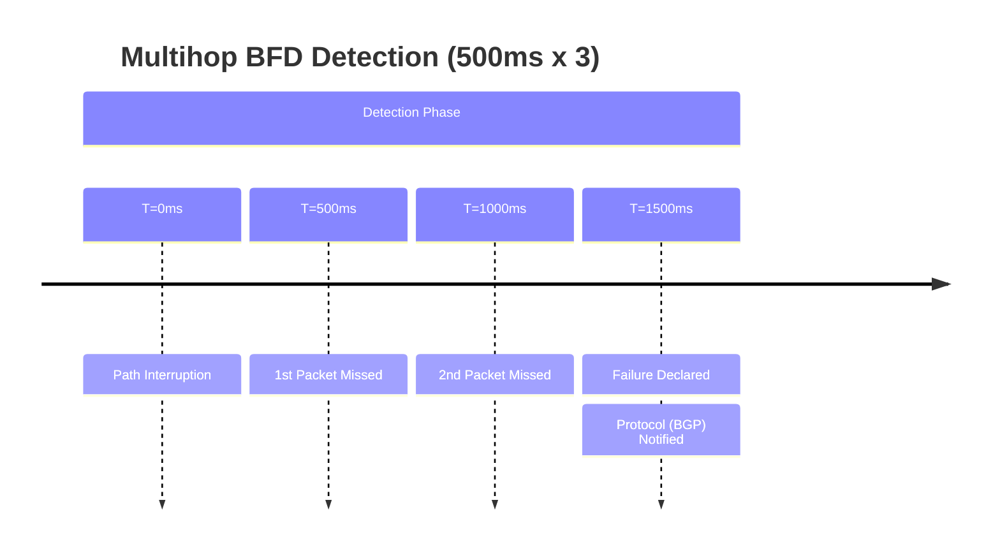

# FortiGate: Multihop BFD Configuration

## 1. Overview & Principles

Standard BFD is designed for directly connected L3 neighbors. **Multihop BFD** is
required when the BGP or Static neighbor is separated by one or more L3 hops (e.g.,
peering via a load balancer, through a transparent VDOM, or over a complex provider
cloud).

### The BFD-Map Logic

Unlike Cisco, which uses a template applied to an interface, FortiGate uses a `bfd-map`.
This map explicitly links a destination IP (the remote peer) to a source IP and
sets the hardware/software timers.

### Port Requirements

- **UDP Port 4784:** Multihop BFD uses this port (Single-hop uses 3784).
- **NPU Offload:** Multihop BFD is typically processed in software by the CPU unless
    specifically offloaded by newer NP7/NP8 chipsets.

## 2. Detection Timelines (Heartbeat)



## 3. Configuration Snippets

### A. Configuring the BFD-Map

This defines the "session" for the specific multihop target.

```fortios
config router bfd-map
    edit 1
        set destination 10.255.255.2
        set source 10.255.255.1
        # Timers are in milliseconds
        set min-rx 500
        set min-tx 500
        set multiplier 3
    next
end
```

### B. BGP Integration

The neighbor must be explicitly set for multihop.

```fortios
config router bgp
    config neighbor
        edit "10.255.255.2"
            set remote-as 65001
            set bfd enable
            set ebgp-enforce-multihop enable
        next
    end
end
```

## 4. Comparison Summary

| Metric | Single-hop (Standard) | Multihop BFD |
| :--- | :--- | :--- |
| **UDP Port** | 3784 | **4784** |
| **Config Location** | Interface / Global | **Router BFD-Map** |
| **Hardware Offload** | SoC4/NP6+ Supported | **CPU Dependent (Usually)** |
| **Peering Type** | Directly Connected | **Non-Connected (Any L3 Hop)** |

## 5. Verification & Troubleshooting

| Command | Purpose |
| :--- | :--- |
| `get router info bfd neighbor` | View all sessions (Look for M-Hop status) |
| `diagnose sniffer packet any 'udp port 4784' 4` | Trace multihop heartbeats |
| `get router info bfd neighbor detail` | Check for active bfd-map associations |
