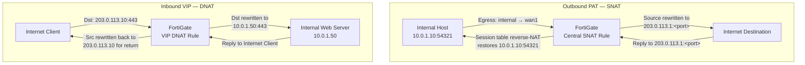

# FortiGate: NAT Configuration

FortiGate performs Network Address Translation in two distinct directions: Source NAT
(SNAT)
for outbound traffic originating inside the network, and Destination NAT (DNAT) for
inbound
traffic targeting published services. FortiOS supports two NAT implementation modes —
Policy NAT (legacy, per-policy) and Central NAT (recommended, separate SNAT and DNAT
tables).
Central NAT decouples address translation from firewall policy logic, improving
operational
clarity at scale.

For protocol background see [Network Address Translation (NAT)](../theory/nat.md).

---

## 1. Overview & Principles

- **Policy NAT (legacy):** NAT parameters are embedded directly in each firewall
  policy using `set nat enable`, `set ippool enable`, and `set poolname`. Simple to
  configure but ties
  address translation tightly to access policy, making large rulesets harder to audit.

- **Central NAT (recommended):** Enabled globally; SNAT rules live in
  `config firewall central-snat-map` and DNAT rules are configured as VIPs under
`config firewall vip`. Firewall policies reference VIP objects as destination addresses.
  Central NAT is the preferred model when managing multiple policies or VDOMs.

- **IP Pools:** Define the public source address range used for SNAT. Three types are
  available: Overload (PAT — many-to-one), One-to-One (static, no port translation), and
  Fixed Port Range (predictable port allocation for specific applications).

- **VIPs (Virtual IPs):** Define inbound DNAT mappings — an external IP (or IP:port) is
  mapped to an internal IP (or IP:port). VIPs must be referenced as destination address
  objects in a permitting firewall policy before traffic is forwarded.

- **Hairpin NAT:** When an internal host accesses a VIP destination from inside the
  network, the FortiGate must perform both DNAT (to reach the server) and SNAT (so
  reply traffic returns through the firewall). This is handled with a loopback
  policy or, preferably, by using split-horizon DNS to resolve the published name
  to the internal IP directly.

- **Order of operations:** Central SNAT rules are evaluated after the firewall policy
match.

match.

The first matching central-snat-map entry is applied; entries are evaluated top-down by
  sequence number.

---

## 2. NAT Flow



---

## 3. Configuration

### A. Enabling Central NAT Mode

Central NAT is disabled by default. Enabling it changes how policies reference address
translation — existing Policy NAT entries in firewall policies are no longer evaluated once
Central NAT is active. Enable on all VDOMs that will use the central tables.

```fortios

config system settings
    set central-nat enable
end
```

This setting is per-VDOM. After enabling, create central-snat-map entries and VIPs before
applying policies; policies with `set nat enable` embedded will no longer function as SNAT
rules once Central NAT is active.

### B. IP Pools (SNAT Source Address Pools)

IP Pools define the translated source address range used for outbound traffic. Three pool
types are supported:

- **Overload (PAT):** Many internal addresses share one or more public IPs; port multiplexing
  provides session uniqueness. Default type; suitable for most internet access scenarios.

- **One-to-One:** Each internal IP is statically mapped to a unique external IP. No port
  translation; the external IP range must be as large as the internal source range.

- **Fixed Port Range:** Allocates a deterministic port block per internal IP. Useful for
  applications that embed source port information in-payload (e.g., some SIP implementations)
  or where consistent port ranges are required by an upstream carrier.

```fortios

config firewall ippool
    edit "INET-PAT-POOL"
        set type overload
        set startip 203.0.113.1
        set endip 203.0.113.1
    next
    edit "INET-1TO1-POOL"
        set type one-to-one
        set startip 203.0.113.20
        set endip 203.0.113.29          ! One external IP per internal source
    next
    edit "INET-FIXED-PORT-POOL"
        set type fixed-port-range
        set startip 203.0.113.30
        set endip 203.0.113.30
        set source-startip 10.0.2.1
        set source-endip 10.0.2.254     ! Port block allocated per host in this range
    next
end
```

### C. Central SNAT Policy

Central SNAT rules match outbound flows by source interface, destination interface, and
source address object, then apply the specified IP pool. A protocol value of `0` matches
all protocols.

```fortios

config firewall central-snat-map
    edit 1
        set srcintf "internal"
        set dstintf "wan1"
        set src-addr "RFC1918-ALL"
        set nat-ippool "INET-PAT-POOL"
        set protocol 0
    next
end
```

If no IP pool is specified, the FortiGate uses the egress interface IP as the translated
source address (interface NAT). Multiple central-snat-map entries can be chained; the first
match wins, so place more specific rules above general ones.

### D. VIPs (Virtual IPs — DNAT)

VIPs define inbound static NAT or port-forward mappings. A VIP object alone does not permit
traffic — it must be referenced as the destination address in a firewall policy with
`set action accept`.

**Port forwarding (external IP:port → internal IP:port):**

```fortios

config firewall vip
    edit "WEB-SERVER-VIP"
        set type static-nat
        set extip 203.0.113.10
        set extintf "wan1"
        set mappedip 10.0.1.50
        set portforward enable
        set protocol tcp
        set extport 443
        set mappedport 443
    next
end
```

**Full one-to-one static NAT (no port restriction):**

```fortios

config firewall vip
    edit "APP-SERVER-STATIC"
        set type static-nat
        set extip 203.0.113.11
        set extintf "wan1"
        set mappedip 10.0.1.60          ! All traffic to 203.0.113.11 forwarded to 10.0.1.60
    next
end
```

**Firewall policy referencing a VIP:**

```fortios

config firewall policy
    edit 50
        set srcintf "wan1"
        set dstintf "internal"
        set srcaddr "all"
        set dstaddr "WEB-SERVER-VIP"    ! VIP object used as destination address
        set action accept
        set schedule "always"
        set service "HTTPS"
    next
end
```

### E. Policy NAT (Without Central NAT)

In environments not using Central NAT, SNAT is configured per firewall policy. The IP pool
must be created under `config firewall ippool` first.

```fortios

config firewall policy
    edit 10
        set srcintf "internal"
        set dstintf "wan1"
        set srcaddr "all"
        set dstaddr "all"
        set action accept
        set schedule "always"
        set service "ALL"
        set nat enable                  ! Enable SNAT on this policy
        set ippool enable               ! Use an IP pool instead of interface IP
        set poolname "INET-PAT-POOL"
    next
end
```

Policy NAT and Central NAT are mutually exclusive modes. When `central-nat enable` is set,
`set nat enable` in a policy has no effect for SNAT.

### F. NAT64 (IPv6-to-IPv4 Traversal)

FortiOS supports NAT64 for environments requiring IPv6 clients to reach IPv4 destinations.
Configuration requires an IPv6-to-IPv4 mapping prefix and is enabled per VDOM.

```fortios

config system settings
    set gui-nat46-64 enable
end

config firewall policy6
    edit 200
        set srcintf "internal_v6"
        set dstintf "wan1"
        set srcaddr6 "all"
        set dstaddr6 "all"
        set action accept
        set schedule "always"
        set service "ALL"
        set nat64 enable
        set ippool6 "NAT64-PREFIX-POOL"
    next
end
```

The NAT64 prefix pool defines the IPv6 prefix that encodes the IPv4 destination
address per RFC 6052. Ensure the prefix is routed to the FortiGate from the IPv6
network.

### G. Hairpin NAT (Internal Access to VIPs)

When an internal host resolves a published hostname to the VIP's external IP and attempts
to connect from inside the network, the FortiGate must handle both DNAT (map external IP
to server) and SNAT (ensure the reply returns through the firewall rather than directly).

The preferred solution is split-horizon DNS — return the internal IP for the published
hostname to internal resolvers, eliminating the hairpin entirely.

Where split-horizon DNS is not possible, create a loopback policy:

```fortios

config firewall policy
    edit 60
        set srcintf "internal"
        set dstintf "internal"          ! Both source and destination on the internal interface
        set srcaddr "all"
        set dstaddr "WEB-SERVER-VIP"    ! VIP object triggers DNAT
        set action accept
        set schedule "always"
        set service "HTTPS"
        set nat enable                  ! SNAT required so return traffic goes back via FortiGate
    next
end
```

The policy must be placed before the general outbound policy in the policy table. The
FortiGate will perform DNAT (VIP mapping) followed by SNAT (rewrite source to internal
interface IP), ensuring the session remains symmetrical.

---

## 4. Comparison Summary

| NAT Type | Direction | Port Translation | Use Case | Session Tracking |
| :--- | :--- | :--- | :--- | :--- |
| **IP Pool — Overload (PAT)** | Outbound (SNAT) | Yes — PAT | Internet access, many hosts to one IP | Port + IP tuple |
| **IP Pool — One-to-One** | Outbound (SNAT) | No | Applications requiring fixed source IP | IP tuple only |
| **IP Pool — Fixed Port Range** | Outbound (SNAT) | Yes — deterministic blocks | SIP, carrier requirements, port-dependent apps | Port block per host |
| **VIP — Port Forward** | Inbound (DNAT) | Yes — remaps ext port to int port | Publishing specific services (HTTPS, RDP) | IP + port tuple |
| **VIP — Static NAT** | Inbound (DNAT) | No | Full one-to-one server publication | IP tuple |

---

## 5. Verification & Troubleshooting

| Command | Purpose |
| :--- | :--- |
| `get firewall central-snat-map` | List all Central SNAT rules with sequence, interfaces, and pool |
| `get firewall ippool` | Show configured IP pools and their type, start/end IP |
| `diagnose firewall iprope show <vdom>` | Display internal IP routing policy table for the VDOM |
| `diagnose netlink dnat list` | Show active DNAT (VIP) session entries in the kernel |
| `diagnose sys session list &#124; grep nat` | Filter active session table for entries with NAT applied |
| `diagnose debug flow filter addr <ip>` | Set debug flow filter to trace traffic for a specific IP |
| `diagnose debug flow trace start 10` | Trace policy match, VIP lookup, and NAT translation for a flow |
| `get system session-info` | Session table summary statistics |
