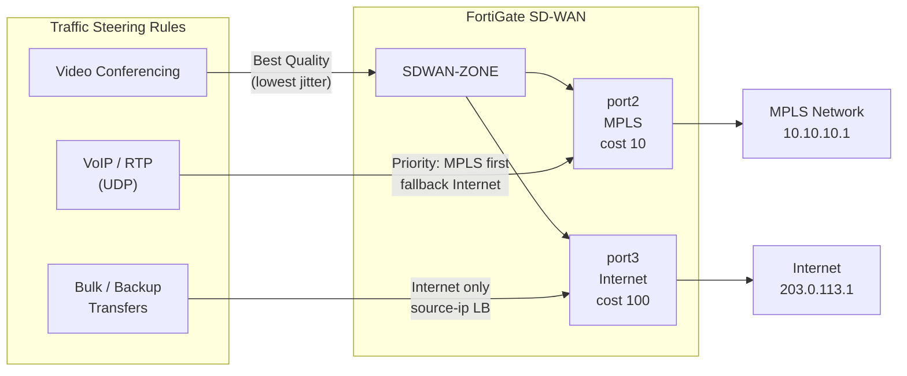

# FortiGate: SD-WAN Configuration Guide

FortiGate SD-WAN aggregates multiple WAN interfaces (broadband, MPLS, LTE, direct connect)
into a logical overlay with policy-based forwarding, per-application routing, and SLA-based
health monitoring. Traffic is steered to the best path based on measured link quality
(latency, jitter, packet loss) or per-application rules. SD-WAN replaces traditional policy
routing in FortiOS and is configured entirely under `config system sdwan`.

---

## 1. Overview & Principles

- **SD-WAN Zone:** Logical grouping of SD-WAN member interfaces. Zone-based policies
  control inter-zone traffic and are referenced in firewall policies as a single interface
  object.
- **SD-WAN Member:** A WAN interface (physical or IPsec/GRE tunnel) participating in
  SD-WAN load-balancing or path selection. Each member is assigned to a zone.
- **Performance SLA:** Continuous probes (ping, HTTP, DNS) measure latency, jitter, and
  packet loss per member. SLA thresholds determine whether a member is considered healthy.
- **SD-WAN Rule (Service):** Matches traffic by source/destination address, application,
  or DSCP, then steers it to a preferred member or zone using a selected algorithm.
- **Load-balancing algorithms:**

| Algorithm | Behaviour |
| --- | --- |
| **Source IP** | Session affinity by source address — same source always uses same member |
| **Spillover** | Fill primary member up to bandwidth threshold; overflow to secondary |
| **Lowest Cost (SLA)** | Route via lowest-cost member that currently meets SLA |
| **Best Quality** | Route via member with best measured metric (latency, jitter, or combined) |
| **Weighted** | Distribute sessions proportionally by configured weight |
| **Volume** | Distribute by bytes transferred across members |

---

## 2. Architecture



---

## 3. Configuration

### A. Define SD-WAN Members and Zone

```fortios
config system sdwan
    set status enable
    config zone
        edit "SDWAN-ZONE"
        next
    end
    config members
        edit 1
            set interface "port2"           ! MPLS uplink
            set zone "SDWAN-ZONE"
            set gateway 10.10.10.1
            set cost 10                     ! Lower cost = preferred for cost-based steering
        next
        edit 2
            set interface "port3"           ! Internet uplink
            set zone "SDWAN-ZONE"
            set gateway 203.0.113.1
            set cost 100
        next
    end
end
```

### B. Performance SLA (Health Check)

```fortios
config system sdwan
    config health-check
        edit "SLA-CHECK-PRIMARY"
            set server "8.8.8.8"
            set protocol ping
            set interval 500               ! Probe every 500ms
            set failtime 3                 ! Mark member failed after 3 consecutive probe failures
            set recoverytime 5             ! Mark member recovered after 5 consecutive successes
            set threshold-latency 150      ! SLA fail if latency > 150ms
            set threshold-jitter 30        ! SLA fail if jitter > 30ms
            set threshold-packetloss 5     ! SLA fail if packet loss > 5%
            config sla
                edit 1
                    set link-cost-factor latency jitter packet-loss
                    set latency-threshold 150
                    set jitter-threshold 30
                    set packetloss-threshold 5
                next
            end
            set members 1 2                ! Run this probe on both members
        next
    end
end
```

### C. SD-WAN Traffic Steering Rules

```fortios
config system sdwan
    config service
        edit 1
            set name "VOIP-MPLS"
            set mode priority              ! Use highest-priority member that meets SLA
            config sla
                edit "SLA-CHECK-PRIMARY"
                    set id 1
                next
            end
            set priority-members 1 2       ! Member 1 (MPLS) preferred; fallback to member 2 (Internet)
            set dst "all"
            set src "VOIP-SUBNET"
            set protocol 17               ! UDP — matches RTP and SIP traffic
        next
        edit 2
            set name "BULK-INTERNET"
            set mode load-balance
            set load-balance-mode source-ip-based
            set members 2                 ! Internet only
            set dst "all"
            set src "all"
        next
        edit 3
            set name "VIDEO-BEST-QUALITY"
            set mode best-quality
            set quality-link-cost-factor jitter
            set members 1 2               ! Best jitter across both members
            set dst "all"
            set src "VIDEO-SUBNET"
        next
    end
end
```

### D. SD-WAN Firewall Policy

SD-WAN traffic must be permitted by a firewall policy that references the SD-WAN zone as
the source interface. The zone name is used the same way as a physical interface.

```fortios
config firewall policy
    edit 100
        set srcintf "SDWAN-ZONE"
        set dstintf "port1"               ! LAN interface
        set srcaddr "all"
        set dstaddr "all"
        set action accept
        set schedule "always"
        set service "ALL"
        set nat enable                    ! Source NAT on egress (required for internet access)
    next
end
```

### E. Per-Member NAT (Different Source IPs per WAN Link)

When members use different public IPs, configure IP pools tied to each member's outbound
interface to ensure return traffic routes correctly:

```fortios
config firewall ippool
    edit "POOL-MPLS"
        set startip 10.10.10.2
        set endip 10.10.10.2
        set interface "port2"
    next
    edit "POOL-INTERNET"
        set startip 203.0.113.2
        set endip 203.0.113.2
        set interface "port3"
    next
end
```

---

## 4. SLA and Health Checks

SLA states control which members are eligible for traffic steering:

- When a member's measured latency, jitter, or packet loss exceeds configured thresholds,
  its SLA status changes to **out-of-SLA**.
- Rules set to `mode priority` skip members with failed SLA and move to the next member
  in the priority list.
- Rules set to `mode best-quality` continuously re-evaluate the best member even when all
  members are within SLA.

| Steering Mode | Behaviour When Primary Fails SLA | Re-evaluation |
| --- | --- | --- |
| **Priority** | Immediate failover to next priority member | On SLA state change |
| **Best Quality** | Continuous; switches to best member dynamically | Per probe interval |
| **Lowest Cost (SLA)** | Switches to lowest-cost member still meeting SLA | On SLA state change |
| **Spillover** | Overflows to secondary when bandwidth threshold exceeded | Per session |

---

## 5. Verification & Troubleshooting

| Command | Purpose |
| --- | --- |
| `diagnose sys sdwan health-check` | Current SLA probe results: latency, jitter, loss per member |
| `diagnose sys sdwan member` | SD-WAN member state, active sessions, and byte counts |
| `diagnose sys sdwan service` | Show which SD-WAN rule matched for active sessions |
| `diagnose sys sdwan intf-sla-log` | Historical SLA performance log per member |
| `get system sdwan` | SD-WAN configuration summary (zones, members, rules) |
| `diagnose debug flow filter addr <ip>` | Set up debug flow filter for a specific host |
| `diagnose debug flow show function-name enable` | Enable function names in flow debug output |
| `diagnose debug flow trace start 10` | Trace policy-match and SD-WAN rule selection for a flow |
