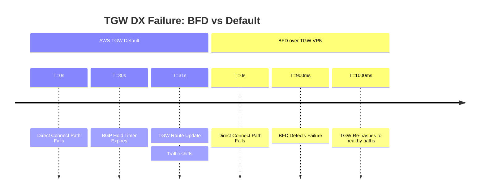

# FortiGate: BGP over AWS Transit Gateway (DX Underlay)

## 1. Overview & Principles

Transit Gateway (TGW) supports ECMP across VPN tunnels. BFD is essential here to
ensure that if one Direct Connect (DX) path fails, the TGW immediately stops hashing
traffic to that specific tunnel.

### Key Principles

- **ECMP Support:** BGP over TGW allows for multi-tunnel hashing (Multipath).
- **MSS Clamping:** Essential to prevent fragmentation over IPsec/DX (Recommend

    1379).

## 2. Detection Timelines (Underlay Failure)



## 3. Configuration Snippets

### A. Phase 1 Interface (VTI)

```fortios

config vpn ipsec phase1-interface
    edit "AWS_TGW_VPN_01"
        set bfd enable
        set npu-offload enable
    next
end
```

### B. BGP with ECMP

```fortios

config router bgp
    set ebgp-multipath enable
    config neighbor
        edit "169.254.x.x"
            set bfd enable
            set timers-holdtime 30
        next
    end
end
```

## 4. Comparison Summary

| Metric | Default Settings | Optimized TGW |
| :--- | :--- | :--- |
| **Detection Speed** | 180 Seconds | **< 1 Second** |
| **Throughput** | 1.25 Gbps (Single Tunnel) | **ECMP Across Tunnels** |
| **Failover Trigger** | BGP Timeout | **BFD Hardware Alert** |

## 5. Verification & Troubleshooting

| Command | Purpose |
| :--- | :--- |
| `get router info bfd neighbor` | Confirm 300ms negotiation. |
| `get router info bgp summary` | Ensure ECMP (multipath) is active. |
| `diagnose vpn tunnel list` | Check if NPU is offloading BFD traffic. |
