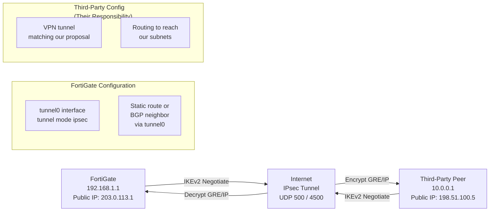

# FortiGate: Third-Party VPN Configuration Guide

Complete reference for establishing secure IPsec VPN tunnels from FortiGate firewalls to external
third parties (partners, vendors, remote offices) without shared infrastructure. Covers static and
dial-up peers, IKEv2 negotiation, route-based and policy-based VPN modes, and BGP or static routing
over tunnels.

For IPsec fundamentals see [IPsec & IKE](../theory/ipsec.md). For troubleshooting see [IPsec VPN
Troubleshooting](../operations/ipsec_vpn_troubleshooting.md).

---

## 1. Overview

### When This Guide Applies

Third-party VPN connectivity is required when connecting to an external peer you do not control:

- Partner organizations with their own network infrastructure
- Vendor/SaaS provider IPsec endpoints
- Remote offices with static public IPs
- Other enterprises or ISPs

**Key difference from cloud-native VPN:** You configure your side (FortiGate); the peer
configures theirs independently. Negotiation is bilateral — both sides must agree on IKEv2
proposals, encryption, authentication, and routing.

### Peer Types: Static vs Dial-Up

| Peer Type | Public IP | Config | Use Case |
| --- | --- | --- | --- |
| **Static** | Fixed (e.g., 203.0.113.5) | Peer IP pre-configured | Partner with stable connection |
| **Dial-Up** | Dynamic (DHCP/PPP) | Initiates toward hub | Branch office, mobile worker |

### Tunnel Mode: Route-Based vs Policy-Based

| Tunnel Mode | Encapsulation | Routing | Policy Application |
| --- | --- | --- | --- |
| **Route-Based** | Virtual interface (tunnel) | Dynamic routing (BGP/OSPF) or static routes | Applied at tunnel interface level |
| **Policy-Based** | Direct IPsec policy | Static routes only | Applied at policy level (legacy) |

**Recommendation:** Route-based tunnels are cleaner; policy-based exist for legacy third-party
compatibility.

### Authentication: Pre-Shared Key vs Certificates

| Method | Setup | Scalability | Best For |
| --- | --- | --- | --- |
| **PSK (Pre-Shared Key)** | Manual key exchange | Few peers; high overhead | Two-party VPN |
| **Certificates** | PKI infrastructure | Many peers; automated | Enterprise; DMVPN-like scales |

---

## 2. Architecture



---

## 3. Configuration

### A. IKEv2 Phase 1 Proposal (ISAKMP SA)

```fortios
config vpn ike
  edit "partner-ike-proposal"
    set comments "Third-party peer negotiation"
    set version 2
    set encryption aes256
    set integrity sha256
    set dhgrp 14
    set lifetime 3600
    set dpd enable
    set dpd-retrycount 3
    set dpd-retryinterval 60
  next
end
```

**Key settings:**

- `version 2` — IKEv2 (mandatory for modern third parties)
- `encryption aes256` — AES-256 CBC (common standard)
- `integrity sha256` — HMAC-SHA256
- `dhgrp 14` — 2048-bit Diffie-Hellman (minimum; consider 19/20 for stronger security)
- `dpd enable` — Dead Peer Detection (detect stale connections)

**Negotiation with third party:** Agree on these values before bringing up the tunnel.

### B. IPsec Phase 2 / Tunnel Interface (Route-Based)

```fortios
config vpn ipsec
  edit "partner-tunnel"
    set type tunnel
    set comments "Third-party VPN tunnel (route-based)"
    set ike-version 2
    set proposal aes256-sha256
    set encap-type tunnel
    set pfs enable
    set pfs-dh-group 14
    set replay disable
    set lifetime 3600
  next
end

config system interface
  edit "partner-vpn"
    set type tunnel
    set tunnel-type ipsec
    set remote-ip 198.51.100.5    ! Third-party peer public IP
    set local-ip 203.0.113.1      ! Your public IP (or 0.0.0.0 for automatic)
    set ipsec-policy "partner-tunnel"
    set ip 10.255.1.1 255.255.255.252
    set mtu 1400
  next
end
```

**Key settings:**

- `type tunnel` + `tunnel-type ipsec` — Route-based mode
- `pfs enable` — Perfect Forward Secrecy (new DH per rekey)
- `remote-ip 198.51.100.5` — Peer public IP (fixed for static peer)
- `local-ip 203.0.113.1` — Your public IP

### C. Static Routing over Tunnel

```fortios
config router static
  edit 100
    set destination 10.0.0.0 255.255.0.0     ! Peer's subnets
    set gateway 10.255.1.2                    ! Peer's tunnel IP
    set device "partner-vpn"                  ! Tunnel interface
  next
end
```

### D. BGP over Tunnel (Dynamic Routing)

```fortios
config router bgp
  set as 65000
  config neighbor
    edit "10.255.1.2"
      set remote-as 65100
      set interface "partner-vpn"
      set allowas-in 1
      set link-down-failover enable
    next
  end
  config address-family ipv4
    set neighbor 10.255.1.2 activate
    set neighbor 10.255.1.2 soft-reconfiguration inbound
  next
end
```

### E. Policy-Based VPN (Legacy)

If the third party requires policy-based mode:

```fortios
config vpn ipsec
  edit "partner-policy-vpn"
    set type static
    set remote-gateway 198.51.100.5
    set proposal aes256-sha256
    set pfs enable
  next
end

config firewall policy
  edit 100
    set name "to-partner"
    set srcintf "internal"
    set dstintf "partner-policy-vpn"
    set srcaddr "all"
    set dstaddr "partner-subnets"
    set action accept
    set service "all"
  next
end
```

### F. Dial-Up VPN (Dynamic Peer IP)

When the third party has a dynamic public IP (DHCP, PPP):

```fortios
config vpn ipsec
  edit "partner-dialup"
    set type dynamic
    set remote-gateway 0.0.0.0    ! Accept from any IP
    set proposal aes256-sha256
  next
end

config system interface
  edit "partner-dialup-vpn"
    set type tunnel
    set tunnel-type ipsec
    set remote-ip 0.0.0.0         ! Accept from any remote IP
    set local-ip 203.0.113.1
    set ipsec-policy "partner-dialup"
  next
end
```

The peer initiates the tunnel toward your public IP (203.0.113.1). Tunnel comes up dynamically.

---

## 4. Comparison Summary

| Aspect | Route-Based | Policy-Based | Static Peer | Dial-Up Peer |
| --- | --- | --- | --- | --- |
| **Tunnel Interface** | Yes (virtual IF) | No (implicit) | Fixed remote IP | Dynamic remote IP |
| **Routing** | BGP or static | Static only | Simpler config | Simpler, peer initiates |
| **Scalability** | Better (clean routing) | Limited | Few peers | Many peers OK |
| **Modern Support** | Recommended | Legacy | Modern third parties | Older peers |
| **Auth** | PSK or cert | PSK or cert | Either | Usually PSK |

---

## 5. Verification & Troubleshooting

### Check IKE Negotiation

```text
diagnose vpn ike status
! Lists active IKE SAs
! Status should show: ESTABLISHED

diagnose vpn ike log filter ?
! Adjust verbosity if needed
```

### Check IPsec Tunnel Status

```text
diagnose vpn tunnel list
! Shows all tunnel states
! Example output:
!   partner-vpn: local-ip=203.0.113.1 remote-ip=198.51.100.5
!   Status: up
!   Incoming: 1234 bytes, Outgoing: 5678 bytes

show vpn ipsec tunnel status
! FortiOS v7+ equivalent
```

### Verify Routing

```text
get router info routing-table all
! Check if peer subnets are reachable via partner-vpn interface

diagnose ip route list
! Detailed routing table
```

### Monitor Traffic over Tunnel

```text
diagnose sys session list | grep partner-vpn
! Active sessions over the tunnel
```

### If Tunnel Down: Check Pre-Shared Key

```text
show vpn ipsec manual
! Verify PSK matches peer's PSK exactly (case-sensitive)
```

---

## Common Issues

| Issue | Cause | Fix |
| --- | --- | --- |
| **IKE negotiation times out** | Firewall blocking UDP 500 | Allow UDP 500/4500 inbound from peer IP |
| **IKE proposal mismatch** | Encryption/integrity/DH group differs | Agree on same proposal with peer |
| **PSK mismatch** | Different pre-shared keys | Verify PSK identity on both sides |
| **Tunnel up, no traffic** | Routing missing | Add static route or BGP route via tunnel |
| **Asymmetric MTU** | DF fragmentation | Set tunnel MTU to 1300-1400 bytes |

---

## Next Steps

- [IPsec & IKE](../theory/ipsec.md) — Protocol deep dive
- [IPsec VPN Troubleshooting](../operations/ipsec_vpn_troubleshooting.md) — Comprehensive diagnostics
