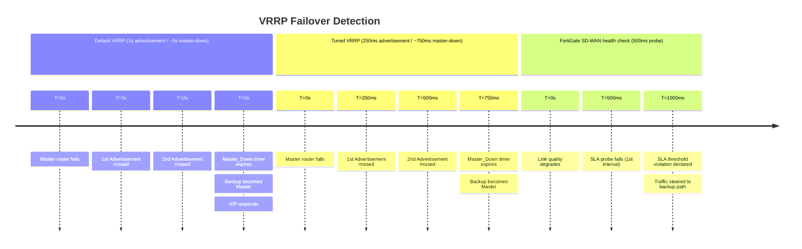

# FortiGate: VRRP Configuration

FortiGate implements VRRP natively — VRRPv2 for IPv4 and VRRPv3 for IPv4/IPv6. Unlike
Cisco IOS-XE, where VRRP is configured as a protocol on an interface, FortiGate VRRP is
configured as a sub-object within the interface definition itself. The FortiGate can act
as Master or Backup and supports multiple VRRP groups per interface.

For protocol theory and a comparison between HSRP and VRRP see
[HSRP vs VRRP](../theory/hsrp_vs_vrrp.md).

---

## 1. Overview & Principles

A VRRP group on FortiGate has the following key attributes:

- **Virtual router ID (VRID):** Group identifier (1–255); must match on all routers
  in the group.

- **Virtual IP (vrip):** The shared gateway address that hosts use as their default
  gateway.

- **Priority:** 1–254; default 100. The router with the highest priority becomes
  Master. A router whose real interface IP matches the vrip is the VRRP owner and
  takes priority 255.

- **Advertisement interval:** How often the Master sends VRRP Advertisements
  (default 1 second).

- **Master_Down interval:** 3 × advertisement interval + skew time. If a Backup
  does not hear from the Master within this window, it transitions to Master.

- **Preempt:** Enabled by default. A higher-priority router that comes online will
  reclaim Master.

- **Version:** VRRPv2 (IPv4 only) or VRRPv3 (IPv4 and IPv6).

| Property | Default value |
| --- | --- |
| Advertisement interval | 1 second |
| Master_Down interval | ~3 seconds |
| Priority | 100 |
| Preemption | Enabled |
| Version | 2 (set explicitly to 3 for VRRPv3) |

---

## 2. Detection Timelines



VRRP's default failover is approximately 3 seconds, faster than HSRP's 10-second default.
Tuning the advertisement interval below 1 second reduces failover time further, but
increases control-plane traffic and should be tested in the target environment before
production deployment.

---

## 3. Configuration

### A. Basic VRRP on a LAN Interface

The VRRP group is configured under `config vrrp` inside the interface definition.

**GUI path:** Network → Interfaces → Edit interface → VRRP section → Create New

**CLI:**

```fortios

config system interface
    edit "port2"
        set vdom "root"
        set ip 10.0.1.2/24
        config vrrp
            edit 1
                set vrip 10.0.1.1
                set priority 110
                set adv-interval 1
                set preempt enable
                set version 3
            next
        end
    next
end
```

Key fields:

| Field | Value | Notes |
| --- | --- | --- |
| `vrip` | 10.0.1.1 | Virtual IP — hosts' default gateway |
| `priority` | 110 | Above default 100; this router is preferred Master |
| `adv-interval` | 1 | Advertisement interval in seconds |
| `preempt` | enable | Higher-priority router reclaims Master on recovery |
| `version` | 3 | VRRPv3 supports both IPv4 and IPv6 |

On the Backup router, configure the same VRID and vrip with a lower priority (leave at
default 100, or set explicitly):

```fortios

config system interface
    edit "port2"
        set vdom "root"
        set ip 10.0.1.3/24
        config vrrp
            edit 1
                set vrip 10.0.1.1
                set priority 100
                set adv-interval 1
                set preempt enable
                set version 3
            next
        end
    next
end
```

---

### B. Preempt Delay

FortiGate VRRP does not have a native preempt delay parameter equivalent to Cisco's
`preempt delay minimum`. When a FortiGate recovers from a failure, preemption is
immediate if `set preempt enable` is configured and the recovering router has a higher
priority.

The practical workaround is to account for routing protocol convergence time when sizing
timers. If the FortiGate is running BGP or OSPF, ensure those adjacencies are established
before the router is expected to forward production traffic. In environments where strict
preempt delay is required, the preferred approach is to use FortiGate SD-WAN health
checks for path selection rather than relying on VRRP failover timing — SD-WAN provides
per-probe failover without a protocol-level convergence dependency.

---

### C. Interface and Route Tracking

FortiGate VRRP does not include native object tracking equivalent to Cisco IP SLA
tracking. There is no built-in mechanism to automatically decrement the VRRP priority
in response to an upstream interface going down or a route disappearing from the
routing table.

The options available are:

- **Accept mode (`set accept-mode enable`):** Allows the Backup to accept traffic
  destined for the vrip even when it is in Backup state. This is useful in asymmetric
  routing scenarios but does not affect failover behaviour.

- **Manual priority adjustment:** If the upstream link is confirmed down and the
  FortiGate should not be Master, change the priority manually via CLI or use an
  automation stitch to trigger a priority change on a link-down event.

- **SD-WAN health checks (recommended):** For scenarios where failover should be
  triggered by upstream link quality (latency, packet loss, route reachability), use
  FortiGate SD-WAN SLA probes instead of VRRP tracking. SD-WAN operates at the
  forwarding plane and provides faster, application-aware failover without requiring
  changes to the VRRP priority.

> **Note:** If the deployment requires uplink-aware gateway redundancy on FortiGate,
> SD-WAN with zone-based failover is the recommended solution. VRRP is best suited
> to simple active/standby gateway redundancy where both FortiGates have equivalent
> connectivity.

---

### D. Dual-Stack IPv4 and IPv6 VRRP Groups

VRRPv3 supports both IPv4 and IPv6. Configure a separate VRRP group for each address
family on the same interface. The VRID values do not need to match between the IPv4
and IPv6 groups, though using matching VRIDs is common for clarity.

```fortios

config system interface
    edit "port2"
        set vdom "root"
        set ip 10.0.1.2/24
        set ipv6
            set ip6-address 2001:db8:1::2/64
        end
        config vrrp
            edit 1
                set vrip 10.0.1.1
                set priority 110
                set adv-interval 1
                set preempt enable
                set version 3
            next
            edit 2
                set vrip6 2001:db8:1::1
                set priority 110
                set adv-interval 1
                set preempt enable
                set version 3
            next
        end
    next
end
```

Both groups must be configured consistently on the Backup router with matching VRID
values, vrip/vrip6 addresses, and lower priority.

---

### E. Verification

```fortios

get system interface port2
```

Displays the interface configuration including the configured VRRP groups, vrip, priority,
and version.

```fortios

diagnose ip vrrp status
```

Shows the operational state of all VRRP groups: current role (Master or Backup),
advertisement interval, priority, and the IP of the current Master.

```fortios

diagnose debug application vrrpd -1
diagnose debug enable
```

Enables real-time VRRP debug output. The `vrrpd` daemon handles all VRRP processing.
This output shows Advertisement receipt, state transitions (Backup → Master), and
timer events. Disable after troubleshooting:

```fortios

diagnose debug disable
diagnose debug reset
```

---

## 4. Comparison Summary

| Scenario | Recommended approach |
| --- | --- |
| Simple active/standby gateway redundancy | VRRP — clean, standards-based, low config overhead |
| Uplink-aware failover (upstream link tracking) | SD-WAN health checks — natively supported, application-aware |
| Path-quality-driven failover (latency, jitter, loss) | SD-WAN SLA probes — cannot be replicated with VRRP alone |
| Dual-stack IPv4 + IPv6 redundancy | VRRPv3 — single protocol covers both address families |
| Sub-second failover | Tune `adv-interval` to 250ms or use SD-WAN probe interval |

---

## 5. Verification Commands

| Command | Purpose |
| --- | --- |
| `get system interface <name>` | Show interface config including VRRP group parameters |
| `diagnose ip vrrp status` | Operational VRRP state — role, priority, Master IP |
| `diagnose debug application vrrpd -1` | Real-time VRRP daemon debug output |
| `diagnose debug enable` | Activate debug output |
| `diagnose debug disable` | Stop debug output |
| `diagnose debug reset` | Clear all active debug filters |

---

## Notes

- VRRP on FortiGate works best for simple gateway redundancy where both firewalls have
  equivalent upstream connectivity. When failover should be sensitive to link quality,
  path reachability, or application performance, FortiGate SD-WAN is the appropriate
  mechanism. See [FortiGate SD-WAN](fortigate_sdwan.md).

- VRRP Advertisements are sent to multicast `224.0.0.18` (IP protocol 112 for VRRPv2/v3
  IPv4) and `FF02::12` (IPv6). Ensure these multicast addresses are permitted on any
  intermediate switch or firewall segment between the VRRP peers.

- The VRRP virtual MAC for group 1 is `0000.5E00.0101`. Confirm the switch fabric
  is learning this MAC on the correct port (the Master's port) after a failover. If the
  switch is slow to update its MAC table, a gratuitous ARP from the new Master will
  accelerate convergence.

- Multiple VRRP groups on the same interface can be used to load-balance traffic by
  assigning different hosts or VLANs to different VRIDs with the Master/Backup roles
  reversed between groups.
