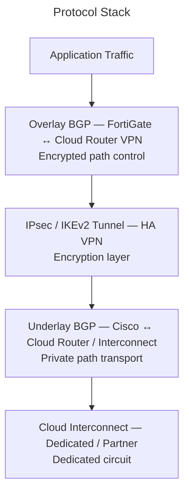
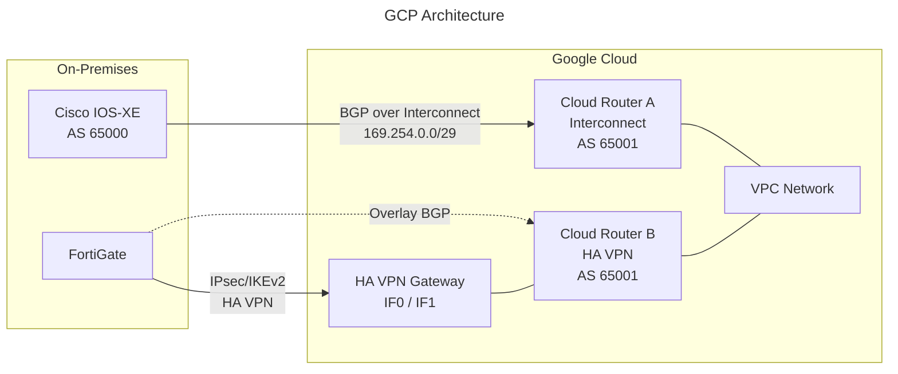
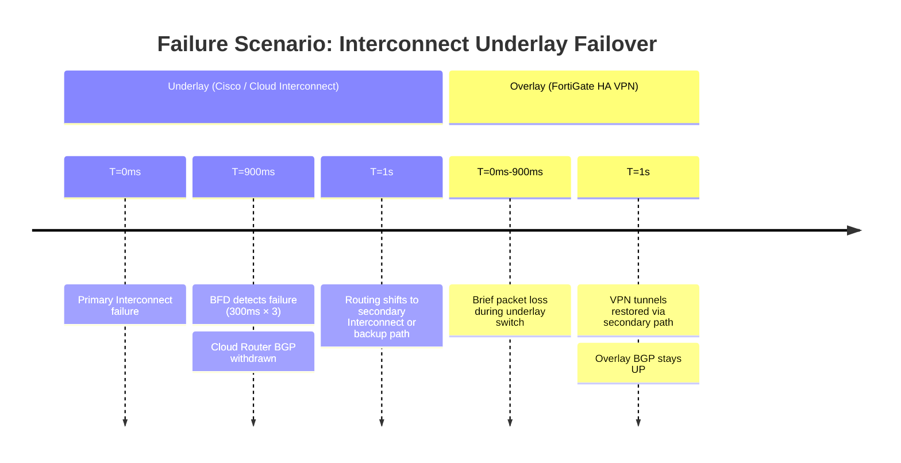
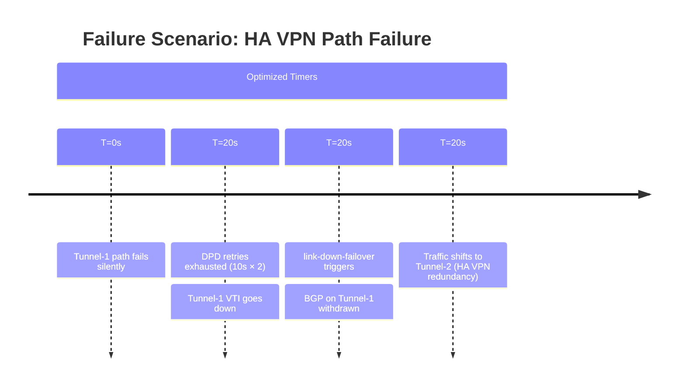

# BGP Stack Analysis: HA VPN Overlay over Cloud Interconnect

## 1. Overview & Principles

This architecture uses a layered protocol approach to provide **encrypted**
connectivity to Google Cloud Platform. Cloud Interconnect is a private dedicated
connection — it is **not encrypted by default**. An HA VPN overlay (IPsec/IKEv2)
running inside the Interconnect path provides confidentiality while preserving the
latency and bandwidth advantages of the dedicated link.

### The Protocol Stack



- **Underlay BGP:** Cisco IOS-XE peers with a GCP Cloud Router over the
  Cloud Interconnect VLAN attachment. Cloud Router BGP ASN is configurable;
  GCP does not use a fixed ASN like Azure's `12076`.

- **HA VPN Tunnels:** FortiGate terminates IKEv2 tunnels to a Cloud VPN Gateway.
  GCP HA VPN requires two tunnels for the 99.99% SLA. Tunnel endpoints are the
  public IPs of the HA VPN gateway interfaces.

- **Overlay BGP:** FortiGate and a second Cloud Router (VPN-attached) peer BGP
  inside the IPsec tunnels, exchanging VPC and on-premises prefixes with
  encryption end-to-end.

- **BFD on Interconnect:** Unlike AWS and Azure, GCP Cloud Router supports BFD
  over Dedicated Interconnect VLAN attachments, enabling sub-second underlay
  failure detection.

### Key Differences from AWS and Azure

| Property | AWS DX + TGW | Azure ER + VPN GW | GCP Interconnect + HA VPN |
| --- | --- | --- | --- |
| Provider fixed ASN | `64512` | `12076` | None — customer-defined Cloud Router ASN |
| BFD on private link | Supported | Supported (since 2021) | Supported (Dedicated IC) |
| BFD over VPN overlay | Not supported | Not supported | Not supported |
| Default route preference | DX > VPN | ER > VPN | Equal; MED-controlled |
| Active-active VPN | Yes (TGW) | Yes (active-active GW) | Yes (HA VPN — mandatory) |
| Encryption on link | Not provided | Not provided | Not provided |

---

## 2. Architecture



### Address Planning

| Segment | Example Range | Notes |
| --- | --- | --- |
| Interconnect VLAN attachment BGP | `169.254.0.1/29` | GCP assigns link-local /29 per attachment |
| HA VPN tunnel 1 BGP | `169.254.1.0/30` | Customer-defined /30 from 169.254.0.0/16 |
| HA VPN tunnel 2 BGP | `169.254.2.0/30` | Customer-defined /30 from 169.254.0.0/16 |
| On-premises prefix | `10.0.0.0/8` | Advertised via both paths |
| GCP VPC CIDR | `10.128.0.0/20` | Advertised by Cloud Router |

---

## 3. Detection & Restoration Timelines

### Underlay Failure (Interconnect Circuit Down)



### Overlay Failure (Silent VPN Path Loss)



> GCP HA VPN DPD defaults to 20 seconds (10s interval × 2 retries). This is
> less aggressive than FortiGate's default `dpd-retryinterval 5`. Tune the
> FortiGate side to match or be more conservative.

---

## 4. Configuration

### A. Cisco IOS-XE — Interconnect Underlay BGP

```ios

! BFD template for Cloud Interconnect VLAN attachment
bfd-template single-hop GCP-IC-BFD
 interval min-tx 300 min-rx 300 multiplier 3
 no bfd echo
!
router bgp 65000
 bgp router-id 10.0.0.1
 bgp log-neighbor-changes
 !
 address-family ipv4 vrf GCP
  ! Cloud Router A peer
  neighbor 169.254.0.2 remote-as 65001
  neighbor 169.254.0.2 description GCP-CLOUD-ROUTER-IC
  neighbor 169.254.0.2 fall-over bfd
  neighbor 169.254.0.2 activate
  neighbor 169.254.0.2 route-map RM-GCP-IC-IN in
  neighbor 169.254.0.2 route-map RM-GCP-IC-OUT out
  neighbor 169.254.0.2 send-community both
 exit-address-family
!
! Use MED to prefer primary Interconnect attachment
route-map RM-GCP-IC-OUT permit 10
 match ip address prefix-list PFX-ONPREM-SUMMARY
 set metric 100
!
route-map RM-GCP-IC-IN permit 10
 match ip address prefix-list PFX-GCP-VPCS
 set local-preference 200
!
ip prefix-list PFX-GCP-VPCS permit 10.128.0.0/20 le 28
ip prefix-list PFX-ONPREM-SUMMARY permit 10.0.0.0/8
```

> VRF `GCP` must be defined and the Interconnect interface assigned to it before this
> config is applied. See the [VRF-Lite config guide](../cisco/cisco_vrf_config.md) for
> VRF definitions and FortiGate subinterface requirements.

### B. FortiGate — HA VPN Phase 1 (IKEv2 to Cloud VPN Gateway)

```fortios

config vpn ipsec phase1-interface
    edit "gcp-havpn-tunnel1"
        set interface "port1"
        set ike-version 2
        set keylife 36000
        set peertype any
        set net-device disable
        set proposal aes256-sha256
        set dhgrp 14
        set remote-gw <HA-VPN-GW-IF0-PUBLIC-IP>
        set psksecret <PRE-SHARED-KEY-1>
        set dpd on-idle
        set dpd-retryinterval 10
        set dpd-retrycount 2
        set npu-offload enable
    next
    edit "gcp-havpn-tunnel2"
        set interface "port1"
        set ike-version 2
        set keylife 36000
        set peertype any
        set net-device disable
        set proposal aes256-sha256
        set dhgrp 14
        set remote-gw <HA-VPN-GW-IF1-PUBLIC-IP>
        set psksecret <PRE-SHARED-KEY-2>
        set dpd on-idle
        set dpd-retryinterval 10
        set dpd-retrycount 2
        set npu-offload enable
    next
end
```

### C. FortiGate — Overlay BGP to Cloud Router B (HA VPN)

```fortios

config system interface
    edit "gcp-havpn-tunnel1"
        set ip 169.254.1.2 255.255.255.252
        set remote-ip 169.254.1.1 255.255.255.252
        set allowaccess ping
    next
    edit "gcp-havpn-tunnel2"
        set ip 169.254.2.2 255.255.255.252
        set remote-ip 169.254.2.1 255.255.255.252
        set allowaccess ping
    next
end

config system zone
    edit "ZONE_GCP_VPN"
        set interface "gcp-havpn-tunnel1" "gcp-havpn-tunnel2"
    next
end

config router bgp
    set as 65000
    set router-id 10.0.0.2
    set ebgp-multipath enable
    set graceful-restart enable
    set graceful-restart-time 120
    set graceful-stalepath-time 120

    config neighbor
        edit "169.254.1.1"
            set description "GCP-CLOUD-ROUTER-VPN-T1"
            set remote-as 65001
            set link-down-failover enable
            set soft-reconfiguration enable
            set capability-graceful-restart enable
            # Cloud Router: keepalive 20–60s (default 20s), hold = 3×keepalive (60s)
            set timers-keepalive 20
            set timers-holdtime 60
            set route-map-in "RM-GCP-OVERLAY-IN"
            set route-map-out "RM-GCP-OVERLAY-OUT"
        next
        edit "169.254.2.1"
            set description "GCP-CLOUD-ROUTER-VPN-T2"
            set remote-as 65001
            set link-down-failover enable
            set soft-reconfiguration enable
            set capability-graceful-restart enable
            set timers-keepalive 20
            set timers-holdtime 60
            set route-map-in "RM-GCP-OVERLAY-IN"
            set route-map-out "RM-GCP-OVERLAY-OUT"
        next
    end

    config network
        edit 1
            set prefix 10.0.0.0 255.0.0.0
        next
    end
end
```

---

## 5. Path Preference

GCP uses **MED** (sent from on-premises) and **LOCAL_PREF** (set by Cloud Router
policy) for path selection. Cloud Router does not support connection weights like
Azure — use MED from the on-premises side and Cloud Router route policies on the
GCP side.

| Path | GCP Control (Cloud Router policy) | On-Premises Control |
| --- | --- | --- |
| Interconnect (underlay) | Set higher `priority` in Cloud Router BGP session | `local-preference 200` inbound |
| HA VPN (overlay) | Default lower priority | `local-preference 100` inbound |
| Inbound from GCP | Use `custom-learned-route-priority` on Cloud Router | Match `MED` sent from on-prem |

---

## 6. Comparison Summary

| Metric | Default | Optimized BGP Stack |
| --- | --- | --- |
| **Underlay detection** | 60s (BGP hold-timer) | **900ms (BFD on Interconnect)** |
| **Overlay detection** | 60s (BGP hold-timer) | **20s (DPD 10s × 2 + link-down-failover)** |
| **BGP link reaction** | Passive (hold-timer) | **Active (link-down-failover)** |
| **Encryption** | None (Interconnect unencrypted) | **AES-256 / IKEv2** |
| **HA VPN SLA** | N/A | **99.99% with two tunnels** |
| **Graceful restart** | Disabled | **Enabled (120s)** |

---

## 7. Verification & Troubleshooting

| Command | Platform | Purpose |
| --- | --- | --- |
| `show bfd neighbors` | Cisco | BFD on Interconnect BGP peering |
| `show bgp vpnv4 unicast vrf GCP summary` | Cisco | BGP neighbour state in VRF GCP |
| `show bgp vpnv4 unicast vrf GCP neighbors 169.254.0.2` | Cisco | Underlay Cloud Router BGP state |
| `show ip route vrf GCP 10.128.0.0` | Cisco | GCP VPC reachable via Interconnect |
| `get router info bgp neighbors 169.254.1.1` | FortiGate | Overlay BGP state and timers |
| `diagnose vpn tunnel list name gcp-havpn-tunnel1` | FortiGate | IKEv2 SA and DPD counters |
| `get router info routing-table 10.128.0.0` | FortiGate | Confirm overlay route installed |
| `gcloud compute vpn-tunnels describe <TUNNEL>` | gcloud | HA VPN tunnel status |
| `gcloud compute routers get-status <ROUTER>` | gcloud | Cloud Router BGP session state |
