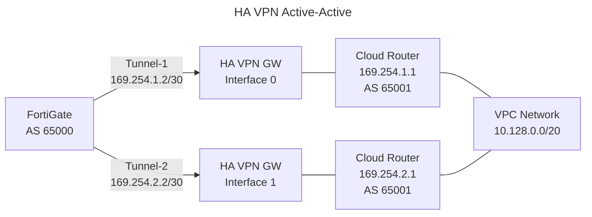
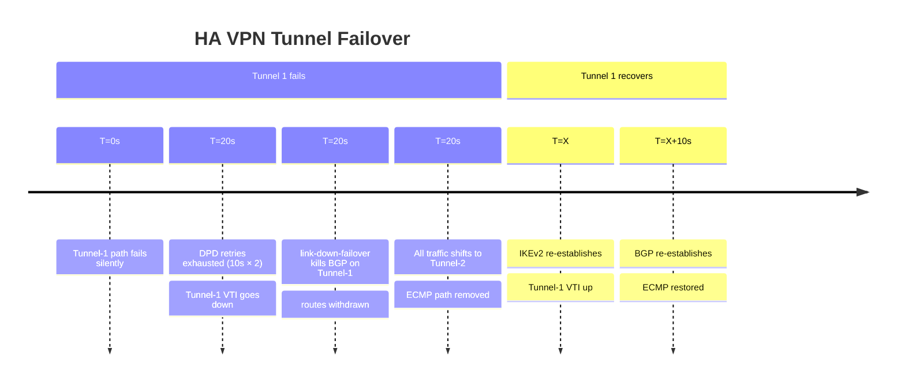

# BGP over HA VPN: Cloud Router Optimization Guide

## 1. Overview & Principles

GCP HA VPN mandates two tunnels per gateway for the 99.99% availability SLA. Both
tunnels are active simultaneously, making HA VPN inherently active-active. Cloud
Router manages BGP sessions for both tunnels and can install both paths as ECMP
forwarding entries on the GCP side. The FortiGate mirrors this with `ebgp-multipath`.

### The BGP > DPD Safety Rule

GCP HA VPN DPD uses a 20-second detection floor (10s interval × 2 retries by
default). The same safety constraint as AWS and Azure applies:

```text
BGP Hold Timer (60s) >> Total DPD detection time (10s × 2 = 20s)
```

### Cloud Router BGP Behaviour

Cloud Router is a fully managed distributed BGP service — it does not run on a
single VM and has no instance failover delay. Each BGP session terminates on the
Cloud Router service independently. A tunnel failure causes only that BGP session
to drop; the other tunnel's BGP session is unaffected.

---

## 2. HA VPN Architecture (Active-Active)



GCP HA VPN gateway interfaces are in different Google edge PoPs, providing
redundancy against a single PoP failure as well as tunnel-level redundancy.

---

## 3. Detection Timelines



---

## 4. Cloud Router Configuration (GCP Side)

Cloud Router BGP is configured via the Google Cloud Console, `gcloud` CLI, or
Terraform. Key parameters for the HA VPN BGP sessions:

```bash

# Create Cloud Router for HA VPN
gcloud compute routers create gcp-vpn-router \

  --network=prod-vpc \
  --asn=65001 \
  --region=europe-west2

# Add BGP interface for Tunnel 1
gcloud compute routers add-interface gcp-vpn-router \

  --interface-name=if-tunnel1 \
  --vpn-tunnel=gcp-havpn-tunnel1 \
  --ip-address=169.254.1.1 \
  --mask-length=30 \
  --region=europe-west2

# Add BGP peer for Tunnel 1
gcloud compute routers add-bgp-peer gcp-vpn-router \

  --peer-name=peer-tunnel1-fortigate \
  --peer-asn=65000 \
  --interface=if-tunnel1 \
  --peer-ip-address=169.254.1.2 \
  --advertised-route-priority=100 \
  --region=europe-west2

# Repeat for Tunnel 2
gcloud compute routers add-interface gcp-vpn-router \

  --interface-name=if-tunnel2 \
  --vpn-tunnel=gcp-havpn-tunnel2 \
  --ip-address=169.254.2.1 \
  --mask-length=30 \
  --region=europe-west2

gcloud compute routers add-bgp-peer gcp-vpn-router \

  --peer-name=peer-tunnel2-fortigate \
  --peer-asn=65000 \
  --interface=if-tunnel2 \
  --peer-ip-address=169.254.2.2 \
  --advertised-route-priority=100 \
  --region=europe-west2
```

---

## 5. Path Preference and MED

### Preferred Path via `advertised-route-priority`

Cloud Router expresses path preference to on-premises peers via MED
(`advertised-route-priority` — lower = more preferred). Set different values
per BGP session to make one tunnel preferred for inbound GCP-to-on-premises traffic.

```bash

# Make Tunnel 1 preferred inbound from GCP
gcloud compute routers update-bgp-peer gcp-vpn-router \

  --peer-name=peer-tunnel1-fortigate \
  --advertised-route-priority=100 \
  --region=europe-west2

gcloud compute routers update-bgp-peer gcp-vpn-router \

  --peer-name=peer-tunnel2-fortigate \
  --advertised-route-priority=200 \
  --region=europe-west2
```

### Preferred Path via Local Preference (On-Premises Side)

To prefer one tunnel for outbound on-premises-to-GCP traffic, set
`local-preference` in the FortiGate route-map applied inbound on each BGP session:

```fortios

config router route-map
    edit "RM-GCP-TUNNEL1-IN"
        config rule
            edit 1
                set match-ip-address "PFX-GCP-VPCS"
                set set-local-preference 200
            next
        end
    next
    edit "RM-GCP-TUNNEL2-IN"
        config rule
            edit 1
                set match-ip-address "PFX-GCP-VPCS"
                set set-local-preference 100
            next
        end
    next
end
```

---

## 6. Key Best Practices

### A. HA VPN Requires Two Tunnels

A single-tunnel Cloud VPN (Classic VPN) provides only a 99.9% SLA and does not
support BGP. Always deploy HA VPN with two tunnels and two Cloud Router BGP peers
for production use.

### B. Route Advertisements from Cloud Router

By default, Cloud Router advertises all VPC subnet routes. For large VPCs, use

**custom route advertisements** to control what is sent to on-premises peers:

```bash

gcloud compute routers update gcp-vpn-router \

  --advertisement-mode=custom \
  --set-advertisement-groups="" \
  --set-advertisement-ranges="10.128.0.0/20" \
  --region=europe-west2
```

### C. Graceful Restart on Cloud Router

Cloud Router supports BGP Graceful Restart with a **120-second timeout**. The FortiGate
`capability-graceful-restart` setting must be enabled to take advantage of this — without
it, a Cloud Router reconvergence event flushes on-premises routes immediately.

**Important:** Graceful restart applies to *planned* process restarts, not tunnel
failures. With `link-down-failover enable`, tunnel failures trigger immediate route
withdrawal (~15s) and bypass graceful restart. The 120-second timer only applies if
your FortiGate BGP process restarts or if Cloud Router undergoes maintenance.

### D. Zone Grouping on FortiGate

GCP may return traffic asymmetrically via either tunnel. Group both VTIs in a zone
and enable loose RPF as with the Azure active-active design:

```fortios

config system zone
    edit "ZONE_GCP_VPN"
        set interface "gcp-havpn-tunnel1" "gcp-havpn-tunnel2"
    next
end
```

---

## 7. Verification & Troubleshooting

| Command | Platform | Purpose |
| --- | --- | --- |
| `gcloud compute routers get-status <ROUTER> --region=<REGION>` | gcloud | BGP session state and learned routes |
| `gcloud compute vpn-tunnels describe <TUNNEL> --region=<REGION>` | gcloud | Tunnel status, DPD state |
| `get router info routing-table database` | FortiGate | Confirm both tunnel paths in routing table |
| `get router info bgp neighbors 169.254.1.1` | FortiGate | Overlay BGP session state |
| `diagnose vpn tunnel list` | FortiGate | IKEv2 SA status for both tunnels |
| `diagnose sniffer packet any 'port 4500' 4` | FortiGate | Confirm ESP traffic via both tunnels |
| `get system session list` | FortiGate | Active sessions; verify zone membership |
