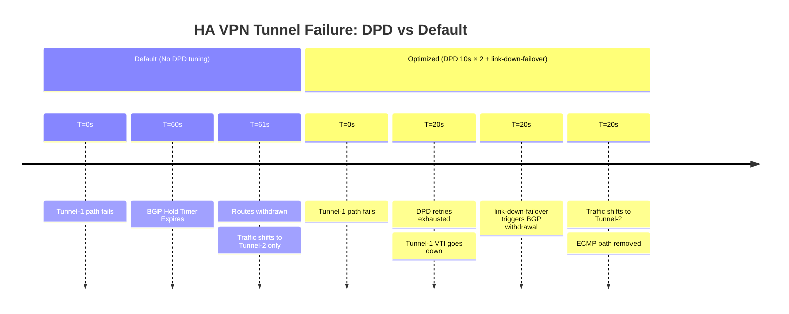

# FortiGate: BGP over GCP HA VPN (Active-Active ECMP)

GCP HA VPN mandates two tunnels per gateway for the 99.99% availability SLA. Both
tunnels are active simultaneously and Cloud Router manages independent BGP sessions
per tunnel. Combined with `ebgp-multipath` on the FortiGate, both paths carry traffic
in parallel. BFD is not supported on the HA VPN overlay; DPD with `link-down-failover`
provides detection within 20 seconds per tunnel.

---

## 1. Failure Detection Timeline (Tunnel Failure)

GCP HA VPN DPD default is 20 seconds (10s interval × 2 retries). Cloud Router BGP
timers are configurable: keepalive 20–60s (default 20s), hold = 3 × keepalive (default
60s). The BGP hold-timer (60s) comfortably exceeds the DPD detection time (20s),
so double reconvergence is not a risk at default settings.



---

## 2. FortiGate CLI Configuration (HA VPN Optimized)

### A. Phase 1 — Dual Tunnel to HA VPN Gateway Interfaces

GCP HA VPN gateway exposes two public IP interfaces (IF0 and IF1) in different
Google edge PoPs. Each FortiGate tunnel connects to one interface. GCP requires
separate pre-shared keys per tunnel.

```fortios

config vpn ipsec phase1-interface
    edit "gcp-havpn-tunnel1"
        set interface "port1"
        set ike-version 2
        set keylife 36000
        set peertype any
        set net-device disable
        set proposal aes256-sha256
        set dhgrp 14                          # GCP default DH group
        set remote-gw <HA-VPN-GW-IF0-PUBLIC-IP>
        set psksecret <PRE-SHARED-KEY-1>
        set dpd on-idle
        set dpd-retryinterval 10
        set dpd-retrycount 2
        set npu-offload enable
    next
    edit "gcp-havpn-tunnel2"
        set interface "port1"
        set ike-version 2
        set keylife 36000
        set peertype any
        set net-device disable
        set proposal aes256-sha256
        set dhgrp 14
        set remote-gw <HA-VPN-GW-IF1-PUBLIC-IP>
        set psksecret <PRE-SHARED-KEY-2>      # Separate PSK for Tunnel 2
        set dpd on-idle
        set dpd-retryinterval 10
        set dpd-retrycount 2
        set npu-offload enable
    next
end
```

### B. BGP with ECMP & Link-Down Failover

Cloud Router ASN is customer-configured. Enable `ebgp-multipath` to install
both tunnel paths as ECMP forwarding entries.

```fortios

config router bgp
    set as 65000
    set ebgp-multipath enable
    set graceful-restart enable
    set graceful-restart-time 120
    set graceful-stalepath-time 120

    config neighbor
        edit "169.254.1.1"
            set description "GCP-CLOUD-ROUTER-VPN-T1"
            set remote-as 65001
            set bfd disable                   # BFD not supported on HA VPN overlay
            set link-down-failover enable
            set soft-reconfiguration enable
            set capability-graceful-restart enable
            # Cloud Router min keepalive 20s (default 20s), hold = 3×keepalive (60s)
            set timers-keepalive 20
            set timers-holdtime 60
        next
        edit "169.254.2.1"
            set description "GCP-CLOUD-ROUTER-VPN-T2"
            set remote-as 65001
            set bfd disable
            set link-down-failover enable
            set soft-reconfiguration enable
            set capability-graceful-restart enable
            set timers-keepalive 20
            set timers-holdtime 60
        next
    end

    config network
        edit 1
            set prefix 10.0.0.0 255.0.0.0
        next
    end
end
```

---

## 3. GCP-Specific Principles

### A. Tunnel Interfaces, Zone, and Loose RPF

GCP may return traffic via either tunnel. Zone grouping and loose RPF prevent
the FortiGate state table from dropping asymmetric return traffic.

```fortios

config system interface
    edit "gcp-havpn-tunnel1"
        set ip 169.254.1.2 255.255.255.252
        set remote-ip 169.254.1.1 255.255.255.252
        set allowaccess ping
        set src-check loose
    next
    edit "gcp-havpn-tunnel2"
        set ip 169.254.2.2 255.255.255.252
        set remote-ip 169.254.2.1 255.255.255.252
        set allowaccess ping
        set src-check loose
    next
end

config system zone
    edit "ZONE_GCP_VPN"
        set interface "gcp-havpn-tunnel1" "gcp-havpn-tunnel2"
    next
end
```

### B. No BFD on the HA VPN Overlay

GCP HA VPN does not support BFD on IPsec tunnels. Detection relies on DPD.
BFD is available on the Cloud Interconnect underlay (Cisco IOS-XE to Cloud Router)
— see the [BGP Stack flagship guide](bgp_stack_vpn_over_interconnect.md) for Cisco
underlay BFD configuration.

### C. Separate PSKs Per Tunnel

GCP requires a unique pre-shared key for each HA VPN tunnel. Using the same
PSK on both tunnels causes Phase 1 to fail on one or both tunnels. Generate
independent PSKs in the GCP console when creating the VPN tunnel resources.

### D. DH Group Matching

GCP HA VPN defaults to DH group 14 (2048-bit). FortiGate defaults to group 2
(1024-bit). Explicitly set `dhgrp 14` on both FortiGate Phase 1 configurations
or create a custom IKEv2 policy in GCP matching your chosen group.

### E. ECMP and Cloud Router Independence

Cloud Router runs as a distributed managed service — each BGP session is
independent. A tunnel failure drops only that session; the other tunnel's BGP
session and forwarding are unaffected. This makes HA VPN resilient to Google-side
maintenance events without requiring Graceful Restart on the FortiGate (though
enabling it is still recommended).

---

## 4. Verification & Troubleshooting

| Command | Platform | Purpose |
| :--- | :--- | :--- |
| `get router info bgp summary` | FortiGate | Confirm both Cloud Router BGP peers established |
| `get router info routing-table database` | FortiGate | Expect two ECMP entries for the GCP VPC prefix |
| `diagnose vpn tunnel list` | FortiGate | Verify both IKEv2 SAs active and NPU offloaded |
| `get system session list` | FortiGate | Confirm sessions using `ZONE_GCP_VPN` |
| `gcloud compute routers get-status <ROUTER> --region=<REGION>` | gcloud | BGP session state and prefixes learned |
| `gcloud compute vpn-tunnels describe <TUNNEL> --region=<REGION>` | gcloud | Tunnel status and DPD state |
