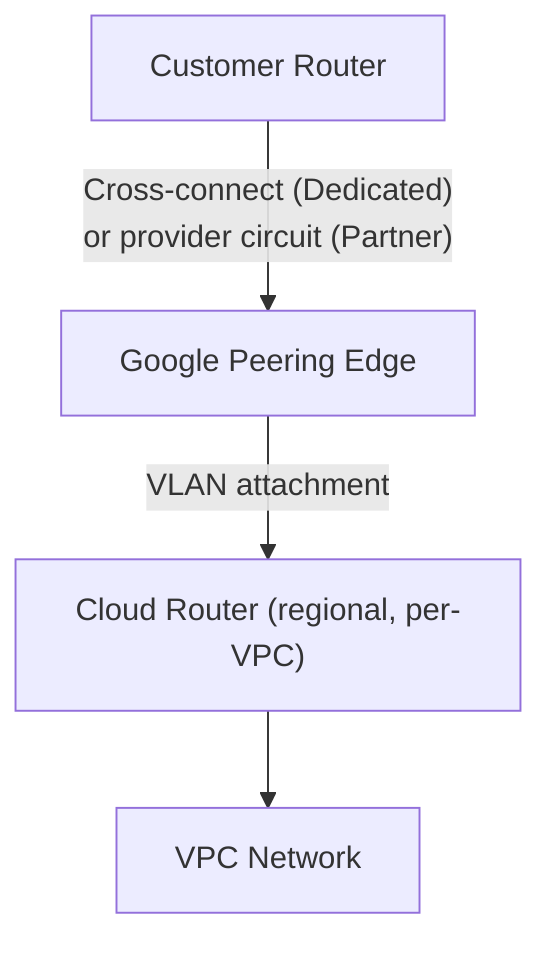

# GCP Cloud Interconnect — Connection Setup

GCP Cloud Interconnect establishes a dedicated private connection between an on-premises
network and Google Cloud. Traffic does not traverse the public internet. This guide
covers the connection from physical provisioning through to an established BGP session
on a Cloud Router. BGP design over an established interconnect is in
[BGP Stack (Flagship)](bgp_stack_vpn_over_interconnect.md).

---

## Architecture Overview

Cloud Interconnect traffic flows from the customer router through Google's peering edge
into a **Cloud Router** in a specified GCP region. The Cloud Router terminates the BGP
session and programs learned routes into the VPC's route table. The Cloud Router is not
optional — there is no mechanism to use static routing over an Interconnect connection.



---

## Interconnect Types

| Type | Physical arrangement | Bandwidth | Use case |
| --- | --- | --- | --- |
| Dedicated Interconnect | 10 or 100 Gbps direct physical port from customer router to Google's network at a colocation facility | 10G or 100G per connection; multiple connections can be bundled | Customer is co-located (or can arrange transport) to a Google colocation facility |
| Partner Interconnect | Customer connects to a Google network partner; partner provides connectivity to Google | 50 Mbps to 50 Gbps | Customer is not co-located with Google; requires less physical infrastructure |

With Dedicated Interconnect, the customer owns the router port and the cross-connect
to Google's cage. With Partner Interconnect, the partner owns the connection to Google;
the customer orders capacity from the partner.

---

## Cloud Router

Cloud Router is Google's managed BGP routing service. Key characteristics:

- One Cloud Router per region per VPC network
- Supports multiple BGP sessions, one per VLAN attachment
- Cloud Router ASN is configurable at creation time (default 64512); it cannot be
  changed after the router is created without deleting and recreating it

- Advertises VPC subnets to on-premises; learns on-premises prefixes and programs them
  into the VPC's dynamic route table

- Regional — a Cloud Router in us-central1 does not automatically route traffic for
  VPCs in europe-west1. For multi-region access, either deploy Cloud Routers per region
  or enable Global Routing mode on the Cloud Router (which allows it to propagate routes
  across regions)

---

## Step 1 — Dedicated Interconnect: Order and Physical Setup

1. In the GCP Console, navigate to **Hybrid Connectivity → Interconnect → Create

   Dedicated Interconnect**

1. Choose the colocation facility and capacity (10 Gbps or 100 Gbps)

1. GCP generates a **Letter of Authorization (LOA)** — download it from the Console

Submit the LOA to the colocation facility to provision a cross-connect between the
customer's cage and Google's cage. The facility connects the two at the specified patch
panel port.

Once the physical link is up and Google detects a signal, the interconnect status in
the Console transitions to **"Active"**. VLAN attachments can then be created on top
of the physical interconnect.

---

## Step 1 — Partner Interconnect: Contact Provider

1. Select a Partner Interconnect provider from Google's list and agree on capacity

   (50 Mbps to 50 Gbps)

1. The provider creates a VLAN attachment on their infrastructure and shares a

   **pairing key** with the customer

1. In the GCP Console, navigate to **Hybrid Connectivity → Interconnect → Create

   Partner Interconnect** and enter the pairing key to associate the attachment

1. Once the provider confirms provisioning is complete, **activate the attachment** in

   the GCP Console — the attachment will not pass traffic until activated

---

## Step 2 — Create VLAN Attachments

A VLAN attachment associates a VLAN on the physical interconnect with a Cloud Router
and VPC in a specific region. The attachment is where BGP session parameters are
configured on the GCP side.

Parameters:

| Parameter | Notes |
| --- | --- |
| Region | Must match the region of the target Cloud Router |
| Cloud Router | The Cloud Router that will terminate BGP for this attachment |
| VLAN ID | 802.1Q tag used on the customer router subinterface |
| BGP session IP addresses | Google provides a /29 from which IP addresses for the BGP session are assigned, or you can specify the range |
| Candidate subnets | IP address ranges Google may use for BGP session addressing |

For redundancy, create at least two VLAN attachments — one in each of two different
metropolitan areas (MAs). A metropolitan area is Google's term for a geographic grouping
of colocation facilities. Using two attachments in different MAs is required to qualify
for the 99.99% availability SLA.

---

## Step 3 — Configure BGP on the Customer Router

The Cloud Router's BGP peer IP and the customer-side BGP IP are shown in the GCP
Console after the VLAN attachment is created. Configure a subinterface on the customer
router for the VLAN, then bring up the BGP session.

**Cisco IOS-XE:**

```ios

! VLAN attachment subinterface
interface GigabitEthernet0/0.100
 encapsulation dot1Q 100
 ip address <customer-bgp-ip> 255.255.255.252

! BGP session toward Cloud Router
router bgp 65001
 neighbor <cloud-router-bgp-ip> remote-as 16550
 neighbor <cloud-router-bgp-ip> password <auth-key>
 neighbor <cloud-router-bgp-ip> description GCP-CloudRouter-MA1
 !
 address-family ipv4
  neighbor <cloud-router-bgp-ip> activate
  neighbor <cloud-router-bgp-ip> soft-reconfiguration inbound
  ! Advertise on-premises prefixes
  network 10.0.0.0 mask 255.255.0.0
 exit-address-family
```

**FortiGate:**

```bash

config system interface
 edit "ic-vlan100"
  set vdom "root"
  set ip <customer-bgp-ip> 255.255.255.252
  set type vlan
  set interface "<physical-port>"
  set vlanid 100
 next
end

config router bgp
 set as 65001
 config neighbor
  edit "<cloud-router-bgp-ip>"
   set remote-as 16550
   set password <auth-key>
   set description "GCP-CloudRouter-MA1"
  next
 end
 config network
  edit 1
   set prefix 10.0.0.0 255.255.0.0
  next
 end
end
```

GCP's ASN on the Cloud Router side is **16550**. The `remote-as` on the customer
router must match the ASN configured on the Cloud Router (16550 by default if the
default ASN is used, or the ASN explicitly set when the Cloud Router was created).

---

## Redundancy Requirements

GCP defines interconnect availability in terms of topology types with associated SLA
targets:

| Topology | Configuration | SLA |
| --- | --- | --- |
| 99.9% | Single VLAN attachment in one metropolitan area | 99.9% monthly uptime |
| 99.99% | Two VLAN attachments in two different metropolitan areas | 99.99% monthly uptime |

A single attachment has no redundancy against facility-level failure. The 99.99%
topology requires:

- Two VLAN attachments on two separate physical interconnects (or two separate Partner
  connections)

- The two interconnects must be in different metropolitan areas — different cities or
  different Google colocation facilities that Google classifies as separate MAs

- Two Cloud Routers, one per region (or one Cloud Router with two BGP sessions if both
  attachments terminate in the same region)

Google does not consider two attachments in the same metropolitan area as qualifying
for 99.99% SLA, even if they are on different physical interconnects.

---

## MED and Path Preference

Cloud Router advertises routes to on-premises with a MED value. When multiple VLAN
attachments exist, the MED can be used to influence which attachment on-premises prefers
for inbound traffic. On the outbound side (on-premises to GCP), the customer can set MED
on advertised prefixes to influence which Cloud Router attachment GCP uses for traffic
toward the on-premises network.

For path preference design between Dedicated Interconnect and HA VPN backup, see
[HA VPN Optimization](bgp_vpn_optimization.md).

See [BGP Stack (Flagship)](bgp_stack_vpn_over_interconnect.md) for full BGP design over
an established interconnect.

---

## Verification

| Check | GCP Console | Customer router (Cisco IOS-XE) | Customer router (FortiGate) |
| --- | --- | --- | --- |
| Physical interconnect state | Hybrid Connectivity → Interconnect: Status = Active | `show interfaces Gi0/0` — up&#124;up | `get system interface` |
| VLAN attachment state | Interconnect → Attachments: State = Active | — | — |
| BGP session state | Cloud Router → BGP sessions: Status = Established | `show bgp neighbors <cloud-router-ip>` | `get router info bgp summary` |
| Routes received from GCP | Cloud Router → Routes tab | `show bgp ipv4 unicast neighbors <cloud-router-ip> received-routes` | `get router info bgp neighbors <cloud-router-ip> received-routes` |
| Routes advertised to GCP | Cloud Router → Routes tab | `show bgp ipv4 unicast neighbors <cloud-router-ip> advertised-routes` | `get router info bgp neighbors <cloud-router-ip> advertised-routes` |
| VPC dynamic routes | VPC network → Routes: on-premises prefixes with type "Dynamic" | — | — |
