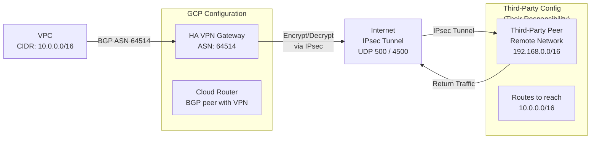

# GCP: Third-Party VPN Configuration Guide

Complete reference for establishing IPsec VPN connectivity from Google Cloud VPC to external
third-party networks without Google Cloud Interconnect. Uses GCP HA VPN and Google-managed IPsec
tunnels with dynamic BGP routing or static routes.

For IPsec fundamentals see [IPsec & IKE](../theory/ipsec.md). For Google Cloud Interconnect (higher
throughput alternative) see [GCP Cloud Interconnect Setup](gcp_cloud_interconnect_setup.md). For
troubleshooting see [IPsec VPN Troubleshooting](../operations/ipsec_vpn_troubleshooting.md).

---

## 1. Overview

### When to Use GCP HA VPN

GCP HA VPN is appropriate when:

- Cloud Interconnect not available or unnecessary
- Lower bandwidth requirement (up to 3 Gbps per tunnel)
- Cost-sensitive (pay per VPN connection + egress data)
- Third-party peer is external; no shared dedicated circuit
- Automatic failover between two tunnel pairs needed

### Limitations vs Cloud Interconnect

| Aspect | HA VPN | Cloud Interconnect |
| --- | --- | --- |
| **Bandwidth** | Up to 3 Gbps per tunnel (6 Gbps aggregate if dual tunnels) | Dedicated circuits (10 Gbps, 100 Gbps) |
| **Latency** | Internet (variable, 30-100ms typical) | Dedicated (consistent, <20ms typical) |
| **Throughput** | Limited by Internet | Guaranteed |
| **Cost** | Lower per connection | Higher; monthly circuit fee |
| **Setup Time** | Minutes (console) | Days/weeks (carrier provisioning) |
| **Redundancy** | Automatic (dual tunnels) | Manual (dual circuits) |

---

## 2. Architecture



---

## 3. Configuration

### A. Create HA VPN Gateway

GCP Console:

1. VPC Network → VPN → HA VPN Gateways → Create VPN Gateway

1. Name: `third-party-vpn-gw`

1. VPC Network: select your VPC

1. Region: select region (HA VPN requires region-specific gateway)

1. Create

Via gcloud CLI:

```bash
gcloud compute vpn-gateways create third-party-vpn-gw \

  --network my-vpc \
  --region us-central1
```

### B. Create VPN Connection (Tunnel)

GCP Console:

1. VPC Network → VPN → VPN connections → Create VPN Connection

1. Name: `third-party-vpn-conn`

1. Type: Site-to-Site (IPsec)

1. VPN Gateway: `third-party-vpn-gw`

1. IKE version: IKEv2 (recommended)

1. Shared Key (PSK): generate or provide (must match third party's PSK)

1. Peer IP: `203.0.113.5` (third-party peer public IP)

1. Create

Via gcloud CLI:

```bash
# Generate pre-shared key
PSK=$(openssl rand -base64 32)

gcloud compute vpn-tunnels create third-party-vpn-tunnel-0 \

  --vpn-gateway third-party-vpn-gw \
  --vpn-gateway-region us-central1 \
  --shared-secret "$PSK" \
  --peer-address 203.0.113.5 \
  --region us-central1

echo "PSK: $PSK"
```

GCP HA VPN creates two tunnels automatically for high availability (tunnel-0 and tunnel-1).

### C. Create Cloud Router

Cloud Router provides BGP peering with the VPN gateway.

GCP Console:

1. VPC Network → Cloud Routers → Create Router

1. Name: `third-party-router`

1. Network: select your VPC

1. Region: same as VPN gateway

1. BGP ASN: `64514` (Google-assigned; cannot change for default)

1. Create

Via gcloud CLI:

```bash
gcloud compute routers create third-party-router \

  --network my-vpc \
  --region us-central1 \
  --asn 64514
```

### D. Configure BGP Peering (Dynamic Routing)

If using dynamic routing (recommended):

GCP Console:

1. Cloud Routers → select `third-party-router`

1. BGP Peers → Add BGP Peer

1. Peer Name: `third-party-peer`

1. Interface Name: create new interface (e.g., `third-party-if`)

1. IP Address: `169.254.21.1` (RFC 5549; GCP-assigned internal address)

1. Peer IP address: `169.254.21.2` (third-party's tunnel IP)

1. Peer ASN: `65100` (agree with third party)

1. Create

Via gcloud CLI:

```bash
gcloud compute routers add-interface third-party-router \

  --interface-name third-party-if \
  --ip-address 169.254.21.1/30 \
  --mask-length 30 \
  --vpn-tunnel third-party-vpn-tunnel-0 \
  --region us-central1

gcloud compute routers add-bgp-peer third-party-router \

  --peer-name third-party-peer \
  --interface third-party-if \
  --peer-ip-address 169.254.21.2 \
  --peer-asn 65100 \
  --region us-central1
```

The third party configures their BGP peer on `169.254.21.1` (GCP side) and exchanges routes via
BGP.

### E. Static Routes (If BGP Not Used)

If the third party cannot support BGP:

GCP Console:

1. VPC Network → Routes → Create Route

1. Name: `to-third-party`

1. Network: select your VPC

1. Destination IP range: `192.168.0.0/16` (third-party network)

1. Next hop: VPN tunnel (`third-party-vpn-tunnel-0`)

1. Create

Via gcloud CLI:

```bash
gcloud compute routes create to-third-party \

  --destination-range 192.168.0.0/16 \
  --next-hop-vpn-tunnel third-party-vpn-tunnel-0 \
  --next-hop-vpn-tunnel-region us-central1 \
  --network my-vpc
```

### F. Third-Party Configuration (Cisco Example)

On the third-party Cisco router, match GCP HA VPN IKEv2 proposal:

```ios
! GCP HA VPN uses IKEv2 with specific parameters

crypto ikev2 proposal GCP-PROPOSAL
  encryption aes-cbc-256
  integrity sha256
  dh-group 14

crypto ikev2 policy GCP-POLICY
  proposal GCP-PROPOSAL

crypto ikev2 keyring GCP-KEYRING
  peer 35.184.1.1     ! GCP HA VPN tunnel 0 endpoint
    pre-shared-key <PSK>
  peer 35.184.1.2     ! GCP HA VPN tunnel 1 endpoint
    pre-shared-key <PSK>

crypto ipsec transform-set GCP-TS esp-aes 256 esp-sha256-hmac
  mode tunnel

crypto ipsec profile GCP-PROFILE
  set transform-set GCP-TS
  set pfs group14

interface Tunnel0
  ip address 169.254.21.2 255.255.255.252
  tunnel source 203.0.113.5
  tunnel destination 35.184.1.1
  tunnel mode ipsec ipv4
  tunnel protection ipsec profile GCP-PROFILE

router bgp 65100
  bgp router-id 203.0.113.5
  neighbor 169.254.21.1 remote-as 64514
  address-family ipv4
    network 192.168.0.0 mask 255.255.0.0
    neighbor 169.254.21.1 activate
```

---

## 4. Comparison Summary

| Feature | GCP HA VPN | GCP Cloud Interconnect | Choice |
| --- | --- | --- | --- |
| **Bandwidth** | Up to 3 Gbps per tunnel | 10/100 Gbps dedicated | DX for high throughput |
| **Latency** | Internet (variable) | Consistent, low | DX for predictable latency |
| **Cost** | Consumption-based | Monthly circuit | VPN for flexible, DX for permanent |
| **Setup Time** | Minutes | Weeks | VPN for speed |
| **BGP Support** | Yes | Yes | Both support dynamic routing |
| **Redundancy** | Dual tunnels (automatic) | Dual circuits (manual) | VPN for automatic failover |

---

## 5. Verification & Troubleshooting

### Check VPN Tunnel Status

```bash
gcloud compute vpn-tunnels describe third-party-vpn-tunnel-0 \

  --region us-central1
```

Tunnel should show status: `up` when peer connects.

### Check BGP Peer Status

```bash
gcloud compute routers describe third-party-router \

  --region us-central1
```

BGP peer should show status: `established`.

### Check BGP Routes Learned

```bash
gcloud compute routers get-status third-party-router \

  --region us-central1
```

Third-party routes (e.g., 192.168.0.0/16) should appear in learned routes once BGP neighbor
establishes.

### Check Route Table

```bash
gcloud compute routes list --filter "network:my-vpc"
```

Routes to third-party network should show VPN tunnel as next hop.

---

## Common Issues

| Issue | Cause | Fix |
| --- | --- | --- |
| **Tunnel: down** | PSK mismatch or peer not online | Verify PSK matches; check peer config |
| **BGP neighbor down** | ASN or peering IP mismatch | Verify BGP ASN and peering IPs match |
| **Tunnel up, no traffic** | Route missing or firewall rule blocking | Check routes and VPC firewall rules |
| **High latency** | Internet routing; ISP path | Normal for VPN; use Cloud Interconnect for lower latency |

---

## Next Steps

- [IPsec & IKE](../theory/ipsec.md) — Protocol fundamentals
- [IPsec VPN Troubleshooting](../operations/ipsec_vpn_troubleshooting.md) — Detailed diagnostics
- [GCP Cloud Interconnect Setup](gcp_cloud_interconnect_setup.md) — Higher performance alternative
