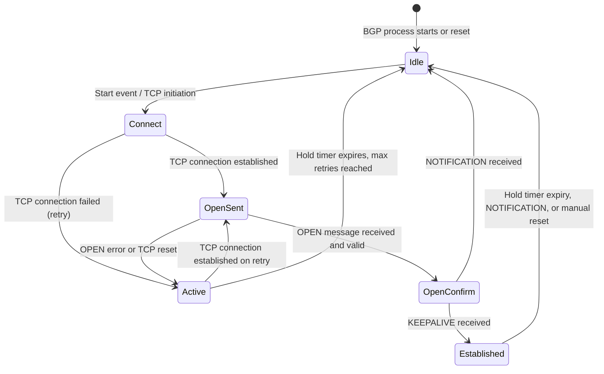

# BGP Troubleshooting

BGP troubleshooting follows a layered approach: verify TCP connectivity first, then
confirm session negotiation parameters, then examine prefix exchange. Skipping layers
wastes time — a session stuck in Active will never resolve by adjusting route-maps.

---

## BGP State Machine

Understanding where a session is stuck immediately narrows the problem space.



**Common stuck states:**

- **Active** — TCP is not completing. Peer is unreachable, wrong peer IP, or a
  firewall is blocking TCP 179.
- **OpenSent / OpenConfirm** — TCP connected but OPEN message was rejected. AS number
  mismatch, router-ID collision, or hold timer incompatibility.
- **Established then drops** — Session formed but keepalives are being lost. High CPU,
  ACL blocking keepalives mid-session, or hold timer too short.

---

## Layer 1: TCP Reachability

Before checking any BGP parameter, confirm basic IP reachability to the peer.

**Cisco IOS-XE:**

```ios
ping <peer-ip> source <local-ip>
telnet <peer-ip> 179
```

If `ping` succeeds but `telnet 179` fails, a firewall or ACL is blocking TCP 179.
Check transit interface ACLs — many operators permit ICMP but forget to permit TCP 179
bidirectionally.

```ios
show ip access-lists
show ip interface <interface>
```

!!! warning
    TCP 179 must be permitted in both directions on any ACL applied to interfaces in
    the BGP path, including loopback interfaces when update-source loopback is used.

---

## Layer 2: BGP Session Parameters

Once TCP is reachable, the session should reach at least OpenSent. If it fails here,
the OPEN message content is wrong.

**Check current state:**

```ios
show ip bgp neighbors <peer-ip> | include BGP state
```

**Check session parameters:**

```ios
show ip bgp neighbors <peer-ip> | include (AS path|Hold|Keepalive|Notif)
```

**Stuck in Active:**

- Wrong peer IP in the `neighbor` statement
- Peer's `neighbor` statement points to a different address
- Source interface not matching — if using `update-source loopback`, the peer must
  have a route back to that loopback

**Stuck in OpenSent or OpenConfirm:**

- Wrong remote AS (`remote-as` mismatch)
- Router-ID collision — two routers in the same AS with the same router-id
- Hold timer incompatibility — rare, but can occur with very low hold timers on one side
- 4-byte ASN capability mismatch on older platforms

---

## Layer 3: NOTIFICATION Messages

When a session rejects an OPEN or terminates, a NOTIFICATION message is sent with an
error code and subcode. These are logged and visible in `show ip bgp neighbors`.

```ios
show ip bgp neighbors <peer-ip> | include notification
```

| Error Code | Subcode | Meaning | Fix |
| --- | --- | --- | --- |
| OPEN Error | Bad Peer AS | `remote-as` configured on one side does not match the other | Correct `remote-as` in `neighbor` statement |
| OPEN Error | Unsupported Capability | Capability mismatch — commonly 4-byte ASN support | Add `neighbor <peer> capability suppress 4-byte-as` or upgrade peer |
| UPDATE Error | Invalid NEXT_HOP | Advertised next-hop is not reachable from the receiving router | Add `neighbor <peer> next-hop-self` for iBGP; verify route to next-hop |
| HOLD TIMER EXPIRED | — | Peer stopped receiving keepalives before hold timer elapsed | Check CPU load, verify no ACL blocking keepalives, tune timers |
| CEASE | Administrative Reset | Peer was manually cleared or restarted | Expected — check if intentional on remote end |

---

## Layer 4: Prefix Advertisement

Session is Established but expected prefixes are missing.

**Prefix not appearing on remote peer:**

```ios
show ip bgp summary
show ip bgp <prefix>
show ip bgp neighbors <peer-ip> advertised-routes
```

Check that:

- A `network` statement matches the exact prefix and mask in the routing table
- `auto-summary` is disabled (`no auto-summary` under `router bgp`)
- A route-map on `neighbor <peer> route-map out` is not filtering the prefix
- The prefix exists in the routing table — BGP will not advertise what it doesn't have

**Prefix received but not installed in routing table:**

```ios
show ip bgp <prefix>
show ip route <prefix>
```

A prefix can be received and present in the BGP table but not installed if:

- The next-hop is unreachable (common in iBGP without `next-hop-self`)
- A locally preferred or more-specific route wins
- The prefix is marked as not best path — `show ip bgp <prefix>` shows the `>`
  indicator on the best path

**Diagnosing inbound filtering:**

```ios
show ip bgp neighbors <peer-ip> received-routes   ! Requires: neighbor <peer> soft-reconfiguration inbound
show ip bgp neighbors <peer-ip> routes            ! Post-filter view
```

The difference between `received-routes` and `routes` shows what an inbound route-map
or prefix-list is filtering out.

**Live UPDATE monitoring:**

```ios
debug ip bgp <peer-ip> updates in
debug ip bgp <peer-ip> updates out
```

!!! warning
    BGP debug on a busy router can generate significant log volume. Use with a specific
    peer IP and disable immediately after capturing what you need: `no debug ip bgp`.

---

## Common Issues Quick Reference

| Symptom | BGP State | Likely Cause | Fix |
| --- | --- | --- | --- |
| Session will not come up | Active | Peer IP wrong or unreachable | Verify `neighbor` statement and routing to peer |
| Session flapping | Established → Idle | Hold timer expiry — CPU high or keepalives blocked | Tune hold/keepalive timers; check ACL for TCP 179 |
| Prefixes missing on peer | Established | Not advertised or filtered outbound | Check `network` statements, outbound route-map, `no auto-summary` |
| Routes received but not in RIB | Established | Next-hop unreachable | Add `next-hop-self` for iBGP; verify next-hop reachability |
| Route rejected with AS_PATH loop | Established | Own AS appears in received AS_PATH | eBGP loop prevention working correctly — verify if route should be accepted |

---

## Cisco IOS-XE Diagnostic Commands

```ios
show ip bgp summary
show ip bgp neighbors <peer-ip>
show ip bgp <prefix>
show ip bgp neighbors <peer-ip> advertised-routes
show ip bgp neighbors <peer-ip> received-routes
show ip bgp neighbors <peer-ip> routes
clear ip bgp <peer-ip> soft
clear ip bgp <peer-ip> soft in
debug ip bgp <peer-ip> events
debug ip bgp <peer-ip> updates in
no debug ip bgp
```

---

## FortiGate BGP Diagnostics

```fortios
get router info bgp summary
get router info bgp neighbors <peer-ip>
get router info bgp neighbors <peer-ip> advertised-routes
get router info bgp neighbors <peer-ip> received-routes
```

**Enable debug logging:**

```fortios
diagnose ip router bgp all enable
diagnose ip router bgp level info
diagnose debug enable
```

!!! warning
    Disable BGP debug after capture — it generates significant output on busy units.

```fortios
diagnose debug disable
diagnose ip router bgp all disable
```
