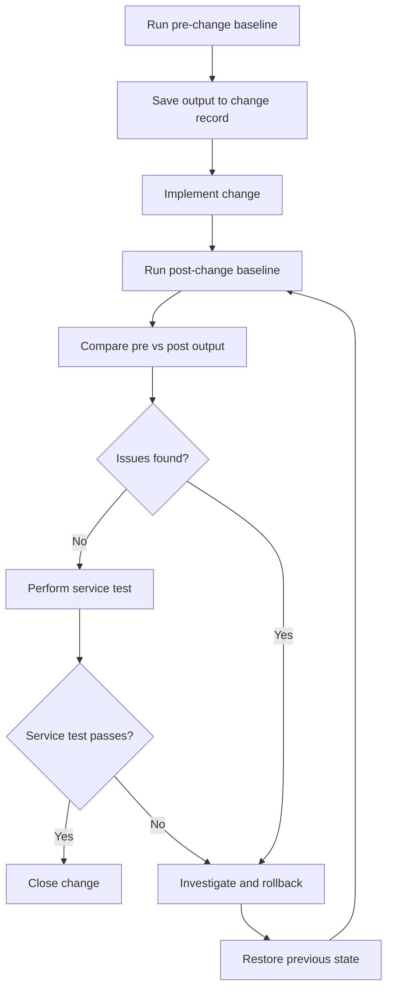

# Pre/Post Change Verification

Network changes can produce unexpected side effects beyond the intended scope of the
work. A structured pre/post verification baseline lets you detect exactly what changed
— interfaces, routing, sessions, and hardware health — rather than discovering problems
through user reports after the maintenance window closes.

This guide applies to any change on Cisco IOS-XE and FortiGate devices: software
upgrades, routing policy changes, firewall policy updates, or physical modifications.

---

## State Categories to Capture

Capture state across these five categories before and after every change.

| Category | Why it matters |
| ---------- | --------------- |
| Interface state | Physical or logical interfaces may go down during a change |
| Routing table | Route counts or specific prefixes may change unexpectedly |
| Neighbour/session state | BGP and OSPF adjacencies may not re-establish correctly |
| Hardware/platform health | CPU or memory may spike post-change and not recover |
| Traffic baseline | Session counts and NAT translations confirm traffic is flowing normally |

---

## Cisco IOS-XE Baseline Commands

Run and save all output before starting the change. Paste into the change record or
redirect
to a log file.

| Command | What to record |
| --- | --- |
| `show version` | IOS-XE version, hostname, uptime |
| `show ip interface brief` | Interface names, IP addresses, line/protocol state |
| `show interfaces &#124; include (line&#124;errors&#124;input&#124;output)` | Error counters per interface |
| `show ip route summary` | Route count per protocol (connected, static, OSPF, BGP) |
| `show ip bgp summary` | BGP peer addresses, state, Up/Down timer, prefixes received |
| `show ip ospf neighbor` | OSPF neighbour IDs, state (expect FULL), interface |
| `show bfd neighbors` | BFD session state and peer addresses |
| `show standby brief` / `show vrrp brief` | Active/standby gateway role and virtual IP state |
| `show ip nat translations total` | Total NAT translation count |
| `show processes cpu sorted &#124; head 20` | Top processes by CPU; record overall CPU% |
| `show platform resources` | Memory and CPU utilisation summary |

!!! note
For BGP, record the prefix count per peer individually. A peer that re-establishes but
advertises fewer prefixes than before may indicate a routing policy issue that aggregate
    counts will not reveal.

---

## FortiGate Baseline Commands

| Command | What to record |
| --------- | --------------- |
| `get system status` | Firmware version, hostname, serial number |
| `get system interface` | Interface names, IP addresses, link state |
| `get router info routing-table all` | Full routing table; note total route count |
| `get router info bgp summary` | BGP peer state, Up/Down, prefixes received |
| `get router info ospf neighbor` | OSPF neighbour state and interface |
| `get system ha status` | HA role (primary/secondary), sync state, uptime |
| `diagnose sys session stat` | Session table: current count, rate, maximum |
| `diagnose hardware sysinfo memory` | Total, used, and free memory |
| `diagnose sys top` | Top processes by CPU at time of snapshot |

!!! note
For HA clusters, run the baseline on both members separately using each unit's
management
    IP. HA sync state and session counts can differ between units.

---

## Change Window Procedure

1. Run all baseline commands from the Cisco IOS-XE and/or FortiGate tables above. Save
the

the

    full output to the change record.

1. Note the exact start time of the change.
1. Implement the change.
1. Note the exact end time of the change.
1. Run the same baseline commands again in the same order.
1. Compare pre- and post-change output:

- Route counts should match, or differ only as expected (e.g., a new static route was
  added intentionally)
  added intentionally)

  - No new interface errors or err-disabled ports
  - All BGP and OSPF neighbours re-established with matching prefix counts
  - CPU and memory have returned to baseline levels
  - Session/NAT counts are in the expected range

1. Perform an application or service test relevant to the change (ping, traceroute,
application

application

    login, traffic flow test).

1. If all checks pass, close the change. If issues are found, follow the rollback
triggers

triggers

    table below.

---

## Change Verification Flowchart

---

## Rollback Triggers

If any of the following symptoms appear in the post-change baseline or service tests, treat
them as rollback triggers unless the root cause is immediately identified and resolved.

| Symptom | Likely cause | Recommended action |
| --------- | ------------- | ------------------- |
| BGP peer(s) remain down after change | Route map, AS path filter, prefix limit, or ACL misconfiguration | Check `show ip bgp neighbor <peer> &#124; include BGP` for error messages; review applied route maps |
| OSPF neighbour missing or stuck in EXSTART/EXCHANGE | MTU mismatch, area type mismatch, authentication misconfiguration | Verify MTU consistency; check `show ip ospf interface` on both sides |
| Interface error counters increasing post-change | Physical layer issue, duplex mismatch, or cable fault | Check `show interfaces <if>` for input/output errors, CRC, and giants |
| CPU sustained above 80% after change | Routing loop, excessive route churn, or process leak | Check `show processes cpu sorted`; look for route flapping in `show ip route` |
| NAT translation count dropped to zero | NAT pool exhaustion, ACL change removed traffic match, or policy misconfiguration | Verify NAT pool, ACL, and policy with `show ip nat translations` and `debug ip nat` |
| HA cluster out of sync (FortiGate) | Config applied to only one member, or firmware mismatch after partial upgrade | Check `get system ha status`; verify firmware version on each member |
| Session count on FortiGate dropped significantly | Firewall policy change blocked legitimate traffic | Review policy hit counts; check `diagnose sys session list` for drops |
