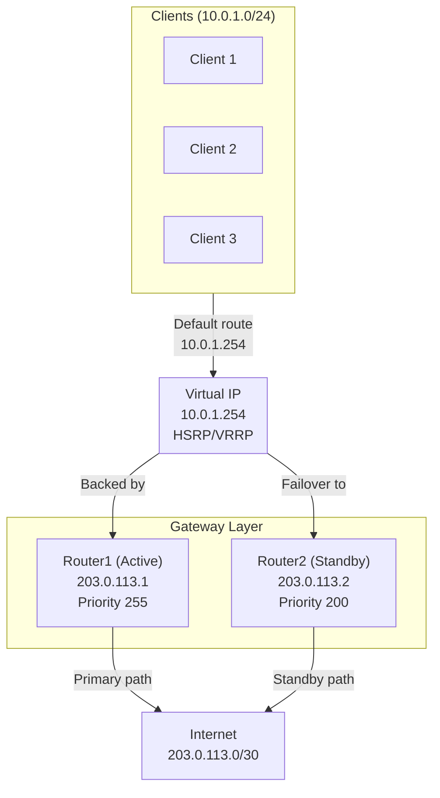
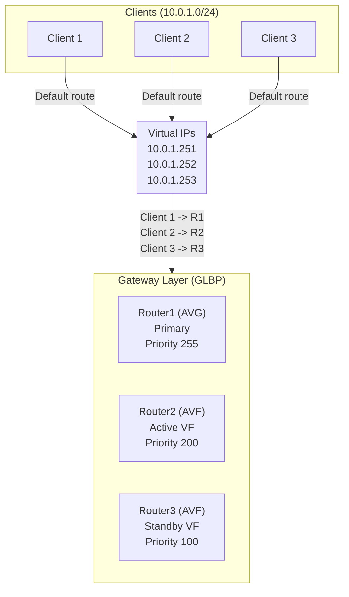

# Gateway Redundancy Deployment Best Practices

Gateway redundancy mechanisms (HSRP, VRRP, GLBP) provide high availability for default gateways. Design
patterns vary from simple active/standby to complex active/active load balancing. Proper implementation
ensures sub-second failover and eliminates single points of failure at the access layer.

---

## Quick Reference Checklist

| Decision | Best Practice |
| --- | --- |
| **Protocol Selection** | VRRP if multi-vendor; HSRP if Cisco-only; GLBP if active/active needed |
| **Active/Standby Design** | Most common; 1 router active, N-1 standby; priority 255 active, 200 standby |
| **Active/Active Design** | GLBP only; each gateway carries subset of traffic; complex failover logic |
| **Priority Planning** | Active: 255; Standby: 200; Primary standby: 150 (for 3-router setup) |
| **Failover Timing** | Preemption disabled initially; tune hello/hold times for <3 sec failover |
| **Monitoring** | Health checks + interface tracking; BFD integration for sub-second detection |
| **Multi-Site Redundancy** | Separate groups per site; synchronize priority with BGP local preference |
| **Common Mistakes** | Preemption wars, asymmetric routing on failover, timer mismatches |

---

## 1. Overview: HSRP vs VRRP vs GLBP

### Protocol Comparison

| Feature | HSRP | VRRP | GLBP |
| --- | --- | --- | --- |
| **Vendors** | Cisco only | Standard (RFC 5798) | Cisco only |
| **Virtual IP** | 1 per group | 1 per group | 1 per group |
| **Active Router** | 1 elected | 1 elected | 1 elected |
| **Standby Router** | 1 designated | Implicit | 1 designated |
| **Load Balancing** | NO (active/standby only) | NO (active/standby only) | YES (active/active via AVF) |
| **Hello Interval** | 3 sec (default) | 1 sec (default) | 3 sec (default) |
| **Hold Time** | 10 sec (default) | 3 sec (default) | 10 sec (default) |
| **Sub-second Failover** | Possible with BFD | Possible with BFD | Possible with BFD |
| **Complexity** | Low | Low | High |
| **Use Case** | Cisco enterprise | Multi-vendor enterprise | Load balancing required |

### When to Use Each

#### HSRP - Cisco-only networks

```text
Scenario: All gateways are Cisco IOS-XE routers
Advantage: Native integration; no compatibility concerns
          Mature, proven protocol
Disadvantage: Vendor lock-in; Cisco only

Deployment: 80% of enterprise networks
```

#### VRRP - Multi-vendor or open-source networks

```text
Scenario: Mix of Cisco, FortiGate, and open-source routers
Advantage: Standard protocol (RFC 5798)
          Works across vendors (FortiGate, Linux, etc.)
Disadvantage: Less feature-rich than HSRP (no load balancing native)
              Slightly higher failover overhead

Deployment: Large enterprises; cloud providers
```

#### GLBP - Load balancing required

```text
Scenario: Need active/active traffic distribution
         All gateways are Cisco
Advantage: Load balancing without BGP complexity
          Active/active with automatic failover
Disadvantage: High complexity; requires strong BGP/routing knowledge
              Cisco-only
              CPU-intensive on low-end routers

Deployment: 5-10% of networks; usually replaced by BGP ECMP
```

---

## 2. Design Patterns: Active/Standby vs Active/Active

### Active/Standby Design (Recommended)

#### Topology



#### Characteristics

```text
- 1 router is ACTIVE (forwards all traffic from clients)
- N-1 routers are STANDBY (do not forward client traffic; listen for failover)
- Clients use virtual IP (10.0.1.254) as default gateway
- All traffic goes through active router until failure
- Failover: Standby takes over; all clients reroute transparently
- Convergence: <3 seconds with fast timers and BFD
```

#### Advantages

```text
- Simple to understand and troubleshoot
- Minimal CPU on standby router (only monitoring)
- Failover is deterministic (always same router path)
- Easy to tune (priority and timers only)
- Suitable for 90% of use cases
```

#### Disadvantages

```text
- Standby router capacity is wasted (only active if primary fails)
- Single-point-of-failure if active router is overloaded (not fault-tolerant)
- No load balancing across gateways
```

### Active/Active Design (GLBP)

#### Topology



#### Characteristics

```text
- 1 router is AVG (Active Virtual Gateway; manages virtual IPs)
- N-1 routers are AVF (Active Virtual Forwarders; each owns virtual IP)
- Clients get different virtual IPs via DHCP
- Each client's traffic goes to different gateway (load balancing)
- Failure: AVG redistributes virtual IPs to remaining AVFs
- Convergence: <3 seconds
```

#### Advantages

```text
- All gateways are active (no wasted capacity)
- Better resource utilization
- Automatic load balancing without BGP
```

#### Disadvantages

```text
- High complexity (hard to troubleshoot)
- CPU-intensive on all routers (not just active)
- GLBP is Cisco-only (no multi-vendor support)
- Client sessions may move between routers (protocol dependent)
- Requires careful DHCP/DNS configuration
```

---

## 3. Failover Timing: Acceptable Failover Duration

### RTO/RPO Requirements by Application

| Application | RTO (Recovery Time Objective) | Design |
| --- | --- | --- |
| **Interactive (Web, SSH)** | <3 seconds | Critical; BFD + fast timers required |
| **Real-time (VoIP)** | <1 second | Very critical; BFD mandatory |
| **Batch/scheduled (SFTP)** | <30 seconds | Standard HSRP/VRRP timers acceptable |
| **Non-critical (email sync)** | <120 seconds | Default timers; no acceleration needed |

### Failover Timeline with Different Configurations

#### Scenario - Active gateway loses internet connectivity

#### Config 1 - Default timers, no BFD

```text
T=0ms: Link down
T=3000ms: Router1 misses 1 hello (3-second interval)
T=6000ms: Router1 misses 2 hellos
T=10000ms: Hold timer expires (default 10 seconds)
T=10100ms: Router2 takes over
T=10200ms: Clients reroute (ARP update)
Total RTO: ~10-15 seconds
Issue: Too long for VoIP; acceptable for web browsing
```

#### Config 2 - Aggressive timers, no BFD

```text
Hello interval: 1 second
Hold time: 3 seconds

T=0ms: Link down
T=1000ms: Router1 misses first hello
T=2000ms: Router1 misses second hello
T=3100ms: Hold timer expires
T=3200ms: Router2 takes over
Total RTO: ~3-5 seconds
Issue: Acceptable for most applications; VoIP still marginal
```

#### Config 3 - BFD-based detection (recommended)

```text
BFD: 300 ms interval, 900 ms timeout (3 missed detections)

T=0ms: Link down
T=300ms: BFD detects failure (first missed detection)
T=600ms: BFD confirms (second detection)
T=900ms: BFD times out; HSRP notified
T=950ms: Router2 takes over
T=1000ms: Clients reroute (ARP update)
Total RTO: ~1-2 seconds
Issue: Suitable for VoIP and critical applications
```

### Recommended Configuration

#### For most networks

```text
Active/Standby with:
  - HSRP/VRRP enabled
  - BFD for sub-second detection (300/900 ms)
  - Preemption disabled (avoid flapping)
  - DHCP snooping (track default gateway consistency)
  - Monitoring via SNMP/Syslog (alert on failover)
```

---

## 4. Priority Planning: Assigning Priorities

### Priority Values

| Router Role | Priority | Notes |
| --- | --- | --- |
| **Primary (Active)** | 255 | Highest; always active unless down |
| **Secondary (Standby)** | 200 | Takes over if primary fails |
| **Tertiary (Standby)** | 100 | Lowest; rare use case (3-router setup) |
| **Disabled** | <100 | Explicitly never active (for testing) |

### Multi-Router Priorities

#### 2-router setup (most common)

```text
Router1 (Primary): Priority 255 (active)
Router2 (Secondary): Priority 200 (standby)

Behavior:
  Normal state: Router1 active
  Router1 fails: Router2 takes over
  Router1 recovers: Router1 becomes active (preemption)
```

#### 3-router setup

```text
Router1 (Primary): Priority 255 (active)
Router2 (Secondary): Priority 200 (standby 1)
Router3 (Tertiary): Priority 100 (standby 2)

Behavior:
  Normal: Router1 active
  Router1 fails: Router2 takes over
  Router1 + Router2 fail: Router3 takes over

Priority gap ensures clear ordering:
  255 > 200 > 100 (unambiguous)
```

#### Multi-site setup (separate HSRP groups)

```text
Site A:
  Primary (ASN 65000): Priority 255 (active)
  Secondary (ASN 65000): Priority 200 (standby)
  BGP local preference: 200 for Site A, 100 for Site B

Site B:
  Primary (ASN 65001): Priority 100 (standby)
  Secondary (ASN 65001): Priority 200 (active)
  BGP local preference: 100 for Site A, 200 for Site B

Result: Site A gateways preferred by default (via BGP)
        HSRP provides local failover
        BGP provides WAN failover
```

### Preemption Strategy

#### Preemption - Active router yields to higher-priority router

```text
Without preemption:
  Router1 (Prio 255) is active
  Router2 (Prio 200) becomes standby
  If Router1 fails and recovers:
    Router2 remains active (no re-takeover)
    Stability: Good (no flapping)
    Downside: If Router1 recovers, it doesn't retake (asymmetric)

With preemption:
  Router1 (Prio 255) is active
  Router1 fails: Router2 takes over
  Router1 recovers: Router1 immediately retakes (preempts Router2)
  Stability: Potential for flapping if Router1 is unstable
  Upside: Primary always active (design intent)
```

#### Recommendation

```text
Default: Disable preemption
  Reason: Stability; avoids flapping
          If primary fails, standby takes over and stays until explicitly fixed

Enable only if:
  1. Primary router is reliable
  2. Primary has measurably better performance
  3. Network design requires primary to always be active

If enabled: Add preemption delay (wait before taking back)
  Delay: 30-60 seconds (allows primary to stabilize before flapping back)
```

### Cisco Priority Configuration

```ios
router(config)# interface GigabitEthernet0/0
  standy 1 priority 255                    ! Group 1, Priority 255 (active)
  standby 1 preempt delay minimum 30       ! Preempt with 30-second delay
end

router(config)# interface GigabitEthernet0/0
  standby 1 priority 200                   ! Group 1, Priority 200 (standby)
  standby 1 preempt delay minimum 30
end
```

### FortiGate Priority Configuration

```fortios
config system vrrp
  edit 1
    set priority 255        ! Active router
    set adv-interval 1
    set preempt enable
    set preempt-delay 30
  next
end

config system vrrp
  edit 1
    set priority 200        ! Standby router
    set adv-interval 1
    set preempt enable
    set preempt-delay 30
  next
end
```

---

## 5. Monitoring: Detecting Silent Failures

### Health Check Integration

#### Issue - Standby router is healthy, but active router is degraded

```text
Scenario: Router1 (active) has:
  - Gateway connectivity: UP
  - CPU: 95% (busy)
  - BGP: DOWN (unable to process routes)
  - HSRP: ACTIVE (no failure detected)

Result: Standby Router2 doesn't failover
        Clients use degraded Router1
        Traffic loss and slow performance
```

#### Solution - Health checks monitoring gateway quality

```text
Health check on active router:
  1. Can resolve DNS? (dig 8.8.8.8)
  2. Can reach ISP gateway? (ping 203.0.113.1)
  3. Can pass BGP routes? (show ip bgp summary | grep Established)
  4. CPU below 80%? (show processes cpu)
  5. Memory available? (show memory | grep Free)

If ANY check fails:
  Lower HSRP priority (e.g., 255 -> 100)
  Standby takes over
  Traffic reroutes automatically
```

### Implementation: Interface Tracking

#### Cisco - Track external link status

```ios
track 1 interface GigabitEthernet0/1 line-protocol
  delay down 5 up 10       ! Wait 5 sec down, 10 sec up before reacting
end

interface GigabitEthernet0/2
  standby 1 track 1 decrement 50
  ! If GigabitEthernet0/1 goes down, reduce priority by 50
  ! E.g., 255 -> 205; standby takes over if its priority is 200+
end
```

#### Cisco - Track route availability

```ios
track 2 ip route 0.0.0.0/0 reachability  ! Default route available?
  ! Alert if default route is missing

interface GigabitEthernet0/2
  standby 1 track 2 decrement 50
end
```

#### Cisco - Custom health script (advanced)

```ios
event manager applet HEALTH-CHECK
  event timer watchdog time 30              ! Check every 30 seconds
  action 1.0 cli command "enable"
  action 2.0 cli command "ping 203.0.113.1 count 3 timeout 2"
  action 3.0 regexp "3 received" $_cli_result match
  action 4.0 if ($match eq "3 received")
  action 4.5  cli command "interface GigabitEthernet0/2"
  action 5.0  cli command "standby 1 priority 255"  ! Healthy: be active
  action 6.0 else
  action 6.5  cli command "interface GigabitEthernet0/2"
  action 7.0  cli command "standby 1 priority 100"  ! Unhealthy: yield
  action 8.0 end
end
```

#### FortiGate - Health check monitoring

```fortios
config system vrrp
  edit 1
    set acceptance-access-list "HEALTH-CHECK"
    set monitored-interface "port1"      ! Track port1 status
  next
end

config system virtual-switch
  edit "vlan-interface-group"
    set physical-port "port1"
    set monitor-proto ping
    set monitor-ip 203.0.113.1
    set monitor-interval 3               ! Ping every 3 seconds
    ! If monitor fails, VRRP priority drops
  next
end
```

### Failover Testing

#### Test 1 - Verify standby is active in case of failure

```text
Step 1: Baseline
  Router1: show standby 1 | grep "State is Active"
  Router2: show standby 1 | grep "State is Standby hot"

Step 2: Fail active router
  Router1# interface GigabitEthernet0/2
  Router1# shutdown           ! Shut down HSRP interface

Step 3: Verify failover
  Router2: show standby 1 | grep "State is Active"
  (Wait <3 seconds with BFD, <10 seconds without)

Step 4: Verify connectivity
  ping 10.0.1.1 from client     ! Should be reachable via Router2

Step 5: Restore
  Router1# no shutdown
  (Standby should return if preemption is enabled)
```

#### Test 2 - Verify health check triggers failover

```text
Step 1: Establish baseline
  Router1 active, Router2 standby

Step 2: Simulate degradation on Router1
  Router1# interface GigabitEthernet0/1
  Router1# shutdown           ! Shut down ISP link

Step 3: Monitor HSRP state
  Router1: show standby 1 | grep priority
  (Should decrease due to tracking)

Step 4: Verify failover happens
  Router2 becomes active (if priority drops below 200)

Step 5: Restore
  Router1# interface GigabitEthernet0/1
  Router1# no shutdown
```

---

## 6. Multi-Site Redundancy: Coordinating with BGP

### Design Pattern: HSRP + BGP Integration

#### Scenario - Two data centers with independent gateways

```text
Site A (Primary):
  Gateway A1: Priority 255 (HSRP)
  Gateway A2: Priority 200 (HSRP)
  BGP local preference: 200 (preferred)

Site B (Secondary):
  Gateway B1: Priority 100 (HSRP)
  Gateway B2: Priority 150 (HSRP)
  BGP local preference: 100 (less preferred)

Design:
  - Clients at Site A use gateway A1 by default (HSRP)
  - If A1 fails, A2 takes over (HSRP failover)
  - If entire Site A fails, traffic flows to Site B via BGP failover
  - Convergence: <3 sec (HSRP) or 30-180 sec (BGP)
```

### Synchronizing HSRP Priority with BGP Preference

#### Rule - Higher HSRP priority = higher BGP local preference

```text
Site A:
  A1 priority 255 -> BGP local preference 200
  A2 priority 200 -> BGP local preference 200

Site B:
  B1 priority 100 -> BGP local preference 100
  B2 priority 150 -> BGP local preference 100

Behavior:
  Inbound: Site A preferred (BGP local preference 200)
  Outbound: Site A active (HSRP priority 255)
  Alignment: Primary site is always preferred both locally and to peers
```

### Configuration Example

#### Cisco Site A (Primary)

```ios
! HSRP on gateway A1 (primary)
interface GigabitEthernet0/0
  ip address 10.0.1.1 255.255.255.0
  standby 1 ip 10.0.1.254
  standby 1 priority 255                ! Highest priority
  standby 1 preempt delay minimum 30
end

! BGP: Prefer Site A routes
router bgp 65000
  neighbor 203.0.113.1 remote-as 65100
  neighbor 203.0.113.1 route-map SITE-A-PREFERENCE in
end

route-map SITE-A-PREFERENCE permit 10
  set local-preference 200              ! Higher than Site B
end

! HSRP on gateway A2 (secondary)
interface GigabitEthernet0/0
  standby 1 priority 200
end
```

#### Cisco Site B (Secondary)

```ios
! HSRP on gateway B1 (standby)
interface GigabitEthernet0/0
  standby 1 ip 10.0.2.254
  standby 1 priority 100                ! Lower priority (standby)
  standby 1 preempt delay minimum 30
end

! BGP: Deprioritize Site B routes
router bgp 65000
  neighbor 203.0.113.5 remote-as 65101
  neighbor 203.0.113.5 route-map SITE-B-PREFERENCE in
end

route-map SITE-B-PREFERENCE permit 10
  set local-preference 100              ! Lower than Site A (backup)
end
```

---

## 7. Interaction with Routing: OSPF Cost Tuning

### Problem: HSRP Failover + Asymmetric Routing

#### Scenario

```text
Topology:
  Client -> Router1 (Active, cost 1) -> Internet
  Client -> Router2 (Standby, cost 10) -> Internet

HSRP: Router1 active
Clients send to virtual IP, packets go to Router1 (optimal)

Router1 fails:
  HSRP: Router2 becomes active
  But OSPF still prefers Router1 (cost 1 < 10)

Result: Asymmetric routing
  Outbound: Router2 (active)
  Inbound: Router1 (OSPF cost 1, even though down!)
  Traffic loss: Replies never reach clients
```

#### Solution - Track OSPF costs with HSRP priority

```text
HSRP + OSPF synchronization:
  Router1 active: HSRP priority 255, OSPF cost 1 (preferred)
  Router1 fails: HSRP priority 200, OSPF cost 10 (deprioritized)
  OR: Shut down all interfaces on Router1 (OSPF cannot route through it)
```

### Cisco: OSPF Cost + HSRP Priority

```ios
! Router1 (Active)
interface GigabitEthernet0/0
  ip address 203.0.113.1 255.255.255.252
  ip ospf cost 1                        ! Low cost (preferred)
  standby 1 priority 255                ! High HSRP priority (active)
end

! Router2 (Standby)
interface GigabitEthernet0/0
  ip address 203.0.113.2 255.255.255.252
  ip ospf cost 10                       ! Higher cost (deprioritized)
  standby 1 priority 200                ! Lower HSRP priority (standby)
end
```

### BFD-based OSPF Failover

#### Even better: Use BFD to detect Router1 failure, remove route from OSPF

```text
BFD monitors link health continuously
If link fails: BFD detects in <1 second
OSPF flushes the route
Clients automatically reroute to Router2
No asymmetric routing possible
```

#### Cisco: BFD + OSPF

```ios
! Router1
interface GigabitEthernet0/0
  ip address 203.0.113.1 255.255.255.252
  ip ospf network point-to-point
  ip ospf cost 1
  bfd interval 300 min_rx 300 multiplier 3  ! 300/900 ms
  ip ospf bfd
end

! Router2
interface GigabitEthernet0/0
  bfd interval 300 min_rx 300 multiplier 3
  ip ospf bfd
end
```

---

## 8. Common Mistakes & Mitigation

### Mistake 1: Preemption Wars (Flapping)

#### Problem

```text
Router1 (priority 255): Active
Router1 has unstable link; flaps every 30 seconds
  T=0s: Router1 down; Router2 takes over
  T=5s: Router1 recovers; preemption causes Router1 to takeover
  T=30s: Router1 link flaps again; Router2 takes over

Result: HSRP flapping; traffic interrupted every 30 seconds
```

#### Mitigation

```text
1. Disable preemption by default
   Standby takes over on failure; stays until fix applied

2. If preemption required, add delay:
   standby 1 preempt delay minimum 60
   Wait 60 seconds before retaking; allows link to stabilize

3. Fix primary router's link instability
   Check interface for flapping: show interface | grep flaps
   Root cause: bad cable, module failure, SFP issue
```

### Mistake 2: Asymmetric Routing on Failover

#### Problem

```text
Outbound traffic via Router2 (active)
Inbound traffic via Router1 (OSPF metric better, even though failing)
Packets from clients never return
```

#### Mitigation

```text
1. Match OSPF cost to HSRP priority
   Active router: Cost 1, Priority 255
   Standby: Cost 10, Priority 200

2. Or: Use BFD + OSPF
   BFD detects failure; OSPF immediately flushes route
   No asymmetric window possible

3. Verify with traceroute during failover
   Outbound path should match inbound path
   If different, adjust costs
```

### Mistake 3: Timer Mismatches

#### Problem

```text
Router1: hello 10, hold 30
Router2: hello 3, hold 9
Routers cannot negotiate timers
HSRP fails to form
```

#### Mitigation

```text
1. Standard timers for all routers in group
   hello 10, hold 30 (default)
   OR: hello 3, hold 9 (fast failover)

2. Document in configuration template
3. Verify:
   show standby 1 | grep "Hel\|Hold"
   Both routers should show same values
```

### Mistake 4: Silent Failure (No Health Checks)

#### Problem

```text
Router1 (active) loses BGP connectivity
HSRP still shows active (gateway is up)
But traffic is blackholed (no routes to internet)
```

#### Mitigation

```text
1. Enable interface tracking
   track 1 ip route 0.0.0.0/0 reachability
   standby 1 track 1 decrement 50

2. Or: Health check script
   Ping ISP gateway every 10 seconds
   If fails, lower priority and failover

3. Monitor BGP session state
   Alert if neighbor state is not Established
```

### Mistake 5: Wrong HSRP Group Number

#### Problem

```text
Router1: standby 1 ip 10.0.1.254
Router2: standby 2 ip 10.0.1.254
Same VIP, but different groups
Routers cannot coordinate failover
Both think they're active (split brain)
```

#### Mitigation

```text
1. Use same group number on all routers
   standby 1 ip 10.0.1.254  (Router1)
   standby 1 ip 10.0.1.254  (Router2)

2. Verify:
   show standby brief | grep "Grp"
   Verify both routers show "Group 1"
```

---

## 9. Verification & Testing

### Pre-Deployment Checklist

- [ ] Protocol selected: HSRP (Cisco), VRRP (multi-vendor), GLBP (active/active)
- [ ] Virtual IP assigned (e.g., 10.0.1.254)
- [ ] Active router priority set to 255
- [ ] Standby router priority set to 200
- [ ] Preemption disabled (stability over primary preference)
- [ ] Timer values: hello 10, hold 30 (or 3/9 for fast failover)
- [ ] BFD configured (300/900 ms for sub-second detection)
- [ ] Interface tracking enabled (external link quality)
- [ ] Health checks in place (BGP, default route, CPU)
- [ ] OSPF costs match HSRP priority (no asymmetric routing)
- [ ] Clients can reach virtual IP (ping 10.0.1.254)
- [ ] Both routers show Established/Full state

### Post-Deployment Testing

#### Failover test

```text
Step 1: Baseline
  Router1: show standby 1 | grep "Active"
  Router2: show standby 1 | grep "Standby"
  Clients: ping 10.0.1.1 (using 10.0.1.254 as gateway)

Step 2: Trigger failure
  Router1# shutdown interface GigabitEthernet0/0
  OR: Shut down HSRP explicitly

Step 3: Monitor failover
  Check logs for failover event
  Verify Router2 becomes active within 3 seconds (with BFD)

Step 4: Verify connectivity
  ping 10.0.1.1 (should still work via Router2)
  traceroute (verify path uses Router2)

Step 5: Restore
  Router1# no shutdown
  Verify Router1 returns to active (if preemption enabled)
  OR: Remains standby (if preemption disabled)
```

#### Health check test

```text
Step 1: Baseline
  Router1: show standby 1 | grep priority
  BGP: show ip bgp summary (established)

Step 2: Simulate degradation
  Router1# interface GigabitEthernet0/1
  Router1# shutdown               ! Shut down ISP link

Step 3: Monitor priority drop
  show standby 1 | grep priority  ! Should drop (e.g., 255 -> 205)

Step 4: Verify failover
  Router2: show standby 1 | grep "Active"
  Clients: Traffic reroutes

Step 5: Restore
  Router1# interface GigabitEthernet0/1
  Router1# no shutdown
```

---

## References

- [HSRP & VRRP Configuration (Cisco)](../cisco/cisco_hsrp_vrrp.md)
- [GLBP Configuration (Cisco)](../cisco/cisco_glbp_config.md)
- [VRRP Configuration (FortiGate)](../fortigate/fortigate_vrrp.md)
- [BFD Best Practices](bfd_best_practices.md)
- [HSRP vs VRRP vs GLBP Theory](../theory/hsrp_vrrp_vs_glbp.md)
