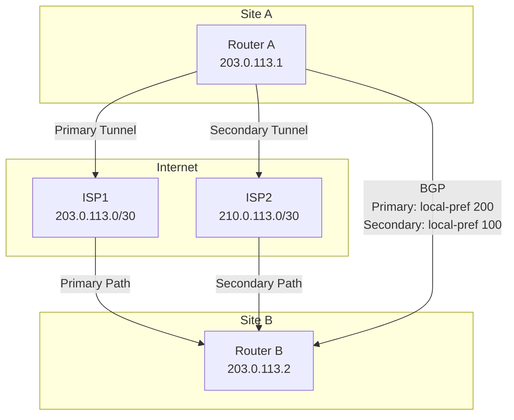

# IPsec VPN Operational Best Practices

IPsec VPN operational best practices focus on site-to-site and remote access VPN design, IKE/IPsec
parameter tuning, encryption algorithm selection, key rotation, and failover design. Proper implementation
ensures secure, reliable connectivity with minimal downtime during rekeying or link failure.

---

## Quick Reference Checklist

| Decision | Best Practice |
| --- | --- |
| **IKE Version** | IKEv2 exclusively; IKEv1 is deprecated (RFC 6539) |
| **Encryption** | AES-256-GCM (Phase 1 and Phase 2); AES-128-GCM acceptable short-term |
| **Authentication** | SHA-256 minimum; SHA-384 or SHA-512 for high-security networks |
| **DH Group** | Group 14 (2048-bit) minimum; Group 20 (4096-bit) for long-term |
| **PFS (Perfect Forward Secrecy)** | Enabled on all tunnels (prevents past session key recovery) |
| **Lifetime** | Phase 1: 28800 sec (8 hours); Phase 2: 3600 sec (1 hour) |
| **DPD (Dead Peer Detection)** | Enabled; timeout 300 seconds |
| **NAT-T** | Enabled for internet-facing VPNs; auto-detect acceptable |
| **Failover Design** | Dual tunnels per peer; different routing; BGP convergence <30 sec |
| **Key Rotation** | Automatic (lifetime); PSK manual every 90 days; certificates annually |
| **Common Mistakes** | Weak algorithms, asymmetric policies, MTU issues, no key rotation |

---

## 1. Overview: Site-to-Site vs Remote Access VPN

### VPN Types & When to Use

| VPN Type | Peer Count | Scale | Best For |
| --- | --- | --- | --- |
| **Site-to-Site** | 1-10 peers | 10-100 sites | Branch offices, data centers, partner networks |
| **Remote Access (SSL)** | 1000+ peers | Unlimited | Mobile users, contractors, distributed workforce |
| **IPsec Remote Access** | 100-1000 | Limited | Legacy mobile; less common (use SSL VPN) |
| **Hub-and-Spoke DMVPN** | 1000+ | Highly scalable | Branch networks at scale; dynamic peer discovery |

### Design Principles

#### Principle 1: Separate tunnels per peer (no shared tunnels)

```text
Correct:
  Tunnel 1: Local Site A -> Remote Site B
  Tunnel 2: Local Site A -> Remote Site C
  Tunnel 3: Local Site A -> Remote Site D
  (Each tunnel has separate IKE/IPsec SAs)

Incorrect (legacy):
  Tunnel 1: Local Site A -> All remote sites
  (Shared tunnel; if one peer fails, all lose connectivity)
```

#### Principle 2: Redundancy at both ends (dual tunnels per peer)

```text
Primary design:
  Primary tunnel: Router A -> Router B (primary link)
  Secondary tunnel: Router A -> Router B (backup ISP)
  BGP/OSPF ensures traffic uses primary until failure

Failover behavior:
  Primary fails: BFD detects in <1 second
  Traffic reroutes to secondary tunnel
  Recovery: <3 seconds
```

#### Principle 3: Policy must be identical on both peers

```text
Example asymmetry (BAD):
  Site A outbound ACL: 10.0.0.0/8 -> 203.0.113.0/24
  Site B outbound ACL: 10.0.0.0/16 -> 203.0.113.0/24 (only /16, not /8)

Result: Traffic from 10.1.0.0/16 works; 10.2.0.0/16 doesn't
         Difficult to troubleshoot; asymmetric encryption

Solution: Both sides must encrypt the exact same traffic
```

---

## 2. IKE Phase 1 Selection: IKEv1 vs IKEv2

### Version Comparison (Detailed)

| Aspect | IKEv1 | IKEv2 |
| --- | --- | --- |
| **RFC** | RFC 2409 (obsolete); RFC 6539 (deprecated 2011) | RFC 7539, RFC 8439 (current) |
| **Standard Status** | DEPRECATED | REQUIRED |
| **Introduction** | 1998 | 2010 |
| **Phases** | 2 (Phase 1 = ISAKMP; Phase 2 = Quick Mode) | 2 (IKE_SA_INIT; IKE_AUTH) |
| **Negotiation Speed** | 4-6 round trips | 2 round trips (faster) |
| **Aggressive Mode** | Yes (weak) | N/A |
| **Main Mode** | Yes (default) | N/A |
| **Rekeying** | Full Phase 1 renegotiation (heavy) | Only Child SA rekey (light) |
| **Algorithm Flexibility** | Inflexible; all algos negotiated upfront | Flexible; can change algos mid-session |
| **AEAD Support** | Limited; requires workarounds | Native (AES-GCM built-in) |
| **Security** | Weaker (vulnerable if weak crypto used) | Stronger (strict requirements) |
| **Vendor Support** | Wide (legacy) | Widespread (modern) |
| **Recommended** | NO (only for legacy interop) | YES (all new deployments) |

### Migration Strategy: IKEv1 to IKEv2

#### Phase 1: Audit current IKEv1 usage

```text
Command:
  Cisco: show crypto session | grep "IKEv1"
  FortiGate: diagnose vpn ike show

Output:
  IKEv1 tunnels: 5 (from ISP, partner A, partner B, legacy site, etc.)

Decision: Which can migrate now vs. timeline
  - ISP: Can upgrade (modern provider)
  - Partner A: Can upgrade (enterprise; uses IKEv2)
  - Partner B: Cannot upgrade (legacy equipment)
  - Legacy site: Schedule migration end of 2025
```

#### Phase 2: Parallel configuration (both IKEv1 + IKEv2)

```text
Step 1: Configure IKEv2 policy alongside IKEv1
  IKEv1 policy (existing): Keep as-is
  IKEv2 policy (new): Add with higher preference

Step 2: Test peer negotiation
  Both sides attempt IKEv2 first
  Fallback to IKEv1 if peer doesn't support

Step 3: Monitor traffic
  Most traffic should flow IKEv2 (modern peers)
  Legacy traffic on IKEv1 (until decommissioned)

Step 4: Timeline for IKEv1 removal
  Set sunset date: End of 2025
  Notify all peers 6 months in advance
  Decommission IKEv1 policies only after all peers migrated
```

### Recommendation

#### For all NEW deployments: IKEv2 exclusively

```ios
! Cisco: IKEv2 only (no IKEv1)
crypto ikev2 proposal STANDARD
  encryption aes-cbc-256
  integrity sha256
  dh-group 14
end

crypto ikev2 policy STANDARD
  proposal STANDARD
  lifetime 28800
end

! Do NOT configure IKEv1 policies
! If partner requires IKEv1, request upgrade
```

#### For existing networks: Parallel IKEv2 + IKEv1 (temporary)

```ios
! Cisco: IKEv2 preferred, IKEv1 fallback
crypto ikev2 proposal PREFERRED
  encryption aes-cbc-256
  integrity sha256
  dh-group 14
end

crypto ikev2 policy PREFERRED
  proposal PREFERRED
  lifetime 28800
end

! IKEv1 fallback (legacy partners only)
crypto isakmp policy 1
  encryption aes 256
  hash sha
  authentication pre-share
  group 14
  lifetime 28800
end
```

---

## 3. Encryption & Authentication: Algorithm Selection

### Phase 1 (IKE SA Negotiation)

#### Encryption options

| Algorithm | Key Length | Security Level | Recommendation |
| --- | --- | --- | --- |
| AES-GCM | 256-bit | Highest | REQUIRED for new deployments |
| AES-GCM | 128-bit | High | Acceptable for 5-10 years |
| AES-CBC | 256-bit | High | Acceptable (requires HMAC) |
| AES-CBC | 128-bit | Medium | Acceptable short-term (requires HMAC) |
| 3DES | 168-bit | Low (weak) | DO NOT USE (NIST sunset 2023) |
| DES | 56-bit | Broken | NEVER USE |

#### Cisco IKEv2 Phase 1 encryption

```ios
crypto ikev2 proposal HARDENED
  encryption aes-cbc-256      ! AES-256 CBC
  integrity sha256 sha384     ! HMAC-SHA-256 or HMAC-SHA-384
  dh-group 14 20              ! Group 14 (2048) or 20 (4096)
end

crypto ikev2 proposal STRONG
  encryption aes-cbc-256
  integrity sha256
  dh-group 14
end
```

#### Integrity/Authentication options

| Algorithm | Output Length | Status | Recommendation |
| --- | --- | --- | --- |
| SHA-256 | 256-bit | CURRENT | REQUIRED minimum |
| SHA-384 | 384-bit | CURRENT | Recommended |
| SHA-512 | 512-bit | CURRENT | Recommended for high-security |
| SHA-1 | 160-bit | DEPRECATED (2020) | DO NOT USE |
| MD5 | 128-bit | BROKEN | NEVER USE |

### Phase 2 (IPsec/ESP Negotiation)

#### Encryption + Integrity pairing

```text
Strong (Recommended):
  AES-256-GCM              (AEAD; encryption + integrity in one)
  AES-256-CBC + HMAC-SHA-256
  AES-256-CBC + HMAC-SHA-384

Acceptable (Transitional):
  AES-128-GCM
  AES-128-CBC + HMAC-SHA-256

DO NOT USE:
  3DES + MD5
  AES + SHA-1
  DES (any)
```

#### Cisco IPsec Phase 2 encryption

```ios
crypto ipsec transform-set HARDENED esp-aes 256 esp-sha256-hmac
  mode tunnel
end

crypto ipsec profile HARDENED
  set transform-set HARDENED
  set pfs group14                    ! Perfect Forward Secrecy
  set security-association lifetime seconds 3600
  set security-association lifetime kilobytes 1000000
end
```

#### FortiGate encryption configuration

```fortios
config vpn ipsec
  edit "site-to-site-tunnel"
    set type tunnel
    set proposal aes256-sha256       ! Phase 2: AES-256 + SHA-256
    set pfs enable
    set pfs-dh-group 14
    set lifetime 3600                ! 1 hour
  next
end

config vpn ike
  edit "phase1-tunnel"
    set version 2                    ! IKEv2
    set encryption aes256            ! Phase 1: AES-256
    set integrity sha256
    set dhgrp 14                     ! DH Group 14
    set lifetime 28800               ! 8 hours
  next
end
```

### Diffie-Hellman (DH) Group Selection

| Group | Type | Key Size | Security Level | Recommendation |
| --- | --- | --- | --- | --- |
| Group 1 | MODP | 768-bit | BROKEN (64-bit effective) | NEVER |
| Group 2 | MODP | 1024-bit | WEAK (80-bit effective) | DO NOT USE |
| Group 5 | MODP | 1536-bit | WEAK (112-bit effective) | Interop only |
| Group 14 | MODP | 2048-bit | STRONG (112-bit) | REQUIRED minimum |
| Group 20 | MODP | 4096-bit | VERY STRONG (128-bit) | Recommended |
| Group 19 | ECDH | P-256 | STRONG (128-bit, faster) | Recommended (if supported) |
| Group 21 | ECDH | P-384 | VERY STRONG (192-bit) | Recommended (if supported) |

#### Cisco DH Group configuration

```ios
crypto ikev2 proposal STRONG
  dh-group 14                        ! Phase 1: Group 14
end

crypto ipsec profile STRONG
  set pfs group14                    ! Phase 2: Group 14 (for PFS)
end
```

#### Recommendation: Use Group 14 (2048-bit MODP) as minimum

```text
Rationale:
  Group 14 sufficient for 30+ years
  Widely supported across vendors
  CPU overhead minimal vs Group 20

If high-security required:
  Group 20 (4096-bit) or Group 19 (ECDH P-256)
  Slight CPU overhead (~10-20% on modern hardware)
```

---

## 4. Perfect Forward Secrecy (PFS)

### PFS Overview

PFS ensures that compromise of the long-term key (pre-shared key or private key) does not reveal past
session keys.

#### Without PFS

```text
Session key = derive(Pre-Shared Key)
If PSK compromised at T=tomorrow:
  Attacker can derive all past session keys
  All past encrypted traffic decrypted retroactively
  (Unacceptable for sensitive data)
```

#### With PFS

```text
Session key = derive(Pre-Shared Key + Ephemeral DH value)
If PSK compromised at T=tomorrow:
  Attacker cannot recover past ephemeral DH values
  Past sessions remain secure
  (Acceptable; past traffic is protected)
```

### Enable PFS on All Tunnels

#### Cisco: PFS mandatory

```ios
crypto ipsec profile SECURE
  set transform-set STRONG
  set pfs group14                    ! PFS enabled with Group 14 DH
  set security-association lifetime seconds 3600
end

! Verify PFS is enabled:
show crypto ipsec profile SECURE | grep "PFS"
  PFS Group: group14
```

#### FortiGate: PFS configuration

```fortios
config vpn ipsec
  edit "tunnel"
    set pfs enable
    set pfs-dh-group 14
  next
end

! Verify:
diagnose vpn ipsec tunnel list | grep "pfs"
  PFS: Enabled (Group 14)
```

---

## 5. Key Rotation & Rekeying

### Automatic Rekeying (SA Lifetime)

#### IPsec SAs rekey automatically based on

```text
Time-based: 3600 seconds (1 hour) is typical
  Every 1 hour, new IPsec SA established (Phase 2 renegotiation)
  Old SA kept for brief grace period
  Client sessions may briefly pause (<1 second)

Volume-based: After 1 GB encrypted (rarely used)
  Useful for high-volume links to prevent key wear
  Combined with time-based: whichever comes first
```

#### Cisco configuration

```ios
crypto ipsec profile STANDARD
  set security-association lifetime seconds 3600        ! 1 hour
  set security-association lifetime kilobytes 1000000   ! 1 GB
end
```

#### FortiGate configuration

```fortios
config vpn ipsec
  edit "tunnel"
    set lifetime 3600        ! 1 hour
  next
end
```

### Manual PSK Rotation

#### Rotate every 90 days or on personnel changes

#### Process

```text
Step 1: Generate new PSK (32+ random characters)
  Use: openssl rand -base64 32

Step 2: Distribute securely
  NOT via email/Slack (use secure channel)
  Password manager, Signal, in-person, etc.

Step 3: Configure both peers with BOTH old and new keys
  Cisco: Configure both PSK values in neighbor statement
  FortiGate: Add new pre-shared-key alongside old

Step 4: Test with new key
  Tunnel should stay up (prefers new key)
  Verify convergence for 24-48 hours

Step 5: Remove old key
  Delete old PSK from both peers
  Only new key remains active
```

#### Cisco: Dual PSK configuration (temporary)

```ios
crypto ikev2 keyring DUAL-PSK
  peer 203.0.113.2
    address 203.0.113.2
    pre-shared-key local OldKeyString123456789012345678
    pre-shared-key local NewKeyString987654321098765432
    ! Both PSK values configured
  !
  peer 203.0.113.2
    address 203.0.113.2
    pre-shared-key remote OldKeyString123456789012345678
    pre-shared-key remote NewKeyString987654321098765432
  !
end
```

#### After 48-hour test: Remove old PSK

```ios
crypto ikev2 keyring DUAL-PSK
  peer 203.0.113.2
    address 203.0.113.2
    pre-shared-key local NewKeyString987654321098765432      ! New only
    pre-shared-key remote NewKeyString987654321098765432
  !
end
```

### Certificate Rotation

#### Rotate annually or before expiry (with 30-day margin)

#### Process

```text
Step 1: Request new certificate from CA (60 days before expiry)

Step 2: Install new cert on both peers
  Keep old cert in keyring (not deleted yet)
  Configure tunnel to use new cert (if possible)

Step 3: Test for 24-48 hours
  Verify IKE session is using new certificate
  Check cert fingerprint in logs

Step 4: Remove old certificate
  Delete from keyring 30 days after new cert is active
  (Grace period in case of issues)
```

#### Cisco: Certificate-based IKE

```ios
! Generate CSR for new certificate
crypto pki trustpoint SITE-B
  enrollment terminal
  subject-name CN=Router-A.site-a.com
end

crypto pki enroll SITE-B
  (Follow prompts; install cert signed by CA)

! Configure tunnel to use certificate
crypto ikev2 keyring CERT-KEYRING
  peer 203.0.113.2
    address 203.0.113.2
    identity certificate SITE-B    ! Use certificate for auth
  !
end
```

---

## 6. Dead Peer Detection (DPD)

### DPD Overview

DPD detects non-responsive peers and removes stale SAs. Prevents traffic from being sent to non-existent
peer.

#### Scenario

```text
Without DPD:
  Peer goes down (power loss, network failure)
  IPsec SA remains active locally
  Router sends traffic to non-existent peer
  Traffic is blackholed
  Recovery time: SA lifetime (1 hour typical)

With DPD:
  Peer becomes non-responsive
  DPD probes sent every 10-30 seconds
  If 3 probes missed: SA is deleted
  Recovery time: <3 minutes (300 seconds timeout)
```

### DPD Configuration

#### Cisco: DPD on IKEv2

```ios
crypto ikev2 profile STANDARD
  match address local 203.0.113.1
  match identity remote address 203.0.113.2
  authentication remote pre-share
  authentication local pre-share
  lifetime 28800
  dpd 10 3 on-demand                ! Interval 10 sec, retries 3, on-demand mode
end
```

#### FortiGate: DPD timeout

```fortios
config vpn ike
  edit "phase1-tunnel"
    set version 2
    set dpd on-idle                 ! Detect on idle timeout
    set dpd-retrycount 3
    set dpd-retryinterval 30
    set idle-timeout enable         ! Enable idle detection
  next
end
```

### DPD Modes

| Mode | Behavior | Use Case |
| --- | --- | --- |
| **On-Demand** | DPD probes sent only when peer is idle; reduces overhead | Normal operation (stable links) |
| **Periodic** | DPD probes sent at regular intervals; higher overhead | Unreliable links (high packet loss) |
| **None** | DPD disabled; rely on SA lifetime for cleanup | Short SA lifetime (<1 hour) |

#### Recommendation: On-Demand mode (default)

```text
On-Demand behavior:
  While traffic flows: No DPD probes (no overhead)
  When traffic stops: DPD probes start
  If peer is responding: No timeout
  If peer is gone: SA deleted after timeout

Benefit: Minimal overhead; fast detection on failure
```

---

## 7. Failover Design: Dual Tunnels & Primary/Secondary

### Single Tunnel (Not Recommended)

```text
Scenario: One tunnel between Site A and Site B
Problem: Single point of failure
  If tunnel fails: No connectivity (until manual fix)
  RTO: Undefined (manual intervention required)

Only acceptable for: Lab testing, temporary links
```

### Dual Tunnel Design (Recommended)

#### Design



#### Configuration

```text
Site A:
  Tunnel 1: Local 203.0.113.1 -> Remote 203.0.113.2 (Primary ISP, BGP LP 200)
  Tunnel 2: Local 210.0.113.1 -> Remote 210.0.113.2 (Backup ISP, BGP LP 100)

Site B:
  Tunnel 1: Local 203.0.113.2 -> Remote 203.0.113.1 (Primary ISP, BGP LP 200)
  Tunnel 2: Local 210.0.113.2 -> Remote 210.0.113.1 (Backup ISP, BGP LP 100)

Behavior:
  Normal: All traffic via Primary Tunnel (higher BGP LP)
  Primary fails: Traffic reroutes to Secondary (via BGP)
  Convergence: <30 seconds (BGP timers)
  Recovery: Primary recovers, traffic returns (if preemption enabled)
```

### Cisco Dual Tunnel Configuration

```ios
! Tunnel 1 (Primary)
crypto ikev2 keyring SITE-B-PRIMARY
  peer 203.0.113.2
    address 203.0.113.2
    pre-shared-key MySecureKey123456789012345678
  !
end

crypto ikev2 profile SITE-B-PRIMARY
  match address local 203.0.113.1
  match identity remote address 203.0.113.2
  authentication remote pre-share
  authentication local pre-share
  keyring SITE-B-PRIMARY
  lifetime 28800
end

crypto ipsec profile SITE-B-PRIMARY
  set transform-set STANDARD
  set pfs group14
  set security-association lifetime seconds 3600
end

interface Tunnel1
  ip address 10.255.1.1 255.255.255.252
  tunnel source 203.0.113.1
  tunnel destination 203.0.113.2
  tunnel mode ipsec ipv4
  tunnel protection ipsec profile SITE-B-PRIMARY
end

! Tunnel 2 (Secondary - identical configuration, different IPs)
! ... (repeat with Secondary ISP IPs 210.0.113.x)

! BGP configuration
router bgp 65000
  address-family ipv4
    network 10.0.0.0 mask 255.255.0.0
    neighbor 10.255.1.2 remote-as 65001   ! Primary tunnel neighbor
    neighbor 10.255.2.2 remote-as 65001   ! Secondary tunnel neighbor

    neighbor 10.255.1.2 route-map PRIMARY-PREFERENCE in
    neighbor 10.255.2.2 route-map SECONDARY-PREFERENCE in
  exit-address-family
end

route-map PRIMARY-PREFERENCE permit 10
  set local-preference 200          ! Higher = preferred
end

route-map SECONDARY-PREFERENCE permit 10
  set local-preference 100          ! Lower = backup
end
```

---

## 8. Monitoring: IKE/IPsec SA State & Rekey Events

### Key Metrics to Monitor

| Metric | Alert Threshold | Purpose |
| --- | --- | --- |
| **IKE SA State** | Any state != Established | Detect negotiation failure |
| **IPsec SA State** | Any state != Alive/Connected | Detect encryption failure |
| **Rekeying Events** | Monitor for excessive rekeying (>1/hour) | Detect rekeying loops |
| **Packet Loss** | >5% on tunnel | Detect link quality issues |
| **DPD Timeouts** | Any | Detect dead peer (remove SA) |

### Monitoring Commands

#### Cisco: IKE/IPsec session state

```ios
show crypto ikev2 sa brief
  IKEv2 SAs:
  Tunnel-id Local                 Remote                fqdn fqdn        Status
  1         203.0.113.1           203.0.113.2           none none        ESTABLISHED

show crypto ipsec sa peer 203.0.113.2
  interface: Tunnel1
    Crypto map tag: Tunnel1-crypto-map, seq num: 10, local addr: 203.0.113.1

    protected vrf: (none)
    local ident (addr/mask/prot/port): (10.0.0.0/16/0/0)
    remote ident (addr/mask/prot/port): (10.1.0.0/16/0/0)

    current_peer: 203.0.113.2 port 500
      PERMIT, flags={origin_is_acl,}

    #pkts encaps: 10000, #pkts encrypt: 10000, #pkts digest: 10000
    #pkts decaps: 9999, #pkts decrypt: 9999, #pkts verify: 9999
    #pkts compressed: 0, #pkts decompressed: 0
    #pkts not compressed: 0, #pkts compr. failed: 0
    #pkts decompress failed: 0, #pkts discard after decompression: 0

    local crypto endpt.: 203.0.113.1, remote crypto endpt.: 203.0.113.2

    path mtu 1500, ip mtu 1500, ip mtu isakmp: 1500
    current outbound spi: 0x12345678(305441016)
    current inbound spi: 0x87654321(2271867681)

    inbound esp sas:
      spi: 0x87654321(2271867681)
        transform: esp-aes 256 esp-sha256-hmac ,
        in use settings ={Tunnel, }
        conn id: 1001, flow_id: ESP:1001, sibling_flags 80000000, crypto map: Tunnel1-crypto-map
        sa timing: remaining key lifetime (k/sec): (1000000/3599)

    outbound esp sas:
      spi: 0x12345678(305441016)
        transform: esp-aes 256 esp-sha256-hmac ,
        in use settings ={Tunnel, }
        conn id: 1002, flow_id: ESP:1002, sibling_flags 80000000, crypto map: Tunnel1-crypto-map
        sa timing: remaining key lifetime (k/sec): (1000000/3599)
```

#### Cisco: Monitor rekeying events

```ios
debug crypto ipsec sa
  *Mar 1 10:00:00.000 UTC: CRYPTO_SA_IKE_SAS: IKE_SA is established
  *Mar 1 10:00:05.000 UTC: CRYPTO_SA_REKEY: Rekey initiated
  *Mar 1 10:00:06.000 UTC: CRYPTO_SA_REKEY: New SA created
  ! Monitor timestamps; rekey should happen ~once per hour
```

#### FortiGate: IPsec session state

```fortios
diagnose vpn ipsec tunnel list
  name: SITE-B
  version: 1
  interface: port1
  proposal: aes256-sha256
  mode: tunnel
  encryption: enabled

  packets in: 10000
  packets out: 9999
  bytes in: 1000000
  bytes out: 999000
  packets lost: 1

  status: up
  uptime: 1:05:30
  sa_index: 1
```

#### FortiGate: Monitor IKE state

```fortios
diagnose vpn ike show
  IKEv2 SA:

    dst_addr               peer_addr              agg  lvl  enc  hash  dh  prf  lifetime
    203.0.113.1            203.0.113.2            no   256  aes  sha256 14 sha256 28800

    Status: Established
```

### Automated Monitoring Alerts

#### SNMP/Syslog based monitoring

```text
Alert 1: IPsec SA down
  Condition: IPsec SA status != up
  Duration: 30 seconds
  Action: Page on-call (tunnel is down)

Alert 2: Excessive rekeying
  Condition: Rekeying event >2 per hour
  Duration: 2 minutes
  Action: Alert; check for aggressive SA lifetime

Alert 3: Packet loss on tunnel
  Condition: (packets_lost / packets_in) > 5%
  Duration: 5 minutes
  Action: Alert; check link quality and MTU
```

---

## 9. Common Mistakes & Mitigation

### Mistake 1: Asymmetric Policies

#### Problem

```text
Site A encryption domain: 10.0.0.0/8 -> 203.0.113.0/24
Site B encryption domain: 10.1.0.0/16 -> 203.0.113.0/24 (only /16, not /8)

Traffic from 10.2.0.0/16 (within /8) doesn't match on Site B
  Site B: This traffic doesn't need encryption (not in policy)
  Site A: This traffic needs encryption (in policy)

Result: Asymmetric routing; packet loss
```

#### Mitigation

```text
1. Verify policies match on both sides BEFORE deployment
   Site A: 10.0.0.0/8 <-> 203.0.113.0/24
   Site B: 10.0.0.0/8 <-> 203.0.113.0/24 (EXACTLY the same)

2. Test with specific subnets
   ping 10.1.0.1 (should work)
   ping 10.2.0.1 (should work)
   ping 10.3.0.1 (should fail if not in policy)

3. Review logs on both sides
   show crypto ipsec sa | grep "protected vrf"
   (Verify local ident and remote ident match)
```

### Mistake 2: MTU Issues (Fragmentation)

#### Problem

```text
IPsec adds 20-60 bytes per packet (ICV, IV, padding)
1500-byte LAN packet becomes 1520-1560 bytes
But WAN MTU is 1500 bytes
Router must fragment
Fragmentation causes CPU load and latency
```

#### Mitigation

```text
1. Set MTU on tunnel interface to account for IPsec overhead
   Tunnel MTU = Link MTU - IPsec overhead

   Typical: 1500 - 73 (ICV + IV + padding) = 1427 bytes
   Or: Conservative 1400 bytes

2. Configure tunnel interface:
   Cisco: ip mtu 1400
   FortiGate: set mtu 1400

3. Test end-to-end:
   ping -df -s 1400 <remote-ip>   (don't fragment flag)
   ping -df -s 1500 <remote-ip>   (should fail if fragmented)

4. Alternative: Enable MSS clamping
   Cisco: ip tcp adjust-mss 1350
   FortiGate: set tcp-mss-sender 1350
```

### Mistake 3: Weak Algorithms (Legacy Configs)

#### Problem

```text
Legacy IKE proposal with weak encryption:
  Encryption: 3DES (56-bit effective)
  Integrity: MD5 (broken)
  DH Group: Group 5 (1536-bit; weak)

Running in 2026 with known exploits available
Security risk
```

#### Mitigation

```text
1. Audit current algorithms
   show crypto ipsec proposal
   show crypto ikev2 proposal

2. Plan migration to strong algorithms
   3DES -> AES-256
   MD5 -> SHA-256
   Group 5 -> Group 14

3. Test new proposal in lab
4. Migrate to new proposal (restart tunnels)
5. Decommission old proposal
```

### Mistake 4: No Key Rotation

#### Problem

```text
PSK "MyPassword123" in production since 2020 (6 years)
No rotation policy
Risk: If PSK leaked, all 6 years of traffic compromised
```

#### Mitigation

```text
1. Implement 90-day PSK rotation
   Generate new PSK quarterly
   Distribute via secure channel
   Update both peers

2. Document rotation dates
   Maintain log (not plaintext keys):
     2026-01-15: Rotated PSK (hash: SHA256abcd...)
     2026-04-15: Rotated PSK (hash: SHA256efgh...)

3. Automate reminders
   Calendar alert 30 days before rotation due
   Ticket in change management system
```

### Mistake 5: No Failover Testing

#### Problem

```text
Dual tunnels configured
But: Never tested
Primary tunnel fails
Secondary tunnel is misconfigured (wrong IPs, wrong PSK)
No failover happens
Downtime: Until manual fix
```

#### Mitigation

```text
1. Test failover before production
   Step 1: Verify both tunnels are up
     show crypto sa

   Step 2: Shut down primary tunnel
     interface Tunnel1
       shutdown
     end

   Step 3: Verify secondary takes over
     ping <remote-site>  (should work)
     show ip route (should show secondary path)

   Step 4: Restore primary
     interface Tunnel1
       no shutdown
     end

   Step 5: Verify return to primary
     Traffic should shift back (if preemption enabled)

2. Schedule annual failover test
   Change window: 2 hours
   Reason: Validate failover procedures
   Both sites involved; coordinated
```

---

## 10. Verification & Testing

### Pre-Deployment Checklist

- [ ] IKE version: IKEv2 only (IKEv1 deprecated)
- [ ] Phase 1 encryption: AES-256-CBC or AES-256-GCM
- [ ] Phase 1 integrity: SHA-256 minimum
- [ ] Phase 1 DH Group: Group 14 (2048-bit) minimum
- [ ] Phase 2 encryption: AES-256-GCM or AES-256-CBC
- [ ] Phase 2 integrity: HMAC-SHA-256 minimum
- [ ] PFS enabled with Group 14
- [ ] Phase 1 lifetime: 28800 seconds (8 hours)
- [ ] Phase 2 lifetime: 3600 seconds (1 hour)
- [ ] DPD enabled; timeout 300 seconds
- [ ] NAT-T enabled (if internet-facing)
- [ ] Pre-shared keys: 32+ characters; distributed securely
- [ ] Or: Certificates installed and validated
- [ ] Encryption policies: Symmetric on both peers
- [ ] Dual tunnels configured (if failover required)
- [ ] BGP local preference set (primary vs secondary)
- [ ] MTU tuned (1400 bytes on tunnel interface)
- [ ] Key rotation schedule documented

### Post-Deployment Testing

#### Connectivity test

```text
Step 1: Verify IKE SA establishment
  show crypto ikev2 sa brief
  Status: ESTABLISHED

Step 2: Verify IPsec SA creation
  show crypto ipsec sa peer <peer-ip>
  Status: UP (both inbound and outbound)

Step 3: Test traffic through tunnel
  ping 10.1.0.1 (remote site)
  Should work (routable through tunnel)

Step 4: Verify encryption
  show crypto ipsec sa | grep "encaps\|decrypt"
  #pkts encaps > 0 (traffic flowing)
```

#### Failover test

```text
Step 1: Establish baseline
  Tunnel 1: Up (primary)
  Tunnel 2: Up (secondary)
  Traffic: Via Tunnel 1

Step 2: Shut down primary tunnel
  interface Tunnel1
    shutdown
  end

Step 3: Verify failover
  Tunnel 2 now carries traffic
  Convergence time: <30 seconds (BGP)

Step 4: Restore primary tunnel
  interface Tunnel1
    no shutdown
  end

Step 5: Verify return
  Traffic returns to Tunnel 1
  (Or remains on Tunnel 2 if preemption disabled)
```

#### Rekeying observation

```text
Step 1: Monitor rekeying events
  debug crypto ipsec sa | include "REKEY"

Step 2: Observe timing
  Rekeying should occur ~once per hour (3600-sec lifetime)
  Traffic should not drop during rekeying (<1 second pause acceptable)

Step 3: Verify continuity
  show crypto ipsec sa | grep "remaining key lifetime"
  (Should be near 3600 seconds after recent rekey)
```

---

## References

- [IPsec & IKE Theory](../theory/ipsec.md)
- [IPsec VPN Troubleshooting](ipsec_vpn_troubleshooting.md)
- [IPsec Best Practices](ipsec_best_practices.md) (already exists; separate document)
- [Cisco IPsec VPN Configuration](../cisco/ipsec-vpn-minimal.md)
- [FortiGate IPsec Configuration](../fortigate/ipsec-vpn-minimal.md)
- [BFD Best Practices](bfd_best_practices.md) (for failover integration)
