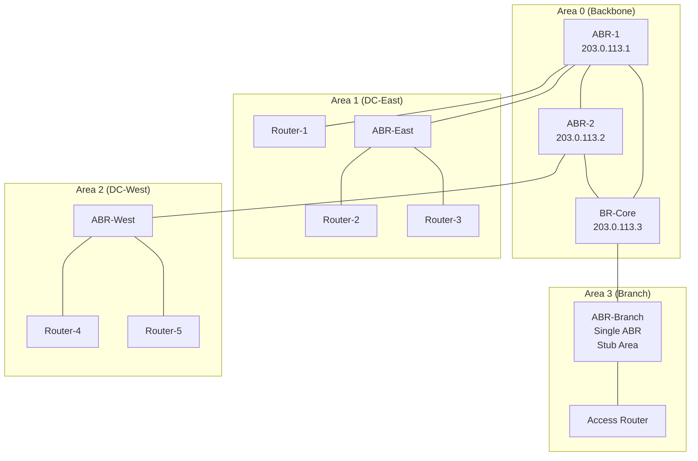

# OSPF Best Practices

OSPF operational best practices encompass area design, router placement, metric planning, convergence
tuning, and monitoring. Proper OSPF design dramatically improves network scalability, reduces SPF
computation time, and enables sub-second convergence with BFD.

---

## Quick Reference Checklist

| Decision | Best Practice |
| --- | --- |
| **Area Design** | Backbone (0) + multiple standard areas; use stub/totally stubby for leaf areas |
| **ABR/ASBR Placement** | ABR connects areas to backbone; ASBR imports external routes; minimize hops to backbone |
| **Metric Planning** | Cost = 10^8 / bandwidth (Mbps); all areas use same formula for consistency |
| **Convergence** | BFD timers 300/900 ms; SPF delay 50 ms; hello 10 sec, dead 40 sec |
| **Authentication** | MD5 (SHA only if vendors support RFC 5709); all routers in area must match |
| **Monitoring** | Neighbor adjacency state, LSA flooding count, SPF recalculation timing |
| **Multi-Area Scaling** | Do not exceed 100 routers per area; use 2-3 areas per domain |
| **Common Mistakes** | Wrong area design allows too much flooding; inconsistent metrics cause suboptimal routing |

---

## 1. Overview: OSPF Design Considerations

### Why OSPF Matters in Modern Networks

OSPF is the gold standard for interior gateway routing in enterprise and cloud networks. Unlike BGP,
OSPF uses link-state technology: every router has a complete view of the network topology.

#### OSPF advantages

```text
- Sub-second convergence (with BFD): no hold timers
- Loop-free by design: SPF (Dijkstra) guarantees shortest path
- Scales to 1000+ routers with proper area design
- Built-in load balancing: ECMP support
- No expensive BGP policies: cost metric drives routing
```

#### OSPF design failure modes

```text
Scenario 1: Single-area network with 500 routers
  - SPF recalculation takes 10+ seconds per topology change
  - One failed link causes network-wide recomputation
  - Convergence time: 30+ seconds (unacceptable)
  - Solution: Split into areas; SPF limited to affected area

Scenario 2: Leaf area (single access router) receives full routing table
  - Leaf area routers store 50,000 LSAs
  - Memory pressure; high CPU on low-end routers
  - Solution: Use stub area; LSAs reduced to 10-100

Scenario 3: All routers configured as ABRs
  - Multiple paths between areas (not optimal)
  - ABRs flood LSAs to all neighbors
  - Convergence slow and unpredictable
  - Solution: 1-2 ABRs per area boundary
```

### Design Pattern: Hierarchical Area Structure

Best practice is to design OSPF in layers:

```text
Layer 1: Backbone (Area 0)
  - Core routers only
  - All areas connect via backbone (either directly or through ABRs)
  - No user traffic crosses backbone (in theory; practice allows it)

Layer 2: Area per data center or region
  - 50-100 routers max
  - Contains access routers, distribution switches, hosts
  - ABRs connect to backbone

Layer 3: Stub areas (optional, leaf networks)
  - Single ABR; no ASBR
  - Routers don't need full routing table
  - Example: branch office with single uplink
```

#### Topology example



---

## 2. Area Design: Backbone, Standard, Stub

### Area Types & When to Use

| Area Type | Router Limit | Transit Area | Use Case |
| --- | --- | --- | --- |
| **Backbone (0)** | 100+ | Yes | Core network; must exist; all areas attach |
| **Standard** | 100 | No | Regional network; normal area |
| **Stub** | 50 | No | Leaf network; single uplink; don't need external routes |
| **Totally Stubby** | 50 | No | Leaf network; no interarea routes (except default) |
| **NSSA** | 50 | No | Leaf with external route injection (ASBR) |

### Backbone Area Design

#### Rule 1: Area 0 must exist and is mandatory

All routers connect to Area 0 either directly or through ABRs. Area 0 is the transit area.

#### Rule 2: Backbone should contain only core routers

```text
DO: Backbone routers are core switches, edge routers, ABRs
    Minimal traffic-carrying, maximum reliability

DON'T: Access layer routers in backbone
       Too many routers; SPF recalculation frequent
       Unnecessary memory pressure
```

#### Rule 3: Keep backbone loopback cost consistent

```text
Cost 1: Backbone-to-Backbone (core links)
Cost 10: ABR-to-Backbone link
Cost 100: Regional link within Area 0

Routers choose shortest path through backbone
Without consistent cost, routing becomes unpredictable
```

#### Cisco: Backbone configuration

```ios
router ospf 1
  network 203.0.113.0 0.0.0.255 area 0       ! Area 0 is backbone
  network 10.0.0.0 0.255.255.255 area 0      ! All core routers in Area 0

  ! Set backbone interface costs (low priority)
  interface GigabitEthernet0/0
    ip ospf cost 1   ! Direct backbone link
  end

  interface GigabitEthernet0/1
    ip ospf cost 10  ! ABR link (slightly higher)
  end
end
```

#### FortiGate: Backbone area

```fortios
config router ospf
  set router-id 203.0.113.1
  config area
    edit 0.0.0.0        ! Area 0 (backbone)
      config interface
        edit "port1"
          set cost 1
        next
        edit "port2"
          set cost 10
        next
      end
    next
  end
end
```

### Standard Areas

#### Rule 1: One standard area per region or data center

```text
Network layout:
  Region 1 (East): 30 routers -> Area 1
  Region 2 (West): 25 routers -> Area 2
  Backbone: 10 routers -> Area 0
```

#### Rule 2: Standard area routers do NOT transit traffic between areas

```text
Router in Area 1 needing to reach Area 2:
  - Sends traffic to ABR (Area 1 exit point)
  - ABR forwards to backbone
  - Backbone ABR forwards to Area 2 ABR
  - Area 2 ABR delivers to destination

Benefit: Area 1 routers don't need Area 2 topology (smaller LSDB)
```

#### Rule 3: Limit standard area to 100 routers

```text
At 100 routers:
  - LSA count: ~500-1000 (one per router, per link)
  - SPF time: ~100 ms per topology change
  - Memory: ~5-10 MB per router (acceptable)

At 500 routers in single area:
  - LSA count: ~2500-5000
  - SPF time: 2-5 seconds per change (unacceptable)
  - Memory: 50-100 MB (unacceptable on edge routers)
```

#### Cisco: Standard area configuration

```ios
router ospf 1
  network 10.1.0.0 0.0.255.255 area 1   ! Region 1, Area 1
  network 10.2.0.0 0.0.255.255 area 2   ! Region 2, Area 2
end
```

### Stub Areas

Stub areas reduce the LSDB by preventing external routes from being flooded. All external routes are
replaced by a default route.

#### Use case: Branch office with single uplink

```text
Branch network:
  - 5 access routers
  - 1 ABR (uplink to backbone)
  - 30,000 external routes (BGP from internet)

Without stub:
  All 30,000 routes flooded to branch routers
  Branch routers store 30,000 LSAs (memory waste)

With stub:
  External routes blocked at ABR boundary
  Branch routers see only default route (0.0.0.0/0)
  Memory reduced by 99%
```

#### Cisco: Configure stub area

```ios
! On all routers in Area 3 (including ABR):
router ospf 1
  area 3 stub
end

! Specifically on branch access routers:
router ospf 1
  area 3 stub
  ! No external routes; default route to ABR
end
```

#### FortiGate: Stub area

```fortios
config router ospf
  config area
    edit 0.0.0.3        ! Area 3
      set type stub
    next
  end
end
```

### Totally Stubby Areas

More restrictive than stub areas: not only external routes are blocked, but interarea routes are also
replaced by a single default route.

#### Use case: Branch with minimal routing needs

```text
Branch network:
  - Single ABR
  - 5 access routers
  - Only need default route

Without totally stubby:
  Branch routers learn interarea routes to other regions
  LSDB still ~1000 LSAs

With totally stubby:
  Only default route; no interarea routes
  LSDB: 5 routers, backbone link only
```

#### Cisco: Totally stubby configuration

```ios
! On all routers in Area 3:
router ospf 1
  area 3 stub no-summary   ! Blocks interarea routes too
end
```

#### FortiGate: Totally stubby

```fortios
config router ospf
  config area
    edit 0.0.0.3
      set type stub
      set default-cost 10
    next
  end
end
```

---

## 3. Router Placement: ABR & ASBR Positioning

### Area Border Router (ABR) Design

ABRs connect areas. Multiple ABRs between the same pair of areas allow load balancing but increase
complexity.

#### Rule 1: Minimum 1 ABR per area; maximum 2-3 per area

```text
1 ABR: Single point of failure; not recommended for production
2 ABRs: Redundancy; load balancing possible
3+ ABRs: Overkill; increases SPF time in backbone

Recommended: 2 ABRs per area if area is critical
```

#### Rule 2: ABRs should be in the backbone (Area 0)

```text
Correct: ABR has interfaces in Area 0 and Area 1
         Can reach other areas via backbone

Incorrect: ABR has interfaces in Area 1 and Area 2 only
           Does not directly touch backbone
           Traffic must transit other Area 0 routers (suboptimal)
```

#### Rule 3: ABR placement affects convergence

```text
Topology: Area 0 (backbone) and Area 1 (regional)

Placement 1: ABR directly connected to core backbone router
  Distance to backbone: 1 hop
  Convergence time: <100 ms

Placement 2: ABR connected to backbone via distribution router
  Distance to backbone: 2 hops
  Convergence time: 150-200 ms

Placement 3: ABR connected via access layer
  Distance to backbone: 3-5 hops
  Convergence time: >300 ms (unacceptable)
```

### AS Boundary Router (ASBR) Design

ASBRs import external routes (from BGP, static routes, etc.) into OSPF.

#### Rule 1: ASBR should be in backbone (Area 0) if possible

```text
ASBR in Area 0:
  - All areas learn external route via backbone (normal SPF)
  - Convergence time: <100 ms

ASBR in Area 1:
  - Other areas learn route via Area 0
  - Interarea route; slightly different SPF calculation
  - Convergence time: 100-150 ms
```

#### Rule 2: Only one ASBR per external routing source

```text
Correct:
  One ASBR imports routes from ISP
  Other ASBR imports routes from MPLS provider
  No competition; routes clearly sourced

Incorrect:
  Both ASBR1 and ASBR2 import same 8.8.8.0/24 from ISP
  OSPF costs are equal; hashing selects one randomly
  Convergence unpredictable
```

#### Rule 3: ASBR configuration should include default external cost

```text
Without default cost: External routes have cost 20 (arbitrary)
With default cost: Explicitly set (e.g., 100)
Benefit: Easy to deprioritize external vs internal routes
```

#### Cisco: ABR and ASBR configuration

```ios
router ospf 1
  ! Router ID (ASBR advertises this)
  router-id 203.0.113.1

  ! Area definitions
  network 203.0.113.0 0.0.0.255 area 0      ! Backbone interface
  network 10.1.0.0 0.0.255.255 area 1       ! Area 1 interface

  ! If ASBR, set default cost for external routes
  default-information originate metric 100 metric-type 1
  ! metric-type 1 = E1 (external type 1; cost includes internal hops)
end
```

#### FortiGate: ABR placement

```fortios
config router ospf
  set router-id 203.0.113.1
  config area
    edit 0.0.0.0    ! Backbone
      config interface
        edit "port1"
        next
      end
    next
    edit 0.0.0.1    ! Area 1
      config interface
        edit "port2"
        next
      end
    next
  end
end
```

---

## 4. Metric Planning: Cost Assignment Strategy

### Metric (Cost) Formula

#### Cisco/FortiGate default: Cost = 10^8 / bandwidth (Mbps)

```text
Link speed | Cost
1 Gbps     | 1 (10^8 / 1000 Mbps)
100 Mbps   | 100
10 Mbps    | 10,000
```

### Consistent Metric Policy

#### Rule 1: Define metric policy BEFORE deploying OSPF

```text
Corporate policy example:
  Backbone links (1 Gbps): cost 1
  Regional links (100 Mbps): cost 100
  Branch links (10 Mbps): cost 1000
  Metro dark fiber (10 Gbps): cost 1
```

#### Rule 2: Do not use default costs; set explicitly

```text
Pitfall: Different routers auto-calculate costs
  Router A sees 1 Gbps -> Cost 1
  Router B sees 100 Mbps -> Cost 100
  Path selection becomes unpredictable

Solution: Set cost on every interface explicitly
```

#### Rule 3: Metric should reflect link quality, not just speed

```text
Pure speed-based metric:
  10 Gbps dark fiber: cost 1
  1 Gbps WAN: cost 10

Reality-adjusted metric:
  10 Gbps dark fiber (local campus): cost 1
  1 Gbps WAN (high jitter, occasional congestion): cost 50

Reasoning: WAN link is less reliable; avoid it unless necessary
```

### Cost Calculation & Examples

#### Example: DC to Branch network

```text
Topology:
  DC router (cost 1 link)
  Regional distribution (cost 10 link)
  Branch access (cost 100 link)

Path 1: DC -> Dist -> Access: Total cost 1 + 10 + 100 = 111
Path 2: DC -> Access (direct, expensive WAN): cost 50

OSPF chooses Path 1 (cost 111 < 50? NO!)
If direct WAN is cost 50, OSPF chooses it (worse quality!)

Solution: Direct WAN cost should be 120+
  Path 1: 111 (preferred)
  Path 2: 120 (backup)
```

#### Cisco: Set interface costs

```ios
router ospf 1
  network 0.0.0.0 255.255.255.255 area 0
end

! On backbone links (1 Gbps):
interface GigabitEthernet0/0
  ip ospf cost 1
end

! On regional links (100 Mbps):
interface GigabitEthernet0/1
  ip ospf cost 10
end

! On branch links (10 Mbps):
interface GigabitEthernet0/2
  ip ospf cost 100
end
```

#### FortiGate: Cost assignment

```fortios
config router ospf
  config area
    edit 0.0.0.0
      config interface
        edit "port1"
          set cost 1          ! Backbone
        next
        edit "port2"
          set cost 10         ! Regional
        next
        edit "port3"
          set cost 100        ! Branch
        next
      end
    next
  end
end
```

### Metric Verification

#### Cisco: Check interface costs

```ios
show ip ospf interface brief | include "Cost"
  Interface    PID   Area  Ip Address/Mask    Cost  State Nbrs F/C
  Gi0/0        1     0     203.0.113.1/30     1     P2P   1/1
  Gi0/1        1     0     10.1.0.1/30        10    P2P   1/1
```

#### Cisco: Check route cost

```ios
show ip route ospf | include "203.0.113"
  O     203.0.113.0/24 [110/111] via 10.1.0.2, 00:05:00, GigabitEthernet0/1
  ! Cost = 111 (path through regional link)
```

---

## 5. Convergence Tuning: SPF, Hello, Dead Timers

### Convergence Timeline

```text
Event: Link down
  T=0ms: Interface down
  T=1ms: OSPF detects (if BFD enabled; else helloing: ~5-10 sec)
  T=10ms: LSU (Link State Update) flooded to all neighbors
  T=50-200ms: SPF runs (all routers recalculate)
  T=200-500ms: RIB updated; traffic rerouted

Total: <1 second (with BFD) or 30-180 seconds (without BFD)
```

### Timer Selection Strategy

| Component | Value | Tuning | Note |
| --- | --- | --- | --- |
| **Hello Interval** | 10 sec | Can reduce to 3-5 sec | More frequent keepalives |
| **Dead Interval** | 40 sec | Set to 4x hello | Neighbor timeout |
| **SPF Delay** | 50 ms | Conservative value | Time before SPF runs after LSA received |
| **SPF Throttle Max** | 5 sec | Prevent CPU overload | Max time between SPFs |
| **BFD Timers** | 300/900 ms | (Rx / Tx) | Enables sub-second convergence |

### Aggressive Convergence Configuration

#### Cisco: Sub-second convergence with BFD

```ios
router ospf 1
  timers throttle spf 50 100 5000
  ! (SPF-delay, SPF-initial-holdtime, SPF-max-holdtime)

  ! Per interface:
  interface GigabitEthernet0/0
    ip ospf hello-interval 5
    ip ospf dead-interval 20
    ip ospf bfd
  end
end

! BFD configuration:
interface GigabitEthernet0/0
  bfd interval 300 min_rx 300 multiplier 3
  ! Interval=300ms, RX=300ms, multiplier=3 (900ms timeout)
end
```

#### FortiGate: Convergence tuning

```fortios
config router ospf
  set router-id 203.0.113.1
  set spf-interval-exp 5 10 5000  ! (base, initial, max in ms)

  config area
    edit 0.0.0.0
      config interface
        edit "port1"
          set hello-interval 5
          set retransmit-interval 5
          set transmit-delay 1
          set dead-interval 20
        next
      end
    next
  end
end
```

### Convergence Testing

#### Cisco: Measure convergence time

```ios
! Terminal 1: Monitor convergence
debug ip ospf spf internal
! Logs SPF runs; check timestamps

! Terminal 2: Trigger event
interface GigabitEthernet0/1
  shutdown           ! Link down
end

! Monitor output: Look for "SPF recalculated at [timestamp]"
! Measure time from "shutdown" to SPF recalculation
! Should be <100 ms with aggressive timers
```

#### FortiGate: SPF monitoring

```fortios
diagnose ip ospf event print
  Log messages showing SPF runs and timing

! Trigger failover:
execute interface down port2

! Check SPF recalculation time in logs
```

---

## 6. Authentication: MD5 & SHA Best Practices

### Authentication Options

| Method | Strength | Compatibility | Use Case |
| --- | --- | --- | --- |
| **None** | None | All routers | Lab only; never production |
| **MD5** | Weak (128-bit) | Wide support | Legacy networks; acceptable short-term |
| **SHA-256** | Strong (256-bit) | RFC 5709; newer devices | Recommended for new deployments |
| **HMAC-SHA** | Strong | Wide support | Enterprise standard |

### Authentication Configuration

#### Cisco: MD5 authentication

```ios
! Define authentication key:
key chain OSPF-KEY
  key 1
    key-string MySecure32CharKeyString1234567890AB
  key 2
    key-string BackupSecureKeyString321098765432BA
end

! Apply to interface:
interface GigabitEthernet0/0
  ip ospf authentication message-digest
  ip ospf message-digest-key 1 md5 MySecure32CharKeyString1234567890AB
end

! Or apply to area:
router ospf 1
  area 0 authentication message-digest
end
```

#### Cisco: SHA-256 authentication (RFC 5709)

```ios
! SHA-256 requires key chain (not legacy auth method):
key chain OSPF-SHA
  key 1
    key-string MyVerySecureKeyFor256BitHashingABC123
    cryptographic-algorithm hmac-sha-256
end

interface GigabitEthernet0/0
  ip ospf authentication key-chain OSPF-SHA
end
```

#### FortiGate: OSPF authentication

```fortios
config router ospf
  config area
    edit 0.0.0.0
      config interface
        edit "port1"
          set authentication message-digest
          set authentication-key "MySecure32CharKeyString1234567890AB"
        next
      end
    next
  end
end
```

### Key Rotation

#### Policy: Rotate keys every 90 days or on team changes

```text
Step 1: Configure backup key (new key ID 2)
  Both old key (ID 1) and new key (ID 2) active

Step 2: Wait 24 hours (verify convergence on new key)
  Routers prefer lower key ID
  All should use key 2 now

Step 3: Deactivate old key (ID 1)
  Remove from configuration
  Only new key (ID 2) remains
```

#### Cisco: Key rotation example

```ios
! Current: Key 1 active
key chain OSPF-KEY
  key 1
    key-string OldKeyString123456789012345678
end

! Step 1: Add key 2
key chain OSPF-KEY
  key 1
    key-string OldKeyString123456789012345678
  key 2
    key-string NewKeyString987654321098765432
end

! Step 3: Remove key 1 after 24 hours
key chain OSPF-KEY
  key 2
    key-string NewKeyString987654321098765432
end
```

---

## 7. Monitoring: Neighbor States, LSA Flooding, SPF Recalculations

### Key Monitoring Metrics

| Metric | Alert Threshold | Purpose |
| --- | --- | --- |
| **Neighbor State** | Any state != Full | Detect adjacency issues |
| **LSA Count** | Sudden increase >10% | Detect flapping or misconfiguration |
| **SPF Count** | >1 per second | Detect instability or high churn |
| **Hello Loss** | >1 lost hello | Detect link instability |
| **Queue Delay** | >100 ms | Detect congestion on OSPF links |

### Monitoring Commands

#### Cisco: Check neighbor adjacency

```ios
show ip ospf neighbor detail

  Neighbor 10.1.0.2, interface address 10.1.0.1
    In the area 1 via interface GigabitEthernet0/0
    Neighbor priority is 1, State is FULL, 6 state changes
    DR is 10.1.0.2 BDR is 10.1.0.1
    Options is 0x12
    Dead timer due in 00:00:38
    Neighbor is up for 00:05:00
```

#### Cisco: Check LSA database size

```ios
show ip ospf database summary
  OSPF Router with ID (203.0.113.1) (Process ID 1)

        Router Link States (Area 0)
                  Number of Router LSAs: 10, Checksum Sum: 0x5eb67
        Net Link States (Area 0)
                  Number of Network LSAs: 5, Checksum Sum: 0x1dc84
        ASBR-summary Link States (Area 0)
                  Number of ASBR Summary LSAs: 2, Checksum Sum: 0x2c2a
        Area Link States (Area 1)
                  Number of Router LSAs: 25
                  Number of Network LSAs: 8

  ! Total: 50 LSAs in Area 0 + Area 1
  ! Baseline: 50; Alert if >55 (10% increase)
```

#### Cisco: SPF recalculation timing

```ios
show ip ospf statistics | include "SPF"
  SPF calculation time    : 0 usecs total, 0 usecs last, queue 0 usecs
  Incremental SPF (ISPF): Enabled: No
  Last SPF recalculation: 00:05:00

! Monitor with debug:
debug ip ospf spf
  OSPF: SPF calculation started for area 0 at 10:00:00.123
  OSPF: SPF runs every 50 milliseconds
  OSPF: SPF completed, time 0.075 seconds

! <100ms = good; >1 second = investigate
```

#### FortiGate: Neighbor status

```fortios
diagnose ip ospf neighbor print
  Neighbor        State      Area        Interface        Uptime
  10.1.0.2        Full       0.0.0.0     port1            05:00:00

diagnose ip ospf lsdb print | grep -c "Router"
  ! Count Router LSAs; baseline and compare
```

### Automated Monitoring Alerts

#### Zabbix/Prometheus monitoring

```yaml
Alert: OSPF neighbor down
  Condition: ospf_neighbor_state != Full
  Duration: 30 seconds
  Action: Page on-call

Alert: LSA count spike
  Condition: ospf_lsa_count > baseline * 1.1
  Duration: 2 minutes
  Action: Alert; review topology

Alert: SPF recalculation timeout
  Condition: ospf_spf_time_usec > 1000000
  Duration: N/A (single event)
  Action: Alert; check CPU on all routers
```

---

## 8. Multi-Area Scaling: When to Split Areas

### Growth Planning

| Network Size | Design |
| --- | --- |
| 1-50 routers | Single area (Area 0) acceptable |
| 50-150 routers | Split into 2-3 areas |
| 150-500 routers | 3-5 areas (backbone + 2-4 regional) |
| 500+ routers | 5-10 areas (enterprise scale) |

### Area Splitting Decision Tree

```text
Question 1: Do you have >100 routers in one area?
  YES -> Split into multiple areas (next question)
  NO -> Continue

Question 2: Is SPF taking >200 ms per topology change?
  YES -> Split into smaller areas
  NO -> Continue monitoring

Question 3: Do you have 30,000+ external routes (BGP)?
  YES -> Use stub or totally stubby areas
  NO -> Standard areas acceptable

Question 4: Are branch sites stable (no frequent flaps)?
  YES -> Can use stub/totally stubby
  NO -> Use standard area (faster failover)
```

### Splitting Example: Single Area to Multi-Area

#### Before (Single Area 0: 200 routers, 30,000 external routes)

```text
Problems:
  - SPF time: 2-3 seconds per change
  - Convergence: 30+ seconds (unacceptable)
  - Memory: 500+ MB per router
  - CPU: High on access routers
```

#### After (Multi-Area: Backbone + 3 regional areas)

```text
Area 0 (Backbone): 15 core routers
Area 1 (East DC): 60 routers
Area 2 (West DC): 70 routers
Area 3 (Branch): 55 routers (stub)

Benefits:
  - Area 0 SPF: 50 ms (15 routers = 15 LSAs)
  - Area 1 SPF: 80 ms (60 routers = 60 LSAs)
  - Area 3 SPF: 20 ms (stub; 5 LSAs only)
  - Total convergence: <300 ms (instead of 30 seconds)
  - Memory: 50-100 MB per router (acceptable)
```

#### Cisco: Multi-area configuration

```ios
router ospf 1
  network 203.0.113.0 0.0.0.255 area 0    ! Backbone
  network 10.1.0.0 0.0.255.255 area 1     ! East DC
  network 10.2.0.0 0.0.255.255 area 2     ! West DC

  area 3 stub no-summary                   ! Branch (stub)
  network 10.3.0.0 0.0.255.255 area 3
end
```

---

## 9. Common Mistakes & Mitigation

### Mistake 1: Wrong Area Design (Allows Too Much Flooding)

#### Problem

```text
Single area with 500 routers
Every link change floods LSA to all 500 routers
SPF runs on all 500 routers
Convergence: 30-60 seconds
```

#### Mitigation

```text
1. Audit router count per area: show ip ospf database summary
2. Split areas: Define regional boundaries
3. Use ABRs: Control LSA flooding at area boundaries
4. Test: Measure SPF time before/after: show ip ospf statistics
```

### Mistake 2: Inconsistent Metrics

#### Problem

```text
Router A configures Gi0/0 with cost 1 (default)
Router B configures Gi0/0 with cost 100 (manual)
Both are 1 Gbps, but costs differ
Path selection becomes unpredictable
```

#### Mitigation

```text
1. Define corporate metric policy (before deploying)
2. Set cost on EVERY interface explicitly (no defaults)
3. Document policy in runbook
4. Audit: show ip ospf interface | include Cost
```

### Mistake 3: Timer Mismatches

#### Problem

```text
Router A: hello 10, dead 40
Router B: hello 5, dead 20
Routers cannot form adjacency (timers must match)
```

#### Mitigation

```text
1. Standard timers for entire network
   Backbone: hello 10, dead 40
   Regional: hello 5, dead 20 (faster convergence)

2. Document in configuration templates
3. Verify: show ip ospf interface | include hello
```

### Mistake 4: Authentication Key Mismatch

#### Problem

```text
Router A: key-string MySecureKey123
Router B: key-string MySecureKy123  (typo: missing 'e')
Adjacency down
```

#### Mitigation

```text
1. Store keys in secure vault (not in running config)
2. Use copy-paste (avoid manual typing)
3. Test adjacency before production
4. Verify: show ip ospf neighbor detail (should be Full)
```

### Mistake 5: ASBR Route Preference Misconfiguration

#### Problem

```text
Two ASBRs import same external route with equal cost
Traffic hash splits 50/50 between them
One ASBR has slower link to external network
Sub-optimal routing
```

#### Mitigation

```text
1. Primary ASBR: set metric 100
2. Secondary ASBR: set metric 200
3. Verify: show ip route | grep external
```

---

## 10. Verification & Testing

### Pre-Deployment Checklist

- [ ] Area design documented (backbone + 2-4 regional areas)
- [ ] Metrics calculated for all link speeds
- [ ] Metrics set explicitly on all interfaces (no defaults)
- [ ] ABR placement confirmed (1-2 per area boundary)
- [ ] Stub areas defined for leaf networks
- [ ] Authentication keys generated (32+ characters)
- [ ] SPF timers configured (50 ms delay)
- [ ] Hello/dead timers set (10/40 sec or 5/20 for fast networks)
- [ ] BFD enabled on critical links (300/900 ms)
- [ ] All routers converge (show ip ospf neighbor = Full)

### Post-Deployment Testing

#### Convergence test

```text
Step 1: Baseline
  show ip ospf statistics | grep "SPF calculation time"
  Record SPF time: 0.050 seconds

Step 2: Trigger topology change
  interface GigabitEthernet0/1
    shutdown
  end

Step 3: Monitor convergence
  show ip ospf database summary
  show ip route | grep "O"

Step 4: Verify
  All routes converged (no "O*" routes, no incomplete state)
  Convergence time <300 ms
  SPF time <100 ms

Step 5: Restore link
  interface GigabitEthernet0/1
    no shutdown
  end

Step 6: Verify restoration
  Converged back to original state
  No transient loops (check traceroute during convergence)
```

**Authentication verification:**

```ios
show ip ospf interface brief | include "Authentication"
  Interface    PID   Area  Authentication
  Gi0/0        1     0     MD5
```

**Multi-area verification:**

```ios
show ip ospf database summary
  ! Verify Area 0 has fewer LSAs than Area 1
  ! Verify Areas are properly segregated
```

---

## References

- [OSPF Routing Protocol](../routing/ospf.md)
- [Cisco OSPF Configuration](../cisco/cisco_ospf_config.md)
- [FortiGate OSPF Configuration](../fortigate/fortigate_ospf_config.md)
- [OSPF Troubleshooting](ospf_troubleshooting.md)
- [OSPF Advanced](../theory/ospf_advanced.md)
- [BFD Best Practices](bfd_best_practices.md)
