# OSPF Troubleshooting

OSPF issues fall into three categories: neighbour formation failures, database
synchronisation
issues, and route installation failures. The neighbour state machine makes it
straightforward
to locate which category applies — identify the stuck state first, then work through the
specific failure points for that state.

---

## OSPF Neighbour State Machine

```mermaid
stateDiagram-v2
    [*] --> Down : Interface comes up / OSPF enabled
    Down --> Init : Hello received from neighbour
    Init --> TwoWay : Own Router ID seen in neighbour's Hello
    TwoWay --> ExStart : DR/BDR election complete (or p2p link); DBD exchange begins
    ExStart --> Exchange : Master/slave negotiated; DBD packets exchanged
    Exchange --> Loading : DBD exchange complete; LSA requests sent
    Loading --> Full : All requested LSAs received
    Full --> Down : Hello timeout, interface down, or manual reset
```



**What each transition requires:**

- **Down → Init**: A Hello packet is received. Requires Layer 2 adjacency, matching subnet,

    and no ACL blocking IP protocol 89 or multicast 224.0.0.5.

- **Init → 2-Way**: The receiving router sees its own Router ID listed in the neighbour's

    Hello. Requires matching Hello/dead intervals, matching area ID, and matching authentication.

- **2-Way → ExStart**: On broadcast networks, DR/BDR election must complete first. On point-to-point,

    this transition is immediate. Requires matching MTU (or `ip ospf mtu-ignore`).

- **ExStart → Exchange**: Master/slave relationship established via DBD sequence numbers.

    Duplicate Router IDs prevent this.

- **Exchange → Loading**: Full DBD exchange complete. Router sends LSR for any LSAs it needs.
- **Loading → Full**: All LSAs received and installed in the LSDB. Large databases or packet

    loss can delay this transition.

---

## Neighbour Formation — Common Failure Points

| Stuck State | Likely Cause | Diagnostic | Fix |
| --- | --- | --- | --- |
| Down &#124; Init | Layer 1/2 issue, OSPF not enabled on interface, or subnet mismatch | `show ip ospf interface`, `ping` to peer | Enable `ip ospf <pid> area <area>` on interface; verify subnet |
| Init (one-way) | ACL blocking multicast 224.0.0.5/6, or Hello/dead interval mismatch | `show ip access-lists`, `show ip ospf interface` | Permit IP proto 89 on interface ACL; match Hello intervals |
| 2-Way (on broadcast, no Full) | Router is DROther — adjacency with DR/BDR only is expected behaviour | `show ip ospf neighbor` | Verify DR and BDR are elected and show Full; DROther to DROther at 2-Way is correct |
| ExStart loop | MTU mismatch between peers | `show interfaces` vs `show ip ospf interface` | `ip ospf mtu-ignore` on both interfaces, or fix MTU to match |
| ExStart &#124; stuck | Duplicate Router ID in the area | `show ip ospf` on all routers | Configure unique `router-id` on one router; clear OSPF process |
| Loading (prolonged) | Database too large, packet loss causing LSA retransmissions | `show ip ospf database`, `show ip ospf statistics` | Check for flapping LSAs; verify no packet loss on the link |

---

## Area Type Mismatches

Stub, totally stubby, and NSSA area types must match on every router in the area. A
mismatch
prevents neighbour formation — the area type is carried in the Hello packet options
field.

**Symptom:** Neighbour stays in Init or 2-Way; no ExStart transition.

**Diagnostic:**

```ios

show ip ospf
show ip ospf interface <interface>
```

The output shows the configured area type. Compare across all routers in the area. A router
configured as `stub` will not form an adjacency with a router that has no stub configuration
for the same area.

---

## Authentication Issues

OSPF supports null, plain-text, and MD5 authentication. Mismatched auth type or key causes
Hello packets to be silently dropped — the neighbour stays in Init or Down.

**Diagnostic:**

```ios

show ip ospf interface <interface>
debug ip ospf adj
```

`show ip ospf interface` shows the configured authentication type. `debug ip ospf adj` logs
authentication failures explicitly: `OSPF: Send with youngest Key 1` or `OSPF: Rcv pkt from
<ip> : Mismatched Authentication type`.

!!! note
    Plain-text OSPF authentication is visible in packet captures and provides no real security.
    Use MD5 authentication or, on IOS-XE 15.4+, SHA HMAC via key chains.

---

## Passive Interface Misconfiguration

A `passive-interface` prevents OSPF Hellos from being sent or received on that interface.
The interface prefix is still advertised into OSPF — only adjacency formation is disabled.

**Symptom:** No OSPF neighbour forming on a specific interface, but the interface prefix
appears in the LSDB.

**Diagnostic:**

```ios

show ip ospf interface <interface>
```

Look for `No Hellos (Passive interface)` in the output.

**Common mistake:** Applying `passive-interface default` and forgetting to un-suppress transit
interfaces with `no passive-interface <interface>`.

---

## Route Not Appearing After Adjacency is Full

If the adjacency is Full but expected routes are missing from the routing table, work through
these checks in order.

**Is the LSA in the database?**

```ios

show ip ospf database
show ip ospf database router <router-id>
show ip ospf database network <dr-ip>
```

If the LSA is absent, the originating router is not generating it — check that the prefix's
interface has OSPF enabled and is not passive.

**Is the route installed?**

```ios

show ip route ospf
show ip route <prefix>
```

An LSA present in the database but absent from the routing table usually indicates:

- A summary route is suppressing the more-specific prefix (`area <x> range` with `not-advertise`,

    or `summary-address` on an ASBR)

- The route is being filtered by a `distribute-list` under `router ospf`
- A more preferred route from another protocol is installed

**Default route:**

```ios

show ip route 0.0.0.0
show running-config | section router ospf
```

Check that `default-information originate` is configured on the intended router, and that
the originating router has a default route in its own table (unless `always` is appended).

**ABR summaries:**

```ios

show ip ospf border-routers
```

---

## SPF and LSA Storms

High CPU caused by constant SPF recalculation indicates OSPF instability — typically a flapping
interface or a routing loop causing LSA flooding.

**Diagnostic:**

```ios

show ip ospf statistics
show ip ospf database
show processes cpu | include ospf
```

A high SPF count in `show ip ospf statistics` confirms instability. Cross-reference with
`show ip ospf database` to identify LSAs with rapidly incrementing sequence numbers — these
point to the originating router with the unstable interface.

**Fix:**

```ios

router ospf <pid>
 timers throttle spf 50 100 5000    ! Initial, hold, max (ms)
 timers lsa arrival 100
```

SPF throttle timers reduce the blast radius of a flapping link by delaying and coalescing
SPF recalculations. The underlying instability still needs to be resolved.

!!! warning
    SPF throttle timers slow convergence as a side effect. Set them conservatively — the
    defaults are reasonable for most networks. Fix the flapping interface rather than relying
    solely on throttling.

---

## Cisco IOS-XE Diagnostic Commands

| Command | Purpose |
| --- | --- |
| `show ip ospf neighbor` | Neighbour state and DR/BDR roles |
| `show ip ospf neighbor detail` | Full neighbour parameters including dead timer |
| `show ip ospf interface` | Per-interface OSPF parameters, auth type, passive status |
| `show ip ospf database` | Full LSDB summary |
| `show ip ospf statistics` | SPF run count and timing |
| `show ip route ospf` | OSPF-installed routes |
| `debug ip ospf adj` | Adjacency events and authentication failures |
| `debug ip ospf events` | General OSPF event log |

!!! warning
OSPF debug on a large network generates significant output. Always specify an interface
    or neighbour scope where possible, and disable debug immediately after capture: `no
    debug ip ospf`.

---

## FortiGate OSPF Diagnostics

```fortios

get router info ospf neighbor
get router info ospf interface
get router info ospf database
get router info routing-table ospf
```

**Enable debug logging:**

```fortios

diagnose ip router ospf all enable
diagnose ip router ospf level info
diagnose debug enable
```

Disable after capture:

```fortios

diagnose debug disable
diagnose ip router ospf all disable
```
