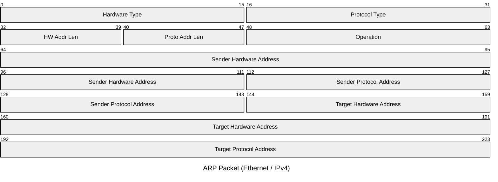

# ARP

The Address Resolution Protocol maps a known IPv4 address to an unknown MAC address
on a local network segment. ARP is encapsulated directly in an Ethernet frame
(EtherType `0x0806`) and operates between the Data Link and Network layers. It is
broadcast-based: a host asks "who has IP x.x.x.x?" and the owner replies with its MAC.

## Quick Reference

| Property | Value |
| --- | --- |
| **OSI Layer** | Layer 2 — Data Link (bridges Layer 2 and 3) |
| **TCP/IP Layer** | Network Access (Link) |
| **RFC** | RFC 826 |
| **Wireshark Filter** | `arp` |
| **EtherType** | `0x0806` |

## Packet Structure

The ARP packet for Ethernet and IPv4 is fixed at 28 bytes (224 bits).

## Field Reference

| Field | Bits | Description |
| --- | --- | --- |
| **Hardware Type** | 16 | Network interface type. `0x0001` = Ethernet. |
| **Protocol Type** | 16 | Network layer protocol being resolved. `0x0800` = IPv4. |
| **HW Addr Len** | 8 | Length of hardware addresses in bytes. `6` for Ethernet MAC addresses. |
| **Proto Addr Len** | 8 | Length of protocol addresses in bytes. `4` for IPv4. |
| **Operation** | 16 | `1` = ARP Request. `2` = ARP Reply. `3` = RARP Request. `4` = RARP Reply. |
| **Sender Hardware Address** | 48 | MAC address of the sender. |
| **Sender Protocol Address** | 32 | IPv4 address of the sender. |
| **Target Hardware Address** | 48 | MAC address of the target. Set to `00:00:00:00:00:00` in a request (unknown). |
| **Target Protocol Address** | 32 | IPv4 address of the target being resolved. |

## Notes

- **ARP requests** are sent to the Ethernet broadcast address (`FF:FF:FF:FF:FF:FF`).
  All hosts on the segment receive and process them; only the owner of the target IP
  sends a unicast reply.
- **Gratuitous ARP** is an ARP request where the sender and target IP are the same.
  Used to announce a new MAC address (e.g. after failover or NIC replacement) and
  to detect IP address conflicts.
- **ARP cache poisoning** exploits the trust model of ARP — replies are accepted
  without a prior request. Mitigation: Dynamic ARP Inspection (DAI) on switches.
- **Proxy ARP** (RFC 1027) allows a router to answer ARP requests on behalf of hosts
  on a different subnet, enabling communication without a default gateway configured
  on the host.
- ARP has **no authentication** and is limited to IPv4. IPv6 replaces ARP with
  Neighbour Discovery Protocol (NDP), which uses ICMPv6 messages and includes
  cryptographic extensions (SEND, RFC 3971).
