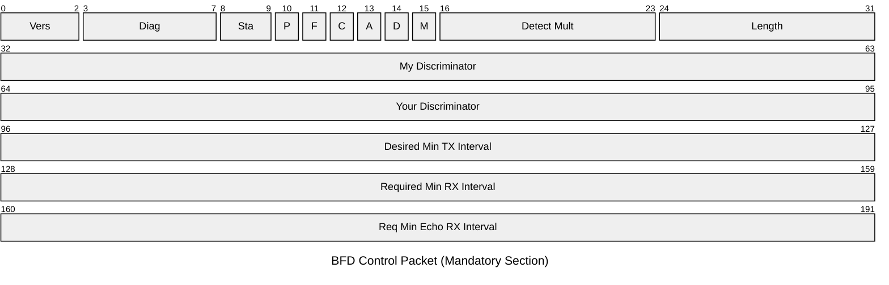
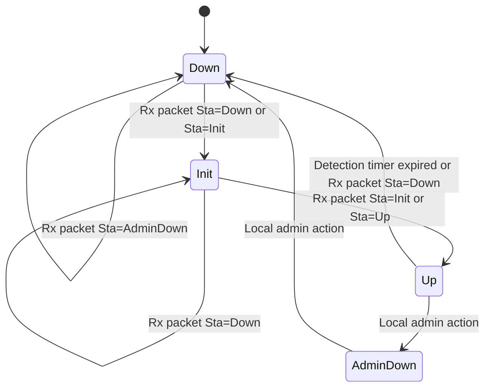

# BFD Control Packet

Bidirectional Forwarding Detection provides sub-second failure detection for any
forwarding path, independent of the media or routing protocol. BFD peers exchange
Control packets over UDP at a negotiated interval; missed packets trigger a
detection event. The mandatory section of a BFD Control packet is 24 bytes.

## Quick Reference

| Property | Value |
| --- | --- |
| **OSI Layer** | Layer 3 — Network (monitors forwarding path) |
| **TCP/IP Layer** | Transport (carried over UDP) |
| **RFC** | RFC 5880 (base), RFC 5881 (single-hop), RFC 5883 (multi-hop) |
| **Wireshark Filter** | `bfd` |
| **UDP Ports** | `3784` single-hop, `4784` multi-hop, `6784` BFD for LAG |

## Packet Structure



## Field Reference

| Field | Bits | Description |
| --- | --- | --- |
| **Vers** | 3 | Protocol version. Must be `1`. |
| **Diag** | 5 | Diagnostic code indicating why the last session failed. `0` = No Diagnostic, `1` = Control Detection Time Expired, `2` = Echo Failed, `3` = Neighbour Signalled Down, `7` = Path Down. |
| **Sta** | 2 | Session state. `0` = AdminDown, `1` = Down, `2` = Init, `3` = Up. |
| **P** | 1 | Poll flag. Sender requests a response with the F flag set (used for parameter changes). |
| **F** | 1 | Final flag. Response to a Poll packet. |
| **C** | 1 | Control Plane Independent. Set when the forwarding plane maintains BFD independently of the control plane (hardware offload). |
| **A** | 1 | Authentication Present. An authentication section follows the mandatory section. |
| **D** | 1 | Demand mode. No periodic packets; polling is used instead. |
| **M** | 1 | Multipoint. Reserved, must be `0`. |
| **Detect Mult** | 8 | Detection time multiplier. The detection time is this value multiplied by the negotiated TX interval. Typical value: `3`. |
| **Length** | 8 | Total length of the BFD packet in bytes, including any authentication section. Minimum `24`. |
| **My Discriminator** | 32 | Locally generated unique session identifier. Non-zero. Used to demultiplex sessions. |
| **Your Discriminator** | 32 | Discriminator received from the remote system. `0` until the remote system is identified. |
| **Desired Min TX Interval** | 32 | Minimum interval (µs) at which this system wants to send Control packets. |
| **Required Min RX Interval** | 32 | Minimum interval (µs) at which this system can receive Control packets. `0` = not willing to receive. |
| **Req Min Echo RX Interval** | 32 | Minimum interval (µs) for Echo packets. `0` = Echo mode not supported. |

## Session State Machine



## Detection Time

Detection time is negotiated between peers:

```text
Detection Time = Detect Mult × max(Desired Min TX Interval, Required Min RX Interval)
```

**Example:** 300ms TX interval, multiplier 3 → detection in **900ms**.

## Notes

- **Hardware offload** (`C` flag) is critical for reliability. When BFD runs in the
  control plane, a CPU spike can cause false positives. NPU-offloaded BFD (FortiGate)
  and ASIC-offloaded BFD (Cisco) set the `C` flag to indicate the forwarding plane
  maintains the session independently.

- **Discriminators** solve the demultiplexing problem when multiple BFD sessions exist
  between the same pair of IP addresses (e.g. multiple VRFs). Each session has a
  unique `My Discriminator` value.

- **Async mode** (default) — peers send periodic hellos. **Demand mode** — no periodic
  packets; a Poll/Final exchange is used to verify connectivity on demand.

- **Echo mode** — packets are looped back by the remote system without processing,
  allowing the local system to test the data path at high rates without burdening the
  remote CPU.
