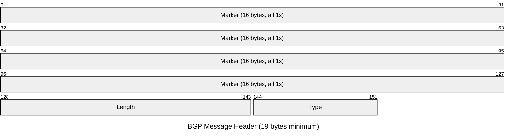
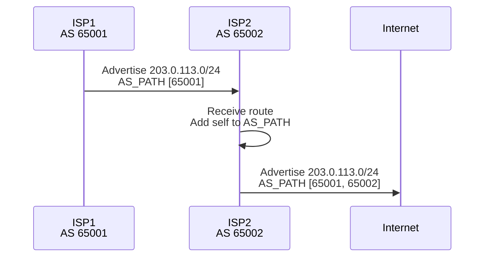
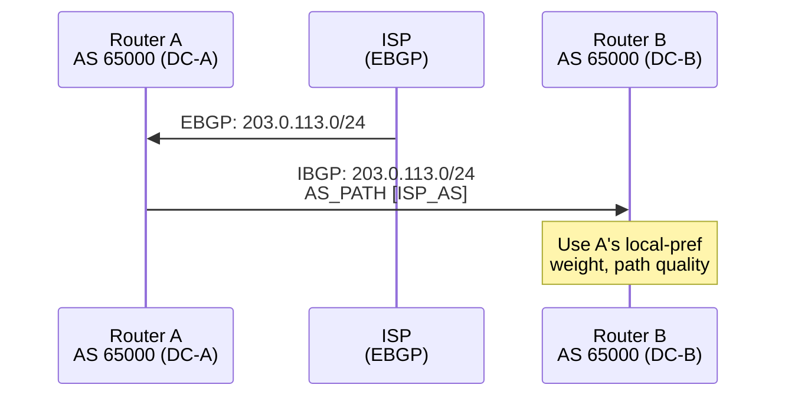
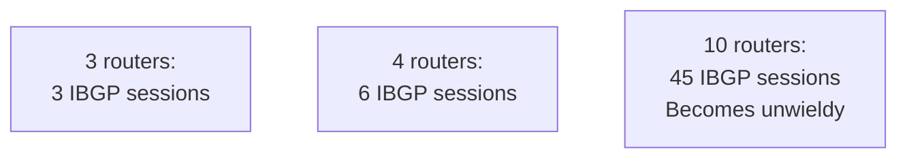
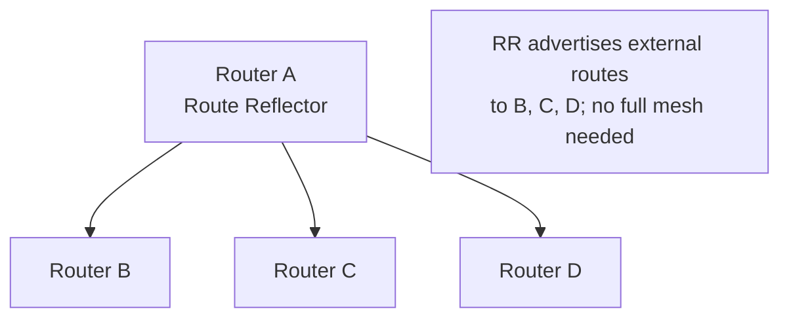
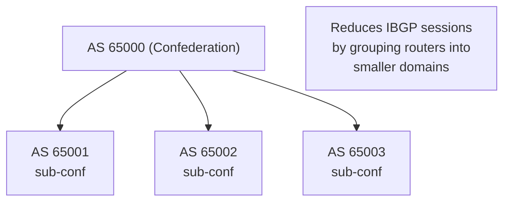

# BGP (Border Gateway Protocol)

Border Gateway Protocol is a path-vector exterior gateway protocol used for inter-autonomous system
(AS) routing. BGP exchanges full routing tables and path attributes (AS path, next-hop, local
preference, MED) to allow networks to make informed routing decisions based on policy and path
characteristics, not just shortest distance.

## Quick Reference

| Property | Value |
| --- | --- |
| **OSI Layer** | Network/Application (Layer 3-4) |
| **Transport** | TCP port 179 |
| **RFC** | RFC 4271 (BGPv4), RFC 4364 (MPLS VPN) |
| **Purpose** | Inter-AS routing; policy-based path selection |
| **Typical Use** | ISP-to-ISP, datacenter-to-cloud, enterprise edge |
| **Default Keepalive Interval** | 60 seconds |
| **Default Hold Time** | 180 seconds |

## Packet Structure

### BGP Message Format (TCP Stream)

All BGP messages start with a 19-byte header:



## Field Reference

| Field | Bytes | Purpose |
| --- | --- | --- |
| **Marker** | 16 | All 1s (0xFFFFFFFFFFFFFFFFFFFFFFFFFFFFFFFF); synchronization |
| **Length** | 2 | Total message length (header + payload), 19-65535 bytes |
| **Type** | 1 | Message type: 1=Open, 2=Update, 3=Notification, 4=Keepalive, 5=Route-Refresh |

## BGP Message Types

### 1. Open (Type 1)

Initiates BGP session; exchanges AS number, Router ID, capabilities.

```text
My AS: 65001
My Router ID: 10.0.0.1
Hold Time: 180 seconds
BGP Identifier: 10.0.0.1
Optional Parameters: Capabilities (MP-BGP, Route Refresh, 4-Byte ASN, etc.)
```

**Capabilities Advertisement (Optional Parameters):**

- MP-BGP: Multiprotocol (IPv6, VPN)
- 4-Byte ASN: Support for ASN > 65535
- Route Refresh: Dynamic route reannouncement without session restart

### 2. Update (Type 2)

Announces new routes or withdraws previously advertised routes.

```text
Withdrawn Routes (NLRI removal):
  - 10.1.0.0/16
  - 10.2.0.0/16

Path Attributes:
  - ORIGIN: IGP (learned internally) / EGP (from external) / INCOMPLETE
  - AS_PATH: [65001, 65002, 65003] (list of ASes route traversed)
  - NEXT_HOP: 192.0.2.1 (next-hop IP to reach this prefix)
  - LOCAL_PREF: 100 (local preference; higher = preferred within AS)
  - MULTI_EXIT_DISC (MED): 50 (metric for external comparison; lower = preferred)
  - COMMUNITIES: [65001:100] (grouping for policy)
  - EXTENDED COMMUNITIES: [RT:65001:100] (Route Target for VPN)

NLRI (Network Layer Reachability Information):
  - 10.3.0.0/24
  - 10.4.0.0/24
  (prefix length + prefix = route being advertised)
```

**Path Attributes Decision Process:**

1. **Weight** (Cisco only): 0-65535; highest wins (local device only)
1. **Local Preference** (IGP to EBGP): Higher wins (within AS)
1. **Shortest AS_PATH**: Fewer ASes wins (loop prevention + efficiency)
1. **ORIGIN**: IGP > EGP > INCOMPLETE
1. **MED** (MULTI_EXIT_DISC): Lower wins (inter-AS preference)
1. **EBGP vs IBGP**: EBGP preferred (true external)
1. **IGP Metric**: Lowest IGP cost to NEXT_HOP wins
1. **Router ID**: Lowest Router ID wins (tiebreaker)

### 3. Keepalive (Type 4)

Heartbeat; confirms session is alive. Sent every 60 seconds (default).

```text
No payload — just header.

If no keepalive or update received within Hold Time (180s), neighbor declared down.
```

### 4. Notification (Type 3)

Error notification; terminates session.

```text
Error Code: 1 (Message Header Error)
              2 (OPEN Message Error)
              3 (UPDATE Message Error)
              4 (Hold Timer Expired)
              5 (Finite State Machine Error)
              6 (Cease)

Subcode: Specific error (e.g., "Unsupported Capability")
Data: Optional diagnostic data
```

### 5. Route-Refresh (Type 5)

Requests peer to resend all routes (without session restart). Requires Route-Refresh capability.

```text
Address Family: IPv4 Unicast, IPv6 Unicast, VPN, etc.

Peer responds with all routes for that AFI/SAFI without teardown.
```

---

## BGP Session States

```mermaid
stateDiagram-v2
    [*] --> IDLE: Down; ready to connect

    IDLE --> CONNECT: TCP connect in progress

    CONNECT --> ACTIVE: Retrying connection

    ACTIVE --> OPENSENT: Send Open message

    OPENSENT: Sent Open<br/>waiting for peer Open

    OPENSENT --> OPENCONFIRM

    OPENCONFIRM: Awaiting<br/>Keepalive

    OPENCONFIRM --> ESTABLISHED

    ESTABLISHED: Full route exchange<br/>active
```



**ESTABLISHED:** Only state where routes are exchanged and traffic flows.

---

## BGP Session Types

### External BGP (EBGP)

Peers in different ASes; full routing table exchange; policy-driven.



### Internal BGP (IBGP)

Peers within same AS; distributes external routes; must be fully meshed or use route reflectors.



---

## Common BGP Attributes Table

| Attribute | Type | Usage | Example |
| --- | --- | --- | --- |
| **LOCAL_PREF** | Well-Known Mandatory | Prefer local paths within AS | 100 (higher = preferred) |
| **MED** | Optional | Prefer external paths to peer ASes | 50 (lower = preferred) |
| **AS_PATH** | Well-Known Mandatory | Prevent loops; prefer shorter paths | [65001, 65002] |
| **NEXT_HOP** | Well-Known Mandatory | Next-hop IP for route | 192.0.2.1 |
| **ORIGIN** | Well-Known Mandatory | Route origin (IGP/EGP/INCOMPLETE) | IGP |
| **COMMUNITIES** | Optional | Policy grouping (COLOR tagging) | 65001:100 |
| **EXTENDED COMMUNITIES** | Optional | VPN route targets, BGP Flowspec | RT:65001:100 |
| **WEIGHT** | Cisco only | Local preference (highest priority) | 100-500 |

---

## BGP Scalability & Design Patterns

### Full Mesh (Small Networks)

Every router peers with every other router (N routers = N*(N-1)/2 sessions).



### Route Reflector (Hierarchical)

One reflector; other routers peer with it (hub-and-spoke within AS).



### Confederation (Very Large Networks)

Divide AS into sub-ASes; reduces IBGP sessions further.



---

## Common BGP Issues

| Issue | Cause | Fix |
| --- | --- | --- |
| **Session not coming up** | TCP 179 blocked; AS/Router ID mismatch | Verify firewall; check `show bgp summary` |
| **Routes not advertised** | Network not in BGP table; no redistribute | Use `network` or `redistribute` commands |
| **Flapping routes** | Unstable adjacency; rapid updates | Check interface stability; use BFD |
| **Suboptimal routing** | LOCAL_PREF not set; MED ignored | Adjust attributes; verify policy |
| **Route loops** | Misconfigured AS_PATH prepending | Review AS_PATH filtering |

---

## References

- RFC 4271: A Border Gateway Protocol 4 (BGPv4)
- RFC 4364: BGP/MPLS IP Virtual Private Networks (L3 VPN)
- RFC 5668: 4-Byte AS Number Space

---

## Next Steps

- See [Routing Protocols Overview](../routing/index.md)
- Configure BGP: [Cisco BGP & iBGP Design](../cisco/cisco_bgp_ibgp.md), [FortiGate BGP](../fortigate/fortigate_bgp_config.md)
