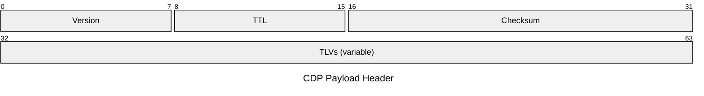
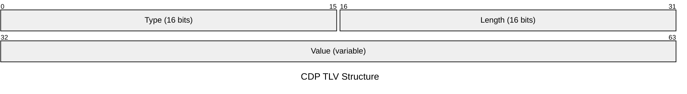

# CDP — Cisco Discovery Protocol

CDP (Cisco proprietary) allows Cisco devices to discover directly connected Cisco
neighbours. Like LLDP, CDP frames are sent to a multicast MAC (`01:00:0C:CC:CC:CC`)
and are never forwarded by bridges. CDP predates LLDP and is enabled by default on
all Cisco IOS, IOS-XE, and NX-OS devices. The vendor-neutral equivalent is LLDP.

## Quick Reference

| Property | Value |
| --- | --- |
| **OSI Layer** | Layer 2 — Data Link |
| **Standard** | Cisco proprietary |
| **Wireshark Filter** | `cdp` |
| **Encapsulation** | IEEE 802.3 with LLC/SNAP (`SNAP OUI 00:00:0C`, Protocol ID `0x2000`) |
| **Destination MAC** | `01:00:0C:CC:CC:CC` (CDP/VTP multicast, not forwarded by bridges) |
| **Current Version** | CDPv2 |
| **Default TX Interval** | 60 seconds |
| **Default Hold Time** | 180 seconds |

## Frame Structure

CDP uses SNAP encapsulation over IEEE 802.3. After the Ethernet 802.3 + LLC + SNAP
headers, the CDP payload begins:



| Field | Bytes | Description |
| --- | --- | --- |
| **Version** | 1 | CDP version. `1` = CDPv1, `2` = CDPv2. |
| **TTL** | 1 | Time in seconds before the receiver discards this entry. Default `180`. |
| **Checksum** | 2 | One's complement checksum of the entire CDP message. |
| **TLVs** | variable | Sequence of Type-Length-Value fields carrying device information. |

## TLV Structure



The Length field includes the 4-byte Type and Length fields themselves.

## TLV Reference

| Type | Name | Description |
| --- | --- | --- |
| `0x0001` | Device ID | Hostname or MAC address of the sending device. |
| `0x0002` | Addresses | Layer 3 addresses of the device. Supports IPv4 and IPv6. Multiple addresses may be listed. |
| `0x0003` | Port ID | Name of the interface sending this CDP frame (e.g. `GigabitEthernet1/0/1`). |
| `0x0004` | Capabilities | 32-bit bitmask of device roles: `0x01` Router, `0x02` Transparent Bridge, `0x04` Source Route Bridge, `0x08` Switch, `0x10` Host, `0x20` IGMP, `0x40` Repeater. |
| `0x0005` | Software Version | IOS/NX-OS version string. |
| `0x0006` | Platform | Hardware model string (e.g. `cisco WS-C3850-48P`). |
| `0x0007` | IP Prefix/Gateway | IP prefix/length pairs for the device's interfaces. |
| `0x000A` | Native VLAN | Native VLAN ID of the sending port. CDPv2 only. Used to detect VLAN mismatches. |
| `0x000B` | Duplex | `0x01` = Full duplex, `0x00` = Half duplex. CDPv2 only. Used to detect duplex mismatches. |
| `0x0016` | VoIP VLAN Reply | Voice VLAN ID advertised to IP phones. |
| `0x001A` | Power Available | PoE power available and consumed, used for Cisco Power Negotiation (CDP-PoE). |

## Cisco IOS-XE Configuration

```ios

! Disable CDP globally
no cdp run

! Re-enable CDP globally
cdp run

! Disable CDP on a specific interface (e.g. uplink to ISP)
interface GigabitEthernet0/0
 no cdp enable

! Tune timers
cdp timer 60
cdp holdtime 180
```

Verification:

```ios

show cdp neighbors
show cdp neighbors detail
show cdp interface GigabitEthernet1/0/1
show cdp entry *
```

## Notes

- **Enabled by default:** CDP is active on all interfaces of Cisco IOS, IOS-XE, and
  NX-OS devices by default. This includes uplinks to service providers and customer-
  facing ports where it should typically be disabled.

- **Security:** CDP advertises the IOS version, hardware platform, IP addresses, and
  interface names to any directly connected device. Disable CDP on all externally
  facing interfaces and untrusted segments with `no cdp enable` per interface.

- **CDPv2 enhancements:** CDPv2 adds native VLAN (Type `0x000A`) and duplex (Type
  `0x000B`) TLVs. When a mismatch is detected, IOS logs a warning:
  `%CDP-4-NATIVE_VLAN_MISMATCH` or `%CDP-4-DUPLEX_MISMATCH`. These are a valuable
  first-line diagnostic for connectivity issues.

- **PoE negotiation:** Cisco IP phones use CDP to negotiate PoE power class with the
  switch, advertising requested wattage via the Power Available TLV. This is separate
  from IEEE 802.3af/at/bt hardware negotiation.

- **LLDP vs CDP:** LLDP (IEEE 802.1AB) is vendor-neutral and works across multi-vendor
  environments. CDP works only between Cisco devices but provides richer Cisco-specific
  details (Voice VLAN, PoE allocation, native VLAN, platform string). Both protocols
  can run simultaneously on IOS-XE interfaces.

- **Comparison with LLDP:** See [LLDP](lldp.md).
