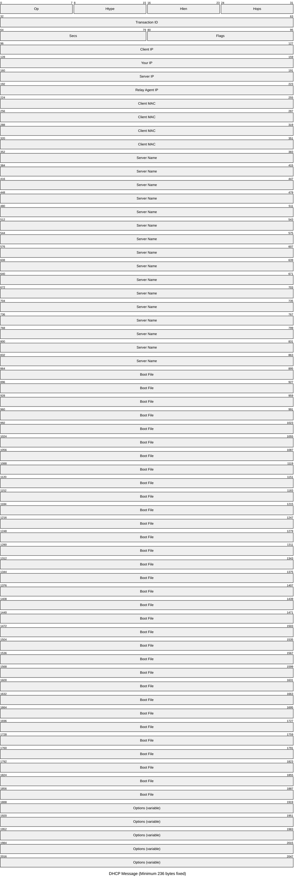
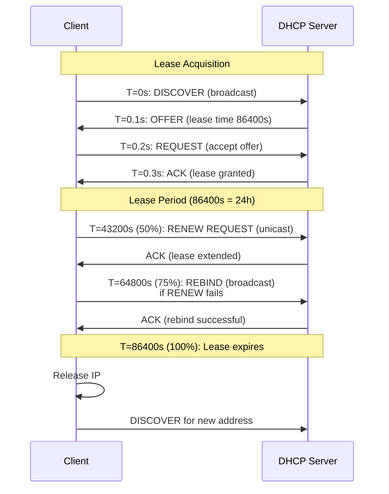

# DHCP (Dynamic Host Configuration Protocol)

Dynamic Host Configuration Protocol automatically assigns IP addresses and network configuration
parameters (gateway, DNS servers, lease duration) to client hosts. DHCP reduces manual
configuration effort and provides centralized IP address management, making it essential for
enterprise and service provider networks.

## Quick Reference

| Property | Value |
| --- | --- |
| **OSI Layer** | Application (Layer 7) |
| **Transport** | UDP port 67 (server), UDP port 68 (client) |
| **RFC** | RFC 2131 (DHCPv4), RFC 3315 (DHCPv6) |
| **Purpose** | Automatic IP assignment; network configuration distribution |
| **Typical Lease Duration** | 24 hours (enterprise); shorter for mobile |
| **Common Use Cases** | Desktops, printers, IoT devices, cloud instances |

## Packet Structure



## Field Reference

| Field | Bytes | Purpose |
| --- | --- | --- |
| **Op** | 1 | Operation: 1=Request, 2=Reply |
| **Htype** | 1 | Hardware type: 1=Ethernet, 6=Token Ring |
| **Hlen** | 1 | Hardware address length (6 for MAC) |
| **Hops** | 1 | Relay agent hop count (incremented each hop) |
| **Transaction ID** | 4 | Unique ID matching request/reply |
| **Secs** | 2 | Seconds elapsed since client started acquisition |
| **Flags** | 2 | Bit 15: Broadcast flag (1=broadcast response, 0=unicast) |
| **Client IP** | 4 | Client's IP (0.0.0.0 if unassigned) |
| **Your IP** | 4 | IP address offered/assigned to client |
| **Server IP** | 4 | DHCP server IP address |
| **Relay Agent IP** | 4 | IP of relay agent (if hopping) |
| **Client MAC** | 16 | Client hardware address (typically 6 bytes of MAC) |
| **Server Name** | 64 | DHCP server hostname (optional) |
| **Boot File** | 128 | Boot file name (PXE, TFTP info) |
| **Options** | Variable | DHCP options (subnet mask, gateway, DNS, lease time, etc.) |

## DHCP Message Types (Options)

DHCP option 53 specifies the message type:

### 1. DISCOVER (Type 1)

Client broadcasts: "Is there a DHCP server?"

```text
Client sends DHCP DISCOVER to 255.255.255.255 (broadcast):
  Op: 1 (Request)
  Transaction ID: 0x12345678
  Client MAC: 00:11:22:33:44:55
  Options:

    - Option 53: DHCPDISCOVER
    - Option 55: Parameter Request List (subnet mask, router, DNS, etc.)
```

### 2. OFFER (Type 2)

Server responds: "I have an IP for you."

```text
Server sends DHCP OFFER (unicast or broadcast per flags):
  Op: 2 (Reply)
  Your IP: 10.1.1.100
  Server IP: 10.1.1.1
  Options:

    - Option 53: DHCPOFFER
    - Option 1: Subnet Mask (255.255.255.0)
    - Option 3: Router (10.1.1.1)
    - Option 6: DNS (8.8.8.8, 8.8.4.4)
    - Option 51: Lease Time (86400 = 24 hours)
```

### 3. REQUEST (Type 3)

Client responds: "I accept the IP from offer."

```text
Client sends DHCP REQUEST to 255.255.255.255:
  Op: 1 (Request)
  Transaction ID: 0x12345678 (matches DISCOVER/OFFER)
  Client MAC: 00:11:22:33:44:55
  Options:

    - Option 53: DHCPREQUEST
    - Option 50: Requested IP Address (10.1.1.100)
    - Option 54: Server Identifier (10.1.1.1)
```

### 4. ACK (Type 5)

Server confirms: "Assignment confirmed; here's your lease."

```text
Server sends DHCP ACK:
  Op: 2 (Reply)
  Your IP: 10.1.1.100
  Options:

    - Option 53: DHCPACK
    - Option 1: Subnet Mask
    - Option 3: Router
    - Option 6: DNS Servers
    - Option 51: Lease Time (3600 to 86400s)
```

### 5. NAK (Type 6)

Server denies: "Can't assign that IP (already in use or out of scope)."

```text
Server sends DHCP NAK:
  Op: 2 (Reply)
  Options:

    - Option 53: DHCPNAK
    - Option 56: Message (reason for denial)
```

### 6. DECLINE (Type 4)

Client rejects: "That IP is already in use; offer another."

```text
Client sends DHCP DECLINE:
  Op: 1 (Request)
  Options:

    - Option 53: DHCPDECLINE
    - Option 50: Declined IP Address
    - Option 54: Server Identifier
```

### 7. RELEASE (Type 7)

Client surrenders: "I'm done with this IP; it's available for reuse."

```text
Client sends DHCP RELEASE:
  Op: 1 (Request)
  Your IP: 10.1.1.100 (being released)
  Options:

    - Option 53: DHCPRELEASE
    - Option 54: Server Identifier
```

### 8. INFORM (Type 8)

Client with existing IP requests: "Give me rest of config (not IP)."

```text
Client sends DHCP INFORM:
  Client IP: 10.1.1.100 (already assigned)
  Options:

    - Option 53: DHCPINFORM
    - Option 55: Parameter Request List (DNS, NTP, etc.)

Server responds with DHCP ACK (IP not assigned, just other parameters).
```

---

## DHCP Lease Acquisition & Renewal



---

## DHCP Options (Common)

| Option | Number | Purpose | Example |
| --- | --- | --- | --- |
| **Subnet Mask** | 1 | Network mask | 255.255.255.0 |
| **Router** | 3 | Default gateway | 10.1.1.1 |
| **DNS Servers** | 6 | Recursive resolvers | 8.8.8.8, 8.8.4.4 |
| **Domain Name** | 15 | Domain suffix | example.com |
| **Lease Time** | 51 | Validity duration (seconds) | 86400 (24h) |
| **Server Identifier** | 54 | DHCP server IP | 10.1.1.1 |
| **Requested IP** | 50 | Client preference | 10.1.1.100 |
| **Message Type** | 53 | DHCP message type | 1-8 (DISCOVER-INFORM) |
| **NTP Servers** | 42 | Time sync servers | 129.6.15.28 |
| **TFTP Server** | 66 | Boot file source (PXE) | 10.1.1.10 |
| **WPAD** | 252 | Web Proxy Auto-Discovery | <http://proxy.example.com/wpad.dat> |

---

## DHCP Relay and DHCP Helper

**DHCP Relay** forwards DHCP packets between subnets:

```text
Client on Subnet 1 (10.1.1.0/24)
    |
    | DHCP DISCOVER (broadcast on local segment)
    |
Router (DHCP Relay)
    |
    | DHCP DISCOVER (forwarded unicast to 10.0.0.1 - DHCP server)
    | Hops incremented; Relay Agent IP set to 10.1.1.1
    |
DHCP Server on Subnet 0 (10.0.0.0/24)
    |
    | DHCP OFFER / ACK (unicast to relay, relay forwards to client)
```

**DHCP Helper** (on router interface): `ip helper-address 10.0.0.1`

---

## Common DHCP Issues

| Issue | Cause | Fix |
| --- | --- | --- |
| **No IP assigned** | DHCP server down; relay misconfigured | Verify server reachability; check DHCP pool |
| **DHCP timeout** | UDP 67/68 blocked; relay not configured | Verify firewall; configure DHCP helper |
| **Duplicate IP** | DHCP pool misconfigured; static + DHCP overlap | Exclude static IPs from DHCP pool |
| **Frequent lease renewal** | Lease time too short; client clock skew | Increase lease duration; check client time |
| **Slow address acquisition** | Multiple servers responding; network congestion | Verify single DHCP server; check load |

---

## DHCPv6 (IPv6)

DHCPv6 operates similarly to DHCPv4 but uses:

- **UDP ports:** 546 (client), 547 (server)
- **Multicast:** ff02::1:2 (all DHCP servers) instead of broadcast
- **Message Types:** SOLICIT, ADVERTISE, REQUEST, REPLY, RENEW, REBIND
- **Modes:**
  - **Stateful:** Server assigns address (like DHCPv4)
  - **Stateless:** Server provides only configuration; prefix from RA (Router Advertisement)

---

## References

- RFC 2131: Dynamic Host Configuration Protocol (DHCPv4)
- RFC 3315: Dynamic Host Configuration Protocol for IPv6 (DHCPv6)
- RFC 3046: DHCP Relay Agent Information Option
- RFC 2939: Procedures and IANA Considerations for Definition of New DHCP Options and Message Types

---

## Next Steps

- Review [Application Protocols Overview](../application/index.md)
- See [DHCP Application Protocol Guide](../application/dhcp.md)
- Configure DHCP Snooping: [Cisco DHCP Snooping & DAI](../cisco/cisco_dhcp_snooping.md)
