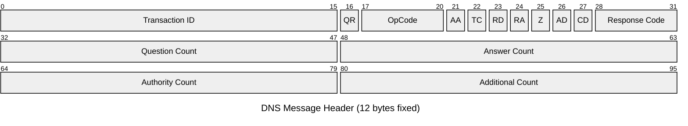
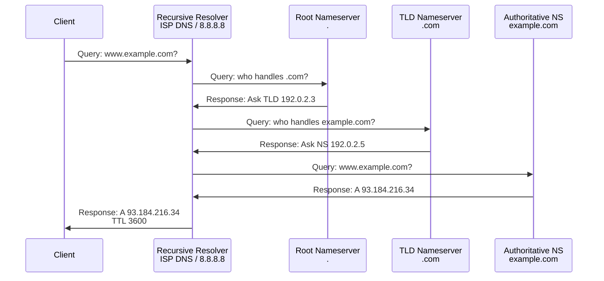

# DNS (Domain Name System)

Domain Name System is the application-layer protocol used for hostname-to-IP address resolution.
DNS operates on a distributed hierarchical database; client queries are recursively resolved
through root nameservers, TLD servers, and authoritative nameservers. Critical for almost all
internet-based applications.

## Quick Reference

| Property | Value |
| --- | --- |
| **OSI Layer** | Application (Layer 7) |
| **Transport** | UDP port 53 (queries), TCP port 53 (zone transfers) |
| **RFC** | RFC 1035 (DNS), RFC 4034 (DNSSEC) |
| **Purpose** | Hostname to IP translation; service discovery; mail routing |
| **Message Types** | Query (QR=0), Response (QR=1) |
| **Common Use Cases** | Web browsing, email, load balancing, cloud infrastructure |

## Packet Structure

All DNS messages (query and response) share the same header and structure:



## Field Reference

| Field | Bits | Purpose |
| --- | --- | --- |
| **Transaction ID** | 16 | Query/response identifier; used to match query to response |
| **QR (Query Response)** | 1 | 0=Query, 1=Response |
| **OpCode** | 4 | 0=Standard Query, 1=Inverse, 2=Status, 4=Notify |
| **AA (Authoritative Answer)** | 1 | 1=Response from authoritative nameserver |
| **TC (Truncation)** | 1 | 1=Message truncated (retry with TCP) |
| **RD (Recursion Desired)** | 1 | 1=Client requests recursive resolution |
| **RA (Recursion Available)** | 1 | 1=Server supports recursion |
| **Z (Zero/Reserved)** | 1 | Reserved (must be 0) |
| **AD (Authenticated Data)** | 1 | 1=Data authenticated via DNSSEC |
| **CD (Checking Disabled)** | 1 | 1=Client wants DNSSEC validation disabled |
| **Response Code** | 4 | 0=NOERROR, 1=FORMERR, 2=SERVFAIL, 3=NXDOMAIN, 4=NOTIMP, 5=REFUSED |
| **Question Count** | 16 | Number of entries in question section |
| **Answer Count** | 16 | Number of resource records (RRs) in answer section |
| **Authority Count** | 16 | Number of NS records pointing to authority |
| **Additional Count** | 16 | Number of RRs in additional section |

## DNS Query and Resolution

### Query Section

```text
QUESTION:
  Name: www.example.com
  Type: A (1) — IPv4 address
  Class: IN (1) — Internet
```

**Common Query Types:**

| Type | Number | Meaning |
| --- | --- | --- |
| **A** | 1 | IPv4 address |
| **AAAA** | 28 | IPv6 address |
| **CNAME** | 5 | Canonical name (alias) |
| **MX** | 15 | Mail exchanger |
| **NS** | 2 | Nameserver |
| **TXT** | 16 | Text record (SPF, DKIM, etc.) |
| **SOA** | 6 | Start of Authority (zone metadata) |
| **PTR** | 12 | Pointer (reverse DNS) |
| **SRV** | 33 | Service (e.g., _ldap._tcp.example.com) |
| **CAA** | 257 | Certification Authority Authorization |

### Answer Section

```text
ANSWER:
  Name: www.example.com
  Type: A
  Class: IN
  TTL: 3600 (seconds)
  RData: 93.184.216.34 (IPv4 address)
```

---

## DNS Resolution Process (Recursive)



---

## DNS Caching and TTL

**Time-To-Live (TTL):** Controls how long a record is cached.

- **High TTL (86400s = 1 day):** Reduces query load; slower propagation on changes
- **Low TTL (300s = 5 min):** Fast failover; higher resolver load
- **Very Low TTL (0s):** No caching; queries on every access (impact on performance)

**Cache Hierarchy:**

1. Client cache (OS)
2. Recursive resolver cache (ISP/Google/Cloudflare)
3. Authoritative nameserver (ground truth)

---

## DNS Record Types Details

### A and AAAA Records

```text
example.com.  3600  IN  A     93.184.216.34
example.com.  3600  IN  AAAA  2606:2800:220:1:248:1893:25c8:1946
```

### MX Records (Mail Exchange)

Priority-based routing for email.

```text
example.com.  3600  IN  MX  10  mail.example.com.
example.com.  3600  IN  MX  20  mail2.example.com.

(Lower priority number = preferred; 10 < 20)
```

### CNAME Records (Alias)

Alias to another domain.

```text
www.example.com.  3600  IN  CNAME  example.com.

(www.example.com points to example.com)
```

### NS Records (Delegation)

Points to nameserver for zone.

```text
example.com.  3600  IN  NS  ns1.example.com.
example.com.  3600  IN  NS  ns2.example.com.
```

### SOA Record (Zone Authority)

Defines zone parameters.

```text
example.com.  3600  IN  SOA  ns1.example.com.  admin.example.com.
  2024042101  (Serial)
  3600        (Refresh: when secondaries check for updates)
  1800        (Retry: if refresh fails, retry in 30 min)
  604800      (Expire: secondaries expire zone data after 7 days)
  86400       (Minimum TTL for negative caching)
```

### TXT Records (Text / DKIM / SPF)

```text
example.com.  3600  IN  TXT  "v=spf1 mx -all"
_dmarc.example.com.  3600  IN  TXT  "v=DMARC1; p=reject; rua=mailto:..."
default._domainkey.example.com.  TXT  "v=DKIM1; k=rsa; p=MIGfMA0...;"
```

---

## DNS Reverse Lookup (PTR Records)

Converts IP address back to hostname (reverse DNS).

```text
Query: 34.216.184.93.in-addr.arpa (reversed with .in-addr.arpa suffix)

Response: PTR  example.com

(Used for mail server verification, logging, etc.)
```

---

## Common DNS Issues

| Issue | Cause | Fix |
| --- | --- | --- |
| **NXDOMAIN (3)** | Domain doesn't exist | Check domain spelling; verify authoritative NS |
| **SERVFAIL (2)** | Authoritative server error | Check nameserver availability; verify zone file |
| **Timeout / No Response** | Resolver unreachable; firewall blocks UDP 53 | Check resolver IP; verify firewall allows port 53 |
| **TTL too high** | Cached stale record after change | Lower TTL before making DNS changes |
| **Slow resolution** | Many hops (root → TLD → auth); caching issues | Verify resolver performance; check authoritative NS |

---

## DNSSEC (DNS Security)

Adds cryptographic authentication to DNS responses.

```text
Query with DNSSEC:
  Client sets AD (Authenticated Data) bit
  Resolver validates chain: Root DNSKEY → TLD DNSKEY → Zone DNSKEY → RRSig
  Returns AD bit = 1 if valid; CD bit = 1 if invalid (rejected)
```

---

## References

- RFC 1035: Domain Names - Implementation and Specification
- RFC 1034: Domain Names - Concepts and Facilities
- RFC 4034: DNSSEC Resource Records
- RFC 5782: DNSSEC Lookaside Validation (DLVZ)

---

## Next Steps

- Review [Application Protocols Overview](../application/index.md)
- See [DNS Application Protocol Guide](../application/dns.md)
