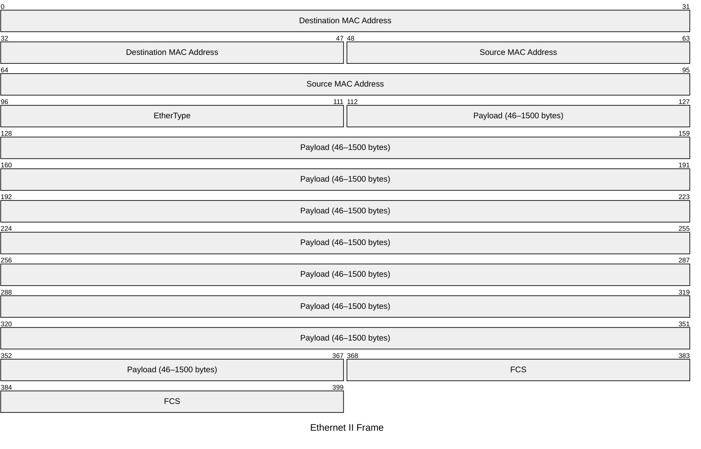

# Ethernet II Frame

An Ethernet II frame is the standard Layer 2 encapsulation used on modern networks.
It carries an upper-layer payload (IPv4, IPv6, ARP, etc.) identified by the EtherType
field. The frame is bounded by a preamble and Start Frame Delimiter at the physical
layer (not shown) and terminated by a Frame Check Sequence.

## Quick Reference

| Property | Value |
| --- | --- |
| **OSI Layer** | Layer 2 — Data Link |
| **TCP/IP Layer** | Network Access (Link) |
| **Standard** | IEEE 802.3 |
| **Wireshark Filter** | `eth` |
| **EtherType** | N/A — this is the frame itself |

## Frame Structure

## Field Reference

| Field | Size | Description |
| --- | --- | --- |
| **Destination MAC** | 48 bits (6 bytes) | MAC address of the intended recipient. `FF:FF:FF:FF:FF:FF` is the broadcast address. |
| **Source MAC** | 48 bits (6 bytes) | MAC address of the sending interface. |
| **EtherType** | 16 bits (2 bytes) | Identifies the encapsulated protocol. Common values: `0x0800` IPv4, `0x86DD` IPv6, `0x0806` ARP, `0x8100` 802.1Q VLAN. |
| **Payload** | 368–12000 bits (46–1500 bytes) | Upper-layer data. Minimum 46 bytes ensures the frame is long enough for collision detection. Maximum 1500 bytes is the standard MTU. |
| **FCS** | 32 bits (4 bytes) | Frame Check Sequence. A CRC-32 checksum computed over the entire frame (excluding preamble and FCS itself). Frames with an invalid FCS are silently discarded. |

## Notes

- **802.1Q VLAN tagging** inserts a 4-byte tag between the Source MAC and EtherType
  fields, pushing the EtherType to offset 128 bits.

- **Jumbo frames** extend the maximum payload to 9000 bytes on supported hardware.
- The **preamble** (7 bytes) and **SFD** (1 byte) are prepended at the physical layer
  and are not visible to the MAC sublayer.
