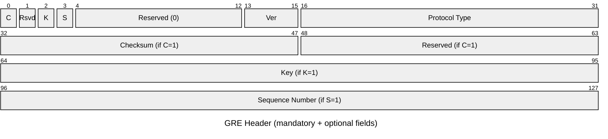

# GRE — Generic Routing Encapsulation

GRE (RFC 2784, updated by RFC 2890) encapsulates one network layer protocol inside
another. The outer IP header carries GRE as IP protocol 47; the GRE header's Protocol
Type field identifies the encapsulated payload. Widely used for VPN tunnels, DMVPN,
and protocol tunnelling (e.g. IPv6-over-IPv4, OSPF over a non-broadcast medium).

## Quick Reference

| Property | Value |
| --- | --- |
| **OSI Layer** | Layer 3 — Network (encapsulation) |
| **RFC** | RFC 2784, RFC 2890 |
| **Wireshark Filter** | `gre` |
| **IP Protocol** | `47` |
| **Min Header Size** | 4 bytes (no optional fields) |
| **Max Header Size** | 16 bytes (all optional fields present) |

## Header Structure

The mandatory GRE header is 4 bytes. Optional fields are present only when the
corresponding flag bits are set.



## Field Reference

| Field | Bits | Description |
| --- | --- | --- |
| **C (Checksum Present)** | 1 | `1` = Checksum and Reserved fields follow the mandatory fields. Checksum covers the GRE header and payload. Rarely used in practice. |
| **Reserved** | 1 | Must be `0`. |
| **K (Key Present)** | 1 | `1` = Key field is present. Used to identify a tunnel instance. NHRP in DMVPN uses this field to distinguish spoke-to-spoke flows. |
| **S (Sequence Present)** | 1 | `1` = Sequence Number field is present. Used for reordering. Rarely enabled. |
| **Reserved** | 9 | Must be `0`. |
| **Ver** | 3 | GRE version. Always `0` for standard GRE. Value `1` is used by PPTP (RFC 2637), a distinct variant. |
| **Protocol Type** | 16 | EtherType of the encapsulated payload. Common values: `0x0800` IPv4, `0x86DD` IPv6, `0x0806` ARP. |
| **Checksum** | 16 | One's complement checksum of the GRE header and payload. Present only when C=1. |
| **Reserved** | 16 | Must be `0`. Present only when C=1. |
| **Key** | 32 | Tunnel identifier. Present only when K=1. |
| **Sequence Number** | 32 | Packet sequence number. Present only when S=1. |

## Cisco IOS Configuration

```ios

interface Tunnel0
 tunnel mode gre ip
 tunnel source GigabitEthernet0/0
 tunnel destination 203.0.113.1
 ip mtu 1476
 ip tcp adjust-mss 1436
 keepalive 10 3
```

## Notes

- **Overhead and MTU:** GRE adds at minimum a 4-byte header on top of a 20-byte outer
  IP header — 24 bytes total. On a 1500-byte MTU path, the effective inner payload MTU
  is 1476 bytes. Always configure `ip mtu` and `ip tcp adjust-mss` on GRE tunnel
  interfaces to prevent fragmentation.

- **No encryption:** GRE provides encapsulation only — no confidentiality, integrity,
  or authentication. IPsec is typically layered on top. GRE-over-IPsec (GRE tunnel
  protected by an IPsec tunnel) is the most common pattern; IPsec transport mode with
  GRE is another variant.

- **DMVPN:** Dynamic Multipoint VPN uses mGRE (multipoint GRE) — a single tunnel
  interface accepts connections from multiple spoke endpoints, each identified by the
  Key field in conjunction with NHRP (Next Hop Resolution Protocol, RFC 2332).

- **GRE keepalives:** Cisco IOS keepalives (`keepalive <interval> <retries>`) work by
  sending a GRE-encapsulated packet addressed back to the tunnel source. If the far end
  does not echo the packet, the tunnel interface is brought down after the retry count
  is exhausted.

- **PPTP distinction:** RFC 2637 defines an Enhanced GRE header (Ver=1) used by
  Point-to-Point Tunnelling Protocol. PPTP GRE is not compatible with standard GRE and
  should not be confused with RFC 2784 GRE.

- **Recursive routing:** A common misconfiguration is routing the GRE tunnel destination
  via the tunnel interface itself, causing a recursive loop. Always ensure the tunnel
  destination is reachable via a non-tunnel route, typically the physical interface or
  a specific static route.
