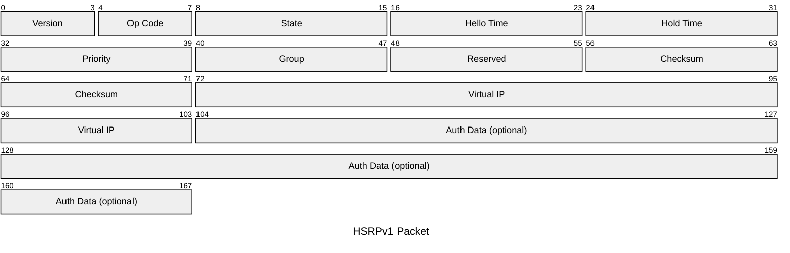
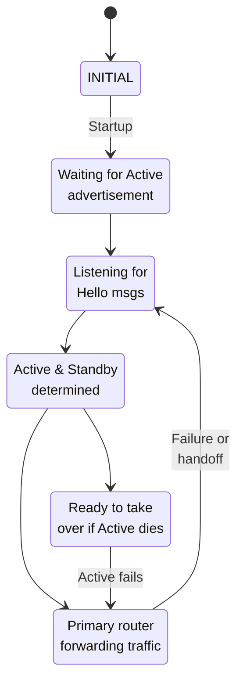
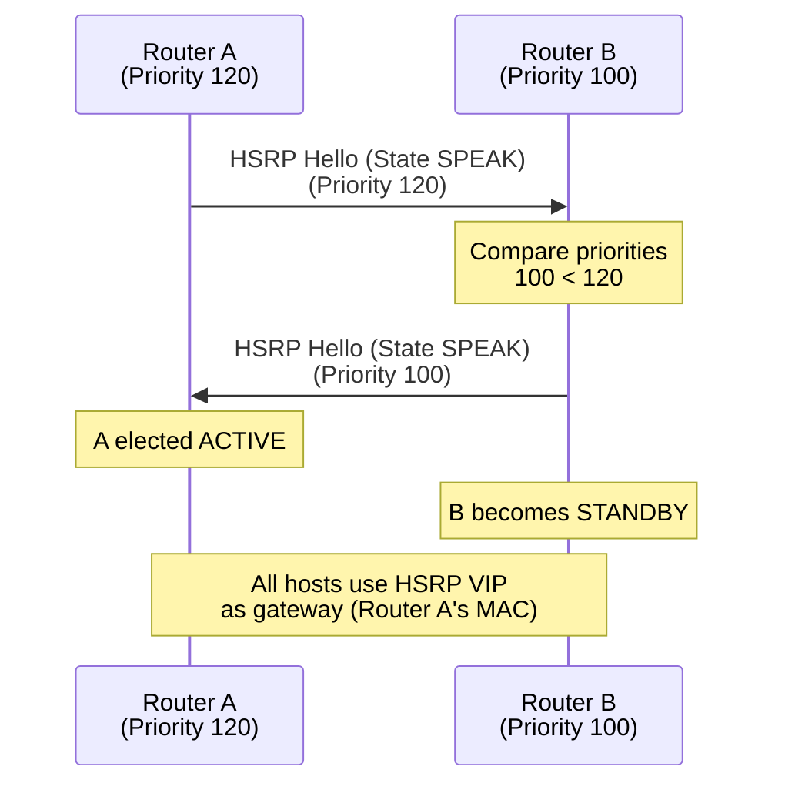

# HSRP (Hot Standby Router Protocol)

Hot Standby Router Protocol is Cisco's proprietary gateway redundancy protocol. HSRP elects a
standby router that takes over if the active (primary) router fails, providing transparent failover
for hosts using a virtual IP address.

## Quick Reference

| Property | Value |
| --- | --- |
| **OSI Layer** | Network (Layer 3) |
| **Transport** | UDP port 1985 |
| **RFC** | RFC 2281 (HSRPv1), RFC 3768 (HSRPv2) |
| **Destination IP** | 224.0.0.2 (all routers) |
| **Purpose** | Gateway redundancy and failover (Cisco proprietary) |
| **Default Hello Interval** | 3 seconds |
| **Default Hold Time** | 10 seconds |

## Packet Structure

### HSRPv1 Packet Format (UDP Port 1985)



## Field Reference

| Field | Bits | Purpose |
| --- | --- | --- |
| **Version** | 4 | HSRP version (1 for HSRPv1, 2 for HSRPv2) |
| **Op Code** | 4 | 0=Hello, 1=Coup, 2=Resign |
| **State** | 8 | 0=Initial, 1=Learn, 2=Listen, 4=Speak, 8=Standby, 16=Active |
| **Hello Time** | 8 | Advertisement interval (seconds) |
| **Hold Time** | 8 | How long to wait for Hello before failover (seconds) |
| **Priority** | 8 | Election priority: 0-255; higher=preferred |
| **Group** | 8 | Group number (1-255); identifies HSRP group |
| **Reserved** | 8 | Unused |
| **Checksum** | 16 | HSRP message checksum |
| **Virtual IP** | 32 | The shared gateway IP address |
| **Authentication** | 64 | Optional MD5 or plaintext password |

---

## HSRP States



## HSRP Election Process



## HSRP Priority and Preemption

### Priority

| Priority | Role | Notes |
| --- | --- | --- |
| **255** | Not usable | Reserved |
| **200-254** | Primary (Active) | Will win election |
| **100-199** | Secondary (Standby) | Backup router |
| **1-99** | Tertiary/Low | Rarely used |
| **0** | Disabled | Router doesn't participate |

### Preemption

**Enabled (default in most configs):**

- If Active router fails and recovers, it reclaims ACTIVE role (higher priority)
- Fast failback; preferred if failover is brief

**Disabled:**

- If Active fails, Standby takes over and keeps ACTIVE role
- Avoids flapping if Active is unstable

```mermaid
graph TD
    subgraph PreemptEnabled["Scenario: Preemption ENABLED"]
        E1["T=0s: A(120) ACTIVE, B(100) STANDBY"]
        E2["T=1s: A fails"]
        E3["T=10s: B becomes ACTIVE"]
        E4["T=5m: A recovers"]
        E5["T=5m1s: A sends COUP<br/>A becomes ACTIVE, B becomes STANDBY"]
    end

    subgraph PreemptDisabled["Scenario: Preemption DISABLED"]
        D1["T=0s: A(120) ACTIVE, B(100) STANDBY"]
        D2["T=1s: A fails"]
        D3["T=10s: B becomes ACTIVE"]
        D4["T=5m: A recovers"]
        D5["T=5m1s: A becomes STANDBY<br/>B stays ACTIVE"]
    end

    E1 --> E2 --> E3 --> E4 --> E5
    D1 --> D2 --> D3 --> D4 --> D5
```



## HSRP Timers

| Timer | Default | Meaning |
| --- | --- | --- |
| **Hello Interval** | 3 seconds | Active sends HSRP hello every 3s |
| **Hold Time** | 10 seconds | Standby waits 10s for Hello before assuming Active failed |
| **Default Hold Time** | 3 × Hello | If not specified, Hold Time = 3 × Hello Interval |

**Fast failover option:**

```text
Hello: 1 second, Hold Time: 3 seconds → ~3 second failover
Hello: 100ms, Hold Time: 300ms → sub-second failover (Cisco IOS 12.3+)
```

## HSRP Virtual MAC Address

Virtual MAC automatically generated from group number:

```text
HSRP MAC: 00:00:0C:07:AC:gg

Where gg = group number in hex

Example: Group 10
MAC: 00:00:0C:07:AC:0A

All routers in group use same MAC address.
Active router "owns" the MAC (responds to ARP requests).
Standby ignores ARP for HSRP VIP.
```

## HSRP Messages

| Message | Op Code | Meaning |
| --- | --- | --- |
| **Hello** | 0 | Periodic advertisement; "I'm active (or standby)" |
| **Coup** | 1 | Takeover announcement; "I'm taking over (higher priority)" |
| **Resign** | 2 | Graceful shutdown; "I'm stopping; next router take over" |

**Coup:** Sent when a higher-priority Standby router wants to take over.

**Resign:** Sent when Active intentionally stops participating (shutdown, config
change, etc.); Standby assumes Active role immediately without waiting for Hold
Time.

---

## HSRPv1 vs HSRPv2

| Feature | v1 | v2 |
| --- | --- | --- |
| **Groups supported** | 1-256 | 0-4095 (per interface) |
| **VIP format** | Single IPv4 | Multiple IPv4/IPv6 per group |
| **Transport** | UDP 1985 | UDP 1985 (similar) |
| **Authentication** | Plaintext/MD5 | Plaintext/MD5/SHA |
| **Multicast** | 224.0.0.2 | 224.0.0.102 (v2-specific) |

## Notes & Common Issues

| Issue | Cause | Fix |
| --- | --- | --- |
| **Both routers ACTIVE** | Different group numbers; different HSRP groups | Verify group number matches |
| **Slow failover** | Hold Time too long | Reduce Hello/Hold timers |
| **Rapid state changes** | Flapping Active router; priority conflicts | Stabilize router; check link quality |
| **HSRP VIP unreachable** | HSRP not enabled; MAC not owned by Active | Verify HSRP running and Active elected |

## References

- RFC 2281: Cisco Hot Standby Router Protocol (HSRPv1)
- Cisco IOS documentation: HSRP, HSRPv2

## Next Steps

- See [HSRP vs VRRP Theory](../theory/hsrp_vs_vrrp.md) comparison
- Configure HSRP: [Cisco HSRP & VRRP](../cisco/cisco_hsrp_vrrp.md)
