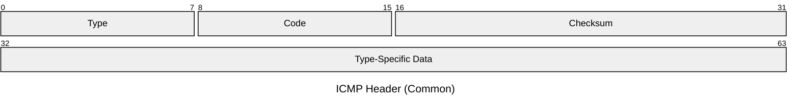

# ICMP

The Internet Control Message Protocol carries diagnostic and error messages for IP
networks. ICMP is encapsulated directly in IP (protocol 1) and operates alongside the
network layer — it is not a transport protocol. It is used for reachability testing,
error reporting, and path discovery.

## Quick Reference

| Property | Value |
| --- | --- |
| **OSI Layer** | Layer 3 — Network |
| **TCP/IP Layer** | Internet |
| **RFC** | RFC 792 |
| **Wireshark Filter** | `icmp` |
| **IP Protocol** | `1` |

## Header Structure

All ICMP messages share a common 8-byte header. The first 4 bytes are fixed; the
remaining 4 bytes are type-specific.

## Field Reference

| Field | Bits | Description |
| --- | --- | --- |
| **Type** | 8 | Identifies the ICMP message class. See common types below. |
| **Code** | 8 | Sub-type within the message class. Provides additional detail (e.g. reason for unreachability). |
| **Checksum** | 16 | One's complement checksum over the entire ICMP message including the header. |
| **Type-Specific Data** | 32 | Meaning depends on Type and Code. For Echo, carries Identifier and Sequence Number. For errors, carries unused bytes (often 0) or Next-Hop MTU. |

## Common Message Types

| Type | Code | Name | Use |
| --- | --- | --- | --- |
| `0` | `0` | Echo Reply | Response to a ping (Type 8). |
| `3` | `0–15` | Destination Unreachable | Network, host, protocol, or port unreachable. Code `4` = Fragmentation Needed (Path MTU Discovery). |
| `5` | `0–3` | Redirect | Router instructs host to use a better next-hop. |
| `8` | `0` | Echo Request | Ping. Carries Identifier and Sequence Number in the type-specific field. |
| `11` | `0–1` | Time Exceeded | Code `0` = TTL exceeded in transit (used by traceroute). Code `1` = Fragment reassembly timeout. |
| `12` | `0–2` | Parameter Problem | Malformed IP header field. Points to the offending octet. |

## Notes

- **Path MTU Discovery** (RFC 1191) relies on ICMP Type 3 Code 4 (Fragmentation
  Needed). Blocking ICMP at firewalls can silently break PMTUD, causing TCP sessions
  to hang when traversing links with a smaller MTU.
- **Traceroute** works by sending probes with incrementing TTL values and collecting
  the Type 11 (Time Exceeded) replies from each router along the path.
- **ICMP for IPv6** is ICMPv6 (RFC 4443), which subsumes the role of ARP (via
  Neighbour Discovery) in addition to standard diagnostics.
- ICMP error messages always include the **IP header and first 8 bytes of the
  offending datagram** so the sender can correlate the error to a specific flow.
