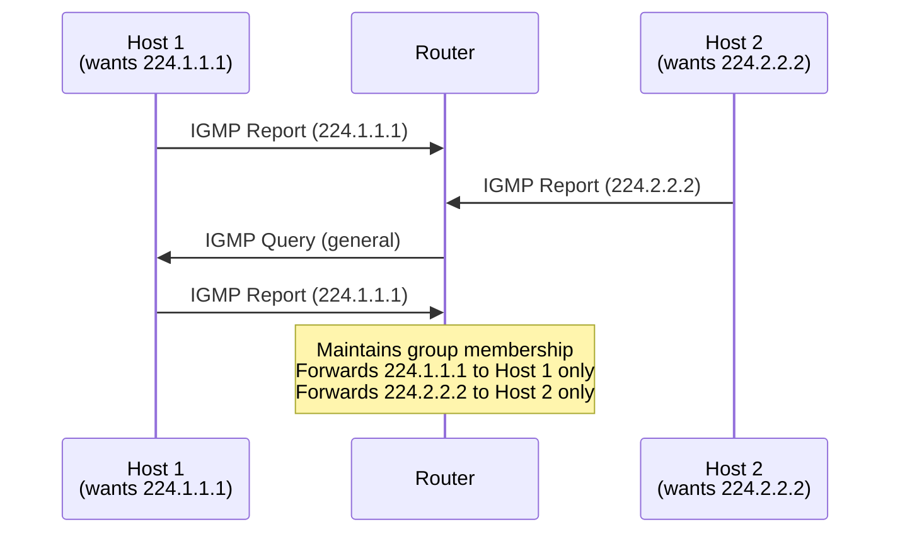
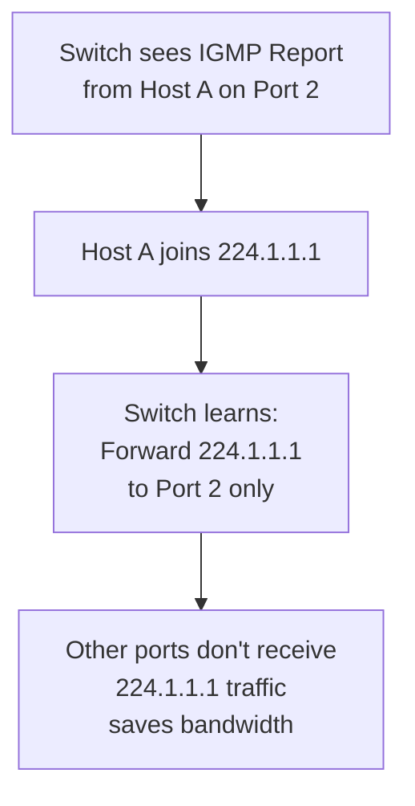

# IGMP (Internet Group Management Protocol)

Internet Group Management Protocol manages multicast group membership. Hosts use IGMP to inform
routers which multicast groups they want to receive. Routers use IGMP to track and forward
multicast traffic only to interested segments.

## Overview

- **Layer:** Network (Layer 3)
- **IP Protocol Number:** 2
- **Purpose:** Multicast group membership management
- **Versions:** IGMPv1 (RFC 1112), IGMPv2 (RFC 2236), IGMPv3 (RFC 3376)
- **Typical use:** Video streaming, IPTV, stock tickers, service discovery

---

## IGMPv2 Packet Format (Most Common)

```text
 0                   1                   2                   3
 0 1 2 3 4 5 6 7 8 9 0 1 2 3 4 5 6 7 8 9 0 1 2 3 4 5 6 7 8 9 0 1
+-+-+-+-+-+-+-+-+-+-+-+-+-+-+-+-+-+-+-+-+-+-+-+-+-+-+-+-+-+-+-+-+
|      Type         |    Max Resp Time  |         Checksum      |
+-+-+-+-+-+-+-+-+-+-+-+-+-+-+-+-+-+-+-+-+-+-+-+-+-+-+-+-+-+-+-+-+
|                    Group Address (32 bits)                    |
+-+-+-+-+-+-+-+-+-+-+-+-+-+-+-+-+-+-+-+-+-+-+-+-+-+-+-+-+-+-+-+-+
```

### Field Descriptions

| Field | Bits | Purpose |
| --- | --- | --- |
| **Type** | 8 | Message type: 0x11=Membership Query, 0x16=v2 Membership Report, 0x17=Leave Group |
| **Max Resp Time** | 8 | Max time (in 1/10 sec) hosts should wait before responding |
| **Checksum** | 16 | IGMP message checksum |
| **Group Address** | 32 | IPv4 multicast address (224.0.0.0/4 range) |

---

## IGMP Message Types

### Membership Query (0x11)

Router asks: "Who wants which multicast groups?"

```text
Type: 0x11 (Membership Query)
Max Resp Time: 100 (10 seconds)
Group Address: 0.0.0.0 (general query — asks about all groups)
               or specific multicast address (group-specific query)
```

**General Query:** Sent to 224.0.0.1 (all hosts). Every 125 seconds (IGMPv2 default).

**Group-Specific Query:** Sent when leaving a group; asks remaining members.

### Membership Report (0x16)

Host responds: "I want to join group 224.1.1.1"

```text
Type: 0x16 (Membership Report)
Max Resp Time: 0 (ignored in reports)
Group Address: 224.1.1.1 (the group being joined)
```

Sent when:

- Joining a group (triggered by application)
- Responding to Membership Query
- Reconfirming membership (periodic)

### Leave Group (0x17)

Host announces: "I'm leaving group X" (IGMPv2 only).

```text
Type: 0x17 (Leave Group)
Max Resp Time: 0 (ignored)
Group Address: 224.1.1.1 (the group being left)
Destination: 224.0.0.2 (all-routers multicast address)
```

---

## IGMP Multicast Address Ranges

| Range | Purpose | Example |
| --- | --- | --- |
| **224.0.0.0/24** | Reserved; local network only | 224.0.0.1 (all hosts), 224.0.0.2 (all routers) |
| **224.0.1.0 – 224.0.1.255** | Globally assigned; RFC standard | 224.0.1.39 (ntp.mcast), 224.0.1.60 (sap.mcast) |
| **224.1.0.0 – 238.255.255.255** | Globally scoped multicast | Video streams, application-specific |
| **239.0.0.0 – 239.255.255.255** | Administrative scoped; not forwarded off-site | Building/campus only |

---

## IGMPv1 vs IGMPv2 vs IGMPv3

| Feature | v1 | v2 | v3 |
| --- | --- | --- | --- |
| **Leave notification** | No (wait for timeout) | Yes (0x17 Leave) | Yes |
| **Query timeout** | Shorter (60s) | Longer (125s) | Longer (125s) |
| **Group-specific query** | No | Yes | Yes |
| **Source filtering** | No | No | Yes (include/exclude sources) |
| **Compatibility** | Oldest | Modern | Newest (backward-compatible) |

---

## IGMP in a Network



---

## Common IGMP Issues

| Issue | Cause | Fix |
| --- | --- | --- |
| **Multicast not reaching host** | Router doesn't know about group membership | Check if IGMP queries are sent; verify host joins group |
| **Excessive multicast traffic** | Switch flooding multicast to all ports | Enable IGMP snooping on managed switches |
| **Hosts leaving group slowly** | IGMPv1 timeout; router waits 60+ seconds | Upgrade to IGMPv2/v3; check query timing |

---

## IGMP Snooping (Switch Level)

Managed switches can listen to IGMP and limit multicast flooding:



---

## References

- RFC 3376: Internet Group Management Protocol, Version 3 (IGMPv3)
- RFC 2236: Internet Group Management Protocol, Version 2 (IGMPv2)
- RFC 1112: Host Extensions for IP Multicasting (IGMPv1)

---

## Next Steps

- See [Multicast & PIM](../theory/multicast.md) for routing multicast traffic
- Review [Cisco Multicast & PIM Configuration](../cisco/cisco_multicast_pim.md)
