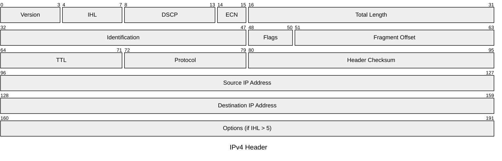

# IPv4 Header

The IPv4 header provides addressing, fragmentation, and delivery information for
packets across Layer 3. The minimum header size is 20 bytes; the Options field can
extend it to 60 bytes. IHL indicates the actual header length in 32-bit words.

## Quick Reference

| Property | Value |
| --- | --- |
| **OSI Layer** | Layer 3 — Network |
| **TCP/IP Layer** | Internet |
| **RFC** | RFC 791 |
| **Wireshark Filter** | `ip` |
| **EtherType** | `0x0800` |

## Header Structure

## Field Reference

| Field | Bits | Description |
| --- | --- | --- |
| **Version** | 4 | IP version. Always `4` for IPv4. |
| **IHL** | 4 | Internet Header Length in 32-bit words. Minimum value `5` (20 bytes); maximum `15` (60 bytes). |
| **DSCP** | 6 | Differentiated Services Code Point. Used for QoS classification (e.g. EF `101110` for voice, AF classes for assured forwarding). |
| **ECN** | 2 | Explicit Congestion Notification. `11` signals congestion experienced without dropping the packet. |
| **Total Length** | 16 | Total packet size in bytes including header and payload. Maximum 65,535 bytes. |
| **Identification** | 16 | Identifies fragments belonging to the same original datagram. |
| **Flags** | 3 | Bit 0: Reserved. Bit 1: DF (Don't Fragment). Bit 2: MF (More Fragments follow). |
| **Fragment Offset** | 13 | Position of this fragment within the original datagram, in units of 8 bytes. |
| **TTL** | 8 | Time To Live. Decremented by 1 at each hop. Packet is discarded when TTL reaches 0. Prevents routing loops. |
| **Protocol** | 8 | Identifies the encapsulated Layer 4 protocol. Common values: `6` TCP, `17` UDP, `89` OSPF, `132` SCTP. |
| **Header Checksum** | 16 | One's complement checksum of the header only. Recomputed at each hop (TTL changes). |
| **Source IP Address** | 32 | IPv4 address of the originating host. |
| **Destination IP Address** | 32 | IPv4 address of the intended recipient. |
| **Options** | 0–320 | Optional and rarely used in modern networks. Present only if IHL > 5. Padded to a 32-bit boundary. |

## Notes

- **Fragmentation** occurs when a packet exceeds the MTU of a link. The receiving host
  reassembles fragments using the Identification, Flags, and Fragment Offset fields.
  Setting DF prevents fragmentation and triggers an ICMP Type 3 Code 4
  (Fragmentation Needed) message back to the sender — the basis of Path MTU Discovery.

- **DSCP** replaced the original ToS (Type of Service) byte. The two ECN bits were
  carved out of the original ToS field in RFC 3168.
