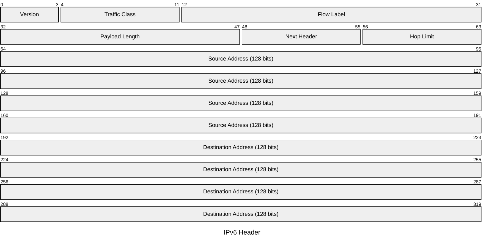

# IPv6 Header

The IPv6 header is fixed at 40 bytes — significantly simpler than IPv4. Fragmentation,
options, and other variable functionality are handled by extension headers chained via
the Next Header field rather than embedded in the base header. This simplifies
forwarding hardware and eliminates per-hop checksum recalculation.

## Quick Reference

| Property | Value |
| --- | --- |
| **OSI Layer** | Layer 3 — Network |
| **TCP/IP Layer** | Internet |
| **RFC** | RFC 8200 |
| **Wireshark Filter** | `ipv6` |
| **EtherType** | `0x86DD` |

## Header Structure

## Field Reference

| Field | Bits | Description |
| --- | --- | --- |
| **Version** | 4 | IP version. Always `6`. |
| **Traffic Class** | 8 | Equivalent to the IPv4 DSCP+ECN byte. Upper 6 bits = DSCP; lower 2 bits = ECN. |
| **Flow Label** | 20 | Labels packets belonging to the same flow for consistent per-flow treatment by routers. `0` if not used. |
| **Payload Length** | 16 | Length in bytes of the payload including any extension headers. Does not include the 40-byte base header. |
| **Next Header** | 8 | Identifies the type of the header immediately following. Uses the same values as the IPv4 Protocol field (e.g. `6` TCP, `17` UDP, `58` ICMPv6) plus extension header types. |
| **Hop Limit** | 8 | Decremented by 1 at each hop. Packet discarded when it reaches 0. Equivalent to IPv4 TTL. |
| **Source Address** | 128 | IPv6 address of the originating interface. |
| **Destination Address** | 128 | IPv6 address of the intended recipient (or next routing waypoint if a Routing header is present). |

## Extension Headers

Extension headers are chained between the base header and the upper-layer payload.
Each extension header contains its own Next Header field pointing to the next one.

| Next Header Value | Extension Header | RFC |
| --- | --- | --- |
| `0` | Hop-by-Hop Options — processed by every router on the path | RFC 8200 |
| `43` | Routing — source routing and segment routing (SRv6) | RFC 8754 |
| `44` | Fragment — fragmentation by the source only (not routers) | RFC 8200 |
| `50` | ESP — IPsec Encapsulating Security Payload | RFC 4303 |
| `51` | AH — IPsec Authentication Header | RFC 4302 |
| `59` | No Next Header — nothing follows | RFC 8200 |
| `60` | Destination Options — processed only by the destination | RFC 8200 |
| `135` | Mobility — mobile IPv6 binding updates | RFC 6275 |

## Comparison with IPv4

| Feature | IPv4 | IPv6 |
| --- | --- | --- |
| Header size | 20–60 bytes (variable) | 40 bytes (fixed) |
| Address size | 32 bits | 128 bits |
| Fragmentation | Routers and source | Source only |
| Header checksum | Yes (recomputed per hop) | No |
| Options | Inline (IHL field) | Extension headers |
| Address configuration | DHCP or manual | SLAAC, DHCPv6, or manual |
| ARP | Yes | Replaced by NDP (ICMPv6) |

## Notes

- **No header checksum** — upper-layer protocols (TCP, UDP, ICMPv6) provide
  checksums that include a pseudo-header with the source and destination addresses.
  Removing the per-hop checksum recalculation speeds up forwarding.
- **Fragmentation** is performed only by the originating host. Routers that receive
  a packet too large for the next link send back an ICMPv6 Packet Too Big message
  (Type 2), enabling Path MTU Discovery.
- **Link-local addresses** (`fe80::/10`) are automatically assigned to every
  interface and are used for Neighbour Discovery and router communications on the
  local segment.
