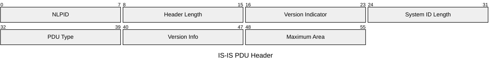
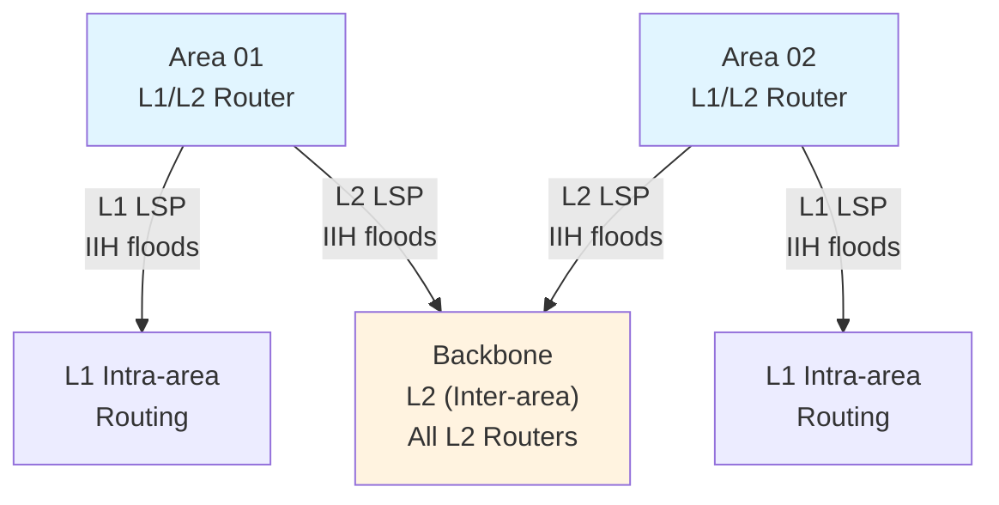
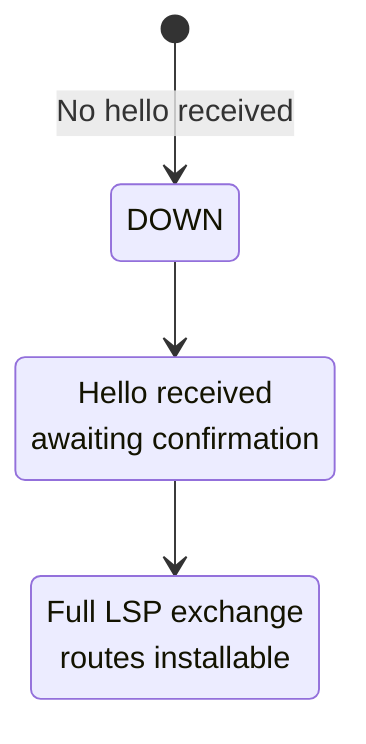

# IS-IS (Intermediate System to Intermediate System)

Intermediate System to Intermediate System is a link-state interior gateway protocol used within
a network domain. IS-IS routers flood topology information (Link State PDUs) similar to OSPF but
is domain-agnostic and commonly used in ISP and service provider networks. Supports IPv4, IPv6, and
fast convergence with BFD.

## Quick Reference

| Property | Value |
| --- | --- |
| **OSI Layer** | Data Link (Layer 2) and Network (Layer 3) |
| **Transport** | Directly on Link Layer (ISO 8348) |
| **ISO PDU Addressing** | NSAP (Network Service Access Point) |
| **RFC/Standard** | ISO 10589, RFC 5308 (IPv6 extensions) |
| **Purpose** | Interior routing; hierarchical design; multi-protocol |
| **Default Hello Interval** | 10 seconds |
| **Default Holding Time** | 30 seconds (3 × Hello) |

## Packet Structure

### IS-IS PDU Format (Header)

All IS-IS PDUs share a common header:



## Field Reference

| Field | Bits | Purpose |
| --- | --- | --- |
| **NLPID** | 8 | Protocol Discriminator (0x83=IS-IS, 0xCC=IPv4, 0x8E=IPv6) |
| **Header Length** | 8 | Total header size (bytes) |
| **Version Indicator** | 8 | 1 (only version defined) |
| **System ID Length** | 8 | Length of system ID; typically 6 bytes |
| **PDU Type** | 8 | 15=IIH (Hello), 17=LSP (Link State), 20=SNP (Sequence Number), etc. |
| **Version Info** | 8 | Reserved; version 1 |
| **Maximum Area** | 8 | Maximum number of areas (default 3) |

## IS-IS PDU Types

### 1. IS-IS Hello PDU (IIH, Type 15)

Discovers neighbors; establishes adjacency; elects DIS (Designated IS).

```text
Point-to-Point IIH:
  - System ID
  - Hello Interval
  - Holding Time (Dead Interval)
  - Local Circuit ID
  - Neighbor System ID (confirms bidirectional)

LAN IIH (Broadcast Segment):
  - System ID
  - Designated Intermediate System (DIS) priority
  - LAN ID (MAC of DIS)
  - Hello Interval
  - Holding Time
  - Neighbor System IDs (already seen neighbors)
```

**Network Types:**

- **Point-to-Point:** Direct serial link; no DIS; bidirectional adjacency required
- **LAN (Broadcast):** Ethernet segment; DIS elected (similar to OSPF DR); all routers
  form adjacency with DIS

### 2. Link State PDU (LSP, Type 17)

Floods network topology; lists neighbors, subnets, and routes.

```text
RouterA LSP:
  - System ID: Router-A
  - PDU Number: Identifies this specific LSP
  - Sequence Number: Incremented each time LSP is updated
  - Lifetime: Remaining validity (decrements; reissued before reaching 0)
  - Neighbor Adjacencies:
      - Neighbor System ID, Metric (cost), Sub-TLV info
  - Reachable IP Addresses:
      - 10.1.0.0/24, Metric 10
      - 10.2.0.0/25, Metric 20
  - IPv6 Reachability (optional):
      - 2001:db8:1::/48, Metric 10
```

**Flooding:** LSP is sent from every router on every link (flooding). Each router keeps a copy
in its LSDB and retransmits to all other neighbors (except incoming interface).

### 3. Sequence Number PDU (SNP, Type 20/21)

Synchronizes Link State Database (LSDB) between routers.

```text
Complete SNP (CSNP): Lists all LSPs known to sender
  Used on LAN to sync DIS → routers

Partial SNP (PSNP): Lists subset of LSPs (missing or newly received)
  Used on point-to-point links for efficiency
```

---

## IS-IS Metric and Costs

| Link Type | Default Metric | Bandwidth |
| --- | --- | --- |
| **Gigabit Ethernet** | 10 | 1000 Mbps |
| **Fast Ethernet** | 100 | 100 Mbps |
| **Ethernet (10 Mbps)** | 1000 | 10 Mbps |
| **T1 (1.544 Mbps)** | 6477 | 1.544 Mbps |
| **Serial 64 kbps** | 156250 | 64 kbps |

**Wide Metrics (RFC 5305):** Supports costs 0-2^32-1 (replaces old 6-bit metric).

**Traffic Engineering (RFC 5305):** Extended IS-IS supports TE metric (admin group, bandwidth,
link delay for MPLS TE path calculation).

---

## IS-IS Hierarchy (Areas)

IS-IS supports **two-level hierarchy:**

1. **Level 1 (L1):** Intra-area routing; routers form full adjacencies within area
2. **Level 2 (L2):** Inter-area routing; backbone; connects all areas



**L1-L2 Router:** Exists in single area; participates in both L1 (intra-area) and L2
(inter-area) routing.

**Area ID:** Format is 1-3 octets (e.g., 01, 02.0001, 49.0001).

---

## IS-IS Neighbor States



On LAN, DIS is elected from neighbors with highest priority (default 64); tie-breaker is
system ID (lower wins).

---

## IS-IS Timers

| Timer | Default | Purpose |
| --- | --- | --- |
| **Hello Interval** | 10 seconds | Frequency of IS-IS Hello PDUs |
| **Holding Time** | 30 seconds | Declares neighbor down if no Hello received |
| **LSP Lifetime** | 1200 seconds (20 min) | How long LSP valid; reissued before expiry |
| **Retransmit Interval** | 5 seconds | Interval between LSP floods (point-to-point) |
| **SPF Calculation Delay** | 50ms-5s | Paced recalculation to avoid thrashing |

---

## Common IS-IS Issues

| Issue | Cause | Fix |
| --- | --- | --- |
| **Adjacency not coming up** | NLPID mismatch; system ID format wrong | Verify NLPID; check area ID, system ID length |
| **LSP not flooding** | Timer mismatch; interface not in IS-IS | Verify area config; check `show isis database` |
| **Slow convergence** | SPF delay too aggressive; high overhead | Tune SPF calculation delay |
| **Routes missing** | LSDB incomplete; LSP lifetime expired | Check LSP retransmit; monitor LSDB sync |

---

## IS-IS vs OSPF

| Feature | IS-IS | OSPF |
| --- | --- | --- |
| **Layer** | Layer 2 (native) | Layer 3 (IP-based) |
| **Metric** | Configurable, wide metrics | Bandwidth-derived (auto-calculated) |
| **Hierarchy** | 2-level (L1/L2) | Multi-level (areas) |
| **Adjacency** | Point-to-point or LAN DIS | Point-to-point or broadcast DR/BDR |
| **IPv6** | RFC 5308 extensions | Native OSPFv3 |
| **Scalability** | Handles large ISP networks well | Good for enterprise networks |
| **Complexity** | Higher (non-IP native) | Lower (IP-integrated) |

---

## References

- ISO 10589: Intermediate System to Intermediate System Intra-domain Routing Information Exchange
  Protocol
- RFC 5308: Routing Extensions for IS-IS
- RFC 5305: IS-IS Extensions for Traffic Engineering
- Cisco IOS-XE IS-IS configuration guide

---

## Next Steps

- See [Routing Protocols Overview](../routing/index.md)
- Configure IS-IS: [Cisco IS-IS](../cisco/cisco_isis_config.md)
