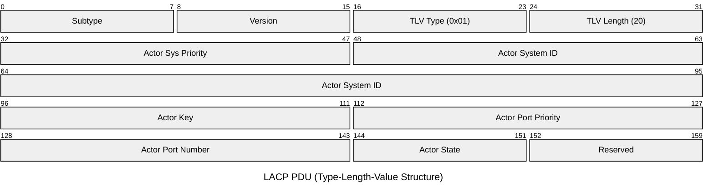
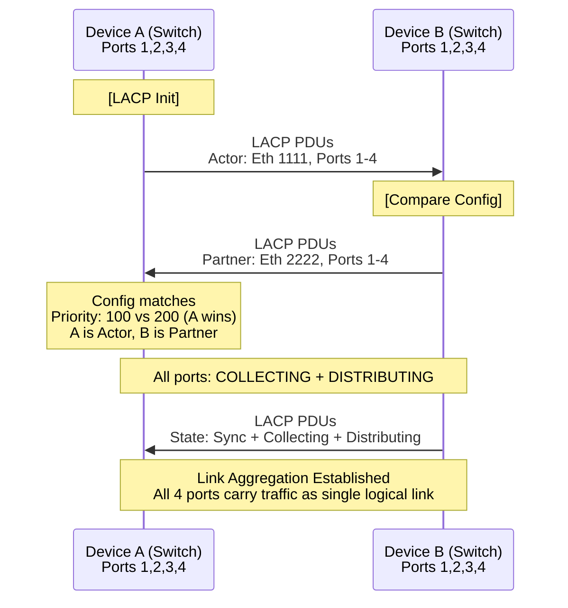

# LACP (Link Aggregation Control Protocol)

Link Aggregation Control Protocol negotiates and maintains link aggregation (bonding) between two
devices. LACP ensures that only compatible ports form an aggregation group, preventing misconfiguration
and enabling dynamic load balancing.

## Quick Reference

| Property | Value |
| --- | --- |
| **OSI Layer** | Data Link (Layer 2) |
| **Ethernet Type** | 0x8809 (Slow Protocols) |
| **LACP Subtype** | 0x01 |
| **RFC/Standard** | IEEE 802.3ad, IEEE 802.1AX |
| **Destination MAC** | 01:80:C2:00:00:02 (all-LACPDUs) |
| **Transmission Interval** | Fast (1 LACP/sec) or Slow (30 LACP/min) |

## Packet Structure



## Field Reference

Actor and Partner Information TLVs contain the following structure:

| Field | Bits | Description |
| --- | --- | --- |
| **Subtype** | 8 | 0x01 for LACP |
| **Version** | 8 | 0x01 (current version) |
| **Actor/Partner System Priority** | 16 | Lower value preferred |
| **Actor/Partner System ID** | 48 | MAC address of the system |
| **Actor/Partner Key** | 16 | Aggregation group identifier |
| **Actor/Partner Port Priority** | 16 | Lower value preferred within aggregation |
| **Actor/Partner Port Number** | 16 | Physical port identifier |
| **Actor/Partner State** | 8 | Activity, Timeout, Aggregation, Sync, Collecting, Distributing flags |

## TLV (Type-Length-Value) Entries

1. **Actor Information TLV (0x01):** Describes this device's port/system
2. **Partner Information TLV (0x02):** Describes peer's port/system
3. **Collector Information TLV (0x03):** Flow collection capabilities
4. **Terminator TLV (0x00):** End of LACP PDU (optional)

## Actor/Partner State Bits

| Bit | Name | Meaning |
| --- | --- | --- |
| **7** | Lacp Activity | 1=Active (send LACP regularly), 0=Passive (respond only) |
| **6** | Lacp Timeout | 1=Short timeout (1s), 0=Long timeout (30s) |
| **5** | Aggregation | 1=Can aggregate with this port, 0=Individual link only |
| **4** | Synchronization | 1=In sync with partner, 0=Out of sync |
| **3** | Collecting | 1=Collecting (receiving aggregated frames), 0=Not collecting |
| **2** | Distributing | 1=Distributing (sending to aggregation), 0=Not distributing |
| **1** | Default | 1=Collected from default, 0=Otherwise |
| **0** | Expired | 1=Timer expired, 0=Timer still running |

**Aggregated status:** Both Collecting AND Distributing bits must be 1 for a port to
actively carry traffic.

## LACP Negotiation Process



## Key Configuration Parameters

### System Priority (2 bytes, lower = preferred)

Determines which device is "Actor" (controls aggregation).

```text
Switch A: System Priority 100 + MAC 0011.2233.4455
Switch B: System Priority 200 + MAC 0099.8877.6655

A wins (lower priority), so A is Actor, B is Partner
```

### Port Priority (2 bytes, lower = preferred within aggregation)

If not all ports can aggregate (e.g., 4-port LAG, 6 ports available), lower-priority
ports are used.

```text
Ports 1,2,3,4: Priority 10 (selected for aggregation)
Ports 5,6: Priority 20 (standby; used if ports 1-4 fail)
```

### Key (2 bytes)

Groups ports with the same key into the same LAG.

```text
Ports 1-4: Key 1 (form LAG together)
Ports 5-8: Key 2 (form separate LAG)
```

## LACP Timeouts

| Parameter | Active | Passive |
| --- | --- | --- |
| **Send interval** | 1 LACP PDU/sec | 30 LACP PDUs/min (no active sending) |
| **Receive timeout** | 3 seconds | 90 seconds |
| **Behavior** | Initiates LACP negotiation | Responds to peer's LACP |

**Active:** Send LACP regularly, even if partner is quiet. Recommended for switch-to-switch.

**Passive:** Only respond to peer's LACP. Saves bandwidth but slower convergence.

## Common LACP States

| State | Collecting | Distributing | Status |
| --- | --- | --- | --- |
| **Aggregated** | ✓ | ✓ | Port actively carries traffic in LAG |
| **Collecting only** | ✓ | ✗ | Receiving traffic but not sending (standby) |
| **Standby** | ✗ | ✗ | Not carrying traffic; waiting for active port failure |
| **Individual** | ✗ | ✗ | Port cannot aggregate (mismatched system/key) |
| **Expired** | ✗ | ✗ | Timer expired; no LACP PDUs received |

## Load Balancing Across LAG Ports

Once aggregated, traffic is distributed by switch's hash algorithm:

```text
Hash(Source MAC, Dest MAC, Source IP, Dest IP, L4 ports) % number_of_active_ports
= Selected Port

Frame A: Src 10.0.0.1 → Dst 10.1.1.1, Port 1 → Eth1
Frame B: Src 10.0.0.2 → Dst 10.1.1.2, Port 1 → Eth2
Frame C: Src 10.0.0.3 → Dst 10.1.1.2, Port 1 → Eth1 (same dest, but different src)
```

(Most switches use source/dest MAC and IP for hash; L4 ports optional)

## LACP vs Static Link Aggregation

| Feature | LACP (Dynamic) | Static (Manual) |
| --- | --- | --- |
| **Negotiation** | Automatic | Manual config matching required |
| **Error detection** | Active (timeouts) | Passive (no detection) |
| **Misconfiguration protection** | Detects mismatches; disables ports | Silent failure possible |
| **Convergence** | < 3 seconds | Manual intervention needed |
| **Complexity** | Slightly higher CPU | Lower overhead |
| **Compatibility** | Both devices must support LACP | Some older devices don't support LACP |

## Notes & Common Issues

| Issue | Cause | Fix |
| --- | --- | --- |
| **Ports not aggregating** | System priority/MAC mismatch; key mismatch | Verify Actor/Partner values match |
| **LACP PDUs not exchanged** | One side set to Passive + both sides Passive | Set at least one side to Active |
| **Unequal load distribution** | Hash algorithm imbalance | Some flows use one port; depends on source/dest IPs |

## References

- IEEE 802.3ad: Link Aggregation
- IEEE 802.1AX: Link Aggregation Control Protocol (LACP)

## Next Steps

- Review [Port Aggregation (LAG) Theory](../theory/port_aggregation.md)
- Configure LAG: [Cisco EtherChannel](../cisco/cisco_etherchannel_config.md), [FortiGate LAG](../fortigate/fortigate_lag_config.md)
