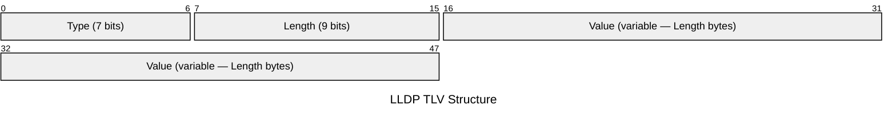

# LLDP — Link Layer Discovery Protocol

LLDP (IEEE 802.1AB) allows network devices to advertise their identity, capabilities,
and neighbours on each port. Advertisements are sent as multicast frames to the
reserved LLDP multicast MAC (`01:80:C2:00:00:0E`) and are never forwarded by bridges.
LLDP is the vendor-neutral standard; Cisco's proprietary equivalent is CDP.

## Quick Reference

| Property | Value |
| --- | --- |
| **OSI Layer** | Layer 2 — Data Link |
| **Standard** | IEEE 802.1AB-2016 |
| **Wireshark Filter** | `lldp` |
| **EtherType** | `0x88CC` |
| **Destination MAC** | `01:80:C2:00:00:0E` (LLDP multicast, not forwarded by bridges) |
| **Default TX Interval** | 30 seconds |
| **Default TTL** | 120 seconds (hold multiplier 4 × TX interval) |

## Frame Structure

The LLDP PDU is carried directly in the Ethernet payload after the `0x88CC` EtherType.
It consists of a sequence of TLVs (Type-Length-Value structures) terminated by an
End TLV. There is no fixed-size header beyond the TLV stream.

## TLV Structure

Each TLV begins with a 2-byte type/length word followed by a variable-length value.



## TLV Field Reference

| Field | Bits | Description |
| --- | --- | --- |
| **Type** | 7 | TLV type identifier. `0` = End of LLDPDU, `1`–`8` = mandatory and optional standard TLVs, `127` = organisation-specific. |
| **Length** | 9 | Length of the Value field in bytes. Maximum 511 bytes per TLV. |
| **Value** | variable | TLV-specific content. Format and semantics depend on Type (and OUI for Type 127). |

## Mandatory TLVs

Mandatory TLVs must appear in every LLDPDU in the order shown.

| Type | TLV Name | Description |
| --- | --- | --- |
| `1` | Chassis ID | Identifies the sending device. Subtype determines format: `4` = MAC address, `5` = network address, `6` = interface name, `7` = locally assigned string. |
| `2` | Port ID | Identifies the specific port. Subtypes: `3` = MAC address, `5` = interface name, `7` = locally assigned string. |
| `3` | TTL | Time in seconds the receiver should retain this LLDP entry. Default `120`. Value `0` = remove entry immediately (sent when a port goes administratively down). |
| `0` | End of LLDPDU | Zero-length TLV marking the end of the PDU. Both Type and Length fields are `0`. Must be the final TLV. |

## Optional TLVs

| Type | TLV Name | Description |
| --- | --- | --- |
| `4` | Port Description | Human-readable description of the sending interface (e.g. interface description string). |
| `5` | System Name | Administratively assigned hostname of the sending device. |
| `6` | System Description | Full system description: hardware platform, OS, and software version string. |
| `7` | System Capabilities | Two 2-byte bitmasks: supported capabilities and enabled capabilities. Bits: `0x0001` Other, `0x0002` Repeater, `0x0004` Bridge, `0x0008` WLAN AP, `0x0010` Router, `0x0020` Telephone, `0x0040` DOCSIS, `0x0080` Station Only. |
| `8` | Management Address | Network address (IPv4 or IPv6) to use for SNMP/management access to this device, plus interface numbering subtype and OID. |
| `127` | Organisation-Specific | Identified by a 3-byte OUI + 1-byte subtype. Common OUIs: IEEE 802.3 (`00:12:0F`) for link speed/duplex/MTU; IEEE 802.1 (`00:80:C2`) for VLAN name, port VLAN ID, and protocol identity; TIA (`00:12:BB`) for LLDP-MED. |

## LLDP-MED

LLDP-MED (Media Endpoint Discovery, ANSI/TIA-1057) extends LLDP for converged voice
and data networks. It adds TLV type 127 extensions under the TIA OUI, including:

| LLDP-MED TLV | Purpose |
| --- | --- |
| Network Policy | Voice VLAN ID, Layer 2 priority (802.1p), and DSCP value for IP phones. |
| Location | Civic address or ELIN (Emergency Location Identification Number) for E911. |
| Extended Power-via-MDI | PoE power type, source, priority, and requested/allocated power. |
| Hardware/Firmware Revision | Endpoint inventory information. |

## Cisco IOS-XE Configuration

```ios

! Enable LLDP globally
lldp run

! Per-interface control
interface GigabitEthernet1/0/1
 lldp transmit
 lldp receive

! Tune timers
lldp timer 30
lldp holdtime 120
lldp reinit 2
```

Verification:

```ios

show lldp neighbors
show lldp neighbors detail
show lldp interface GigabitEthernet1/0/1
```

## Notes

- **Scope:** LLDP frames are consumed by the immediate Layer 2 neighbour only. They

  are never forwarded by IEEE 802.1D-compliant bridges. This makes LLDP strictly a
  single-hop discovery protocol.

- **Timers:** Default transmit interval is 30 seconds with a hold multiplier of 4,

  giving a TTL of 120 seconds. A neighbour entry expires if no LLDPDU is received
  within the advertised TTL.

- **TTL = 0:** When a port goes down or LLDP is disabled on an interface, a shutdown

  LLDPDU with TTL=0 is sent, instructing neighbours to immediately remove the entry
  rather than waiting for the TTL to expire.

- **Simultaneous CDP:** Cisco IOS-XE can run LLDP and CDP simultaneously on the same

  interface. Both protocols are independent; each maintains its own neighbour table.

- **Security:** LLDP has no authentication. It can reveal interface names, system

  descriptions, IP addresses, and capabilities to any directly connected device.
  Consider disabling LLDP on externally facing or customer-facing interfaces.

- **Comparison with CDP:** See [CDP](cdp.md). LLDP is vendor-neutral and mandatory

  for multi-vendor environments; CDP provides richer Cisco-specific information
  (VoIP VLAN, PoE negotiation details, native VLAN).
