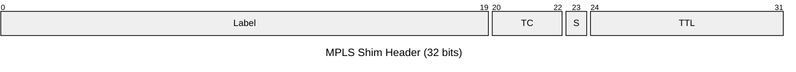
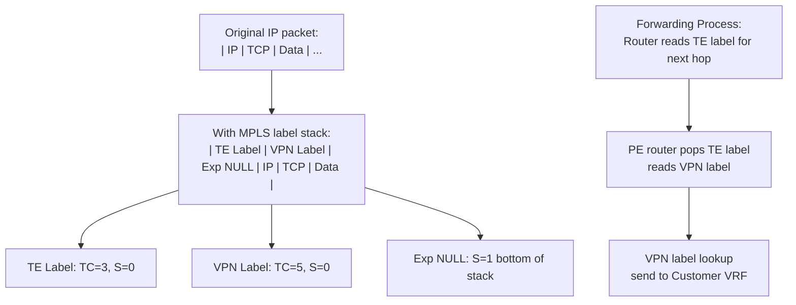
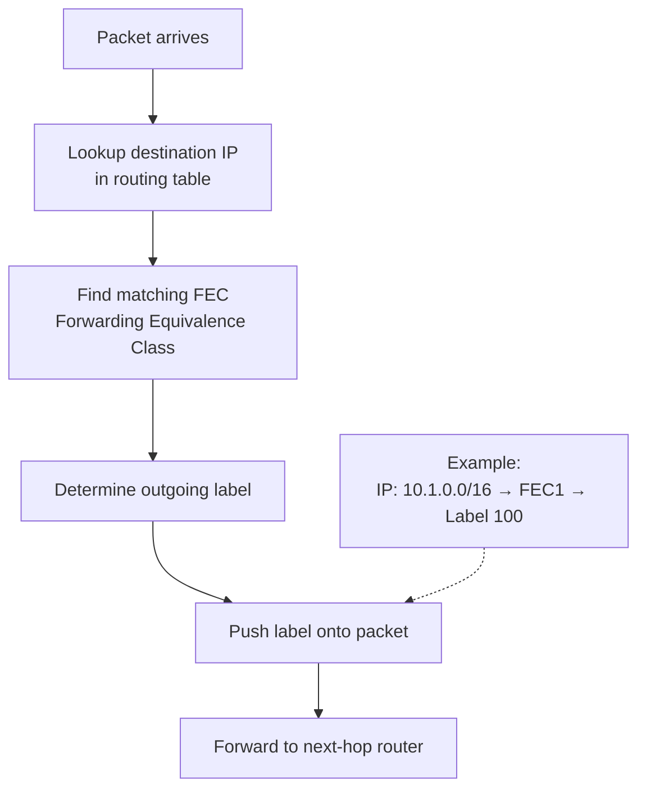
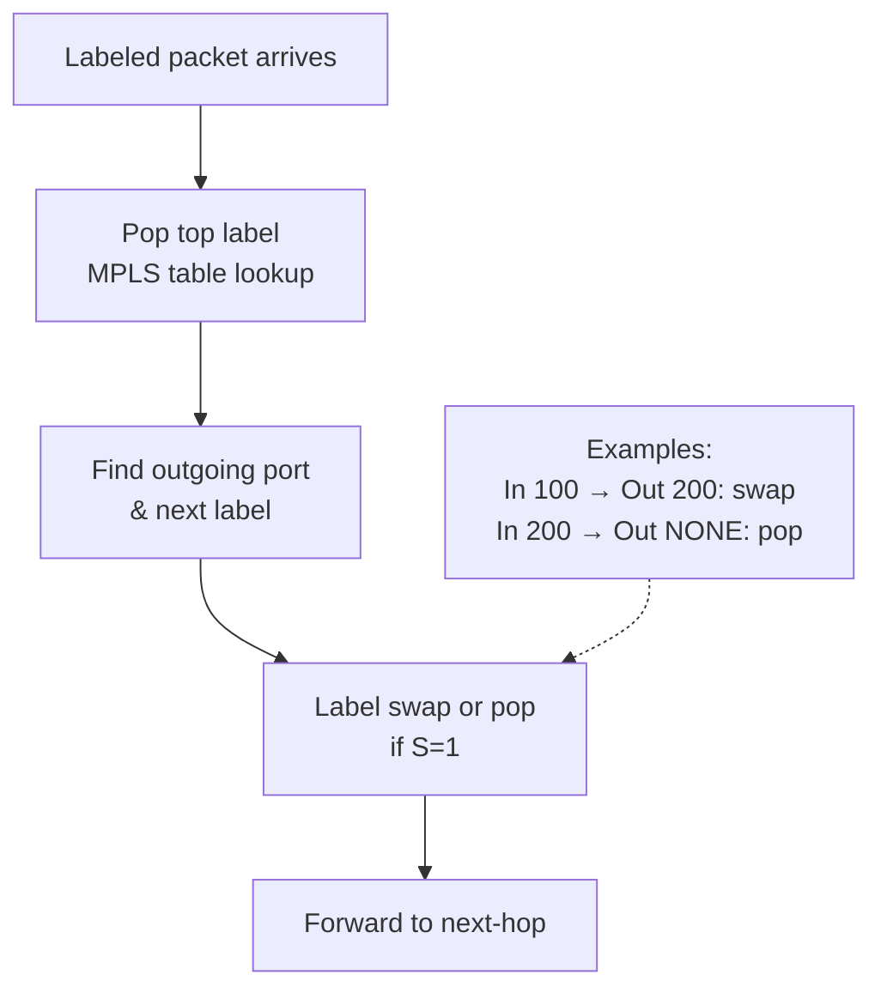
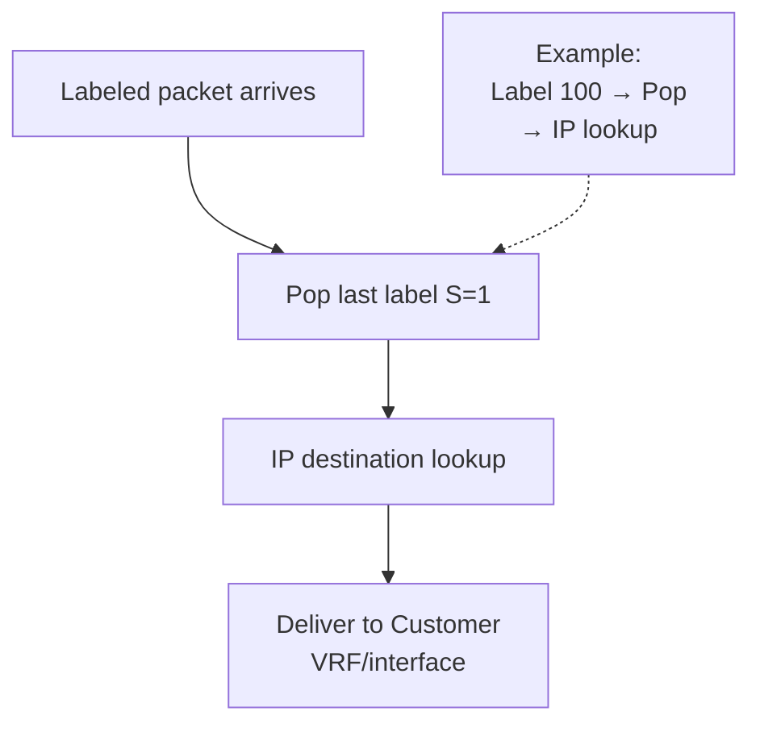
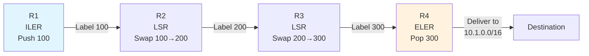
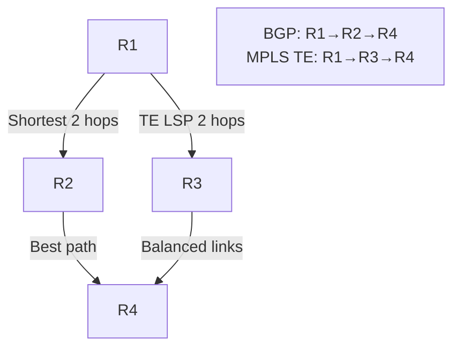
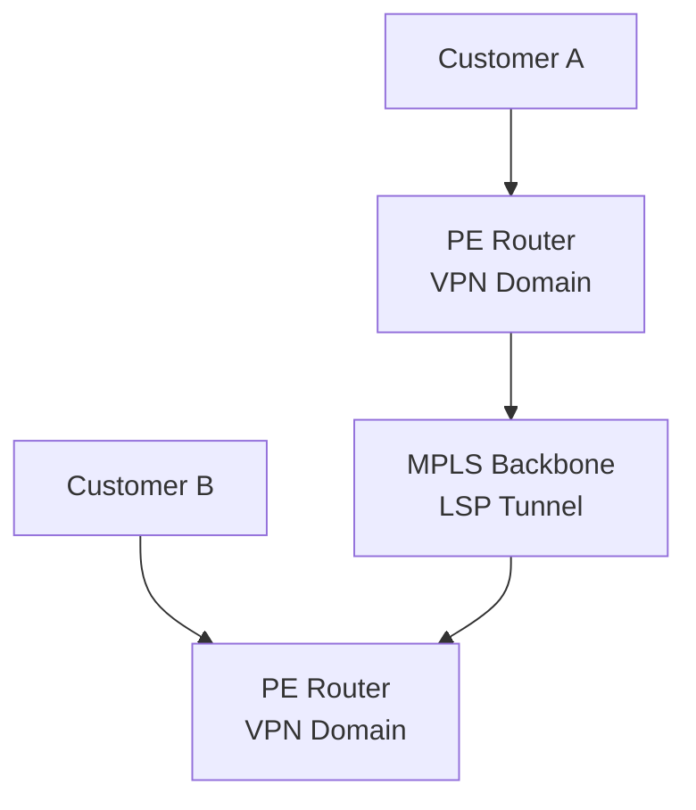
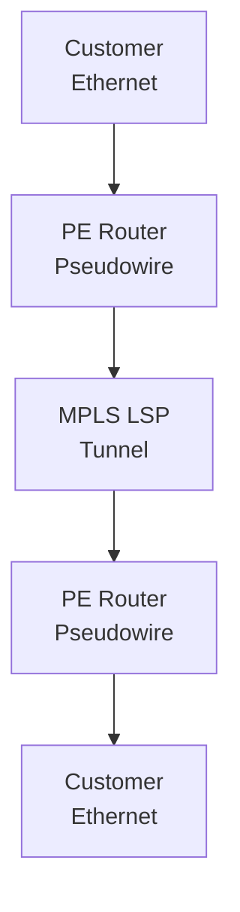

# MPLS (Multiprotocol Label Switching)

Multiprotocol Label Switching is a forwarding mechanism that prepends a label stack to packets,
allowing fast label-based switching instead of IP routing table lookup. MPLS enables traffic engineering,
VPNs, and QoS optimization.

## Quick Reference

| Property | Value |
| --- | --- |
| **OSI Layer** | Layer 2.5 (between Data Link and Network) |
| **EtherType** | 0x8847 (MPLS unicast), 0x8848 (MPLS multicast) |
| **RFC** | RFC 3031 (MPLS Architecture), RFC 3032 (MPLS Encapsulation) |
| **Purpose** | Fast label-based forwarding, traffic engineering, VPN tunneling |
| **Label Range** | 0-1048575 (20-bit label field) |
| **Reserved Labels** | 0-15 |

## Packet Structure

### MPLS Label Stack Entry (Shim Header)



## Field Reference

| Field | Bits | Purpose |
| --- | --- | --- |
| **Label** | 20 | Label value (16-1048575 for user; 0-15 reserved) |
| **TC (Traffic Class)** | 3 | QoS marking (same as DSCP/CoS) |
| **S (Bottom of Stack)** | 1 | 1=Last label in stack, 0=More labels follow |
| **TTL** | 8 | Time-to-Live; decremented at each hop |

---

## Reserved Labels (0-15)

| Label | Name | Purpose |
| --- | --- | --- |
| **0** | IPv4 Explicit NULL | Pop label; forward as IPv4 (PHP optimization) |
| **1** | Router Alert | Interrupt forwarding; send to control plane |
| **2** | IPv6 Explicit NULL | Pop label; forward as IPv6 (PHP optimization) |
| **3** | Implicit NULL | Penultimate hop pops label (deprecated) |
| **4-13** | Reserved | Reserved for future use |
| **14** | OAM Alert | Operations & Maintenance (ping, traceroute) |
| **15** | Reserved | Reserved |
| **16+** | Available | User labels (LSPs, VPNs, traffic engineering) |

## MPLS Label Stack

Packets can have multiple labels (label stack); processed from top to bottom.



## MPLS Forwarding Process

### Ingress Router (Ingress Label Edge Router — ILER)



### Transit Router (Label Switching Router — LSR)



### Egress Router (Egress Label Edge Router — ELER)



## MPLS LSP (Label Switched Path)

Pre-computed path from ingress to egress router.



LSP: R1 → R2 → R3 → R4 (for destination 10.1.0.0/16)

---

## MPLS vs Traditional IP Routing

| Aspect | IP Routing | MPLS |
| --- | --- | --- |
| **Lookup** | IP header, every hop | Label table, every hop (faster with ASIC) |
| **Path** | Based on routing protocol (OSPF, BGP) | Can enforce explicit path (traffic engineering) |
| **Forwarding** | Destination-based | FEC-based (group destinations, not just prefix) |
| **VPN** | Overlays (GRE, VxLAN) | Native MPLS VPN (easier, standardized) |
| **QoS** | Per-packet marking | Per-LSP class of service |

---

## MPLS Applications

### 1. Traffic Engineering (TE)

Force traffic down specific path (not shortest path):



### 2. MPLS L3 VPN

Customer VPN over service provider MPLS backbone:



### 3. MPLS Pseudowires (L2 VPN)

Tunnel Ethernet/Frame Relay over MPLS:



---

## MPLS Label Distribution

### LDP (Label Distribution Protocol)

Exchange labels between adjacent routers automatically:

```text
R1: "For FEC 10.1.0.0/16, I'll use label 100"
    →(LDP advertisement) R2

R2: "I'll use label 200 for that FEC"
    →(LDP advertisement) R1 and R3

R3: "I'll use label 300"
    →(LDP advertisement) R2 and R4
```

### BGP-based (in L3 VPN)

BGP carries both routing and label information:

```text
BGP route: 10.1.0.0/16
BGP label: 500

ISP can advertise: "Route 10.1.0.0/16 with label 500"
Ingress PE pushes label 500 for routes learned via this BGP path
```

---

## Common Issues

| Issue | Cause | Fix |
| --- | --- | --- |
| **LSP not forwarding** | Label distribution failed | Check LDP neighbor status |
| **Poor QoS** | TC field not marked correctly | Enable QoS on ingress PE |
| **Label conflicts** | Two LSPs using same label | Use MPLS label allocation pool |
| **TTL exceeded** | Packet crossed too many hops | Increase TTL or reduce LSP depth |

---

## References

- RFC 3031: Multiprotocol Label Switching Architecture
- RFC 5036: LDP (Label Distribution Protocol)
- RFC 4364: BGP/MPLS IP Virtual Private Networks (L3 VPN)

---

## Next Steps

- Read [MPLS Fundamentals Theory](../theory/mpls.md)
- See [Route Redistribution](../theory/route_redistribution.md) for integration points
