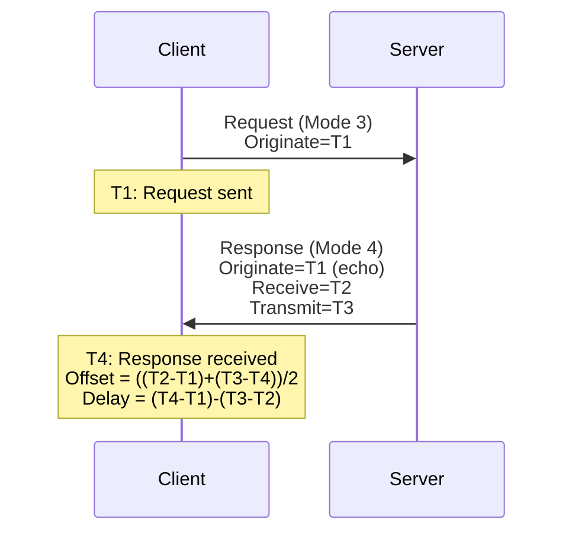
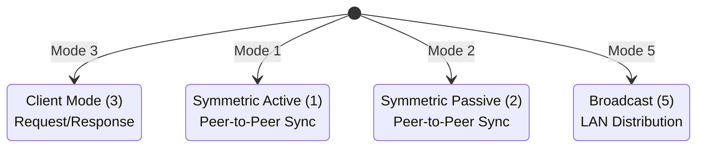

# NTP (Network Time Protocol)

Network Time Protocol synchronizes clocks across networked devices. NTP is critical for accurate
logging, cryptographic operations (certificate validation), BGP timers, and security event
correlation across a network.

## Overview

- **Layer:** Application (Layer 7)
- **Transport:** UDP port 123
- **Purpose:** Clock synchronization with millisecond accuracy
- **Versions:** NTPv3 (RFC 1305), NTPv4 (RFC 5905)
- **Typical accuracy:** 1-50 ms (LAN), 100+ ms (WAN)

---

## NTP Packet Format

```text
 0                   1                   2                   3
 0 1 2 3 4 5 6 7 8 9 0 1 2 3 4 5 6 7 8 9 0 1 2 3 4 5 6 7 8 9 0 1
+-+-+-+-+-+-+-+-+-+-+-+-+-+-+-+-+-+-+-+-+-+-+-+-+-+-+-+-+-+-+-+-+
|LI | VN  |Mode |    Stratum     |     Poll      |  Precision    |
+-+-+-+-+-+-+-+-+-+-+-+-+-+-+-+-+-+-+-+-+-+-+-+-+-+-+-+-+-+-+-+-+
|                          Root Delay                            |
+-+-+-+-+-+-+-+-+-+-+-+-+-+-+-+-+-+-+-+-+-+-+-+-+-+-+-+-+-+-+-+-+
|                       Root Dispersion                          |
+-+-+-+-+-+-+-+-+-+-+-+-+-+-+-+-+-+-+-+-+-+-+-+-+-+-+-+-+-+-+-+-+
|                     Reference Identifier                       |
+-+-+-+-+-+-+-+-+-+-+-+-+-+-+-+-+-+-+-+-+-+-+-+-+-+-+-+-+-+-+-+-+
|                                                                 |
|                   Reference Timestamp (64 bits)               |
|                                                                 |
+-+-+-+-+-+-+-+-+-+-+-+-+-+-+-+-+-+-+-+-+-+-+-+-+-+-+-+-+-+-+-+-+
|                                                                 |
|                   Originate Timestamp (64 bits)               |
|                                                                 |
+-+-+-+-+-+-+-+-+-+-+-+-+-+-+-+-+-+-+-+-+-+-+-+-+-+-+-+-+-+-+-+-+
|                                                                 |
|                    Receive Timestamp (64 bits)                |
|                                                                 |
+-+-+-+-+-+-+-+-+-+-+-+-+-+-+-+-+-+-+-+-+-+-+-+-+-+-+-+-+-+-+-+-+
|                                                                 |
|                   Transmit Timestamp (64 bits)                |
|                                                                 |
+-+-+-+-+-+-+-+-+-+-+-+-+-+-+-+-+-+-+-+-+-+-+-+-+-+-+-+-+-+-+-+-+
```

### Field Descriptions

| Field | Bits | Purpose |
| --- | --- | --- |
| **LI (Leap Indicator)** | 2 | Warns of pending leap second: 0=none, 1=+1s, 2=-1s, 3=unsync |
| **VN (Version Number)** | 3 | NTP version (typically 3 or 4) |
| **Mode** | 3 | 1=symmetric active, 2=symmetric passive, 3=client, 4=server, 5=broadcast, 6=reserved |
| **Stratum** | 8 | Clock quality: 0=kiss of death, 1=primary (GPS/atomic), 2-15=secondary, 16+=unsynchronized |
| **Poll** | 8 | Log₂ of polling interval (seconds); typical 64-1024s (6-10) |
| **Precision** | 8 | Log₂ of clock precision (seconds); -10 to -24 typical |
| **Root Delay** | 32 | Round-trip delay to primary source (fixed point, 16.16) |
| **Root Dispersion** | 32 | Maximum clock error relative to primary (fixed point, 16.16) |
| **Reference ID** | 32 | Identifies sync source (IP address or ASCII code) |
| **Reference Timestamp** | 64 | When local clock was last corrected |
| **Originate Timestamp** | 64 | When client sent request |
| **Receive Timestamp** | 64 | When server received request |
| **Transmit Timestamp** | 64 | When server sent response |

### Fixed-Point Format

Timestamps use fixed-point representation:

- **64-bit:** 32-bit seconds + 32-bit fraction (32 fractional bits = 233 picoseconds
  precision)
- **32-bit delays:** 16-bit seconds + 16-bit fraction

Example: `0x80000000` = 0.5 seconds

---

## NTP Stratum Hierarchy

| Stratum | Source | Accuracy | Example |
| --- | --- | --- | --- |
| **0** | Reference clock | — | GPS, atomic clock, radio (not transmitted) |
| **1** | Directly connected | 1-10 ms | GPS receiver, NTP server with atomic clock |
| **2** | One hop from stratum 1 | 10-100 ms | Time server synced from stratum 1 |
| **3+** | Multiple hops | 100+ ms | Corporate time servers, cloud instances |
| **16** | Unsynchronized | — | No valid source; cannot be used |

---

## NTP Modes & Operation

### Client Mode (Mode 3)

Client sends request to server; server responds with timestamp data.



### Symmetric Active/Passive (Modes 1 & 2)

Peer-to-peer synchronization; both devices can correct each other.

### Broadcast Mode (Mode 5)

Server broadcasts time without client requests; useful in LAN segments (less accurate).

---

## NTP Modes Overview



---

## Common NTP Configurations

### Query NTP Server (Client Mode)

```text
UDP Source Port: 51234 (ephemeral)
UDP Dest Port: 123
Mode: 3 (client)
Stratum: 0 (request has no stratum)
Poll: 10 (1024 seconds between queries)
Precision: -24 (microsecond precision)
```

### Server Response

```text
Mode: 4 (server)
Stratum: 1 (primary source) or 2+ (secondary)
Poll: 10 (suggest 1024s poll interval)
Root Delay: 0 ms (stratum 1) or RTT to primary
Root Dispersion: 0 ms (stratum 1) or error bound
Reference ID: "GPS " (ASCII) for stratum 1 GPS receivers
```

---

## Leap Seconds

NTP warns of upcoming leap seconds (added to UTC for Earth rotation corrections).

| Value | Meaning |
| --- | --- |
| `0` | No leap second pending |
| `1` | Positive leap second pending; next minute has 61 seconds |
| `2` | Negative leap second pending; next minute has 59 seconds |
| `3` | Unsynchronized; leap second status unknown |

Devices receiving LI=1 should add 1 second after the current minute ends.

---

## NTP Authentication (NTPv4)

NTP supports optional authentication via:

- **Symmetric Key (MD5/SHA):** Pre-shared keys; provides protection against
  replay/spoofing
- **Autokey (Public Key):** Asymmetric; more scalable but computationally expensive

```text
ntp authentication enable
ntp key 1 md5 "SharedSecret123"
ntp trusted-key 1
```

---

## Common Issues

| Issue | Cause | Detection |
| --- | --- | --- |
| **Unsynchronized clocks** | No stratum 1 source reachable | Stratum = 16; RTC drifts |
| **Large offset** | Network latency or clock bias | \|T2-T1\| - \|T3-T4\| >> threshold |
| **Stratum degradation** | Primary source down; fallback to secondary | Stratum increases over time |
| **Broadcast storms** | Multiple broadcast servers on same LAN | Excessive NTP traffic; desync |

---

## References

- RFC 5905: NTP Version 4 Protocol and Algorithms
- RFC 1305: NTP Version 3 Specification (obsolete)
- NIST: Network Time Protocol

---

## Next Steps

- Read [PTP](ptp.md) for sub-microsecond precision timing
- See [NTP vs PTP](../theory/ntp_vs_ptp.md) comparison for deployment decisions
- Review NTP configuration guides for [Cisco](../cisco/cisco_interface_routing_basics.md) and [FortiGate](../fortigate/fortigate_interface_routing_basics.md)
