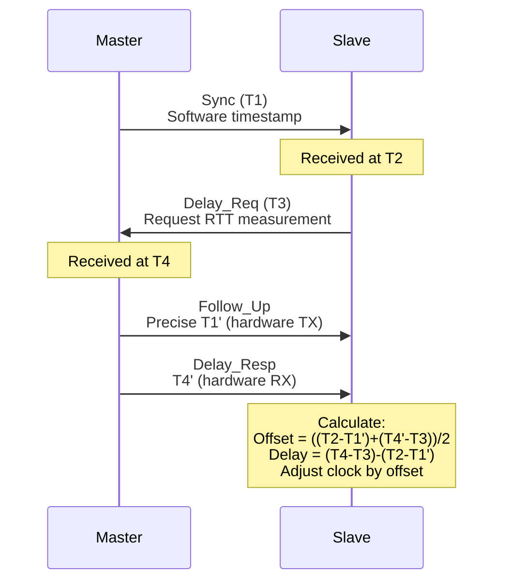
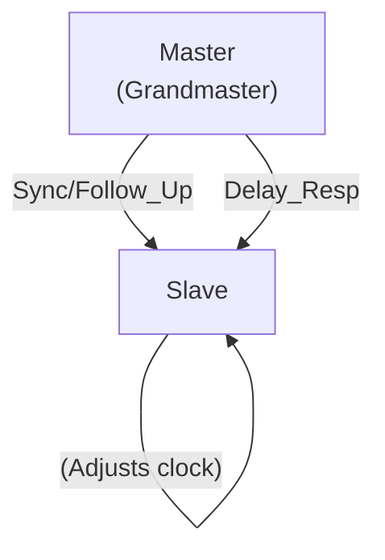

# PTP (Precision Time Protocol)

Precision Time Protocol provides sub-microsecond clock synchronization for time-sensitive applications
in local networks. PTP is used in data centers, high-frequency trading, telecom, and industrial automation
where nanosecond-level accuracy is critical.

## Overview

- **Layer:** Application (Layer 7), but uses hardware timestamps at L2/L1
- **Transport:** UDP ports 319 (events), 320 (general); also Ethernet type 0x88F7
- **Purpose:** Sub-microsecond clock synchronization (hardware-assisted)
- **Versions:** PTPv1 (IEEE 1588-2002), PTPv2 (IEEE 1588-2008)
- **Typical accuracy:** 1-100 nanoseconds (with hardware support)

---

## PTP vs NTP

| Property | NTP | PTP |
| --- | --- | --- |
| **Accuracy** | 1-50 ms | 1-100 ns |
| **Scope** | Wide area networks | Local networks (LAN) |
| **Hardware assist** | Software-only | Requires hardware timestamps |
| **Overhead** | Low (polling every 1024s) | Higher (frequent sync/follow-up) |
| **Complexity** | Simple | Complex |
| **Use case** | Logging, BGP timers | Trading, telecom, motion control |

---

## PTPv2 Packet Format (Event Messages)

### Sync Message (Master → Slave)

```text
 0                   1                   2                   3
 0 1 2 3 4 5 6 7 8 9 0 1 2 3 4 5 6 7 8 9 0 1 2 3 4 5 6 7 8 9 0 1
+-+-+-+-+-+-+-+-+-+-+-+-+-+-+-+-+-+-+-+-+-+-+-+-+-+-+-+-+-+-+-+-+
| transportSpecific |   messageType  |         reserved          |
+-+-+-+-+-+-+-+-+-+-+-+-+-+-+-+-+-+-+-+-+-+-+-+-+-+-+-+-+-+-+-+-+
|       versionPTP  |         messageLength                      |
+-+-+-+-+-+-+-+-+-+-+-+-+-+-+-+-+-+-+-+-+-+-+-+-+-+-+-+-+-+-+-+-+
|    domainNumber   |        reserved       |      flags        |
+-+-+-+-+-+-+-+-+-+-+-+-+-+-+-+-+-+-+-+-+-+-+-+-+-+-+-+-+-+-+-+-+
|                      correctionField (64 bits)                |
|                                                                 |
+-+-+-+-+-+-+-+-+-+-+-+-+-+-+-+-+-+-+-+-+-+-+-+-+-+-+-+-+-+-+-+-+
|                         reserved32                             |
+-+-+-+-+-+-+-+-+-+-+-+-+-+-+-+-+-+-+-+-+-+-+-+-+-+-+-+-+-+-+-+-+
|                  ClockIdentity (64 bits)                       |
|                                                                 |
+-+-+-+-+-+-+-+-+-+-+-+-+-+-+-+-+-+-+-+-+-+-+-+-+-+-+-+-+-+-+-+-+
|      sourcePortNumber             |     sequenceId             |
+-+-+-+-+-+-+-+-+-+-+-+-+-+-+-+-+-+-+-+-+-+-+-+-+-+-+-+-+-+-+-+-+
|        controlField               |    logMessageInterval      |
+-+-+-+-+-+-+-+-+-+-+-+-+-+-+-+-+-+-+-+-+-+-+-+-+-+-+-+-+-+-+-+-+
|                   originTimestamp (64 bits)                    |
|                                                                 |
+-+-+-+-+-+-+-+-+-+-+-+-+-+-+-+-+-+-+-+-+-+-+-+-+-+-+-+-+-+-+-+-+
```

### Follow_Up Message (Master → Slave, after Sync)

Contains precise timestamp of the Sync message transmission (hardware-captured).

```text
 0                   1                   2                   3
 0 1 2 3 4 5 6 7 8 9 0 1 2 3 4 5 6 7 8 9 0 1 2 3 4 5 6 7 8 9 0 1
+-+-+-+-+-+-+-+-+-+-+-+-+-+-+-+-+-+-+-+-+-+-+-+-+-+-+-+-+-+-+-+-+
| [Header as above]                                              |
+-+-+-+-+-+-+-+-+-+-+-+-+-+-+-+-+-+-+-+-+-+-+-+-+-+-+-+-+-+-+-+-+
|                     preciseOriginTimestamp                     |
|                          (64 bits)                             |
+-+-+-+-+-+-+-+-+-+-+-+-+-+-+-+-+-+-+-+-+-+-+-+-+-+-+-+-+-+-+-+-+
|                      [TLV extensions]                          |
+-+-+-+-+-+-+-+-+-+-+-+-+-+-+-+-+-+-+-+-+-+-+-+-+-+-+-+-+-+-+-+-+
```

### Delay_Req Message (Slave → Master)

Slave requests round-trip delay measurement.

```text
[Common header as above]
|                     originTimestamp (64 bits)                  |
|                      (slave's TX timestamp)                    |
+-+-+-+-+-+-+-+-+-+-+-+-+-+-+-+-+-+-+-+-+-+-+-+-+-+-+-+-+-+-+-+-+
```

### Delay_Resp Message (Master → Slave)

Master responds with receive timestamp of Delay_Req.

```text
[Common header as above]
|                      receiveTimestamp (64 bits)               |
|                       (master RX of Delay_Req)                |
+-+-+-+-+-+-+-+-+-+-+-+-+-+-+-+-+-+-+-+-+-+-+-+-+-+-+-+-+-+-+-+-+
```

---

## PTPv2 Message Types

| Type | Direction | Purpose |
| --- | --- | --- |
| **Sync (0x00)** | Master → Slave | Send time; slave adjusts clock |
| **Delay_Req (0x01)** | Slave → Master | Request round-trip delay |
| **Pdelay_Req (0x02)** | Peer → Peer | Peer delay measurement (P2P mode) |
| **Pdelay_Resp (0x03)** | Peer → Peer | Respond to peer delay request |
| **Follow_Up (0x08)** | Master → Slave | Precise Sync transmit timestamp |
| **Delay_Resp (0x09)** | Master → Slave | Respond to Delay_Req with RX time |
| **Pdelay_Resp_FollowUp (0x0A)** | Peer → Peer | Peer delay follow-up |
| **Announce (0x0B)** | Master → All | Master availability; priority |
| **Signaling (0x12)** | Both directions | Request/grant subscriptions |
| **Management (0x0D)** | Both directions | Administrative queries |

---

## PTP Synchronization Process (Slave Perspective)



**Key advantage:** Hardware timestamps on Follow_Up and Delay_Resp provide
picosecond precision.

---

## PTP Modes

### Master-Slave (E2E — End-to-End)

Traditional mode: slave requests delay from master.



### Peer-to-Peer (P2P)

Direct peer measurement; reduces hop latency; useful for daisy-chained networks.


---

## PTP Clock Classes & Grandmaster Selection

| Class | Accuracy | Source | Example |
| --- | --- | --- | --- |
| **6** | ±100 ns | PTP master | Precision time server |
| **7** | ±250 ns | GPS/Cesium-backed | Primary clock |
| **13** | ±10 µs | Filtered NTP | Secondary clock |
| **52** | ±1 ms | NTP (application) | Fallback timing |
| **187** | ±100 ms | No synchronization | Local free-running clock |
| **255** | Unknown | Undetermined | Clock not ready |

**Grandmaster Selection:** Grandmasters (masters) are elected based on best clock
class, accuracy, and priority.

---

## PTP Hardware Support

To achieve nanosecond accuracy, PTP requires:

1. **Hardware Timestamp Registers:** Network interface captures exact TX/RX times
2. **Sync Pulse:** Often outputs PPS (pulse-per-second) signal for external devices
3. **Oscillator Quality:** Local oscillator must be stable (GPS-disciplined preferred)

Modern enterprise switches and NICs include PTP support:

- Cisco switches: `ptp server` / `ptp client`
- Mellanox NICs: DPDK integration for PTP
- Intel/Broadcom NICs: Firmware support for hardware timestamps

---

## Ethernet-Based PTP (Layer 2)

PTP can run directly over Ethernet (EtherType 0x88F7) without UDP/IP overhead for
even lower latency.

```text
Ethernet Frame:
| DA | SA | EtherType (0x88F7) | PTP Message | FCS |
                                  ← Direct encapsulation
```

Advantages:

- Lower latency (no IP/UDP stack processing)
- Deterministic timestamps (no ARP, DHCP, etc.)
- Can synchronize network infrastructure itself

---

## Common Issues

| Issue | Cause | Fix |
| --- | --- | --- |
| **Poor accuracy** | No hardware timestamps | Enable PTP hardware assist in NIC firmware |
| **Master not elected** | Announce messages blocked | Check firewall rules for UDP 319/320 |
| **Slave won't sync** | Clock class mismatch or priority | Verify Grandmaster election and domain |
| **Asymmetric delay** | Network switch without PTP support | Deploy PTP-aware switches (transparent clock) |

---

## References

- IEEE 1588-2008: Precision Clock Synchronization Protocol
- RFC 5905: NTP Version 4 (for comparison)

---

## Next Steps

- Read [NTP](ntp.md) for wide-area synchronization
- See [NTP vs PTP](../theory/ntp_vs_ptp.md) comparison
- Configure PTP on your switches/routers (vendor-specific)
