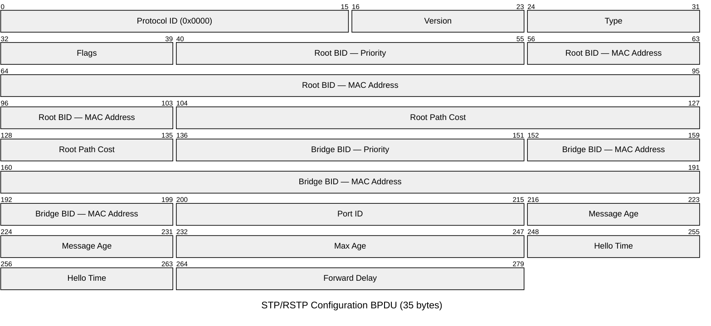
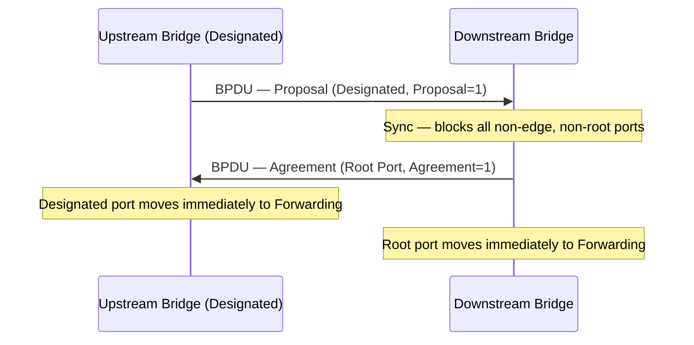

# STP / RSTP — Spanning Tree Protocol

STP (IEEE 802.1D) prevents Layer 2 loops in switched networks by placing redundant
links into a blocking state. RSTP (IEEE 802.1w, incorporated into 802.1D-2004) is
the current standard; it converges in 1–2 seconds rather than STP's 30–50 seconds.
MSTP (IEEE 802.1s, now part of 802.1Q) extends RSTP to map multiple VLANs to
independent spanning tree instances.

## Quick Reference

| Property | Value |
| --- | --- |
| **OSI Layer** | Layer 2 — Data Link |
| **Standard** | IEEE 802.1D (STP), IEEE 802.1D-2004 (RSTP), IEEE 802.1Q (MSTP) |
| **Wireshark Filter** | `stp` |
| **Encapsulation** | IEEE 802.3 with LLC (DSAP `0x42`, SSAP `0x42`) |
| **Destination MAC** | `01:80:C2:00:00:00` (Bridge Group multicast) |
| **Config BPDU Size** | 35 bytes |
| **TCN BPDU Size** | 4 bytes |

## BPDU Structure

BPDUs (Bridge Protocol Data Units) are the control messages exchanged by bridges.
The Configuration BPDU carries all spanning tree parameters.



## Field Reference

| Field | Bytes | Description |
| --- | --- | --- |
| **Protocol ID** | 2 | Always `0x0000`. Identifies this as an IEEE spanning tree BPDU. |
| **Version** | 1 | `0x00` = STP (802.1D), `0x02` = RSTP (802.1w), `0x03` = MSTP (802.1s). |
| **Type** | 1 | `0x00` = Configuration BPDU, `0x80` = TCN (Topology Change Notification) BPDU, `0x02` = RSTP/MST BPDU. |
| **Flags** | 1 | See Flags table below. |
| **Root Bridge ID** | 8 | 2-byte priority + 6-byte MAC address of the current Root Bridge. |
| **Root Path Cost** | 4 | Cumulative cost of the path from the sending bridge to the Root Bridge. |
| **Bridge ID** | 8 | 2-byte priority + 6-byte MAC address of the sending bridge. |
| **Port ID** | 2 | 4-bit port priority + 12-bit port number of the sending port. |
| **Message Age** | 2 | Time (in 1/256 seconds) since the Root Bridge originated this information. Incremented at each bridge hop. |
| **Max Age** | 2 | Maximum age for BPDU information. Default `20` seconds (in 1/256 s units: `5120`). |
| **Hello Time** | 2 | Interval between Configuration BPDUs sent by the Root Bridge. Default `2` seconds. |
| **Forward Delay** | 2 | Time spent in Listening and Learning states. Default `15` seconds. |

## Flags Byte (RSTP)

| Bit | Name | Description |
| --- | --- | --- |
| `0` | TC | Topology Change. Set to signal that a topology change has occurred. |
| `1` | Proposal | Sent by a Designated port initiating rapid transition. |
| `2–3` | Port Role | `00` = Unknown, `01` = Alternate/Backup, `10` = Root, `11` = Designated. |
| `4` | Learning | Port is in Learning state. |
| `5` | Forwarding | Port is in Forwarding state. |
| `6` | Agreement | Sent by a Root port in response to a Proposal, allowing immediate Forwarding. |
| `7` | TC Acknowledgment | Acknowledges receipt of a Topology Change BPDU. |

## Bridge ID

The 2-byte Priority field in the Bridge ID is divided into two sub-fields:

| Sub-field | Bits | Description |
| --- | --- | --- |
| **Bridge Priority** | 4 | Configurable priority in increments of 4096. Default `32768` (0x8000). Range `0`–`61440`. |
| **System ID Extension** | 12 | VLAN ID (in PVST+/Rapid PVST+) or MST instance number. Allows per-VLAN unique Bridge IDs without changing the base MAC. |

## Port States

| State | STP (802.1D) | RSTP (802.1w) | Learns MACs | Forwards Frames |
| --- | --- | --- | --- | --- |
| Blocking | Yes | — (part of Discarding) | No | No |
| Listening | Yes | — (part of Discarding) | No | No |
| Discarding | — | Yes | No | No |
| Learning | Yes | Yes | Yes | No |
| Forwarding | Yes | Yes | Yes | Yes |
| Disabled | Yes | Yes | No | No |

## Port Roles (RSTP)

| Role | Description |
| --- | --- |
| **Root Port** | The single port on a non-root bridge with the best path cost toward the Root Bridge. |
| **Designated Port** | The forwarding port on a network segment. One designated port exists per segment. |
| **Alternate Port** | A blocked port that offers an alternate path toward the Root Bridge. Immediately unblocks if the Root Port fails. |
| **Backup Port** | A blocked port that is a redundant path to a segment where the bridge already has a Designated Port. |

## Path Cost Defaults

| Link Speed | STP Cost (legacy 802.1D) | RSTP Cost (802.1D-2004) |
| --- | --- | --- |
| 10 Mbps | 100 | 2,000,000 |
| 100 Mbps | 19 | 200,000 |
| 1 Gbps | 4 | 20,000 |
| 10 Gbps | 2 | 2,000 |
| 100 Gbps | 1 | 200 |

## Root Election

The bridge with the lowest Bridge ID is elected Root Bridge. Bridge IDs are compared
first by priority (lower wins), then by MAC address (lower wins as tiebreaker). All
ports on the Root Bridge are Designated ports in Forwarding state.

## RSTP Rapid Convergence

RSTP eliminates timer-based convergence for point-to-point links by using a
Proposal/Agreement handshake.



## Cisco IOS-XE Configuration

```ios

! Set spanning tree mode
spanning-tree mode rapid-pvst

! Set bridge priority (lower = more likely to become root)
spanning-tree vlan 10 priority 4096

! PortFast — skip Listening/Learning on access ports
interface GigabitEthernet1/0/1
 spanning-tree portfast

! BPDU Guard — shut down a PortFast port if a BPDU is received
 spanning-tree bpduguard enable

! Root Guard — prevent a port from becoming Root port
interface GigabitEthernet1/0/2
 spanning-tree guard root
```

Verification:

```ios

show spanning-tree vlan 10
show spanning-tree vlan 10 detail
show spanning-tree interface GigabitEthernet1/0/1
```

## Notes

- **RSTP Proposal/Agreement:** Rapid transition applies only to point-to-point
  full-duplex links. Shared (half-duplex) ports still use STP timer-based convergence.
  Edge ports (PortFast) go directly to Forwarding without a handshake.
- **Cisco Rapid PVST+:** Cisco's per-VLAN implementation of RSTP. Runs an independent
  RSTP instance for each VLAN, using the System ID Extension to embed the VLAN ID in
  the Bridge ID. Enable with `spanning-tree mode rapid-pvst`.
- **PortFast:** Immediately transitions an access port to Forwarding, bypassing
  Discarding/Learning. Use only on ports connected to end hosts. Never enable on
  inter-switch links — if a BPDU is received on a PortFast port without BPDU Guard,
  the port loses its PortFast status and reverts to normal STP.
- **BPDU Guard:** Shuts down (`err-disabled`) a PortFast port the moment a BPDU is
  received. Prevents rogue or misconfigured switches from influencing the STP topology.
  Recovery: `errdisable recovery cause bpduguard`.
- **Root Guard:** Prevents a port from becoming a Root Port. If a superior BPDU is
  received on a Root Guard port, the port is placed in `root-inconsistent` state
  (blocking) and a log message is generated. Automatically recovers when the superior
  BPDUs stop.
- **Topology Change:** A TC event causes bridges to flush their MAC address tables,
  temporarily increasing flooding. Excessive TCs (logged as
  `%SPANTREE-2-ROOTPORT_LOST_BRIDGEASSURANCE`) can cause intermittent traffic drops
  and are worth investigating.
- **MSTP:** Maps VLANs to IST (Internal Spanning Tree) instances, reducing the number
  of active STP instances. Useful in large data-centre environments with many VLANs.
  Cisco calls its MSTP implementation MST; it is compatible with the IEEE standard.
