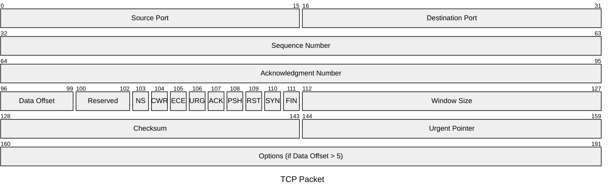

# TCP Header

TCP provides reliable, ordered, and error-checked delivery of a byte stream between
applications. The minimum header is 20 bytes; the Options field can extend it to
60 bytes. Data Offset indicates the actual header length in 32-bit words.

## Quick Reference

| Property | Value |
| --- | --- |
| **OSI Layer** | Layer 4 — Transport |
| **TCP/IP Layer** | Transport |
| **RFC** | RFC 9293 |
| **Wireshark Filter** | `tcp` |
| **IP Protocol** | `6` |

## Header Structure

## Field Reference

| Field | Bits | Description |
| --- | --- | --- |
| **Source Port** | 16 | Port number of the sending application. |
| **Destination Port** | 16 | Port number of the receiving application. |
| **Sequence Number** | 32 | Position of the first byte of this segment in the sender's byte stream. Used for ordering and reassembly. |
| **Acknowledgment Number** | 32 | Next sequence number the sender expects to receive. Valid only when ACK flag is set. |
| **Data Offset** | 4 | Header length in 32-bit words. Minimum `5` (20 bytes); maximum `15` (60 bytes). |
| **Reserved** | 3 | Must be zero. |
| **NS** | 1 | ECN nonce concealment protection (RFC 3540). |
| **CWR** | 1 | Congestion Window Reduced. Sender reduced its congestion window in response to an ECE signal. |
| **ECE** | 1 | ECN-Echo. Signals congestion to the sender when set in an ACK. |
| **URG** | 1 | Urgent pointer field is significant. |
| **ACK** | 1 | Acknowledgment number is valid. Set on all segments after the initial SYN. |
| **PSH** | 1 | Push. Receiver should pass buffered data to the application immediately. |
| **RST** | 1 | Reset the connection. Sent in response to an invalid segment or to abort a connection. |
| **SYN** | 1 | Synchronise sequence numbers. Set only on the first two segments of the three-way handshake. |
| **FIN** | 1 | No more data from the sender. Initiates the four-way connection termination. |
| **Window Size** | 16 | Number of bytes the sender is willing to receive, starting from the acknowledgment number. Forms the basis of TCP flow control. |
| **Checksum** | 16 | One's complement checksum over a pseudo-header (source/destination IP, protocol, segment length), TCP header, and payload. |
| **Urgent Pointer** | 16 | Offset from the sequence number to the last urgent byte. Valid only when URG is set. |
| **Options** | 0–320 | Variable-length options padded to a 32-bit boundary. Common options: MSS, Window Scale, SACK, Timestamps. |

## Notes

- **Three-way handshake:** SYN → SYN-ACK → ACK establishes a connection and
  synchronises sequence numbers in both directions.
- **Window Scale option** (RFC 1323) shifts the Window Size field left by up to 14
  bits, allowing windows up to 1 GB — essential for high-bandwidth, high-latency paths.
- **SACK (Selective Acknowledgment)** allows the receiver to acknowledge
  non-contiguous blocks, avoiding unnecessary retransmission of already-received data.
- **Timestamps option** enables RTT measurement and protects against sequence number
  wrap-around (PAWS) on fast connections.
