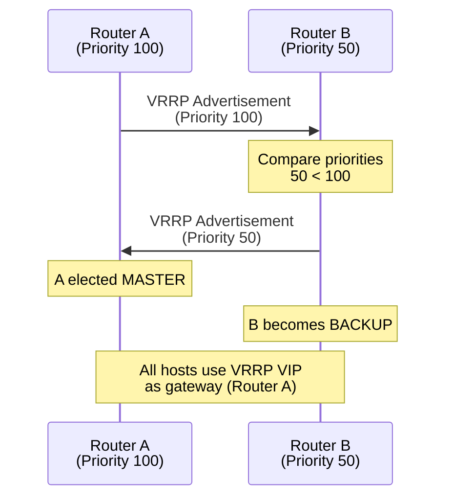
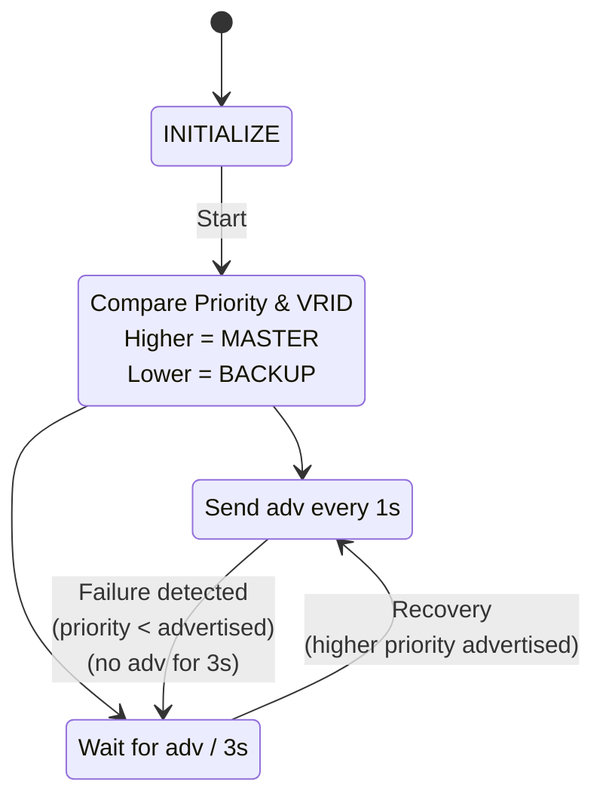
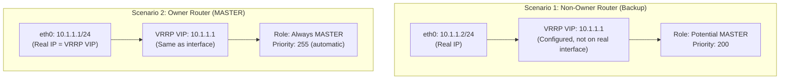
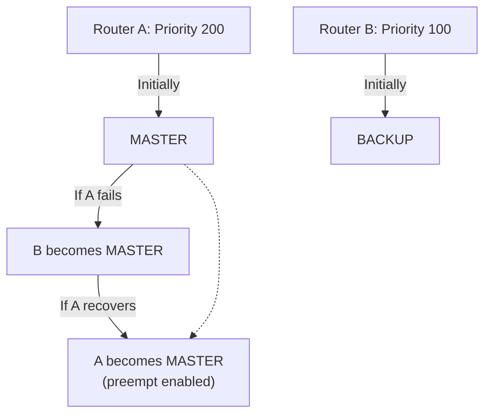
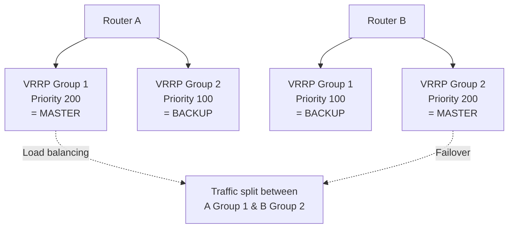

# VRRP (Virtual Router Redundancy Protocol)

Virtual Router Redundancy Protocol provides gateway redundancy by allowing multiple routers
to share a virtual IP address. VRRP automatically elects a Master router; if it fails, a Backup
takes over with minimal traffic loss.

## Overview

- **Layer:** Network (Layer 3)
- **IP Protocol Number:** 112
- **Destination IP:** 224.0.0.18 (all VRRP routers)
- **Purpose:** Gateway redundancy and failover
- **Versions:** VRRPv2 (IPv4, RFC 3768), VRRPv3 (IPv4/IPv6, RFC 5798)
- **Advertisement interval:** 1 second (default)

---

## VRRPv2 Packet Format

```text
 0                   1                   2                   3
 0 1 2 3 4 5 6 7 8 9 0 1 2 3 4 5 6 7 8 9 0 1 2 3 4 5 6 7 8 9 0 1
+-+-+-+-+-+-+-+-+-+-+-+-+-+-+-+-+-+-+-+-+-+-+-+-+-+-+-+-+-+-+-+-+
|Version| Type  |   Virtual Rtr ID   |  Priority    | Count IP |
+-+-+-+-+-+-+-+-+-+-+-+-+-+-+-+-+-+-+-+-+-+-+-+-+-+-+-+-+-+-+-+-+
|       Auth Type        |   Adver Int    |   Checksum        |
+-+-+-+-+-+-+-+-+-+-+-+-+-+-+-+-+-+-+-+-+-+-+-+-+-+-+-+-+-+-+-+-+
|                    IP Address (VRRP VIP)                     |
+-+-+-+-+-+-+-+-+-+-+-+-+-+-+-+-+-+-+-+-+-+-+-+-+-+-+-+-+-+-+-+-+
|                    IP Address (Optional, repeat)             |
|                                                                 |
+-+-+-+-+-+-+-+-+-+-+-+-+-+-+-+-+-+-+-+-+-+-+-+-+-+-+-+-+-+-+-+-+
|   Authentication Data (optional, 8 bytes, deprecated)        |
|                                                                 |
+-+-+-+-+-+-+-+-+-+-+-+-+-+-+-+-+-+-+-+-+-+-+-+-+-+-+-+-+-+-+-+-+
```

### Field Descriptions

| Field | Bits | Purpose |
| --- | --- | --- |
| **Version** | 4 | VRRP version (2 for VRRPv2, 3 for VRRPv3) |
| **Type** | 4 | 1=Advertisement |
| **VRID** | 8 | Virtual Router ID (1-255); identifies group |
| **Priority** | 8 | Election priority: 0-254 (0=stop, 255=owner); higher=preferred |
| **Count IP** | 8 | Number of IP addresses in packet |
| **Auth Type** | 8 | Deprecated (should be 0) |
| **Adver Int** | 8 | Advertisement interval in seconds |
| **Checksum** | 16 | VRRP packet checksum |
| **IP Address** | 32 | Virtual IP (VRRP VIP) or secondary addresses |

---

## VRRP Election Process



---

## Priority Values

| Priority | Role | Meaning |
| --- | --- | --- |
| **255** | Owner | Router owns the VRRP VIP; highest priority always |
| **200-254** | Master candidate | Will win election among non-owners |
| **1-199** | Backup candidate | Lower priority in election |
| **0** | Disabled | Router stops participating in VRRP group |

**Owner:** A router configured with the VRRP VIP as a real interface IP is the "owner" (priority 255).

---

## VRRP Timers

| Timer | Default | Meaning |
| --- | --- | --- |
| **Advertisement Interval** | 1 second | Master sends VRRP advertisements every 1s |
| **Master Down Interval** | 3 × adver int = 3s | Backup waits 3 seconds for Master advert before taking over |
| **Skew Time** | (256 - Priority) / 256 seconds | Prevents thundering herd on failover |

**Failover scenario:**

```text
T=0s: Master fails
T=1s: Backup misses 1st advertisement
T=2s: Backup misses 2nd advertisement
T=3s: Master Down Interval expires → Backup becomes MASTER
      All hosts now use Backup's MAC for VRRP VIP
      Traffic flows resume
```

---

## VRRP MAC Address

Virtual MAC derived from VRID:

```text
VRRP MAC: 00:00:5E:00:01:VRID

Example: VRRP group ID 10
MAC: 00:00:5E:00:01:0A

All routers in group use same MAC; ARP resolves VRRP VIP to this MAC.
Master router "owns" the MAC (responds to ARP).
Backup ignores ARP for VRRP VIP.
```

---

## VRRP State Machine



---

## VRRP VIP Ownership



**Owner always wins:** A router with VRRP VIP as a real interface IP cannot lose the MASTER role.

---

## Common Deployment Patterns

### Active-Backup (Single VRRP Group)



### Active-Active (Multiple VRRP Groups)



---

## VRRP vs HSRP vs GLBP

| Feature | VRRP | HSRP | GLBP |
| --- | --- | --- | --- |
| **Standard** | Open (IEEE) | Proprietary (Cisco) | Proprietary (Cisco) |
| **Load balancing** | No | No | Yes (all routers active) |
| **VIP ownership** | Can be shared | Cannot | Can be shared |
| **Failover time** | ~3 seconds | ~3 seconds | ~3 seconds |
| **IPv6 support** | VRRPv3 yes | No | No |
| **Complexity** | Low | Low | Higher |

---

## Common Issues

| Issue | Cause | Fix |
| --- | --- | --- |
| **Both routers MASTER** | Different VRID numbers; different groups | Verify VRID matches on both routers |
| **Slow failover** | Advertisement interval too long | Reduce to 1 second |
| **Rapid flapping** | Preempt enabled; priorities keep changing | Disable preempt or stabilize priorities |
| **VRRP VIP unreachable** | Master's MAC not responding to ARP | Verify VRRP enabled and running |

---

## References

- RFC 5798: Virtual Router Redundancy Protocol (VRRPv3)
- RFC 3768: Virtual Router Redundancy Protocol (VRRPv2)

---

## Next Steps

- See [HSRP vs VRRP Theory](../theory/hsrp_vs_vrrp.md) comparison
- Configure VRRP: [Cisco HSRP & VRRP](../cisco/cisco_hsrp_vrrp.md), [FortiGate VRRP](../fortigate/fortigate_vrrp.md)
