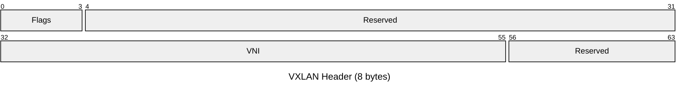
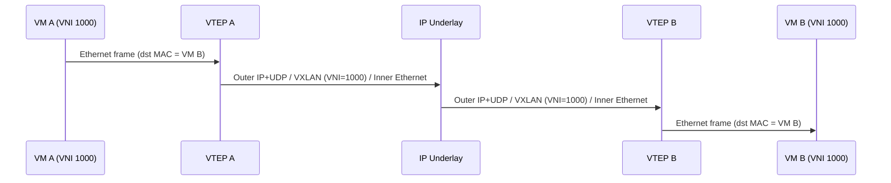

# VXLAN — Virtual Extensible LAN

VXLAN (RFC 7348) encapsulates Layer 2 Ethernet frames in UDP datagrams, allowing
Layer 2 segments to span Layer 3 networks. A 24-bit VNI (VXLAN Network Identifier)
extends the logical segment space from 4,096 VLANs to over 16 million segments.
VXLAN is the standard overlay technology for cloud provider networks and modern
data-centre fabrics.

## Quick Reference

| Property | Value |
| --- | --- |
| **OSI Layer** | Layer 2 overlay / Layer 3 transport |
| **RFC** | RFC 7348 |
| **Wireshark Filter** | `vxlan` |
| **UDP Destination Port** | `4789` |
| **Header Size** | 8 bytes (VXLAN header only; outer Ethernet+IP+UDP adds 42 bytes) |
| **Total Encapsulation Overhead** | 50 bytes (14 Eth + 20 IP + 8 UDP + 8 VXLAN) |

## Encapsulation Stack

Outer Ethernet frame → Outer IPv4/IPv6 header → Outer UDP header (dst port 4789) →
VXLAN header → Inner Ethernet frame (original L2 payload).

## VXLAN Header Structure

## Field Reference

| Field | Bits | Description |
| --- | --- | --- |
| **Flags** | 8 | Only bit 3 (the I flag) is defined. Must be set to `1` to indicate the VNI field is valid. All other bits are reserved and must be `0` on transmit (ignored on receive). |
| **Reserved** | 24 | Must be `0`. |
| **VNI** | 24 | VXLAN Network Identifier. Identifies the logical Layer 2 segment. Range 0–16,777,215. Analogous to a VLAN ID but with a vastly larger namespace. |
| **Reserved** | 8 | Must be `0`. |

## VTEP Operation

A VTEP (VXLAN Tunnel Endpoint) is the device that encapsulates outbound Ethernet
frames into VXLAN/UDP and decapsulates inbound VXLAN/UDP packets back to Ethernet.
A VTEP can be a physical switch (hardware VTEP), a hypervisor vSwitch, or a software
implementation.

## Notes

- **Flood-and-learn vs. BGP EVPN control plane:** RFC 7348 defines a flood-and-learn

  model where BUM (Broadcast, Unknown Unicast, Multicast) traffic is flooded to all
  VTEPs. Production deployments use a BGP EVPN control plane (RFC 7432 + RFC 8365) to
  distribute MAC/IP reachability as BGP routes, eliminating flooding entirely.

- **BUM handling without BGP EVPN:** Either multicast underlay groups (one multicast

  group per VNI) or ingress replication (head-end replication — the sending VTEP
  unicasts a copy to every known VTEP) must be configured for BUM traffic.

- **ECMP and flow hashing:** The UDP source port is typically set to a hash of the

  inner frame's L2–L4 headers. This allows underlay ECMP paths to load-balance
  individual VXLAN flows across multiple links.

- **MTU:** Total encapsulation overhead is 50 bytes. On a 1500-byte underlay MTU,

  inner frames are limited to 1450 bytes. Jumbo frames (MTU 9000+) on all underlay
  interfaces are strongly recommended to accommodate full-size inner frames without
  fragmentation.

- **Cloud overlays:** AWS VPC uses VXLAN internally for VPC segment isolation. Azure

  and GCP use similar proprietary overlay technologies built on the same principles.

- **Security:** VXLAN provides no encryption or authentication. Underlay network

  access controls (ACLs restricting UDP 4789) or IPsec encryption of the underlay are
  required if the underlay traverses untrusted segments.

- **VXLAN GPE:** VXLAN Generic Protocol Extension (draft-ietf-nvo3-vxlan-gpe)

  introduces a next-protocol field to the VXLAN header, enabling transport of non-
  Ethernet payloads (IP, NSH for service function chaining).
