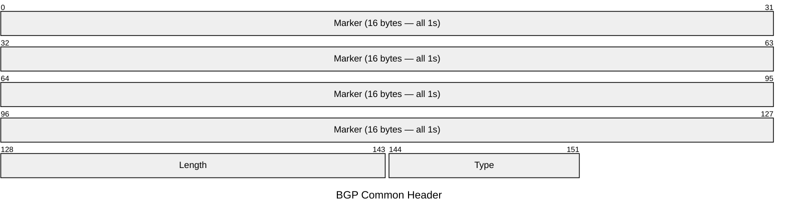
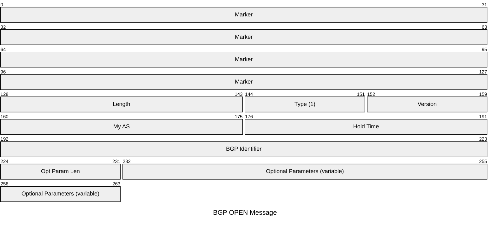
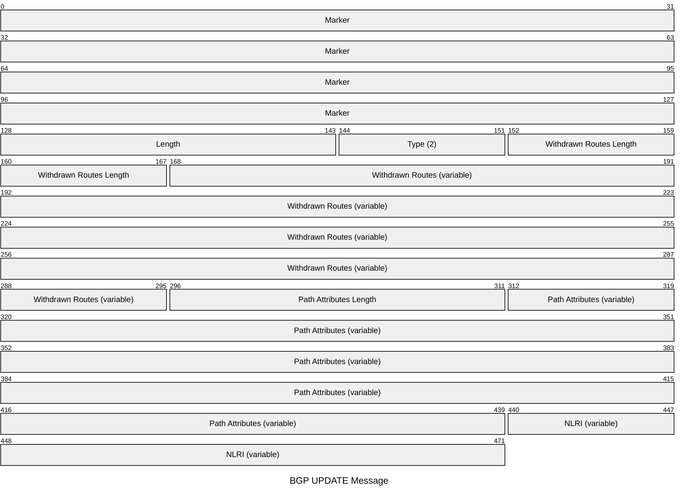
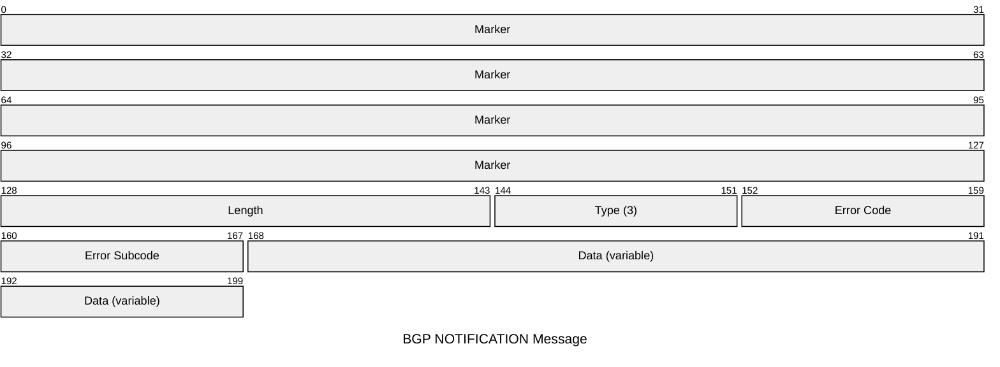
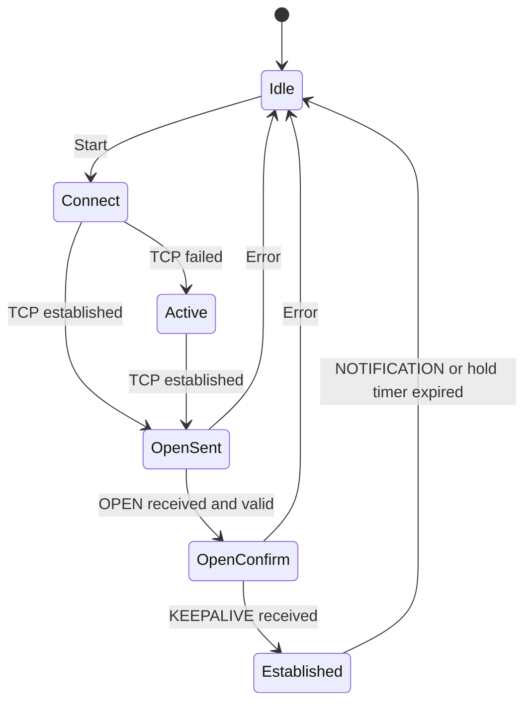

# BGP

The Border Gateway Protocol is the path-vector routing protocol that underlies
internet routing. BGP runs over TCP port 179, using the reliable transport to avoid
implementing its own retransmission. It carries reachability information (NLRIs)
alongside path attributes that allow policy-based route selection. BGP-4 (RFC 4271)
supports CIDR; extensions via capabilities negotiation (RFC 5492) enable MP-BGP,
graceful restart, and ADD-PATH.

## Quick Reference

| Property | Value |
| --- | --- |
| **OSI Layer** | Layer 7 — Application |
| **TCP/IP Layer** | Application |
| **RFC** | RFC 4271 (BGP-4) |
| **Wireshark Filter** | `bgp` |
| **TCP Port** | `179` |

---

## Common Header

Every BGP message begins with a 19-byte header.

| Field | Bits | Description |
| --- | --- | --- |
| **Marker** | 128 | All bits set to 1. Used for synchronisation and, historically, authentication. |
| **Length** | 16 | Total message length in bytes including the header. Minimum `19`; maximum `4096`. |
| **Type** | 8 | `1` OPEN, `2` UPDATE, `3` NOTIFICATION, `4` KEEPALIVE. |

---

## OPEN

Sent by each peer immediately after the TCP connection is established. Negotiates
session parameters.

| Field | Bits | Description |
| --- | --- | --- |
| **Version** | 8 | BGP version. Always `4`. |
| **My AS** | 16 | Sender's 2-byte AS number. AS `23456` (AS_TRANS) signals a 4-byte ASN in Optional Parameters. |
| **Hold Time** | 16 | Proposed hold time in seconds. Must be `0` or ≥ `3`. Negotiated to the lower of the two peers' values. |
| **BGP Identifier** | 32 | Router ID — typically the highest loopback IP. Unique within the AS. |
| **Opt Param Len** | 8 | Length of Optional Parameters in bytes. `0` if none. |
| **Optional Parameters** | Variable | Capability advertisements (MP-BGP, 4-byte ASN, graceful restart, ADD-PATH, route refresh). |

---

## KEEPALIVE

A KEEPALIVE is a bare 19-byte header (Type `4`, no additional data). Sent
periodically to prevent the hold timer from expiring. The keepalive interval is
typically one third of the hold time.

---

## UPDATE

Advertises new routes or withdraws previously advertised routes. A single UPDATE
may carry both withdrawals and new NLRIs.

| Field | Bits | Description |
| --- | --- | --- |
| **Withdrawn Routes Length** | 16 | Length in bytes of the Withdrawn Routes field. `0` if no withdrawals. |
| **Withdrawn Routes** | Variable | List of IPv4 prefixes being withdrawn. Each entry is a 1-byte length followed by the prefix. |
| **Path Attributes Length** | 16 | Length in bytes of the Path Attributes field. `0` if no new routes. |
| **Path Attributes** | Variable | Encoded attributes for the advertised routes. See common attributes below. |
| **NLRI** | Variable | Network Layer Reachability Information — list of IPv4 prefixes being advertised. |

### Common Path Attributes

| Type Code | Attribute | Description |
| --- | --- | --- |
| `1` | ORIGIN | Route origin: `0` IGP, `1` EGP, `2` Incomplete. |
| `2` | AS_PATH | Sequence of AS numbers the route has traversed. Used for loop prevention and policy. |
| `3` | NEXT_HOP | IPv4 address of the next-hop router. |
| `4` | MULTI_EXIT_DISC | MED — hints to external peers about preferred entry point into the AS. |
| `5` | LOCAL_PREF | Preferred exit point within the AS. Higher is preferred. Not sent to eBGP peers. |
| `6` | ATOMIC_AGGREGATE | Indicates a less-specific route was selected over more-specific. |
| `7` | AGGREGATOR | AS and router ID that performed route aggregation. |
| `8` | COMMUNITY | 32-bit tags for grouping routes for policy. Well-known: `NO_EXPORT` `0xFFFFFF01`, `NO_ADVERTISE` `0xFFFFFF02`. |
| `14` | MP_REACH_NLRI | Multiprotocol reachability (RFC 4760) — carries IPv6, VPN, and other AFI/SAFI NLRIs. |
| `15` | MP_UNREACH_NLRI | Multiprotocol withdrawal. |

---

## NOTIFICATION

Sent when an error is detected. The TCP connection is closed immediately after.

| Field | Bits | Description |
| --- | --- | --- |
| **Error Code** | 8 | Category of error. See table below. |
| **Error Subcode** | 8 | Specific error within the category. |
| **Data** | Variable | Diagnostic data — typically the offending field from the erroneous message. |

### Error Codes

| Code | Name |
| --- | --- |
| `1` | Message Header Error |
| `2` | OPEN Message Error |
| `3` | UPDATE Message Error |
| `4` | Hold Timer Expired |
| `5` | Finite State Machine Error |
| `6` | Cease (includes graceful shutdown subcode `6`) |

---

## Session State Machine

## Notes

- **eBGP vs iBGP:** eBGP peers are in different AS numbers (TTL=1 by default);
  iBGP peers are within the same AS. iBGP requires full mesh or route reflectors —
  it does not modify AS_PATH, so loop prevention relies on not re-advertising
  iBGP-learned routes to other iBGP peers.

- **4-byte ASNs** (RFC 6793) extend the AS space to 32 bits. The AS_PATH attribute
  uses the AS4_PATH attribute for compatibility with 2-byte-only speakers.

- **Graceful Restart** (RFC 4724) allows a restarting router to retain forwarding
  state while BGP reconverges. Peers advertise GR capability in OPEN Optional
  Parameters.

- **BFD** integration triggers faster session failure detection than the BGP hold
  timer alone — see the [BGP vs BFD comparison](../theory/bgp_bfd_comparison.md).
