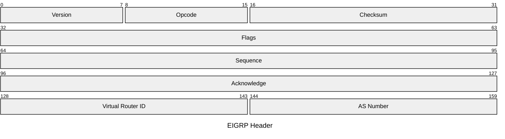
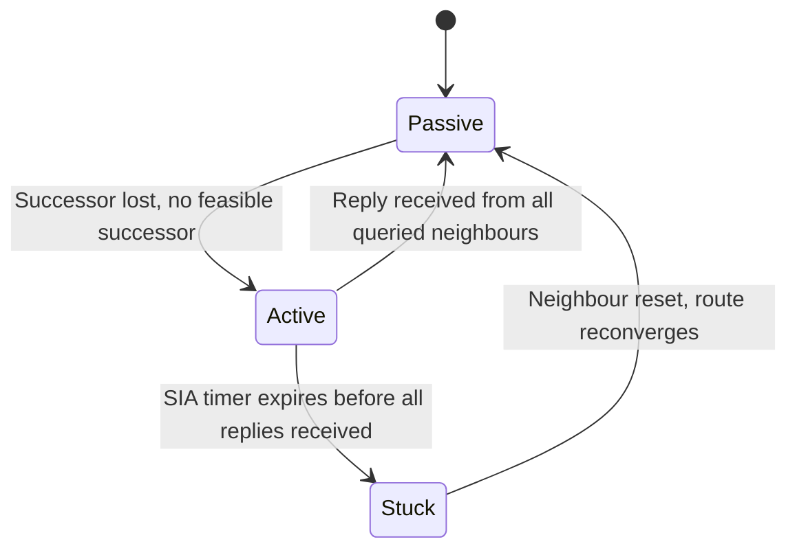

# EIGRP

Enhanced Interior Gateway Routing Protocol is a Cisco-developed advanced
distance-vector protocol that uses the Diffusing Update Algorithm (DUAL) to guarantee
loop-free paths and fast convergence. EIGRP runs directly over IP (protocol 88) and
uses reliable multicast delivery for most packet types. Originally Cisco-proprietary,
it was published as an informational RFC in 2016 (RFC 7868).

## Quick Reference

| Property | Value |
| --- | --- |
| **OSI Layer** | Layer 3 — Network |
| **TCP/IP Layer** | Internet |
| **RFC** | RFC 7868 |
| **Wireshark Filter** | `eigrp` |
| **IP Protocol** | `88` |
| **Multicast** | `224.0.0.10` (AllEIGRPRouters) |

---

## Packet Header

| Field | Bits | Description |
| --- | --- | --- |
| **Version** | 8 | EIGRP header version. Always `2`. |
| **Opcode** | 8 | Packet type. See table below. |
| **Checksum** | 16 | Standard IP checksum over the entire EIGRP packet. |
| **Flags** | 32 | `0x01` Init — first packet of a new adjacency. `0x02` Conditional Receive (CR). `0x04` Restart. `0x08` End-of-table. |
| **Sequence** | 32 | Sequence number for reliable delivery. `0` for unreliable packets. |
| **Acknowledge** | 32 | Sequence number being acknowledged. `0` if not an acknowledgement. |
| **Virtual Router ID** | 16 | Identifies the address family: `0x0001` IPv4 unicast, `0x0002` IPv6 unicast, `0x0080` multicast. |
| **AS Number** | 16 | Autonomous system number. Neighbours must share the same AS number to form an adjacency. |

---

## Packet Types (Opcodes)

| Opcode | Name | Delivery | Description |
| --- | --- | --- | --- |
| `1` | Update | Reliable multicast / unicast | Carries routing information. Sent when topology changes. |
| `2` | Request | Unreliable | Requests specific route information. |
| `3` | Query | Reliable multicast | Sent when a route is lost and no feasible successor exists. Neighbours must reply. |
| `4` | Reply | Reliable unicast | Response to a Query with the best metric or unreachable status. |
| `5` | Hello | Unreliable multicast | Discover and maintain neighbours. Also used as ACK when Acknowledge field is non-zero. |
| `8` | Ack | Unreliable unicast | Bare Hello with Acknowledge set — confirms receipt of a reliable packet. |
| `10` | SIA-Query | Reliable | Sent to a neighbour that has not replied to a Query within the SIA timer. |
| `11` | SIA-Reply | Reliable | Response to SIA-Query confirming the neighbour is still active. |

---

## TLV Structure

Following the header, EIGRP packets carry one or more Type-Length-Value (TLV) fields.

| Type | TLV | Description |
| --- | --- | --- |
| `0x0001` | Parameters | K-values and hold time used for neighbour negotiation. |
| `0x0003` | Sequence | List of neighbours that should not receive this multicast. |
| `0x0004` | Software Version | IOS version and EIGRP version for diagnostics. |
| `0x0005` | Next Multicast Sequence | Next sequence number for multicast packets. |
| `0x0102` | Internal Route (IPv4) | IPv4 route learned within the EIGRP AS. |
| `0x0103` | External Route (IPv4) | IPv4 route redistributed into EIGRP from another source. |

### Internal Route TLV (IPv4)

| Field | Bits | Description |
| --- | --- | --- |
| **Next Hop** | 32 | Next-hop address. `0.0.0.0` means use the sender's address. |
| **Delay** | 32 | Cumulative delay in units of 10µs. `0xFFFFFFFF` = unreachable. |
| **Bandwidth** | 32 | Inverse of bandwidth in units of 256 Kbps. Lowest bandwidth on path. |
| **MTU** | 24 | Smallest MTU on the path in bytes. |
| **Hop Count** | 8 | Number of hops to the destination. |
| **Reliability** | 8 | Worst-case reliability as a fraction of 255. |
| **Load** | 8 | Worst-case load as a fraction of 255. |
| **Prefix Length** | 8 | Length of the destination prefix in bits. |
| **Destination** | Variable | Destination network address (1–4 bytes depending on prefix length). |

---

## DUAL and Feasible Successors

EIGRP avoids routing loops using the **Feasibility Condition**: a neighbour's
reported distance to a destination must be strictly less than the local router's
feasible distance (the best known distance). Neighbours meeting this condition are
**Feasible Successors** — pre-computed backup paths installed instantly on failure
without querying.

## Notes

- **Composite metric** is calculated from bandwidth and delay by default

  (K1=1, K3=1, K2=K4=K5=0). Load and reliability (K2, K4, K5) are available
  but rarely used as they cause instability.

- **Unequal-cost load balancing** via the `variance` command allows EIGRP to

  install multiple paths with different metrics, proportional to their metric ratio.

- **BFD** provides sub-second failure detection for EIGRP neighbours independently

  of the Hello/hold timer — see the
  [EIGRP vs BFD comparison](../theory/eigrp_bfd_comparison.md).

- **Named mode** (IOS 15.0.1M+) consolidates all EIGRP configuration under a

  single `router eigrp <name>` stanza and is the preferred configuration style
  on modern IOS-XE.
