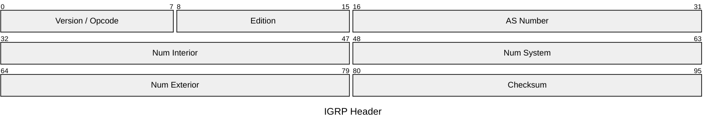
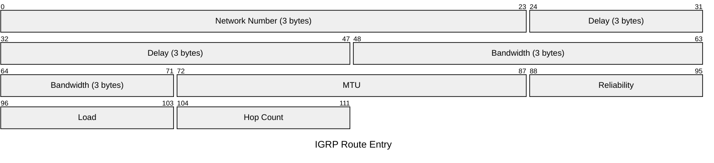

# IGRP

> **Deprecated.** IGRP was removed from Cisco IOS in release 12.3 (2004) and is no
> longer supported on any current Cisco platform. It is documented here for historical
> reference only. EIGRP is its direct replacement and successor.

The Interior Gateway Routing Protocol was a Cisco-proprietary distance-vector IGP
developed in the mid-1980s to overcome RIP's 15-hop limit and single-metric
limitation. IGRP uses a composite metric based on bandwidth, delay, reliability,
load, and MTU. It runs directly over IP (protocol 9) with no transport layer.
EIGRP (RFC 7868) superseded IGRP entirely.

## Quick Reference

| Property | Value |
| --- | --- |
| **OSI Layer** | Layer 3 — Network |
| **TCP/IP Layer** | Internet |
| **Standard** | Cisco proprietary — no RFC |
| **Wireshark Filter** | `igrp` |
| **IP Protocol** | `9` |
| **Status** | **Deprecated** — removed from IOS 12.3 (2004) |

---

## Packet Header



| Field | Bits | Description |
| --- | --- | --- |
| **Version / Opcode** | 8 | Upper 4 bits: version (always `1`). Lower 4 bits: opcode — `1` Update, `2` Request. |
| **Edition** | 8 | Incremented each time the routing table changes. Allows neighbours to detect stale updates. |
| **AS Number** | 16 | Autonomous system number. Routers must share the same AS number to exchange routes. |
| **Num Interior** | 16 | Number of interior route entries (subnets of the directly connected network). |
| **Num System** | 16 | Number of system route entries (other networks within the AS). |
| **Num Exterior** | 16 | Number of exterior route entries (routes outside the AS). |
| **Checksum** | 16 | Standard IP checksum over the IGRP packet. |

---

## Route Entry

Each route entry is 14 bytes, following the header.



| Field | Bits | Description |
| --- | --- | --- |
| **Network Number** | 24 | Last three octets of the destination network (classful — first octet inferred from address class). |
| **Delay** | 24 | Cumulative delay in units of 10µs. `0xFFFFFF` = unreachable. |
| **Bandwidth** | 24 | Inverse of the minimum bandwidth on the path in units of 1 Kbps. |
| **MTU** | 16 | Minimum MTU on the path in bytes. |
| **Reliability** | 8 | Worst-case interface reliability as a fraction of 255. |
| **Load** | 8 | Worst-case interface load as a fraction of 255. |
| **Hop Count** | 8 | Number of routers on the path. Maximum 255; default maximum 100. |

---

## Composite Metric

IGRP's metric is computed from the same K-value formula later adopted by EIGRP:

```text
Metric = [K1 × Bandwidth + (K2 × Bandwidth)/(256 - Load) + K3 × Delay]
         × [K5 / (Reliability + K4)]
```

Default K-values: K1=1, K2=0, K3=1, K4=0, K5=0, reducing to:

```text
Metric = Bandwidth + Delay
```

## Notes

- **Classful only** — IGRP carries no subnet mask, making VLSM impossible.
  This was a fundamental limitation compared to EIGRP and OSPF.
- **Broadcast updates** are sent every 90 seconds to `255.255.255.255`.
  The invalid timer is 270s; the flush timer is 630s — significantly slower
  than modern protocols.
- **No authentication** — any device on the segment can inject routes.
- IGRP and EIGRP can coexist and automatically redistribute routes between
  each other when configured with the same AS number (on IOS versions that
  still supported IGRP).
