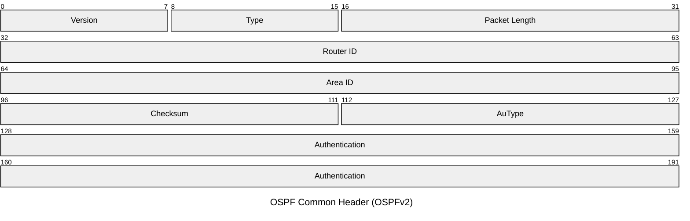
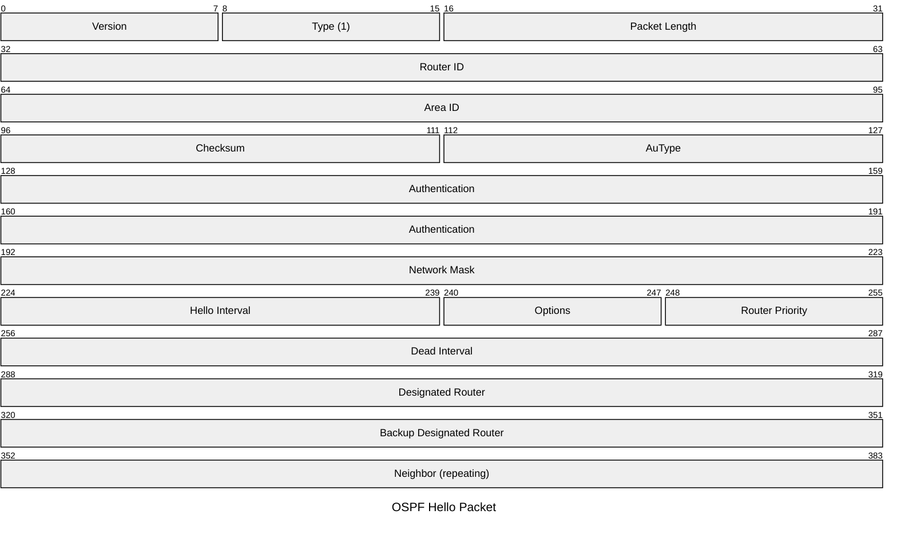

# OSPF

Open Shortest Path First is a link-state IGP that builds a complete topology map of
the network and runs Dijkstra's shortest-path algorithm to compute routes. Routers
flood Link State Advertisements (LSAs) to all routers in an area. OSPFv2 (RFC 2328)
operates over IPv4; OSPFv3 (RFC 5340) operates over IPv6. OSPF runs directly over IP
(protocol 89), not TCP or UDP.

## Quick Reference

| Property | Value |
| --- | --- |
| **OSI Layer** | Layer 3 — Network |
| **TCP/IP Layer** | Internet |
| **RFC** | RFC 2328 (OSPFv2), RFC 5340 (OSPFv3) |
| **Wireshark Filter** | `ospf` |
| **IP Protocol** | `89` |
| **Multicast** | `224.0.0.5` (AllSPFRouters), `224.0.0.6` (AllDRouters) |

---

## Common Header

All OSPF packets share a 24-byte (OSPFv2) common header.

| Field | Bits | Description |
| --- | --- | --- |
| **Version** | 8 | `2` for OSPFv2, `3` for OSPFv3. |
| **Type** | 8 | `1` Hello, `2` DBD, `3` LSR, `4` LSU, `5` LSAck. |
| **Packet Length** | 16 | Total length of the OSPF packet in bytes including the header. |
| **Router ID** | 32 | Unique identifier for the originating router, expressed as an IPv4 address. |
| **Area ID** | 32 | Area the packet belongs to. `0.0.0.0` = backbone area. |
| **Checksum** | 16 | Standard IP checksum over the entire OSPF packet. Not used in OSPFv3 (relies on IPv6 AH). |
| **AuType** | 16 | `0` None, `1` Simple password, `2` MD5 cryptographic. OSPFv3 omits this field. |
| **Authentication** | 64 | Authentication data. Content depends on AuType. Zero when AuType is 0. |

---

## Hello Packet

The Hello packet establishes and maintains neighbour adjacencies. It is sent
periodically on every OSPF-enabled interface.

| Field | Bits | Description |
| --- | --- | --- |
| **Network Mask** | 32 | Subnet mask of the originating interface. `0.0.0.0` on point-to-point links. |
| **Hello Interval** | 16 | Seconds between Hello packets. Typically `10`s (broadcast) or `30`s (NBMA). |
| **Options** | 8 | Capability bits: E (external routing), MC (multicast), N/P (NSSA), DC (demand circuit). |
| **Router Priority** | 8 | Used in DR/BDR election. `0` = ineligible. Higher wins. |
| **Dead Interval** | 32 | Seconds without a Hello before the neighbour is declared down. Typically `4 × Hello Interval`. |
| **Designated Router** | 32 | IP address of the DR on this segment. `0.0.0.0` if none elected. |
| **Backup Designated Router** | 32 | IP address of the BDR. `0.0.0.0` if none elected. |
| **Neighbor** | 32 | Router ID of each known neighbour. Repeated for each neighbour. |

---

## Packet Types

| Type | Name | Description |
| --- | --- | --- |
| `1` | Hello | Discover and maintain neighbours; elect DR/BDR. |
| `2` | Database Description (DBD) | Exchange LSA headers during database synchronisation. Includes sequence number and M/MS/I flags. |
| `3` | Link State Request (LSR) | Request specific LSAs from a neighbour after DBD exchange. |
| `4` | Link State Update (LSU) | Carry one or more LSAs. Used for flooding and responding to LSRs. |
| `5` | Link State Acknowledgment (LSAck) | Acknowledge receipt of LSAs. |

---

## LSA Types

| Type | Name | Description |
| --- | --- | --- |
| `1` | Router LSA | Every router; describes its interfaces and costs within an area. |
| `2` | Network LSA | Generated by DR; describes routers on a multi-access segment. |
| `3` | Summary LSA | Generated by ABR; advertises inter-area prefixes. |
| `4` | ASBR Summary LSA | Generated by ABR; advertises location of an ASBR. |
| `5` | AS External LSA | Generated by ASBR; advertises external (redistributed) routes. Flooded to all areas except stubs. |
| `7` | NSSA External LSA | Like Type 5 but flooded only within an NSSA; converted to Type 5 at the ABR. |
| `9–11` | Opaque LSA | Vendor/application-specific extensions (e.g. Traffic Engineering, RFC 3630). |

---

## Neighbour State Machine

```mermaid
stateDiagram-v2
    [*] --> Down
    Down --> Init : Hello received
    Init --> TwoWay : Own Router ID seen in neighbour's Hello
    TwoWay --> ExStart : DR/BDR elected; adjacency required
    ExStart --> Exchange : Master/slave agreed; DBD exchange begins
    Exchange --> Loading : DBD complete; LSR/LSU exchange
    Loading --> Full : All LSAs received
    Full --> Down : Dead interval expired or interface down
```

## Notes

- **DR/BDR election** reduces LSA flooding on multi-access segments (Ethernet).
  Only the DR and BDR form full adjacencies with all other routers; others remain
  in TwoWay state with each other.
- **Areas** limit LSA flooding scope. The backbone (area 0) interconnects all other
  areas via Area Border Routers (ABRs). Stub areas block Type 5 LSAs.
- **BFD** provides sub-second failure detection for OSPF adjacencies independently
  of the Dead Interval — see the [OSPF vs BFD comparison](../theory/ospf_bfd_comparison.md).
- **OSPFv3** removes the Authentication field from the common header (relying on
  IPsec AH/ESP instead), adds an Instance ID field, and uses IPv6 link-local
  addresses for neighbour communication.
