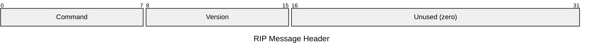
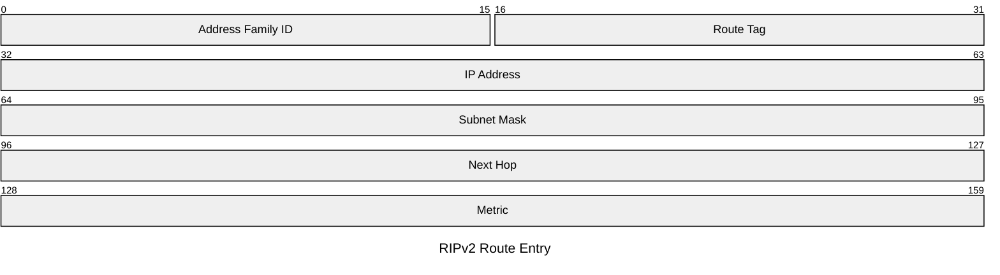

# RIP

The Routing Information Protocol is a distance-vector IGP that uses hop count as
its sole metric, with a maximum of 15 hops (16 = unreachable). RIPv1 (RFC 1058) is
classful and broadcasts updates; RIPv2 (RFC 2453) adds subnet masks, next-hop fields,
and multicast delivery. RIPng (RFC 2080) extends RIPv2 for IPv6. RIP is simple to
configure but unsuitable for large or complex networks due to its limited metric and
slow convergence.

## Quick Reference

| Property | Value |
| --- | --- |
| **OSI Layer** | Layer 7 — Application |
| **TCP/IP Layer** | Application |
| **RFC** | RFC 1058 (v1), RFC 2453 (v2), RFC 2080 (ng/IPv6) |
| **Wireshark Filter** | `rip` |
| **UDP Port** | `520` (v1/v2), `521` (RIPng) |
| **Multicast** | `224.0.0.9` (RIPv2), `FF02::9` (RIPng) |

---

## Message Header

| Field | Bits | Description |
| --- | --- | --- |
| **Command** | 8 | `1` Request — ask neighbours for their routing table. `2` Response — carry routing entries (periodic update or reply to request). |
| **Version** | 8 | `1` for RIPv1, `2` for RIPv2. |
| **Unused** | 16 | Must be zero. |

---

## Route Entry (RIPv2)

Up to 25 route entries follow the header. Each entry is 20 bytes.

| Field | Bits | Description |
| --- | --- | --- |
| **Address Family ID** | 16 | `2` = IPv4. `0xFFFF` in the first entry signals an authentication entry (RIPv2 only). |
| **Route Tag** | 16 | Carries external route information (e.g. originating AS). `0` for internal routes. Not used in RIPv1. |
| **IP Address** | 32 | Destination network address. |
| **Subnet Mask** | 32 | Subnet mask for the destination. `0.0.0.0` in RIPv1 (classful — mask inferred). |
| **Next Hop** | 32 | Explicit next-hop address. `0.0.0.0` means use the sender's address. RIPv2 only. |
| **Metric** | 32 | Hop count to destination. `1`–`15` valid; `16` = infinity (unreachable). |

---

## RIPv1 vs RIPv2 vs RIPng

| Feature | RIPv1 | RIPv2 | RIPng |
| --- | --- | --- | --- |
| IP version | IPv4 | IPv4 | IPv6 |
| Classful / CIDR | Classful | CIDR (subnet mask included) | CIDR |
| Updates | Broadcast `255.255.255.255` | Multicast `224.0.0.9` | Multicast `FF02::9` |
| Authentication | No | Yes (plain text or MD5) | No (relies on IPv6 AH/ESP) |
| Next-hop field | No | Yes | Yes (in separate prefix entry) |
| Route tag | No | Yes | Yes |
| UDP port | `520` | `520` | `521` |

---

## Timers

| Timer | Default | Description |
| --- | --- | --- |
| **Update** | 30s | Periodic full routing table broadcast/multicast. |
| **Invalid** | 180s | Route marked invalid (metric 16) if no update received. |
| **Hold-down** | 180s | After a route goes invalid, suppress better-metric updates for this period to prevent routing loops. |
| **Flush** | 240s | Route removed from the table entirely if still unreachable. |

## Notes

- **Split horizon** prevents a router from advertising a route back out the interface

  it was learned on, reducing routing loops. **Poison reverse** actively advertises
  routes learned on an interface back with metric 16 for faster loop prevention.

- **Triggered updates** (RFC 2453) send immediate partial updates when a route

  changes rather than waiting for the next periodic update, accelerating convergence.

- **Maximum 25 route entries** per message. Large routing tables require multiple

  UDP messages.

- RIP is not suitable for modern production networks. It has been largely replaced

  by OSPF and EIGRP in enterprise environments.
