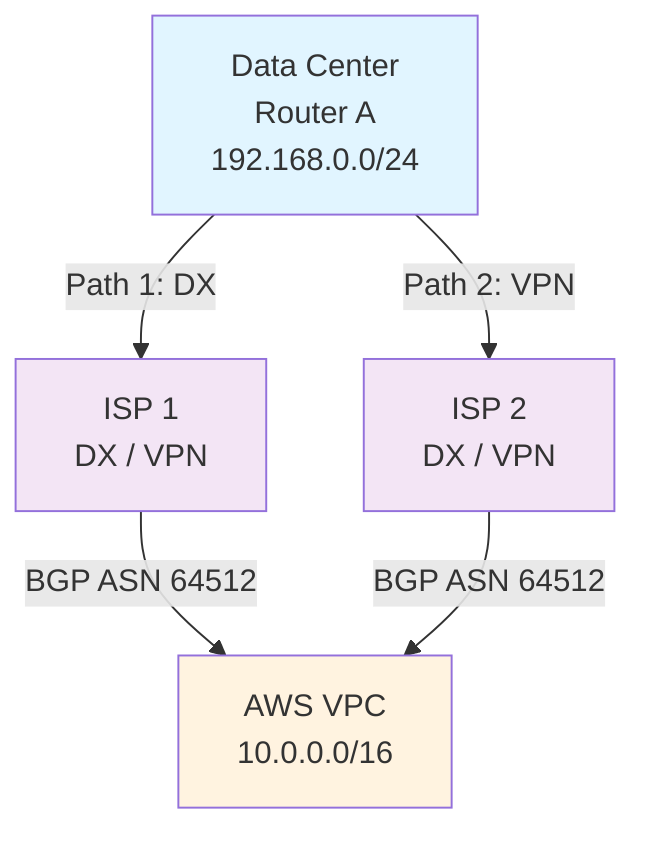
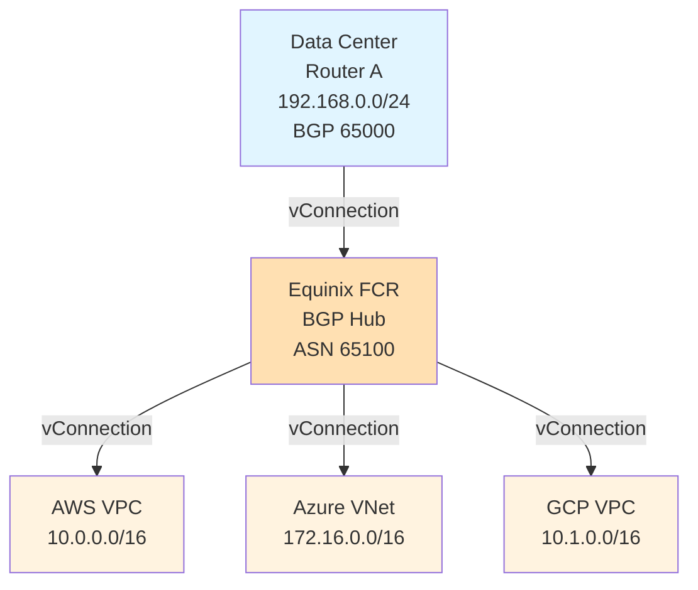
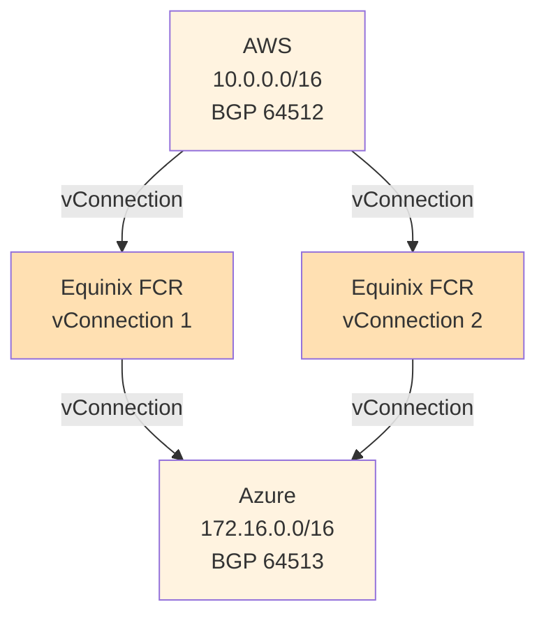

# Active-Active & Multi-Path Connectivity Design

Design patterns for active-active and multi-path connectivity between data centers and cloud
providers, and between multiple cloud providers. Covers load balancing strategies, ECMP (Equal-Cost
Multi-Path) routing, traffic engineering, and failover behavior.

For BGP configuration see [Cisco BGP & iBGP Design](../cisco/cisco_bgp_ibgp.md) and
[FortiGate BGP Config](../fortigate/fortigate_bgp_config.md). For cloud-specific BGP see
[AWS BGP Stack (Flagship)](../aws/bgp_stack_vpn_over_dx.md), [Azure BGP Stack (Flagship)](../azure/bgp_stack_vpn_over_expressroute.md),
[GCP BGP Stack (Flagship)](../gcp/bgp_stack_vpn_over_interconnect.md).

---

## At a Glance

| Aspect | Active-Active | Active-Passive | Hub-Spoke | Mesh |
| --- | --- | --- | --- | --- |
| **Traffic Distribution** | Simultaneous on all paths | Single path active | All traffic through hub | Direct peer paths |
| **Bandwidth Efficiency** | Maximum (additive) | Single path only | Limited by hub | Maximum |
| **Failover Speed** | <1s with BFD | Manual or 10-30s | <1s with BFD | <1s with BFD |
| **Load Algorithm** | Per-flow or per-packet hashing | N/A | Hub routing decisions | Per-flow hashing |
| **Complexity** | Medium (ECMP, BFD) | Low | Medium (hub management) | High (many peers) |
| **Use Case** | Maximize throughput; HA | Cost-sensitive; simplicity | Multi-cloud centralization | True resilience; no bottleneck |

---

## 1. Overview

### Active-Active vs Active-Passive

| Design | Traffic Pattern | Failover | Use Case |
| --- | --- | --- | --- |
| **Active-Active (ECMP)** | Both paths carry traffic simultaneously | Automatic; traffic shifts to healthy path | Maximize throughput; sub-second failover |
| **Active-Passive** | Primary path carries traffic; standby idle | Manual or BFD-triggered failover | Simplicity; cost optimization |

**Active-Active requires:**

- Equal-cost paths (same metric in routing protocol)
- Load balancing algorithm (per-flow or per-packet hashing)
- Equal or comparable latency/bandwidth

**Active-Passive requires:**

- Route metric differentiation (primary lower cost than backup)
- BFD or manual detection of primary failure
- Simpler configuration; less operational complexity

### Why Multi-Path Matters for DC-to-Cloud

1. **Redundancy** — If one path fails, traffic automatically shifts to others
1. **Throughput scaling** — Multiple parallel paths aggregate bandwidth
1. **Sub-second convergence** — BFD detects failures faster than routing protocols alone
1. **Cost optimization** — Balance load across multiple carriers or connection types

---

## 2. Multi-Path Architectures

### 2.1 DC to Single Cloud (Dual Connections)



**Design:**

- Data center router connects to cloud provider via two paths (DX + VPN, or DX + DX different carriers)
- Both paths announce same BGP prefix from cloud (AWS announces 10.0.0.0/16 on both connections)
- Data center receives two equal-cost routes; uses ECMP

**BGP Configuration (Data Center side):**

```ios
router bgp 65000
  neighbor 169.254.1.1 remote-as 64512     ! Path 1 (DX)
  neighbor 169.254.2.1 remote-as 64512     ! Path 2 (VPN)
  address-family ipv4
    neighbor 169.254.1.1 activate
    neighbor 169.254.2.1 activate
    ! Both neighbors receive same routes; if same cost, ECMP applied
end
```

**Cloud Side (AWS example):**

```bash
# Both VGW (DX) and VPN GW announce same prefix
# AWS automatically sets equal cost if configured identically
```

**Load Balancing:**

- Cisco uses flow-based hashing (per-destination or per-flow)
- FortiGate uses per-packet or per-flow hashing
- Result: traffic distributed across both paths

---

### 2.2 DC to Multiple Clouds (Hub-Spoke Multi-Cloud)



**Design:**

- Data center connects to Equinix FCR (or similar multi-cloud exchange)
- All clouds connect to same FCR hub
- Hub advertises all cloud routes; single point of control for load balancing

**BGP Configuration:**

```ios
! DC Router
router bgp 65000
  neighbor 169.254.1.1 remote-as 65100     ! Equinix FCR
  address-family ipv4
    neighbor 169.254.1.1 activate
    ! FCR advertises all cloud routes: 10.0.0.0/16, 172.16.0.0/16, 10.1.0.0/16
end

! Equinix FCR (Route Reflection)
router bgp 65100
  bgp router-id 10.255.0.1
  neighbor 169.254.1.2 remote-as 65000     ! DC Router
  neighbor 169.254.2.1 remote-as 65001     ! AWS
  neighbor 169.254.3.1 remote-as 65002     ! Azure
  neighbor 169.254.4.1 remote-as 65003     ! GCP
  address-family ipv4
    neighbor 169.254.1.2 route-reflector-client    ! DC is a client
    neighbor 169.254.2.1 route-reflector-client
    neighbor 169.254.3.1 route-reflector-client
    neighbor 169.254.4.1 route-reflector-client
end
```

**Advantages:**

- Single connection from DC reaches all clouds
- Hub provides route summarization and filtering
- Easier to manage security policies at hub

**Limitations:**

- Hub becomes bottleneck (single point of failure without redundant hub)
- All traffic passes through hub (added latency)

---

### 2.3 Cloud-to-Cloud Multi-Path (Direct Peering)



**Design:**

- Both clouds connect to Equinix FCR via multiple vConnections
- Creates mesh topology with redundancy at hub level
- Each cloud sees equal-cost paths through hub

**BGP Configuration (AWS side):**

```ios
router bgp 64512
  neighbor 169.254.1.1 remote-as 65100     ! Equinix via vConnection 1
  neighbor 169.254.2.1 remote-as 65100     ! Equinix via vConnection 2
  address-family ipv4
    neighbor 169.254.1.1 activate
    neighbor 169.254.2.1 activate
end
```

**Result:**

- AWS learns 172.16.0.0/16 (Azure) from both Equinix connections
- ECMP load-balances traffic across both paths
- If one vConnection fails, traffic uses the other

---

## 3. Load Balancing Methods

### Per-Flow Hashing (Default)

```text
Flow = {source IP, destination IP, protocol, source port, destination port}
Hash(Flow) mod number_of_paths = selected_path

Example:
  Flow 1: 192.168.1.10 → 10.0.0.20 (SSH) → Path 1
  Flow 2: 192.168.1.11 → 10.0.0.21 (SSH) → Path 2
  (Different flows use different paths; same flow always uses same path)
```

**Pros:**

- Preserves packet order (no reordering)
- Compatible with TCP (no out-of-order packet issues)
- Default on Cisco and FortiGate

**Cons:**

- Imbalanced if many flows go same source/destination pair

### Per-Packet Hashing

```text
Each packet is independently hashed, regardless of flow

Example:
  Packet 1 from Flow A → Path 1
  Packet 2 from Flow A → Path 2
  Packet 3 from Flow A → Path 1
  (Packets from same flow can use different paths)
```

**Pros:**

- Better load distribution if flows are bursty
- True per-packet distribution

**Cons:**

- Risk of out-of-order delivery (TCP must reorder)
- Higher CPU overhead on endpoints (reordering buffer)
- Not recommended for VPN or high-latency paths (divergent RTT)

### Weighted Load Balancing

If paths have unequal bandwidth or cost, weight them accordingly:

```text
Path 1: 100 Mbps → weight 1
Path 2: 50 Mbps  → weight 1/2

Distribution: 2/3 traffic on Path 1, 1/3 on Path 2
```

**Configuration:**

**Cisco:**

```ios
router bgp 65000
  address-family ipv4
    neighbor 169.254.1.1 weight 200        ! Path 1: weight 200
    neighbor 169.254.2.1 weight 100        ! Path 2: weight 100
    ! Higher weight = preferred path; 2:1 ratio
end
```

**FortiGate:**

```fortios
config router bgp
  set as 65000
  config neighbor
    edit "169.254.1.1"
      set weight 200
    next
    edit "169.254.2.1"
      set weight 100
    next
  end
end
```

---

## 4. ECMP in Detail

### ECMP Activation

ECMP is automatically enabled when multiple routes to the same destination have equal cost (metric).

**Requirements:**

1. **Same metric** — Routes must have identical cost

    - BGP default: AS-Path length
    - If AS-Path differs, highest metric loses (longer path deprioritized)
    - Solution: Use `bestpath as-path ignore` or `local-preference` to override
1. **Same next-hop weight** (optional) — Routes can have different BGP next-hops

1. **Maximum paths configured** — Default is often 1; increase to allow multiple:

```ios
! Cisco BGP
router bgp 65000
  address-family ipv4
    maximum-paths 4    ! Allow up to 4 ECMP paths
  exit-address-family
end
```

```fortios
! FortiGate BGP
config router bgp
  set maximum-paths 4
end
```

### ECMP Examples

#### Example 1: Equal AS-Path

```text
DC Router receives:
  Route: 10.0.0.0/16, Next-Hop: 169.254.1.1, AS-Path: 64512
  Route: 10.0.0.0/16, Next-Hop: 169.254.2.1, AS-Path: 64512
  (Same AS-Path length = ECMP)
```

#### Example 2: Unequal AS-Path (no ECMP)

```text
DC Router receives:
  Route: 10.0.0.0/16, Next-Hop: 169.254.1.1, AS-Path: 64512
  Route: 10.0.0.0/16, Next-Hop: 169.254.2.1, AS-Path: 64512 65999
  (Path 1 has shorter AS-Path; Path 2 loses. No ECMP unless configured.)
```

#### Fix: Override AS-Path comparison

```ios
router bgp 65000
  bgp bestpath as-path ignore
  ! OR use local-preference
  address-family ipv4
    neighbor 169.254.2.1 route-map PREFER-PATH2 in
  exit-address-family

route-map PREFER-PATH2 permit 10
  set local-preference 150    ! Higher local-pref = preferred
```

---

## 5. BFD for Fast Failover

ECMP distribution assumes all paths remain active. If a path fails but BGP takes 30+ seconds to
detect (route timers), traffic queues or blackholes.

**BFD (Bidirectional Forwarding Detection)** detects link failures in <1 second.

### BFD Over BGP

```ios
router bgp 65000
  neighbor 169.254.1.1 remote-as 64512
  neighbor 169.254.1.1 fall-over bfd single-hop
  ! BFD detects neighbor down in <1 second
end
```

```fortios
config router bgp
  config neighbor
    edit "169.254.1.1"
      set bfd enable
    next
  end
end
```

**Behavior:**

- BFD sends keepalive packets every 300 ms
- If 3 consecutive keepalives missed (900 ms total), link declared down
- BGP immediately removes route; ECMP adjusts
- Total failover time: <1 second

---

## 6. Design Patterns Summary

| Pattern | Throughput | Failover | Complexity | Best For |
| --- | --- | --- | --- | --- |
| **Dual DX (both active)** | 2x bandwidth | Sub-second | Medium | High-throughput DC-Cloud; cost allows |
| **DX + VPN backup** | DX bandwidth | 10-30s BGP | Low | Cost-sensitive; VPN as safety net |
| **Equinix hub (DC-to-clouds)** | Limited by hub | <1s with BFD | Medium | Multi-cloud simplicity; centralized control |
| **Cloud-to-cloud mesh** | Cloud egress limits | <1s with BFD | High | True HA multi-cloud; maximum resilience |
| **Active-passive (primary/backup)** | Single path | Manual or slow | Very low | Legacy; minimal complexity |

---

## 7. Monitoring Multi-Path Health

### Cisco BGP Routes

```ios
show ip bgp summary
! Verify all neighbors "up"

show ip route bgp | include 10.0.0.0
! Verify multiple equal-cost routes (ECMP)

show ip cef 10.0.0.0/16
! Show forwarding path (which next-hops are active)
```

### FortiGate BGP Routes

```fortios
get router info bgp summary
! Verify neighbor status

get router info routing-table bgp 10.0.0.0/16
! Show learned routes via BGP

diagnose ip route list
! Verify ECMP distribution in kernel
```

### BFD Status

**Cisco:**

```ios
show bfd session
! Lists BFD neighbors and status (UP/DOWN)
```

**FortiGate:**

```fortios
diagnose ip bfd session list
! Shows BFD peers and detection times
```

---

## Notes / Gotchas

- **ECMP Requires Identical Metrics:** Both routes must have the same cost/metric or ECMP will not
  activate. A longer BGP AS-Path deprioritizes a path unless overridden with
  `bestpath as-path ignore` or matching `local-preference`.

- **Per-Flow vs Per-Packet Tradeoff:** Per-flow hashing preserves TCP ordering but can cause
  imbalance with skewed source/destination pairs. Per-packet distributes better but risks
  out-of-order delivery on high-latency paths.

- **BFD + BGP Damping Interaction:** BFD detects failure in under a second, but BGP route
  dampening can suppress the prefix for 15+ minutes after multiple flaps. This is intentional
  protection against control-plane storms.

- **Hub Becomes Single Point of Failure:** Hub-and-spoke designs centralize routing but create a
  bottleneck. A dual-hub with route reflection mitigates this but adds complexity and cost.

- **Cloud Provider AS-Path Matching:** AWS, Azure, and GCP may assign different AS-Path lengths to
  equivalent routes. Verify both paths have identical AS-Path length, or use local-preference.

---

## See Also

- [BGP Convergence: Default Settings vs. BFD Integration](../theory/bgp_bfd_comparison.md)
- [eBGP vs iBGP](../theory/ebgp_vs_ibgp.md)
- [BFD Core Config Guide](../cisco/cisco_bfd_config_guide.md)
- [AWS BGP Stack (Flagship)](../aws/bgp_stack_vpn_over_dx.md)
- [Equinix Cloud-to-Cloud Interconnect](../equinix/equinix_cloud_to_cloud_interconnect.md)
