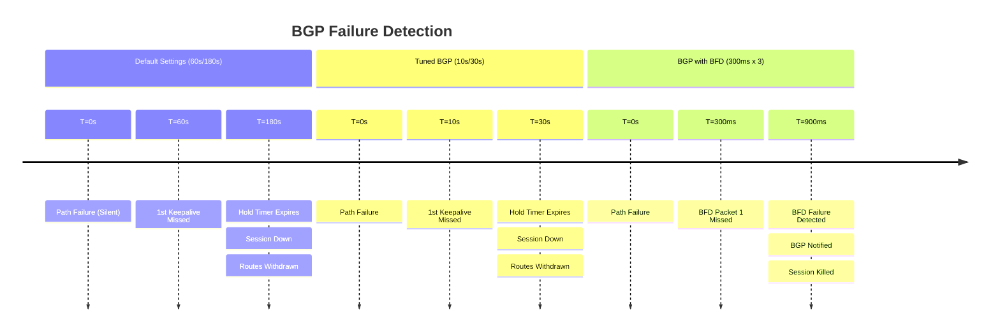
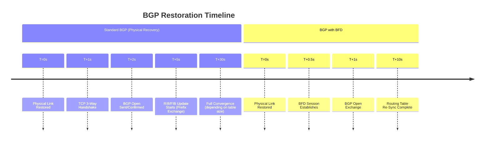

# BGP Convergence: Default Settings vs. BFD Integration

## At a Glance

| Aspect | Default Settings | Tuned BGP | BGP with BFD |
| --- | --- | --- | --- |
| **Keepalive / Hold Timer** | 60s / 180s | 10s / 30s | 60s / 180s (backup) |
| **Detection Time** | ~180 seconds | ~30 seconds | **< 1 second** |
| **CPU Impact** | Very low | Medium | Low (offloaded) |
| **Stability Risk** | None | Flapping | Low |
| **Route Withdrawn** | TCP timeout | Timer expire | Immediate |
| **Use Case** | Legacy/stable | Performance-sensitive | Production multi-hop |

---

## 1. Overview & Principles

BGP is an application-layer protocol (TCP/179) designed for stability and policy-based
routing rather than raw speed. By default, it uses high timers to prevent global
routing churn (flapping).

### The "Silent Failure" Problem

Because BGP runs over TCP, it cannot inherently detect a path failure unless the
underlying interface goes down or the TCP session times out. In complex environments
(like Direct Connect or multi-hop paths), a link may be "up" physically but unable
to pass traffic.

### BFD as the Trigger

BFD provides a sub-second notification to the BGP process. When BFD fails, BGP doesn't
wait for its hold-timer; it tears down the session and withdraws routes immediately.

### BGP Route Dampening

While BFD speeds up **detection**, BGP **restoration** can be slowed by dampening.
If a link flaps repeatedly, BGP will penalize the route and refuse to reinstall
it for a "suppress-time," regardless of how fast BFD comes back up.

## 2. Failure Detection & Restoration Timelines

### Failure Detection (Session Down)



### Restoration Timeline (Session Re-established)



## 3. Configuration Snippets

### Cisco IOS-XE BGP with BFD

```ios

router bgp 65000
 neighbor 10.1.1.2 remote-as 65001
 neighbor 10.1.1.2 fall-over bfd
 ! Keep default timers high for stability; BFD handles the speed
 neighbor 10.1.1.2 timers 60 180
```

### FortiGate BGP with BFD

```fortios

config router bgp
    config neighbor
        edit "10.1.1.2"
            set bfd enable
            set link-down-failover enable
        next
    end
end
```

## 4. Comparison Summary

| Metric | Default Settings | Tuned BGP | BGP with BFD |
| :--- | :--- | :--- | :--- |
| **Keepalive / Hold** | 60s / 180s | 10s / 30s | 60s / 180s (Backup) |
| **Detection Time** | ~180 Seconds | ~30 Seconds | **< 1 Second** |
| **CPU Impact** | Very Low | Medium | **Low (Offloaded)** |
| **Stability** | Very High | Moderate | **High** |
| **Recovery Logic** | TCP Timeout | Timer Expire | **Immediate Trigger** |

## 5. Verification & Troubleshooting

| Command | Purpose |
| :--- | :--- |
| `show bfd neighbors` | Verify active heartbeats and intervals. |
| `show ip bgp neighbors &#124; inc BFD` | Confirm BGP registration with the BFD process. |
| `get router info bfd neighbor` | (FortiGate) Verify NPU offload and session state. |
| `debug bfd event` | Monitor session transitions in real-time. |

---

### Engineering Guidance

- **Keep BGP Timers Conservative:** When using BFD, keep your BGP hold-timers at

    60s or higher. This prevents the BGP process from constantly checking the TCP
    stack, as BFD handles the "heavy lifting" of health checks.

- **BFD Multihop:** If peering over a firewall or load-balancer, ensure you use

    `fall-over bfd multihop` to allow for TTL variation.

- **Graceful Restart:** Pair BFD with BGP Graceful Restart to ensure the data plane

    continues to forward traffic even if the control plane BGP process restarts.

- **Dampening Awareness:** Be aware that BFD does not bypass BGP Dampening. If BFD

    triggers a session drop multiple times, the prefix may be suppressed for up
    to 60 minutes.

---

## Notes / Gotchas

- **BFD Requires Symmetry:** Both peers must support BFD and have it configured. If one side has
  BFD enabled but the other does not, that side falls back to TCP timeouts. Check
  `show ip bgp neighbors` for BFD registration.

- **Multihop BFD TTL Limits:** `bfd multihop` decrements TTL per hop. For paths crossing 10+
  hops, increase the `hop-count` parameter to avoid unexpected session terminations.

- **Dampening Penalizes Recovery:** BGP route dampening can delay route re-installation for
  15 minutes or longer even with sub-second BFD detection. Know your dampening thresholds
  before deploying BFD.

- **TCP Connection Establishment Still Matters:** BFD detects failure instantly, but a new TCP
  session after recovery takes 1–2 seconds. The BGP session is not "up" until the TCP
  handshake and Open exchange complete — this is the actual convergence bottleneck.

- **Graceful Restart Interaction:** If BGP Graceful Restart is enabled, a forwarding-plane hold
  is requested during restart. BFD failure during this hold is not detected by BGP. Ensure
  the GR timeout is shorter than the BFD hold timer.

---

## See Also

- [BFD (Bidirectional Forwarding Detection)](../theory/bfd_fundamentals.md)
- [BGP Fundamentals](../theory/bgp_fundamentals.md)
- [iBGP vs eBGP](../theory/ibgp_vs_ebgp.md)
- [BGP Communities](../reference/bgp_communities.md)
- [AWS Direct Connect BGP Stack](../aws/bgp_stack_vpn_over_dx.md)
