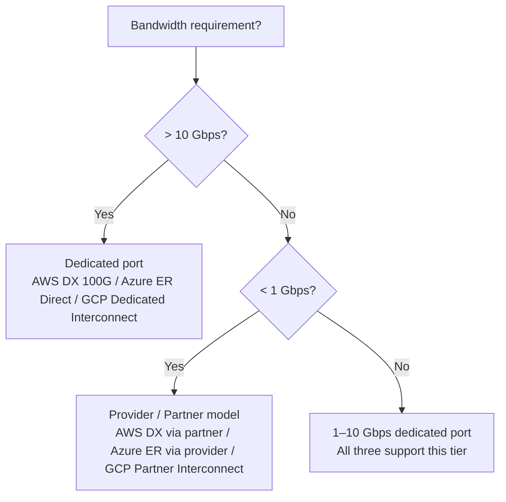

# Cloud Connectivity Comparison — AWS vs Azure vs GCP

Each cloud provider solves the same connectivity problems — private WAN, encrypted internet
tunnels, and transit routing between networks — but uses different product names, architectural
models, and BGP behaviours. This page maps equivalent concepts across all three providers and
highlights where behaviour diverges.

---

## Terminology Map

| Concept | AWS | Azure | GCP |
| --- | --- | --- | --- |
| **Private WAN connection** | Direct Connect (DX) | ExpressRoute | Cloud Interconnect |
| **Private WAN port speed** | 1 / 10 / 100 Gbps | 50 Mbps – 10 Gbps (provider); 1 / 10 / 100 Gbps (direct) | 10 / 100 Gbps (dedicated); 50 Mbps – 10 Gbps (partner) |
| **Logical layer over physical** | Virtual Interface (VIF) | Peering / Circuit | VLAN Attachment |
| **Peering types** | Private VIF, Transit VIF, Public VIF | Private Peering, Microsoft Peering | n/a (VLAN attachment attaches to Cloud Router) |
| **BGP termination (cloud side)** | Virtual Private Gateway (VGW) or Transit Gateway (TGW) | ExpressRoute Gateway / VPN Gateway | Cloud Router |
| **BGP termination (cloud ASN)** | 7224 (default VGW) | 12076 (MSEE — fixed) | 16550 (fixed) |
| **Customer-side ASN** | 1–4 byte public or private | 1–4 byte public or private | 1–4 byte public or private |
| **Transit hub** | Transit Gateway (TGW) | Virtual WAN (vWAN) Hub | Network Connectivity Center (NCC) |
| **VPC-to-VPC routing** | TGW route tables or VPC Peering | VNet Peering or vWAN | VPC Peering or NCC |
| **Internet VPN product** | Site-to-Site VPN | VPN Gateway | HA VPN |
| **VPN redundancy model** | Two tunnels per connection (active/active or active/passive) | Two tunnels; VNG active/passive or active/active | Two tunnels per HA VPN gateway (always active/active) |
| **VPN max throughput** | ~1.25 Gbps per tunnel | Up to 10 Gbps (VpnGw5) | ~3 Gbps per tunnel |
| **VPN routing** | Static or BGP | Static or BGP | BGP required |
| **Virtual network** | VPC | VNet | VPC |
| **Subnet routing** | Route Table | Route Table (User-Defined Routes) | VPC Routes |
| **Default route propagation** | Route propagation toggle on route table | BGP route propagation on VNG | Custom route advertisements on Cloud Router |
| **Site-to-site link between regions** | TGW peering | vWAN or Global VNet Peering | VPC Peering (global) or NCC |
| **Private connectivity to managed services** | VPC Endpoint (Interface / Gateway) | Private Endpoint / Private Link | Private Service Connect |
| **DNS** | Route 53 | Azure DNS / Private DNS Zone | Cloud DNS |

---

## Private WAN Connectivity

### Architecture Model

All three providers use the same physical model: a customer router connects to the
provider's edge via a cross-connect at a co-location facility (or via a network service
provider). The logical differences are significant.

| Aspect | AWS Direct Connect | Azure ExpressRoute | GCP Cloud Interconnect |
| --- | --- | --- | --- |
| **Physical speeds** | 1 / 10 / 100 Gbps dedicated port | 1 / 10 / 100 Gbps (Direct); provider handles sub-1G | 10 / 100 Gbps (Dedicated); Partner Interconnect for sub-10G |
| **Logical encapsulation** | 802.1Q VLAN-tagged VIFs over the port | Q-in-Q (provider model) or direct dot1q | 802.1Q VLAN Attachments |
| **Multiple logical connections** | One port → multiple VIFs (each with own VLAN + BGP session) | One circuit → Private Peering + Microsoft Peering (separate BGP sessions) | One port → multiple VLAN Attachments (each with own Cloud Router BGP session) |
| **Access to cloud-managed services** | Public VIF (public AWS IPs via BGP) | Microsoft Peering (O365, Azure PaaS via BGP + route filters) | Cloud Router only (no separate "public" peering) |
| **Route limit (inbound from on-prem)** | 100 prefixes (Private VIF); 200 (Transit VIF) | 4,000 prefixes | 100 prefixes per BGP session |
| **Static routing** | Not supported — BGP only | Not supported — BGP only | Not supported — BGP only |
| **SLA** | 99.99% (redundant connections) | 99.95% (standard); 99.99% (premium + redundant) | 99.99% (redundant VLAN attachments) |

### Key Terminology Differences

**AWS** calls the logical layer a **Virtual Interface (VIF)**. Three types exist:

- **Private VIF** — connects to a VGW attached to a single VPC
- **Transit VIF** — connects to a DX Gateway, which can reach a TGW and many VPCs
- **Public VIF** — reaches AWS public IP ranges (S3, DynamoDB, public APIs) without
  traversing the internet

**Azure** calls the logical layer **Peering**. Two types exist:

- **Private Peering** — reaches VNets via an ExpressRoute Gateway
- **Microsoft Peering** — reaches Azure PaaS and O365 public endpoints; requires a
  public ASN and route filter configuration

**GCP** uses **VLAN Attachments**. There is only one type — each attachment connects to
a Cloud Router, which handles all BGP and routing. Access to Google APIs over private
connectivity uses Private Service Connect or private.googleapis.com ranges, advertised
via the same Cloud Router.

---

## VPN

| Aspect | AWS Site-to-Site VPN | Azure VPN Gateway | GCP HA VPN |
| --- | --- | --- | --- |
| **Tunnel model** | 2 tunnels per VPN connection | 2 tunnels per connection | 2 tunnels per HA VPN gateway |
| **Max throughput** | ~1.25 Gbps per tunnel | Up to 10 Gbps (VpnGw5 SKU) | ~3 Gbps per tunnel |
| **ECMP across tunnels** | Yes (BGP required) | Yes (active/active VNG required) | Yes (BGP required; always active/active) |
| **Routing** | Static or BGP | Static or BGP | BGP only |
| **IKE versions** | IKEv1 and IKEv2 | IKEv1 and IKEv2 | IKEv2 only |
| **NAT-T** | Supported | Supported | Supported |
| **Attached to** | VGW or TGW | VNet (VPN Gateway resource) | Cloud Router (via Cloud VPN Gateway) |
| **BGP ASN (cloud side)** | 7224 (default VGW) or TGW ASN (configurable) | 65515 (default VNG) | 16550 (Cloud Router) |
| **Typical use case** | Backup path over DX; branch VPN | Backup path over ER; branch VPN | Primary for sites below interconnect threshold |

### Redundancy Comparison

**AWS:** Each VPN connection has two IPsec tunnels terminating at different AWS
endpoints for resilience. When attached to a TGW, multiple VPN connections can ECMP
for higher aggregate throughput.

**Azure:** A VPN Gateway in active/passive mode fails over automatically; active/active
mode provides two public IPs, two tunnels, and ECMP from on-premises. Upgrading from
active/passive to active/active requires a gateway SKU change (Brief outage).

**GCP:** HA VPN is always active/active. Two external IPs are assigned to the HA VPN
gateway, and both tunnels carry traffic simultaneously. BGP is mandatory — there is no
static routing option with HA VPN.

---

## Transit Routing

This is where the three providers diverge most significantly in both architecture and
terminology.

| Aspect | AWS Transit Gateway (TGW) | Azure Virtual WAN (vWAN) | GCP Network Connectivity Center (NCC) |
| --- | --- | --- | --- |
| **Model** | Customer-managed hub; explicit route tables | Managed hub (Microsoft-managed routing) | Hub-and-spoke; Google-managed routing |
| **VPC/VNet attachment** | TGW attachment per VPC | VNet connection to vWAN Hub | VPC spoke to NCC Hub |
| **On-prem attachment** | DX (Transit VIF) or Site-to-Site VPN | ExpressRoute or VPN Gateway in Hub | Interconnect or HA VPN via Cloud Router |
| **Inter-region transit** | TGW peering across regions | vWAN Standard Hub handles inter-region natively | NCC hub routes globally by default |
| **Routing control** | Route tables per attachment (propagation + static) | Custom route tables in vWAN Hub | Route policies on NCC Hub |
| **Transitive routing (VPC-to-VPC)** | Yes — via TGW route tables | Yes — native in vWAN hub | Yes — via NCC hub |
| **SD-WAN integration** | Supported (VPN tunnel ECMP) | Native SD-WAN partner integration in vWAN | Limited |
| **Bandwidth limit** | 50 Gbps per VPC attachment | Hub SKU dependent | No published limit per spoke |
| **Cost model** | Per attachment + per GB | Per connection + per GB | Per VLAN attachment + per GB |

### Conceptual Differences

**AWS TGW** gives the customer full control over route tables. Each attachment (VPC,
VPN, DX) has explicit route propagation rules and can be associated with different
route tables to achieve network segmentation. Every routing decision is visible and
configurable.

**Azure vWAN** abstracts the hub routing — Microsoft manages the hub router. Customers
configure route tables and policies but cannot control the underlying routing engine
directly. This simplifies operations but reduces flexibility. Virtual WAN Standard Hub
is required for transitive routing; Basic Hub only supports VPN.

**GCP NCC** is the newest of the three and the most opinionated. The hub is
Google-managed; spokes are attached Cloud Router/Interconnect or HA VPN resources.
Route exchange between spokes is automatic. NCC also supports SD-WAN appliances as
spokes (router appliances), allowing branch-to-GCP and branch-to-branch routing
through GCP.

---

## BGP Behaviour

| Aspect | AWS | Azure | GCP |
| --- | --- | --- | --- |
| **Cloud-side ASN** | 7224 (VGW default); TGW ASN configurable | 12076 (MSEE — always fixed) | 16550 (Cloud Router — always fixed) |
| **Customer ASN** | Any valid public or private ASN | Any valid public or private ASN | Any valid public or private ASN |
| **Inbound path preference (on-prem → cloud)** | Local Preference on customer router | Local Preference on customer router | MED advertised by GCP; customer sets MED |
| **Outbound path preference (cloud → on-prem)** | AS-path prepending from on-prem | AS-path prepending; BGP communities for weight | Cloud Router advertises equal MEDs by default; prepend to influence |
| **BGP communities (inbound)** | Supported on Public VIF | Supported; used to scope Microsoft Peering routes | Not used for Interconnect |
| **BGP communities (outbound from cloud)** | AWS tags routes with communities; documented | Azure uses communities for route scope | GCP does not advertise communities |
| **ECMP across paths** | Yes — TGW supports multipath | Yes — ER Gateway with FastPath; VNG active/active | Yes — Cloud Router supports multipath per VLAN attachment |
| **Route advertisements from cloud** | VPC CIDRs only (VGW/TGW advertise attached VPC prefixes) | VNet address space + connected peered VNets | VPC CIDR + GCP routes per router configuration |
| **Default route injection** | Optional; not injected by default | VNG can inject 0.0.0.0/0 to on-prem | Cloud Router does not inject default route by default |

---

## Redundancy Models

### Minimum Recommended Redundancy

| Provider | Minimum | Recommended Production |
| --- | --- | --- |
| **AWS DX** | Single DX connection, two VIFs | Two DX connections at different DX locations |
| **Azure ER** | Single circuit, two physical links (provider handles) | Two circuits in different peering locations |
| **GCP Interconnect** | Two VLAN attachments in same metro | Two VLAN attachments in different metros |

### VPN as Backup Path

All three providers support using an IPsec VPN as a backup for the private WAN
connection. The model is the same in each case:

1. Private WAN (DX / ER / Interconnect) carries traffic normally with a higher BGP
   Local Preference
1. VPN tunnel is maintained in hot-standby with a lower Local Preference
1. If the private WAN BGP session drops, traffic fails over to the VPN tunnel within
   the BFD or BGP hold-time window

Refer to the provider-specific BGP stack guides for configuration:

- [AWS — BGP stack over DX](../aws/bgp_stack_vpn_over_dx.md)
- [Azure — BGP stack over ExpressRoute](../azure/bgp_stack_vpn_over_expressroute.md)
- [GCP — BGP stack over Interconnect](../gcp/bgp_stack_vpn_over_interconnect.md)

---

## Decision Guide

### Which Private WAN Product?

### TGW vs vWAN vs NCC

| Requirement | Best Fit |
| --- | --- |
| Fine-grained routing control between VPCs | AWS TGW |
| Simplified ops; Microsoft manages hub routing | Azure vWAN |
| Branch-to-branch routing via cloud backbone | GCP NCC (router appliance support) |
| SD-WAN integration with cloud hub | Azure vWAN (native partners) |
| Multi-region with single hub policy | Azure vWAN Standard or GCP NCC |
| Existing AWS-heavy footprint | AWS TGW |

---

## Common Gotchas

| Issue | AWS | Azure | GCP |
| --- | --- | --- | --- |
| **Fixed cloud ASN** | VGW default is 7224 but is configurable at creation | 12076 is always fixed — cannot change | 16550 is always fixed — cannot change |
| **Route limits** | 100 routes per Private VIF; 200 per Transit VIF — session resets if exceeded | 4,000 prefixes from on-prem | 100 prefixes per BGP session on VLAN attachment |
| **Public VIF / Microsoft Peering** | Public VIF requires a public ASN | Microsoft Peering requires a public ASN and route filters; misconfiguration leaks internet routes | GCP has no equivalent; use Private Service Connect for PaaS access |
| **Default route** | Not injected unless explicitly configured | VPN Gateway can inject; ER does not by default | Cloud Router does not inject by default |
| **VPN BGP ASN conflict** | Customer ASN must differ from 7224 | Customer ASN must differ from 65515 | Customer ASN must differ from 16550 |
| **Transitive routing** | VPCs cannot route to each other via VGW — TGW required | VNets cannot route transitively via ER Gateway — vWAN required | VPCs can peer globally; NCC adds on-prem transit |

---

## Newer Services & Management Plane Tools

### AWS Cloud WAN

**Cloud WAN** (launched 2022) is AWS's managed global WAN service that sits above Transit Gateway.
Rather than manually peering TGWs across regions, Cloud WAN provides a central policy engine (Core
Network Policy — a JSON document) that defines network segments and routing. Attachments include
VPCs, TGWs, SD-WAN (via Connect), and Direct Connect. Cloud WAN is increasingly the recommended
approach for new multi-region deployments; legacy TGW multi-region peering is being superseded.

| Aspect | Cloud WAN |
| --- | --- |
| **Model** | Managed global WAN with centralized policy (JSON) |
| **Policy language** | Core Network Policy (JSON document; declarative) |
| **Core concept** | Network Segments (isolated routing domains; like VRFs) |
| **Attachments** | VPCs, TGWs, SD-WAN (Connect), on-prem (DX or VPN via TGW) |
| **Multi-region routing** | Native — no manual TGW peering required |
| **Monitoring** | CloudWatch + integrated visualization in AWS console |
| **Cost model** | Per attachment + per GB (similar to TGW) |

### Azure Virtual Network Manager (AVNM)

**AVNM** (generally available 2023) is Azure's centralized management plane for VNet topology and
security policies at scale. It complements Virtual WAN (vWAN handles on-prem + branch; AVNM manages
VNet-to-VNet topology). AVNM uses **Network Groups** (logical groupings of VNets) and **Connectivity
Configurations** to deploy hub-and-spoke or mesh topologies without manually creating individual
peerings. Under the hood, it still uses VNet peering; AVNM is an orchestration layer.

| Aspect | AVNM |
| --- | --- |
| **Model** | Management plane for VNet topology and security policy |
| **Scope** | VNet-to-VNet connectivity; orthogonal to vWAN |
| **Core concepts** | Network Groups (logical VNet sets); Connectivity Configs (hub-spoke/mesh) |
| **Topology options** | Hub-and-Spoke, Mesh, or Hybrid |
| **Security policies** | Security Admin Configs (NSG rules applied across Network Groups at scale) |
| **Deployment** | Infrastructure-as-Code friendly (JSON or Bicep) |
| **Interaction with vWAN** | Complementary — vWAN for on-prem; AVNM for VNet topology |

### GCP Context

GCP has no direct equivalent to AVNM. **Network Connectivity Center (NCC)** already serves both roles:
it's the managed hub for on-prem connectivity (like vWAN) and supports VPC spokes natively. For
VNet topology management at scale, GCP relies on native global VPC peering (automatic, no
configuration) and NCC for hub-and-spoke topologies with on-prem. A direct management plane layer
for VPC topology is not necessary given global VPC peering defaults.

---

## References

- [AWS Direct Connect Setup](../aws/aws_direct_connect_setup.md)
- [Azure ExpressRoute Setup](../azure/azure_expressroute_setup.md)
- [GCP Cloud Interconnect Setup](../gcp/gcp_cloud_interconnect_setup.md)
- [Cloud Network Design Principles](cloud_network_design.md)
- [eBGP vs iBGP](ebgp_vs_ibgp.md)
