# Cloud Network Design Principles

Connecting on-premises infrastructure to public cloud providers introduces a distinct
set of design problems. The physical transport is no longer owned or controlled by the
organisation; routing policy must be expressed through BGP rather than static routes;
and the network perimeter must be rethought when compute resources span two or more
administrative domains. This guide covers the cross-cloud principles that apply
regardless of whether the destination is AWS, Azure, or GCP.

---

## Connectivity Options

Three categories of transport exist for reaching cloud providers from an on-premises
network. They differ significantly in latency predictability, bandwidth ceiling, and
the degree of isolation from shared internet infrastructure.

| Method | AWS | Azure | GCP | Bandwidth | Latency | Use case |
| --- | --- | --- | --- | --- | --- | --- |
| Internet VPN | Site-to-Site VPN | VPN Gateway | HA VPN | Up to ~1.25 Gbps | Variable; no SLA | Dev/test, backup path, small branch |
| Managed VPN (provider backbone) | Partner-hosted VPN over MPLS | Provider IPVPN (ExpressRoute Any-to-Any) | Partner Interconnect | 50 Mbps – 10 Gbps | Better than internet; provider SLA | Branches without co-location access |
| Dedicated private connection | Direct Connect | ExpressRoute | Dedicated Interconnect | 1 Gbps – 100 Gbps | Deterministic; no internet path | Production workloads; compliance; high throughput |

The dedicated private connection tier eliminates the shared internet entirely. Traffic
travels from the customer router to the cloud provider's edge over a physical
cross-connect
at a co-location facility. Latency is consistent hop-to-hop; the path does not traverse
the public internet at any point. This is the recommended model for production
workloads.

See the connection setup guides for each provider:
[AWS Direct Connect](../aws/aws_direct_connect_setup.md) ·
[Azure ExpressRoute](../azure/azure_expressroute_setup.md) ·
[GCP Cloud Interconnect](../gcp/gcp_cloud_interconnect_setup.md)

---

## Hub-and-Spoke vs Flat Mesh Topology

### Hub-and-Spoke

In a hub-and-spoke topology, a central transit VPC or VNet acts as the hub. All workload
VPCs (spokes) peer only with the hub, not with each other. On-premises connectivity
terminates in the hub, meaning spoke VPCs inherit access to on-premises resources
through the hub peering without requiring their own dedicated connection.

Centralised security inspection is the primary advantage. A firewall (FortiGate or Cisco
FTD/ASA) in the hub VPC can inspect all traffic entering or leaving the environment, and
all spoke-to-spoke traffic if routed through the hub. Egress to the internet is also
centralised, simplifying logging and policy.

The hub becomes a bottleneck for spoke-to-spoke traffic. Every packet between two spokes
traverses the hub twice. If the hub firewall is the inspection point, its throughput
limits aggregate east-west capacity. Latency for spoke-to-spoke flows is higher than it
would be with direct peering.

### Flat Mesh

In a flat mesh, VPCs peer directly with each other. Every VPC that needs to communicate
with another has a direct peering relationship. There is no hub and no inspection
chokepoint.

Latency for any VPC-to-VPC path is as low as the cloud provider's backbone permits.
There is no bottleneck switch in the forwarding path. The limitation is management
complexity: the number of peering relationships grows at O(n²) as VPCs are added, and
applying consistent security policy across all paths requires per-VPC controls rather
than a single centralised inspection point. VPC peering is also non-transitive in all
three cloud providers — a packet cannot traverse a peering to reach a third VPC, which
further constrains large flat mesh designs.

### Transit Services

AWS Transit Gateway (TGW), Azure Virtual WAN, and GCP Network Connectivity Center (NCC)
address the core limitation of hub-and-spoke without requiring a customer-managed hub
VPC. The transit service is a managed routing construct in the cloud provider's
backbone.
VPCs attach to it; routing between attachments is handled natively without traffic
passing through a customer-managed device.

This achieves hub-and-spoke topology — centralised control of what can communicate with
what — without the hub VPC becoming a throughput bottleneck. Security inspection can
still be inserted by routing specific traffic flows through a firewall attachment.

```mermaid
graph TD
    subgraph HubSpoke["Hub-and-Spoke (Customer-Managed Hub)"]
        HUB["Hub VPC<br/>(Firewall &#43; DX/ER/IC termination)"]
        SP1["Spoke VPC 1"]
        SP2["Spoke VPC 2"]
        SP3["Spoke VPC 3"]
        ONPREM1["On-Premises"]
        SP1 -- peering --> HUB
        SP2 -- peering --> HUB
        SP3 -- peering --> HUB
        ONPREM1 -- DX&#124;ER&#124;IC --> HUB
    end

    subgraph Transit["Transit Service (TGW &#47; vWAN &#47; NCC)"]
        TGW["Transit Service"]
        VP1["VPC 1"]
        VP2["VPC 2"]
        VP3["VPC 3"]
        ONPREM2["On-Premises"]
        VP1 -- attachment --> TGW
        VP2 -- attachment --> TGW
        VP3 -- attachment --> TGW
        ONPREM2 -- DX&#124;ER&#124;IC --> TGW
    end
```

---

## Shared Services VPC Pattern

Some infrastructure must be reachable from all VPCs and from on-premises: DNS resolvers,
Active Directory domain controllers, NTP servers, monitoring collectors, and
authentication services such as RADIUS or TACACS+. Distributing these into every VPC is
operationally expensive and creates consistency problems.

The standard pattern is a dedicated shared services VPC (or VNet) that is peered to all
workload VPCs and to the transit hub. Resources in any spoke VPC can reach the shared
services VPC through the normal peering or transit attachment. On-premises connectivity
— the Direct Connect, ExpressRoute circuit, or Interconnect — terminates only in the
hub or transit account. The shared services VPC does not require its own dedicated
connection back to on-premises; it inherits reachability through the hub.

This pattern reduces the number of BGP sessions, the number of on-premises connection
points, and the blast radius of a connectivity failure: if the dedicated connection goes
down, workload VPCs lose on-premises access but the shared services VPC continues to
function for inter-VPC traffic.

---

## IP Address Planning for Cloud

### Non-Overlapping RFC 1918 Space

Overlapping address space is the most common cause of routing failures in cloud
environments. VPC peering is non-transitive and relies on distinct CIDR blocks being
routable in both directions. If an on-premises subnet and a VPC subnet share the same
prefix, VPC peering fails silently from a routing perspective — the cloud provider drops
the peering connection or refuses to accept the overlapping route advertisement.

Allocate a discrete, non-overlapping RFC 1918 range to each cloud region before
provisioning any VPCs. Treat this allocation with the same discipline as on-premises
IPAM. A common approach:

| Allocation | Range | Notes |
| --- | --- | --- |
| On-premises core | 10.0.0.0/8 (subnetted) | Existing infrastructure; do not reuse in cloud |
| AWS production region | 172.16.0.0/16 | One /16 per region; sub-allocate /24s per VPC tier |
| Azure production region | 172.17.0.0/16 | Same model |
| GCP production region | 172.18.0.0/16 | Same model |
| Non-production / dev | 192.168.0.0/16 (subnetted) | Isolated; no peering to production |

A /16 per region provides 256 /24 subnets. A typical VPC uses four tiers — web, app,
data, management — each occupying one or more /24s. This leaves substantial space for
growth without requiring a re-addressing exercise.

### Cloud Provider Reserved Addresses

Each cloud provider reserves addresses within every subnet for internal use. These
addresses cannot be assigned to resources:

| Provider | Reserved per subnet | Addresses |
| --- | --- | --- |
| AWS | 5 addresses | Network address, VPC router (.1), DNS (.2), future use (.3), broadcast |
| Azure | 5 addresses | Network address, default gateway (.1), DNS mapping (.2–.3), broadcast |
| GCP | 4 addresses | Network address, default gateway (.1), second-to-last (penultimate), broadcast |

For /24 subnets this is not material. For /28 or /29 subnets used for transit links or
management ranges, the reserved count becomes significant — a /29 provides 8 addresses,
of which 4 or 5 are consumed before a single resource is assigned.

### APIPA / Link-Local BGP Addressing

169.254.x.x (APIPA / link-local) addresses appear in cloud BGP configurations and are
expected behaviour, not a configuration error. All three providers use link-local
addresses for BGP peering on certain connection types:

- **AWS Direct Connect**: the customer may choose APIPA addressing (169.254.0.0/16
  range) for the BGP session on a Private VIF or Transit VIF, eliminating the need to
  allocate routable /30 subnets for each VIF

- **Azure VPN Gateway** (active-active mode): uses 169.254.21.x and 169.254.22.x for
  the internal BGP peering between gateway instances

- **GCP HA VPN**: uses link-local addresses in the 169.254.0.0/16 range for BGP
  sessions over HA VPN tunnels

Do not apply access control lists or firewall rules that block 169.254.0.0/16 on
interfaces participating in cloud BGP sessions.

---

## BGP Design in Cloud

All three cloud providers use BGP exclusively for dedicated connections. There is no
static routing option for AWS Direct Connect, Azure ExpressRoute, or GCP Cloud
Interconnect. BGP design decisions made at this layer have direct consequences for
traffic engineering, redundancy, and security.

### AS Number Assignment

| Side | Recommendation |
| --- | --- |
| Customer on-premises | Private ASN 64512–65534 unless a public ASN is already held |
| AWS | ASN 7224 (fixed on AWS DX routers) |
| Azure | ASN 12076 (fixed on MSEE routers) |
| GCP | ASN 16550 (fixed on Google peering edge) |

Using a private ASN on-premises is standard practice for organisations without BGP
provider relationships. The private ASN is not advertised beyond the BGP session to the
cloud provider; it does not appear on the public internet.

### Prefix Advertisement Policy

On-premises routers should advertise specific prefixes to the cloud provider, not a
default route (0.0.0.0/0). Advertising a default route toward the cloud creates a
condition where any prefix the cloud provider does not have a more specific route for
will be forwarded back to the on-premises network — a potential route hijacking vector.

Cloud providers advertise the CIDR blocks of attached VPCs or VNets. With transit
services (TGW, Virtual WAN, NCC), the cloud provider may advertise all attached VPC
CIDRs as a summarised or per-prefix set depending on configuration. Each provider
imposes
a maximum prefix limit per BGP session:

| Provider &#124; Session type | Default prefix limit |
| --- | --- |
| AWS Private VIF | 100 |
| AWS Transit VIF | 200 |
| Azure Private Peering | 4,000 (Standard SKU) |
| GCP VLAN attachment | 100 |

Exceeding these limits causes the BGP session to be torn down. Aggregate on-premises
prefixes where possible, and monitor advertised prefix counts as the on-premises network
grows.

### BGP Communities and Traffic Engineering

All three providers support BGP communities or similar mechanisms for traffic
engineering:

- **AWS**: BGP communities on Direct Connect to influence Local Preference for inbound
  traffic. See [BGP Communities](../reference/bgp_communities.md)

- **Azure**: BGP communities to tag routes by Azure region; used with route filters on
  Microsoft Peering to control which services are reachable

- **GCP**: MED (Multi-Exit Discriminator) to influence path preference between multiple
  VLAN attachments or between Interconnect and HA VPN backup

Path selection behaviour across providers is documented in
[BGP Path Selection](../reference/bgp_path_selection.md).

---

## Security Design

### North-South Traffic

Traffic between on-premises and cloud (north-south) should be firewalled at the
dedicated connection termination point. On the on-premises side, a FortiGate or Cisco
ASA/FTD at the network edge applies policy before traffic enters the dedicated
connection. In the cloud, a firewall VM or appliance in the hub VPC inspects traffic
arriving from the on-premises direction before it reaches workload VPCs.

### East-West Traffic

Traffic between cloud resources (east-west) uses two layers of control:

1. **Security Groups (AWS/GCP) and Network Security Groups (Azure)**: stateful

   per-resource or per-subnet packet filters. These are the first and lowest-latency
   layer of control. Apply least-privilege rules at this layer.

2. **Centralised firewall inspection**: for deep packet inspection, IDS/IPS, or policy

   that cannot be expressed in Security Groups, route east-west traffic through a
firewall appliance in the hub VPC. This introduces latency and throughput constraints;
   apply it selectively to traffic flows that require application-layer inspection.

### Management Access

Do not expose management interfaces — SSH, HTTPS GUI — on public IP addresses. Cloud
resources with public IPs and open management ports are a primary attack surface for
credential-stuffing and exploitation of unpatched vulnerabilities. Use one of:

- **Jump host / bastion** in the management subnet of the shared services VPC, reachable
  only from on-premises via the dedicated connection

- **VPN** back to on-premises for management access, with the VPN terminating inside the
  cloud environment rather than on a public interface

---

## Redundancy Design

### Minimum Viable Redundancy

A single dedicated connection is a single point of failure regardless of the physical
redundancy within that provider's facility. At minimum, provision two connections
originating from different physical locations — different Direct Connect locations,
different ExpressRoute peering locations from different providers, or different GCP
colocation facilities in different metropolitan areas. A failure at one facility does
not affect the other.

| Redundancy model | Protection against | Notes |
| --- | --- | --- |
| Single connection | Nothing | Unacceptable for production |
| Dual connections, same location | Port &#124; router failure | Does not protect against facility failure |
| Dual connections, different locations | Facility failure | Recommended minimum for production |
| Dedicated connection &#43; VPN backup | Complete provider PoP failure | Cold standby; VPN bandwidth significantly lower |

### VPN as a Backup Path

A site-to-site VPN over the internet provides a cold standby path when the dedicated
connection fails. BGP AS-path prepending on the VPN path makes it less preferred than
the dedicated connection under normal conditions. When the dedicated connection's BGP
session drops, the on-premises router withdraws the more-preferred route and traffic
shifts to the VPN path automatically.

The VPN path will have lower bandwidth and higher, variable latency compared to the
dedicated connection. It is suitable as a failover path for critical control-plane
traffic and reduced-throughput data plane traffic, not as an equal-capacity primary
path.

For detailed BGP configuration over each connection type:

- [AWS BGP Stack](../aws/bgp_stack_vpn_over_dx.md)
- [Azure BGP Stack](../azure/bgp_stack_vpn_over_expressroute.md)
- [GCP BGP Stack](../gcp/bgp_stack_vpn_over_interconnect.md)
