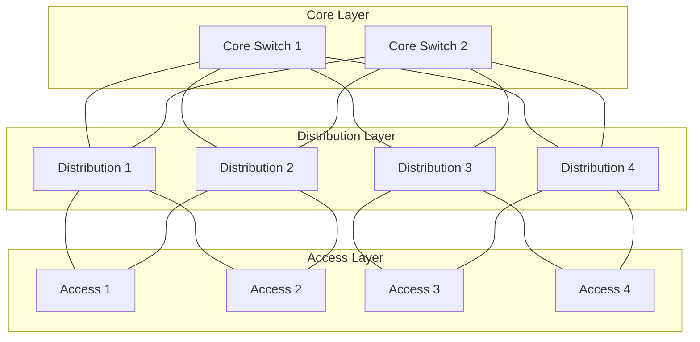
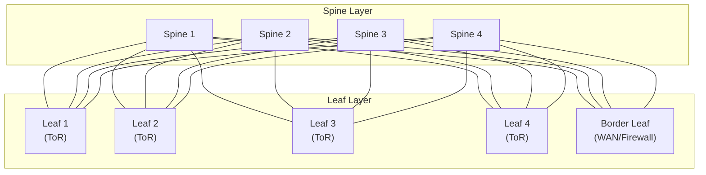
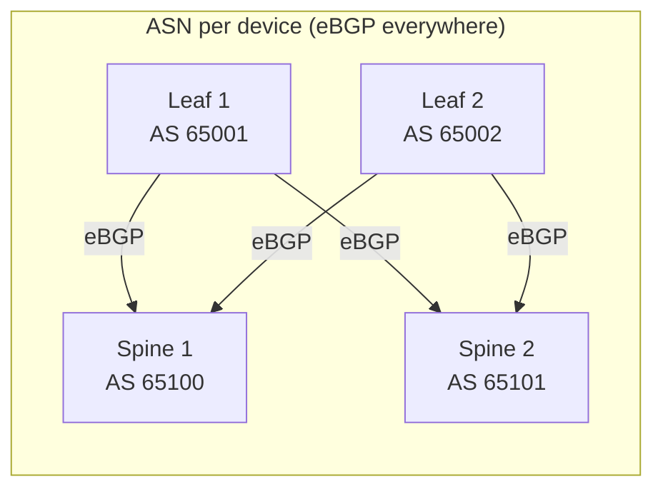
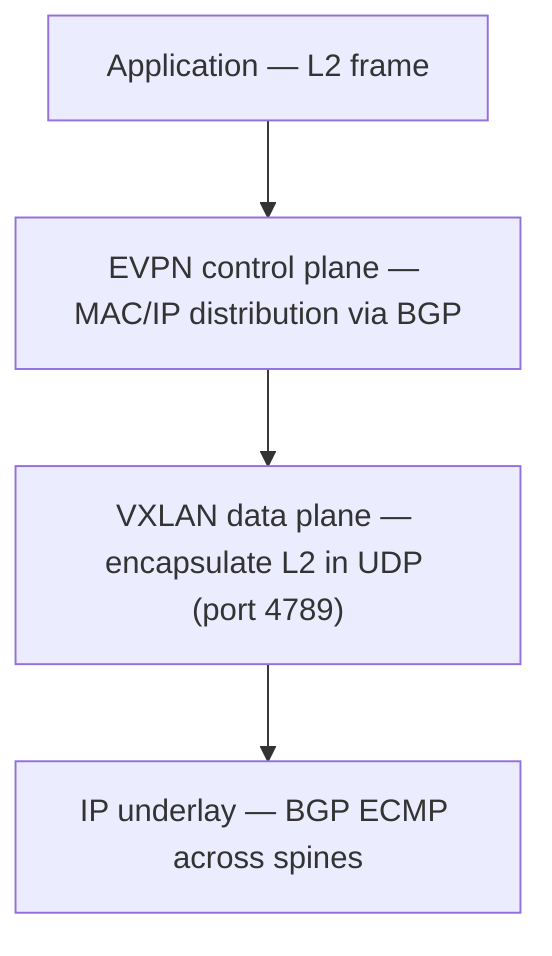
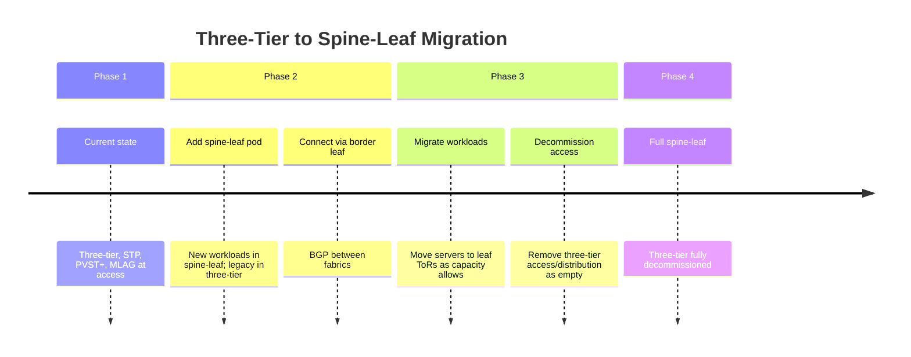

# Data Centre Topologies: Spine-Leaf vs Three-Tier

Two fundamentally different approaches to data centre network design dominate in
practice. The **three-tier** (Access / Distribution / Core) model originated in campus
networks and was adapted for early datacentres — it is L2-heavy and relies on Spanning
Tree for redundancy. The **spine-leaf** (Clos) model is the modern standard for
hyperscale and enterprise datacentres — it is fully routed, ECMP-native, and eliminates
Spanning Tree entirely. Choosing between them (or migrating from one to the other) is
one of the most consequential decisions in datacentre design.

---

## At a Glance

| Property | Three-Tier | Spine-Leaf (Clos) |
| --- | --- | --- |
| Layers | Access → Distribution → Core | Leaf → Spine |
| Routing boundary | Distribution or Core layer | Leaf layer (every ToR is L3) |
| Spanning Tree | Required (at access layer) | Not used |
| East-west traffic path | Up to distribution, across, back down | One hop: leaf → spine → leaf |
| Oversubscription | Varies; often 20:1 at access | Predictable; typically 3:1 to 7:1 |
| ECMP | Partial (core/distribution only) | Full (every path equally used) |
| Scalability | Limited by STP domain and uplink bandwidth | Near-linear; add spine/leaf pairs |
| Failure domain | Large (STP topology change affects domain) | Small (leaf or spine failure isolated) |
| Protocol complexity | STP + OSPF/EIGRP hybrid | BGP underlay (or OSPF); clean separation |
| Typical use case | Legacy DC, campus, small-medium DC | Modern DC, hyperscale, cloud fabrics |

---

## Three-Tier Architecture

The three-tier model stacks switching into three functional layers:

**Access layer:** ToR (Top of Rack) or EoR (End of Row) switches connect servers. Typically
unmanaged or minimally configured L2 switches. VLANs span the access layer. Uplinks to
distribution are active/standby (STP blocks one).

**Distribution layer:** Aggregates access switches. L2/L3 boundary — VLANs are terminated
here as SVIs (Switched Virtual Interfaces); routing begins at distribution. PVST+ root
bridges live here. HSRP/VRRP provides gateway redundancy.

**Core layer:** High-speed L3 switching between distribution pods and out to WAN/internet.
No L2 — pure IP routing. OSPF or EIGRP typically runs here.

### Traffic Patterns in Three-Tier

**North-south** (server → internet/WAN): server → access → distribution → core → firewall/router.
Well-optimised by the hierarchical design.

**East-west** (server → server): server → access → distribution →
(core if different pod) → distribution → access → server. Every server-to-server flow
traverses at least the
distribution layer, even for servers in adjacent racks. As datacentre workloads have
shifted from client-server (predominantly north-south) to distributed/microservices
(predominantly east-west), this is the primary limitation of three-tier.

### Spanning Tree in Three-Tier

STP runs at the access and distribution layers. Blocked uplinks mean:

- 50% of uplink capacity is unused on access switches
- MAC table flushes from TCNs propagate across the entire L2 domain
- Convergence on distribution failure: up to 30s (legacy STP) or 1–2s (Rapid PVST+)

MLAG / vPC (Cisco Virtual Port Channel) is used to present two distribution switches
as a single logical switch to the access layer, allowing active-active uplinks without
STP blocking either. This is the standard mitigation in modern three-tier designs.

---

## Spine-Leaf Architecture

The spine-leaf model is a two-tier Clos network. Every leaf connects to every spine;
no leaf connects directly to another leaf; no spine connects to another spine.

**Leaf switches:** One per rack (or pod). Connect servers on downlinks; connect to every
spine on uplinks. The L3 boundary is at the leaf — each leaf is a BGP router. Servers
may receive a /32 or /30 routed to them, or the leaf runs an anycast gateway for L2
segments within the rack.

**Spine switches:** Pure L3 forwarding — no server connections, no services. Exist only
to provide high-bandwidth interconnection between leaves. Spines run BGP and forward
based on ECMP.

**Border leaf:** Dedicated leaf switches connecting the fabric to WAN, internet,
firewalls, or load balancers. Keeps external peering separate from server-facing leaves.

### Traffic Patterns in Spine-Leaf

Every leaf-to-leaf path is **exactly two hops** regardless of which leaves are involved:
leaf → spine → leaf. All paths are equal-cost; traffic is distributed across all spines
via ECMP. There is no preferred path and no blocked path.

**East-west traffic** is first-class in this design. A flow between servers in adjacent
racks traverses the same number of hops as a flow between servers on opposite sides of
the datacentre. This makes spine-leaf optimal for distributed workloads, microservices,
and storage traffic (iSCSI, NVMe-oF).

### BGP as Underlay

Spine-leaf fabrics almost universally use BGP as the routing protocol. Each leaf and
spine is an eBGP router; each leaf-spine link is an eBGP peering. This provides:

- **Simple ECMP:** BGP ECMP across all spine uplinks
- **Fast convergence:** BFD on every leaf-spine link; sub-second failure detection
- **Clear failure domain:** A spine failure withdraws its BGP routes; leaves immediately
  re-hash traffic to remaining spines
- **Operational simplicity:** Each leaf has the same config template; adding a leaf
  requires only adding eBGP sessions to all spines

ASN assignment options:

- **Unique ASN per device:** Each spine and leaf has its own private ASN. Clean loop
  prevention; recommended by RFC 7938.
- **Shared ASN per tier:** All spines share one ASN; all leaves share another. Simpler
  but requires `allowas-in` or `as-path relax` to allow prefixes to traverse the fabric
  (since the leaf's own ASN appears in the path learned from spine).

### Overlay: VXLAN + EVPN

While the underlay is fully routed, workloads often require L2 connectivity across
leaves (VM migration, legacy applications). **VXLAN** provides a L2 overlay over the
L3 underlay; **BGP EVPN** (RFC 7432) distributes MAC/IP reachability information
between leaves, replacing flood-and-learn with a control-plane-driven model.

VTEP (VXLAN Tunnel Endpoint) functionality lives on the leaf. The leaf encapsulates
server frames in VXLAN and forwards them to the remote leaf's VTEP IP over the routed
underlay.

---

## Oversubscription

Oversubscription is the ratio of downlink (server-facing) bandwidth to uplink (spine-facing)
bandwidth on a leaf switch.

| Design | Typical Ratio | Notes |
| --- | --- | --- |
| Three-tier access (active/standby uplinks) | 40:1 or worse | Half of uplink bandwidth blocked by STP |
| Three-tier access (MLAG/vPC, active/active) | 20:1 | Both uplinks active; still limited by uplink count |
| Spine-leaf leaf switch | 3:1 – 7:1 | All uplinks active; ratio controlled by port count |
| Spine-leaf (low oversubscription) | 1:1 – 2:1 | High-performance HPC / storage fabrics |

In a spine-leaf design, oversubscription is a deliberate design choice: a leaf with 48
× 25G downlinks and 8 × 100G uplinks has a 48×25 / 8×100 = 1.5:1 ratio. Adding spines
or upgrading uplinks directly reduces oversubscription without redesigning the fabric.

---

## Failure Domains

### Three-Tier Failure Scenarios

| Failure | Impact | Recovery |
| --- | --- | --- |
| Access switch | Servers on that switch lose connectivity | Immediate (dual-homed servers) or full outage |
| Distribution switch | All access switches below lose connectivity | HSRP/VRRP failover; STP reconvergence |
| Core switch | Inter-pod traffic affected | Routing reconvergence (OSPF/EIGRP) |
| STP topology change | MAC table flush across entire L2 domain | Temporary flooding; recovery in seconds |

### Spine-Leaf Failure Scenarios

| Failure | Impact | Recovery |
| --- | --- | --- |
| Leaf switch | Servers on that leaf lose connectivity | Dual-homed servers remain up |
| Spine switch | Traffic re-hashes across remaining spines | BFD detects in <1s; BGP withdraws routes |
| Leaf-spine link | Traffic re-hashes to other spines | BFD + link-down-failover; sub-second |
| Border leaf | WAN/external traffic fails over to redundant border leaf | BGP reconvergence |

The key difference: a spine failure in a spine-leaf fabric affects **bandwidth** (traffic
re-hashes to fewer spines) but not **reachability** for any server. In three-tier, a
distribution switch failure cuts off all access switches below it.

---

## Migration Path

Most datacentres migrate from three-tier to spine-leaf incrementally:

---

## When to Use Each

### Use Three-Tier When

- Existing infrastructure is three-tier and workloads are north-south dominant
- Budget or timeline does not support full fabric redesign
- L2 adjacency between large numbers of servers is genuinely required
- Scale is small (< 500 servers) and east-west traffic is limited

### Use Spine-Leaf When

- East-west traffic dominates (microservices, distributed storage, virtualisation)
- Predictable, consistent latency is required between any two servers
- Scale beyond a single distribution pod is anticipated
- Greenfield deployment — no legacy L2 constraints to work around
- Modern workloads: Kubernetes, NVMe-oF, high-frequency compute

---

## Notes

- The terms "Clos network" and "spine-leaf" are used interchangeably. Charles Clos
  described the mathematical properties of this topology in 1953 for telephone switching.
- **BGP Unnumbered** (RFC 5549) simplifies spine-leaf underlay configuration further by
  using IPv6 link-local addresses for peering, eliminating the need to assign IPv4
  addresses to every point-to-point link.
- **Anycast gateway** on leaf switches allows multiple leaves to present the same virtual
  MAC/IP as the default gateway for a VLAN, enabling VMs to migrate between leaves without
  changing their gateway.
- See [Spanning Tree: Design and Convergence](spanning_tree.md) for STP design principles
  relevant to the three-tier access layer.
- See [VXLAN](../packets/vxlan.md) and [BGP](../routing/bgp.md) for the underlying
  protocol references used in spine-leaf overlays.
